<div align="center">

# VALEN

### The Compliance, Risk, and Permission Layer for Agentic Finance

**Every autonomous agent action — settled or refused — produces verifiable proof.**

[](https://valenai.vercel.app)
[](https://valen-api-m3g4.onrender.com/docs)
[](https://valenai.vercel.app/proofs/pack)
[](https://valenai.vercel.app/agents/valen)

[](https://sepolia.arbiscan.io)
[](https://explorer.testnet.chain.robinhood.com)
[](https://nestjs.com)
[](https://nextjs.org)
[](https://soliditylang.org)
[](https://docs.arbitrum.io/stylus/stylus-gentle-introduction)
[](https://eips.ethereum.org/EIPS/eip-8226)
[](https://eips.ethereum.org/EIPS/eip-8004)
[](https://www.x402.org)

[Launch App](https://valenai.vercel.app/login) · [Proof Pack](https://valenai.vercel.app/proofs/pack) · [API Docs](https://valen-api-m3g4.onrender.com/docs) · [GitHub](https://github.com/goat-dev8/valen)

</div>

---

## Table of Contents

- [Executive Summary](#executive-summary)
- [The Problem](#the-problem)
- [The Solution](#the-solution)
- [Architecture](#architecture)
- [Deep Technical Reference](#deep-technical-reference)
  - [Agent Architecture](#agent-architecture)
  - [Governance & Mandates](#governance--mandates)
  - [Budget Engine](#budget-engine)
  - [Policy Engine](#policy-engine)
  - [Compliance Engine](#compliance-engine)
  - [Risk Engine](#risk-engine)
  - [Settlement Engine](#settlement-engine)
  - [Proof Engine](#proof-engine)
  - [Identity Engine (ERC-8004)](#identity-engine-erc-8004)
- [Arbitrum & Stylus](#arbitrum--stylus)
- [Robinhood Asset Layer](#robinhood-asset-layer)
- [x402 Payment Layer](#x402-payment-layer)
- [Smart Contracts](#smart-contracts)
- [API Reference](#api-reference)
- [Database Schema](#database-schema)
- [Frontend & User Flows](#frontend--user-flows)
- [Worker & Queue Architecture](#worker--queue-architecture)
- [Security Model](#security-model)
- [Production Evidence](#production-evidence)
- [Hackathon Impact](#hackathon-impact)
- [Repository Structure](#repository-structure)
- [Local Development](#local-development)
- [Future Work](#future-work)

---

## Executive Summary

**VALEN** is infrastructure — not a wallet, DEX, Robinhood clone, or chatbot. It is the **governed execution rail** between autonomous AI agents and on-chain financial settlement.

Autonomous agents can now initiate transfers, payments, and tokenized asset trades at machine speed. Without governance, they can drain wallets, violate compliance, and leave no auditable trail. VALEN makes **permission, evaluation, and proof** first-class primitives.

### The Six Layers

| Layer | Role | Implementation |
|-------|------|----------------|
| **Governance** | Scoped authority before any agent acts | EIP-712 mandates + `ValenMandateRegistry` (ERC-8226 aligned) |
| **Compliance** | Regulatory and organizational eligibility | Stylus `ComplianceEngine` + off-chain attestations |
| **Risk** | Scoring, tiering, human approval gates | Stylus `RiskEngine` + Robinhood policy + budget checks |
| **Settlement** | Final on-chain fund movement | `ValenSettlement` + `ValenTokenSettlementAdapter` |
| **Proof** | Verifiable public evidence | `proofVersion: "1.0"` at `/proofs/*` |
| **Identity** | Discoverable agent profiles | ERC-8004 metadata + `ValenIdentityResolver` |

### Why Now

Three forces converge:

1. **AI agents** are becoming autonomous economic actors (treasury, procurement, trading)
2. **On-chain finance** is expanding to regulated RWAs (Robinhood Chain tokenized stocks, USDG)
3. **Standards are emerging** — ERC-8226 mandates, ERC-8004 identity, x402 HTTP payments — but no unified layer ties them together with enforcement and proofs

VALEN is the missing **governance operating system** for this stack.

### Production Status

Phases **A–I** are production-verified on **Arbitrum Sepolia (421614)** and **Robinhood Chain Testnet (46630)** as of 2026-06-13.

| Surface | URL |
|---------|-----|
| Frontend | https://valenai.vercel.app |
| API | https://valen-api-m3g4.onrender.com |
| Swagger | https://valen-api-m3g4.onrender.com/docs |
| Public proof pack | https://valenai.vercel.app/proofs/pack |
| Public agent profile | https://valenai.vercel.app/agents/valen |

> **Note:** Arbitrum One mainnet is explicitly **deferred** — testnet only in current deployment.

---

## The Problem

### Why Autonomous Agents Cannot Safely Move Money Today

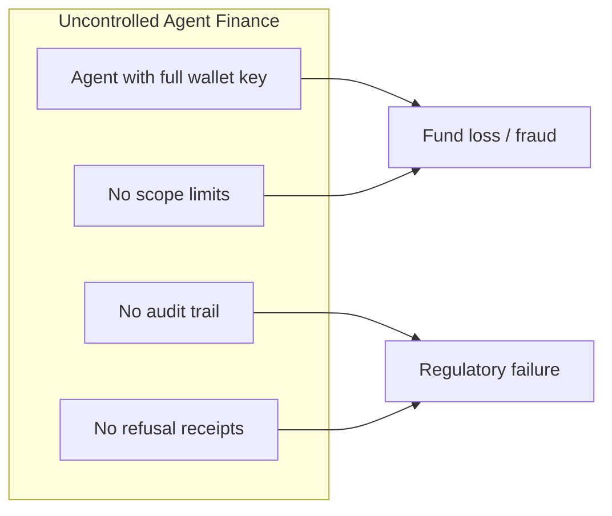

| Risk | Consequence |
|------|-------------|
| **Unlimited permissions** | Compromised agent drains entire wallet |
| **No compliance** | Restricted assets traded outside policy windows |
| **No budgets** | Runaway spend with no operational caps |
| **No auditability** | Organizations cannot prove due diligence |
| **No proof system** | Counterparties cannot verify governed outcomes |

Financial agents will handle treasury rebalancing, vendor payments, payroll, and customer refunds without human clicks on every transaction. That requires **authority**, **policies**, **compliance**, **settlement**, and **proofs** — not just API keys to a hot wallet.

---

## The Solution

VALEN enforces a **fail-closed pipeline**. Every agent intent passes through deterministic gates before any funds move. Every outcome — success or refusal — produces a **public proof URL**.

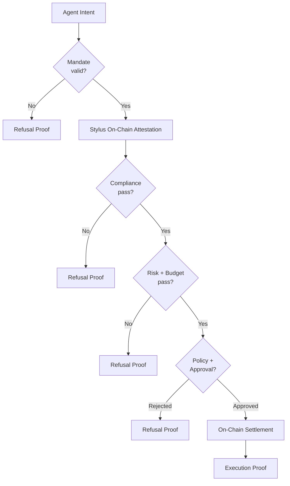

### What Makes VALEN Unique

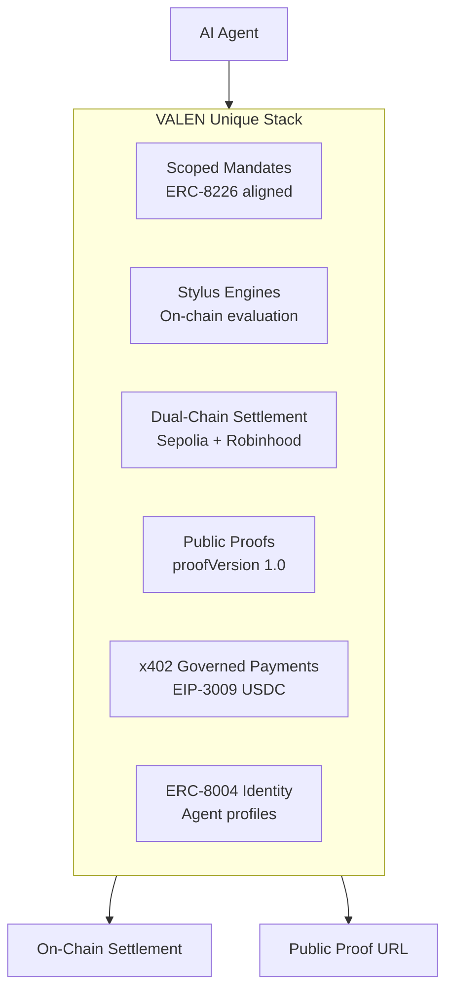

| Differentiator | Description |
|----------------|-------------|
| **Hybrid architecture** | NestJS + BullMQ orchestrates Stylus engine reads and Solidity settlement |
| **Dual-chain production** | Arbitrum Sepolia (USDC, budget vault, x402) + Robinhood Testnet (USDG, TSLA, AMZN, PLTR, NFLX, AMD) |
| **Proof as product** | Every execution, refusal, and x402 payment has a public URL with evidence hash |
| **Fail-closed design** | Missing mandate, exceeded budget, failed compliance → auditable refusal |
| **Stylus compute** | Compliance, risk, eligibility, policy, budget engines as Rust/WASM on Arbitrum |

> **Design principle:** *Proof is the product.* Other systems move money. VALEN proves money moved **correctly** — or **correctly refused** to move.

---

## Architecture

### System Architecture

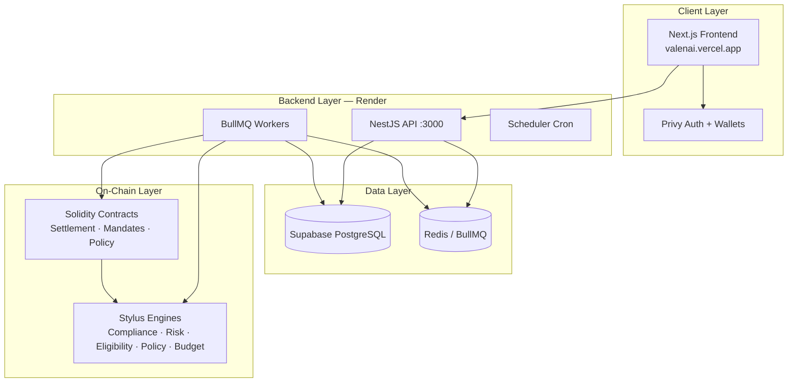

### Execution Pipeline (Sequence)

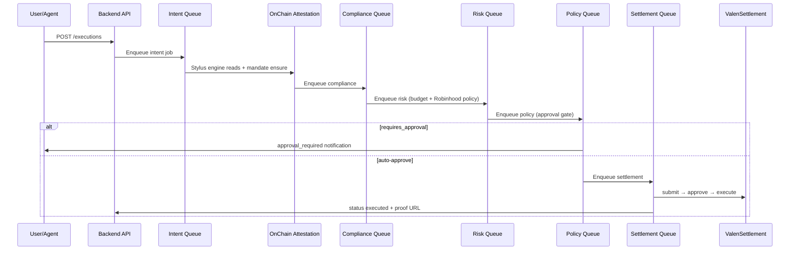

### User Journey (7 Steps)

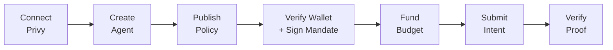

| Step | Route | Outcome |
|------|-------|---------|
| 1. Connect | `/login` | Privy auth → org membership |
| 2. Agent | `/dashboard/agents/studio` | Governed agent with policy binding |
| 3. Policy | `/dashboard/policies` | Active policy hash on-chain |
| 4. Authority | `/dashboard/authority` | Verified wallet + EIP-712 mandate |
| 5. Budget | `/dashboard/budgets` | USDC cap configured (Arbitrum) |
| 6. Execute | `/dashboard/executions/new` | Intent submitted to pipeline |
| 7. Proof | `/proofs/executions/{id}` | Public verifiable outcome |

### Dual-Chain Topology

| Component | Arbitrum Sepolia (421614) | Robinhood Testnet (46630) |
|-----------|---------------------------|---------------------------|
| ValenRegistry | ✅ | ✅ |
| ValenSettlement | ✅ | ✅ |
| ValenMandateRegistry | ✅ | ✅ |
| ValenTokenSettlementAdapter | ✅ USDC | ✅ USDG + stocks |
| ValenBudgetVault | ✅ | ❌ |
| ValenIdentityResolver | ✅ | ❌ |
| RobinhoodAssetRegistry | ❌ | ✅ |
| BudgetEngine (Stylus) | ✅ | ❌ |
| 4 core Stylus engines | ✅ | ✅ |

---

## Deep Technical Reference

### Agent Architecture

An **agent** is a registered autonomous actor within an organization — identified by UUID, linked wallets, optional API keys, and governed by mandates and policies.

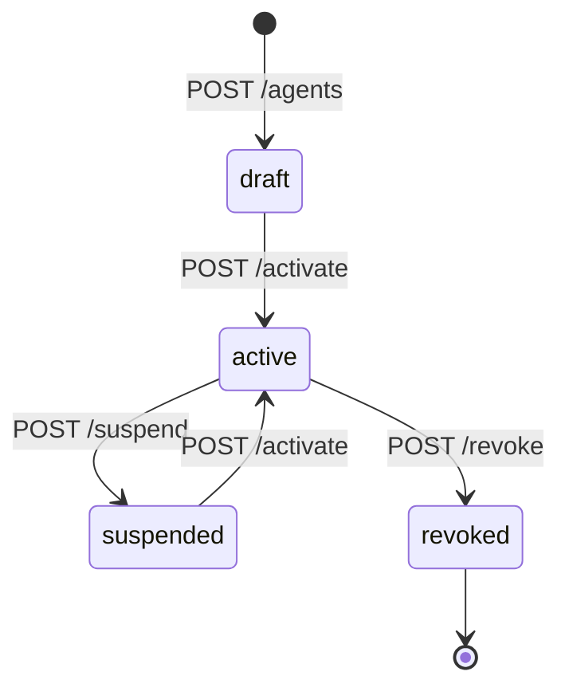

| Field | Detail |
|-------|--------|
| **Types** | `hosted`, `external`, `service`, `experimental` |
| **Tables** | `agents`, `agent_wallets`, `api_keys`, `agent_identity` |
| **Public slug** | Enables profile at `/agents/{slug}` (e.g. `valen`) |
| **Key API** | `POST /v1/organizations/:orgId/agents` |

**Demo agent:**
- ID: `64f56184-eacf-4eef-bc84-f3b863d3894f`
- Slug: `valen`
- Agent key: `0x483e006c252ec494695aaad6c7a209005ab20266a189818a836173675b280489`

---

### Governance & Mandates

**Mandates** are ERC-8226-aligned scoped permissions binding a principal, agent, scope hash, validity window, and spending caps (`maxPerTx`, `maxTotal`).

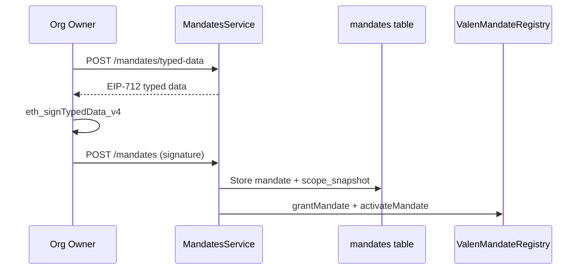

| Layer | Implementation |
|-------|----------------|
| **Off-chain** | EIP-712 domain `VALEN Agent Mandate` v1; `scope_snapshot` frozen at sign time |
| **On-chain** | `ValenMandateRegistry.checkMandate()` at submit; `recordExecution()` at settle |
| **Eligibility** | `evaluateIntentEligibility()` matches mandate scope to intent requirements |

**Key functions (`ValenMandateRegistry`):**
- `grantMandate`, `activateMandate`, `revokeMandate`, `freezeMandate`
- `checkMandate`, `recordExecution`, `allowScope`, `allowScopeBinding`

**Addresses:**
- Arbitrum Sepolia: `0xC3B422d77aBE0B7D3c8930d7f1FCFCa4657d41F2`
- Robinhood Testnet: `0x3122B8446044E87A683C1104dc80f32d3Eb28CE4`

---

### Budget Engine

Three enforcement layers work together:

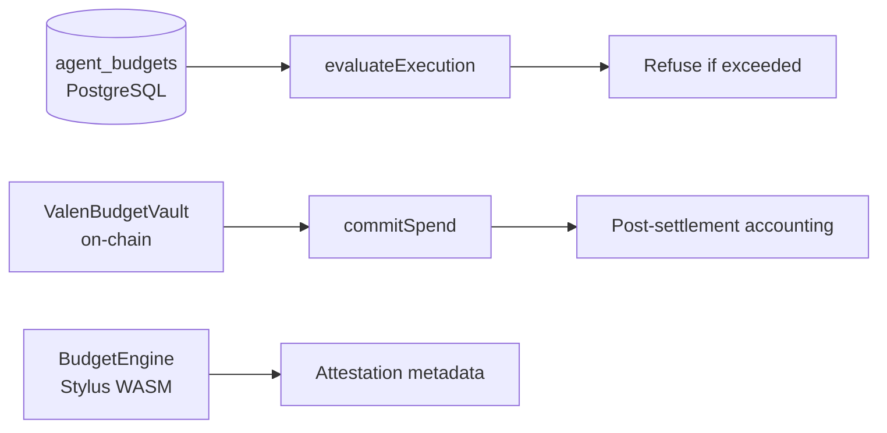

| Operation | Where | When |
|-----------|-------|------|
| Top-up | `POST /budget/:agentId/topup` | Manager sets cap |
| Evaluate | `BudgetService.evaluateExecution` | Risk worker |
| Commit | DB + `ValenBudgetVault.commitSpend` | Post-settlement |
| Refuse | `budget_exceeded` / `budget_paused` | Pre-settlement |

**Demo configuration (Arbitrum Sepolia):**
- Vault: `0x87876e15455F492F06612383f15F82F1fc42E2F2`
- Asset: USDC `0x75faf114eafb1BDbe2F0316DF893fd58CE46AA4d`
- Cap: 1 USDC (1,000,000 base units), 24h period

> **Note:** Budget vault and Stylus BudgetEngine exist on **Arbitrum Sepolia only**. Robinhood executions use policy-based refusal without on-chain budget vault.

---

### Policy Engine

| Layer | Role |
|-------|------|
| **Off-chain** | `policies` + `policy_versions` with rules JSON lifecycle: draft → published → active |
| **On-chain** | `ValenPolicyManager` stores `rules_hash`; settlement validates active hash |
| **Stylus** | `PolicyEngine.evaluate` + `evaluate_robinhood_policy` |

**Policy version lifecycle:**

```
draft → pending_approval → published → active
```

Settlement requires `ValenPolicyManager.isPolicyActive(policyVersionHash)` at `submitSettlement`.

---

### Compliance Engine

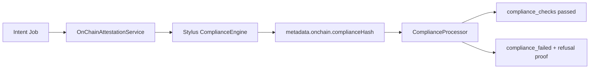

| Component | Address (421614) |
|-----------|------------------|
| ComplianceEngine | `0xf6d515f09b1e14adb891c72605e1df12c7f5db6b` |
| ComplianceEngine (46630) | `0x2c1db0c436b72d94a4112f321dfbd13a976d8831` |

**API:** `GET /executions/:id/compliance`, `POST /compliance/attestations` (providers: `trm`, `webacy`, `internal`)

Fail-closed: compliance failure → `compliance_failed` + public refusal proof.

---

### Risk Engine

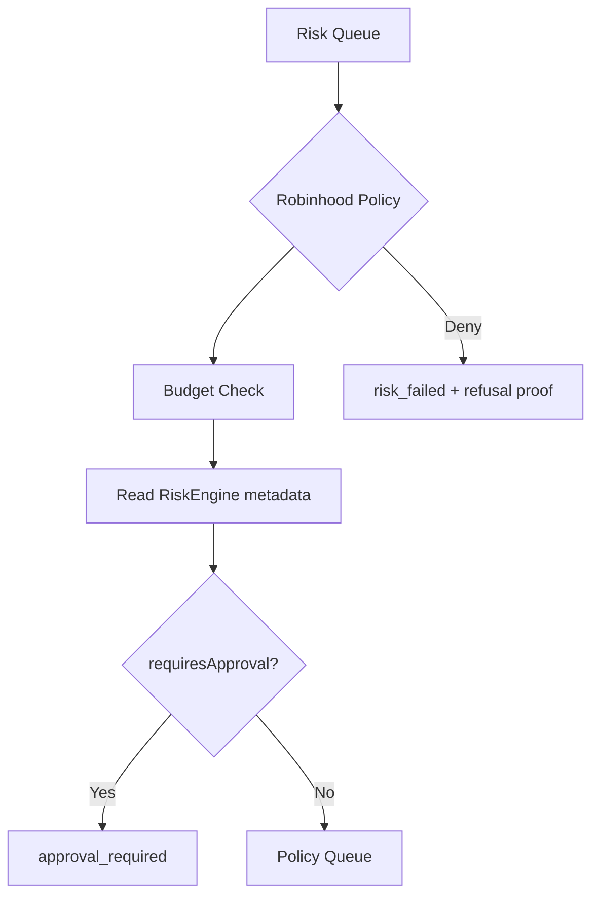

**Robinhood refused scenario:** amount 250, action `robinhood_token_transfer`, scenario metadata → `risk_failed`

**Stylus RiskEngine addresses:**
- 421614: `0x8eb252ff6f05b1ee767bb816e5786ad72e5b4073`
- 46630: `0xae57003e42e3548a9d39cd55bcdfac04363b1d63`

---

### Settlement Engine

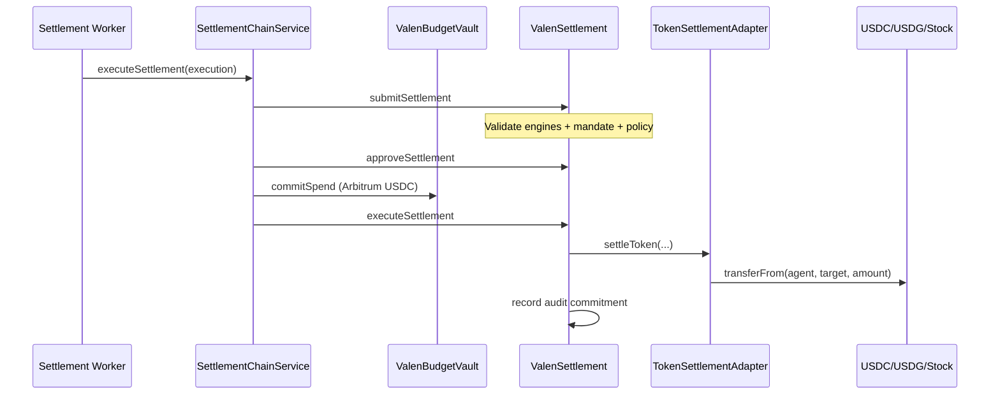

**Three on-chain steps:**

1. **`submitSettlement`** — validates engines, mandate, policy; creates `SettlementRecord`
2. **`approveSettlement`** — status → Approved
3. **`executeSettlement`** — `recordExecution`, audit commitment, token/native transfer

**Settlement contracts:**

| Contract | Arbitrum Sepolia | Robinhood Testnet |
|----------|------------------|-------------------|
| ValenSettlement | `0x993622D55Ea095aB71165Caf191B21E6e3A71D4A` | `0x91CdD9a481C732bEB09Ce039da23DC11e83547a4` |
| ValenTokenSettlementAdapter | `0x2120A24E060f9f2a16e1e96d5609b810b041aDF4` | `0x97F8d7AdD32Db13d6FEe23F7ea09296B532da336` |

**Pipeline status transitions:**

```
created → validated → approved → settlement_submitted → executed
                                    ↓ (failures)
              compliance_failed | risk_failed | policy_rejected | failed
```

---

### Proof Engine

Proofs are **read-only projections** from database views — schema frozen at **`proofVersion: "1.0"`**.

| Kind | View | Statuses | Public Route |
|------|------|----------|--------------|
| **execution** | `public_executions_v` | `executed`, `settlement_submitted` | `/proofs/executions/:id` |
| **refusal** | `public_refusals_v` | `compliance_failed`, `risk_failed`, `policy_rejected`, `failed` | `/proofs/refusals/:id` |
| **payment** | `public_payments_v` | x402 `settled`, `refused` | `/proofs/payments/:id` |

**Proof schema:**

```json
{
  "proofVersion": "1.0",
  "id": "07736a69-...",
  "kind": "execution",
  "chainId": 421614,
  "status": "executed",
  "asset": "USDC",
  "amount": "0.001",
  "settlementTx": "0xf3f5526a...",
  "evidenceHash": "0x...",
  "mandateHash": "0x...",
  "mandateSigner": "0x...",
  "identity": {
    "status": "registration_pending",
    "publicSlug": "valen",
    "resolverAddress": "0x2CF57Bf0a734Ea98e899b3557d7e0A144B434b77"
  }
}
```

**Hash bindings:**

| Hash | Purpose |
|------|---------|
| `evidenceHash` | Binds proof to original intent payload |
| `mandateHash` | Links to EIP-712 authority |
| `complianceHash` | Stylus ComplianceEngine output |
| `riskHash` | Stylus RiskEngine output |
| `metadataHash` | ERC-8004 agent metadata |

On-chain anchor: `ValenAuditLog.recordAuditCommitment(executionHash, commitment)`

---

### Identity Engine (ERC-8004)

**ERC-8004** is an emerging standard for on-chain agent identity. VALEN binds identity to governed proofs.

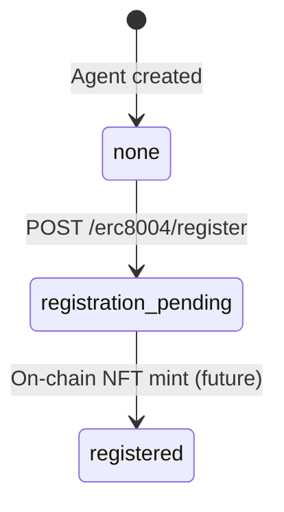

| Component | Status |
|-----------|--------|
| `ValenIdentityResolver` | Deployed on 421614: `0x2CF57Bf0a734Ea98e899b3557d7e0A144B434b77` |
| ERC-8004 NFT registry | **Not deployed** — metadata layer ready, mint awaits registry |
| Public profile | `/agents/valen` via `GET /v1/public/agents/:slug` |

**Honest demo state:** UI shows `registration_pending` — metadata bound to resolver; NFT mint is future work.

**Key functions (`ValenIdentityResolver`):**
- `bindIdentity(agentKey, registry, tokenId, owner, tokenUri, metadataHash, registered)`
- `getIdentity(agentKey)`

---

## Arbitrum & Stylus

### Why Arbitrum

- **Low-cost L2** suitable for high-frequency agent transactions
- **Stylus support** — Rust/WASM engines at lower gas than equivalent Solidity
- **Production-grade tooling** — Alchemy RPC, Arbiscan, mature ecosystem
- **USDC testnet rail** — EIP-3009 `transferWithAuthorization` for x402

### Why Stylus

VALEN runs five evaluation engines as **Arbitrum Stylus** contracts (Rust compiled to WASM):

| Engine | Package | Key Functions | Sepolia Address |
|--------|---------|---------------|-----------------|
| ComplianceEngine | compliance-engine | `evaluate`, `set_active` | `0xf6d515f09b1e14adb891c72605e1df12c7f5db6b` |
| RiskEngine | risk-engine | `calculate`, `get_thresholds` | `0x8eb252ff6f05b1ee767bb816e5786ad72e5b4073` |
| EligibilityEngine | eligibility-engine | `check`, `get_eligibility_root_hash` | `0x03e00644c2bbb45ab4566e34c30929dd017ee5bd` |
| PolicyEngine | policy-engine | `evaluate`, `evaluate_robinhood_policy` | `0x3eb88dde893288faea417b413a55a5b4d3256108` |
| BudgetEngine | budget-engine | `evaluate` (0=allow, 1=refuse, 2=reset) | `0x5496dab17a35580e595bfae135b7677b8a3ade0a` |

**Robinhood Testnet (46630):** 4 engines deployed (no BudgetEngine).

`ValenSettlement._validateEngines` resolves engine addresses from **`ValenRegistry`** using name hashes.

### How Governance Executes Through Arbitrum

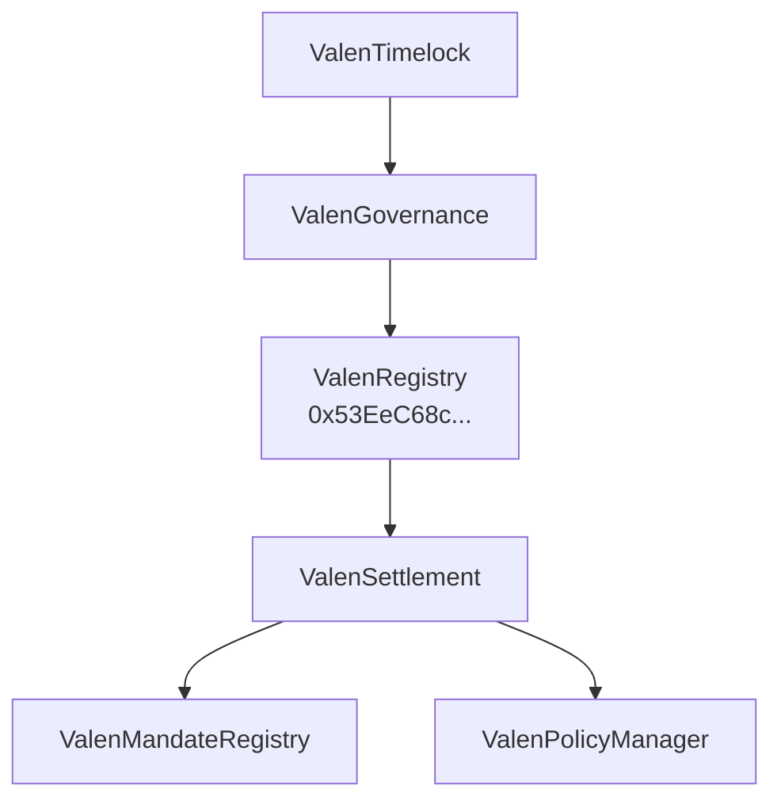

- **UUPS upgrades** controlled by `ValenTimelock` (86400s delay)
- **Emergency pause** via `ValenEmergencyGuardian.pauseScope`
- **Operator API** exposes governance status and proposal/queue/execute

### Budget Vault on Arbitrum

`ValenBudgetVault` (`0x87876e15455F492F06612383f15F82F1fc42E2F2`):
- Immutable: USDC asset + agent key
- Roles: `BUDGET_MANAGER_ROLE` (topUp), `SETTLEMENT_ROLE` (commitSpend)
- Period tracking with automatic reset

---

## Robinhood Asset Layer

Robinhood Chain Testnet (chain ID **46630**) hosts tokenized assets. VALEN demonstrates governed settlement with **allowed** and **refused** scenarios for each asset.

### Supported Assets

| Ticker | Address | Decimals | Role |
|--------|---------|----------|------|
| **USDG** | `0x7E955252E15c84f5768B83c41a71F9eba181802F` | 6 | Robinhood stablecoin |
| **TSLA** | `0xC9f9c86933092BbbfFF3CCb4b105A4A94bf3Bd4E` | 18 | Tesla tokenized stock |
| **AMZN** | `0x5884aD2f920c162CFBbACc88C9C51AA75eC09E02` | 18 | Amazon tokenized stock |
| **PLTR** | `0x1FBE1a0e43594b3455993B5dE5Fd0A7A266298d0` | 18 | Palantir tokenized stock |
| **NFLX** | `0x3b8262A63d25f0477c4DDE23F83cfe22Cb768C93` | 18 | Netflix tokenized stock |
| **AMD** | `0x71178BAc73cBeb415514eB542a8995b82669778d` | 18 | AMD tokenized stock |

**Registry:** `RobinhoodAssetRegistry` at `0x4797e664b719504710c77ed1E8F8A33d09b42A5D`

### Governed RWA Settlement Flow

```mermaid
flowchart TD
    A[Select Robinhood Template] --> B{Mandate matches<br/>ticker + chain?}
    B -->|No| X[Submit blocked]
    B -->|Yes| C[Submit execution]
    C --> D[Attestation on 46630]
    D --> E{Robinhood Policy}
    E -->|refused scenario| F[risk_failed]
    E -->|allowed| G[Settlement on 46630]
    F --> H[/proofs/refusals/id]
    G --> I[/proofs/executions/id]
```

### Allowed vs Refused Scenarios

| Template pattern | Amount | Outcome |
|------------------|--------|---------|
| `robinhood-{ticker}-allowed` | 1 token | Settlement + execution proof |
| `robinhood-{ticker}-refused` | 250 tokens | `risk_failed` + refusal proof |

**Policy function:** `evaluateRobinhoodPolicy()` in `backend/src/modules/risk/robinhood.policy.ts`

**Frontend hub:** `/dashboard/assets` and `/dashboard/assets/{ticker}`

---

## x402 Payment Layer

### What is x402?

**x402** implements HTTP **402 Payment Required** for machine-to-machine payments. A server returns 402 with payment instructions; the client pays on-chain and retries with proof.

VALEN governs x402 so agents cannot pay beyond budget or outside mandate scope.

### Full Lifecycle

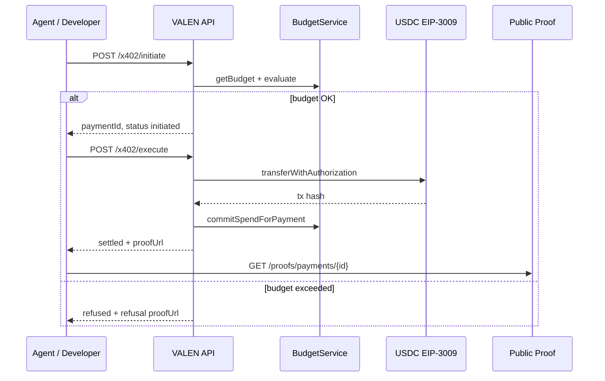

| Step | API | Action |
|------|-----|--------|
| **Initiate** | `POST /x402/initiate` | Budget pre-check; create `x402_payments` row |
| **Validate** | Server-side | Mandate scope, org active policy |
| **Budget** | `BudgetService` | Refuse if `budget_exceeded` or `budget_paused` |
| **Settle** | `POST /x402/execute` | EIP-3009 `transferWithAuthorization` on USDC Sepolia |
| **Proof** | Auto | `/proofs/payments/{paymentId}` |

**USDC Sepolia:** `0x75faf114eafb1BDbe2F0316DF893fd58CE46AA4d`

**Chain:** Arbitrum Sepolia (421614) only — x402 does not support Robinhood assets.

> **Note:** `X402_FACILITATOR_URL` is configured in env but settlement uses direct EIP-3009 via `X402ChainService`, not an external facilitator.

**Frontend:** `/dashboard/payments`, `/dashboard/demo/x402-protected`, Command Center x402 drawer

---

## Smart Contracts

Deployer EOA: `0xf76e6B0920e9332fF4410f6dD53F01722AbC71a3`

Manifests: `contracts/deployments/arbitrum-sepolia/deployment.json`, `contracts/deployments/robinhood-testnet/deployment.json`

### Arbitrum Sepolia (421614)

| Contract | Proxy Address | Purpose |
|----------|---------------|---------|
| **ValenRegistry** | `0x53EeC68c869E06B659A87b9e049a379ba3a5FA0F` | Engine/contract discovery hub |
| **ValenSettlement** | `0x993622D55Ea095aB71165Caf191B21E6e3A71D4A` | Final settlement gate |
| **ValenMandateRegistry** | `0xC3B422d77aBE0B7D3c8930d7f1FCFCa4657d41F2` | ERC-8226 mandate lifecycle |
| **ValenPolicyManager** | `0x72eB4D7e57D4b582c5B05d255c1faE723507a03d` | Policy hash lifecycle |
| **ValenTokenSettlementAdapter** | `0x2120A24E060f9f2a16e1e96d5609b810b041aDF4` | ERC-20 settlement executor |
| **ValenBudgetVault** | `0x87876e15455F492F06612383f15F82F1fc42E2F2` | Per-agent USDC budget envelope |
| **ValenIdentityResolver** | `0x2CF57Bf0a734Ea98e899b3557d7e0A144B434b77` | ERC-8004 metadata binding |
| **ValenTreasury** | `0x094B10D817f4603e9a4734B52c4c7A1Bf389658D` | Protocol fee accrual |
| **ValenEscrow** | `0x485eba92e9Bf0e035216726A0EC194dd397311BC` | Optional ERC-20 custody |
| **ValenGovernance** | `0xF7623E69a21ad43f3678a9FA2bA931e59f7F1574` | Governance proposals |
| **ValenTimelock** | `0xAe853e326bCF38f6f9131eA0f5298C88084D72bc` | 86400s upgrade delay |
| **ValenAuditLog** | `0xBe1b5F1055C21D715185612947f681059B585cEE` | Immutable audit commitments |
| **ValenEmergencyGuardian** | `0x3424a2ea234Ba819FceF1Beea32Ab39C42e235d9` | Emergency pause/freeze |

### Robinhood Testnet (46630)

| Contract | Proxy Address |
|----------|---------------|
| **ValenRegistry** | `0x8A80D270dd7028536ecB6f92b04eec11F929d603` |
| **ValenSettlement** | `0x91CdD9a481C732bEB09Ce039da23DC11e83547a4` |
| **ValenMandateRegistry** | `0x3122B8446044E87A683C1104dc80f32d3Eb28CE4` |
| **ValenPolicyManager** | `0x2741bAF6F51e5Ab67E81DdDCb1439679Bebd2d2F` |
| **ValenTokenSettlementAdapter** | `0x97F8d7AdD32Db13d6FEe23F7ea09296B532da336` |
| **RobinhoodAssetRegistry** | `0x4797e664b719504710c77ed1E8F8A33d09b42A5D` |
| **ValenTreasury** | `0xd9aDaab0E9660777B979D4C44294bE07E10470c8` |
| **ValenGovernance** | `0x8c263B12e0d511e5a612b4090cFEa0c758A2af6b` |
| **ValenAuditLog** | `0x21EC2E12865b5a307A3708ACbA85f2FE2a98B8BF` |
| **ValenEmergencyGuardian** | `0xb6a36B53E46A0D9ee3c1D589e936b0214aFA9303` |

### Contract Relationships

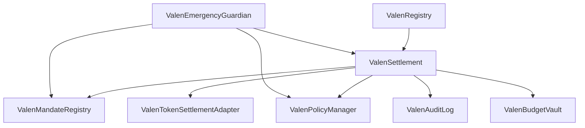

### Security Model (Contracts)

| Role | Capability |
|------|------------|
| `SETTLEMENT_OPERATOR_ROLE` | Submit/approve/execute settlements |
| `BUDGET_MANAGER_ROLE` | Top up budget vault |
| `SETTLEMENT_ROLE` | Commit spend on vault |
| `EMERGENCY_GUARDIAN_ROLE` | Pause scope, freeze mandate/policy |
| `DEFAULT_ADMIN_ROLE` | UUPS upgrades via timelock |

---

## API Reference

**Base URL:** `https://valen-api-m3g4.onrender.com`  
**Swagger:** https://valen-api-m3g4.onrender.com/docs  
**Auth:** Bearer JWT (Privy) or `x-api-key` for agent endpoints

### Public Endpoints (No Auth)

```http
GET /health/live
GET /health/ready
GET /v1/public/proofs/executions/:id
GET /v1/public/proofs/refusals/:id
GET /v1/public/proofs/payments/:id
GET /v1/public/proofs/pack
GET /v1/public/agents/:agentSlug
GET /v1/assets?chainId=421614
GET /v1/robinhood/assets
```

### Create Execution

```http
POST /v1/organizations/{organizationId}/executions
Authorization: Bearer {token}
Content-Type: application/json
```

```json
{
  "agentId": "64f56184-eacf-4eef-bc84-f3b863d3894f",
  "chainId": 421614,
  "actionType": "transfer",
  "assetAddress": "0x75faf114eafb1BDbe2F0316DF893fd58CE46AA4d",
  "amount": "1000",
  "targetAddress": "0xf76e6B0920e9332fF4410f6dD53F01722AbC71a3",
  "idempotencyKey": "exec-20260613-usdc-001",
  "metadata": { "templateId": "arbitrum-usdc" }
}
```

**Response (202):**

```json
{
  "id": "07736a69-...",
  "status": "created",
  "chainId": 421614,
  "proofUrl": "https://valenai.vercel.app/proofs/executions/07736a69-..."
}
```

### x402 Initiate

```http
POST /v1/organizations/{organizationId}/x402/initiate
```

```json
{
  "agentId": "64f56184-eacf-4eef-bc84-f3b863d3894f",
  "mandateId": "...",
  "recipient": "0xRecipientAddress",
  "amount": "1000",
  "merchantUrl": "https://valenai.vercel.app/api/x402/protected",
  "chainId": 421614
}
```

### Sign Mandate (Typed Data)

```http
POST /v1/organizations/{organizationId}/mandates/typed-data
```

Returns EIP-712 typed data with domain `VALEN Agent Mandate` version `1`. User signs with `eth_signTypedData_v4`, then:

```http
POST /v1/organizations/{organizationId}/mandates
```

### Get Public Proof Pack

```http
GET /v1/public/proofs/pack
```

```json
{
  "proofVersion": "1.0",
  "executions": [{ "id": "...", "settlementTx": "0x...", "status": "executed" }],
  "refusals": [{ "id": "...", "refusalFactors": { "reason": "budget_exceeded" } }],
  "payments": [{ "id": "...", "status": "settled" }]
}
```

> Full route list (100+ endpoints): see [Swagger API Docs](https://valen-api-m3g4.onrender.com/docs)

---

## Database Schema

**Engine:** Supabase PostgreSQL  
**Migrations:** `backend/supabase/migrations/` (27 files)

### Core Tables

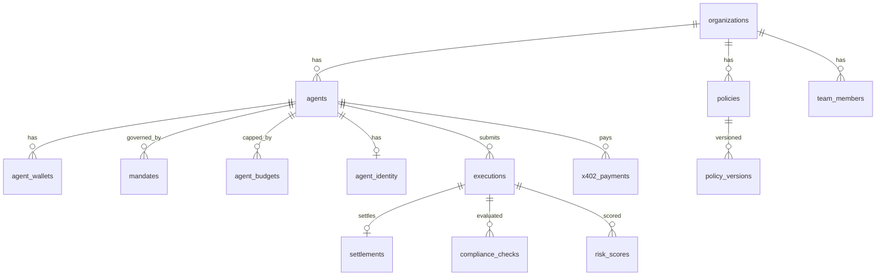

| Table | Purpose |
|-------|---------|
| `users`, `organizations`, `team_members` | Identity and RBAC |
| `agents`, `agent_wallets`, `api_keys` | Agent management |
| `agent_identity` | ERC-8004 metadata |
| `policies`, `policy_versions` | Policy lifecycle |
| `mandates` | Signed EIP-712 mandates + `scope_snapshot` |
| `executions`, `intent_idempotency_keys` | Intent pipeline |
| `compliance_checks`, `compliance_attestations` | Compliance evidence |
| `risk_models`, `risk_scores` | Risk evaluation |
| `settlements`, `contract_deployments` | On-chain settlement records |
| `agent_budgets`, `budget_events` | Budget tracking |
| `x402_payments` | x402 payment records |
| `audit_logs`, `audit_events`, `audit_commitments` | Audit trail |
| `assets` | Asset catalog (both chains) |
| `dead_letter_jobs`, `emergency_actions` | Operations |

### Public Proof Views

| View | Purpose |
|------|---------|
| `public_executions_v` | Execution proof projection |
| `public_refusals_v` | Refusal proof projection |
| `public_payments_v` | x402 payment proof projection |
| `agent_summary_v` | Dashboard Mission Control KPIs |
| `agent_budget_status_v` | Budget status aggregation |

### Execution Lifecycle

```
created → validated → compliance_pending → risk_pending → policy_pending
  → approval_required (optional) → approved → settlement_submitted → executed
  → compliance_failed | risk_failed | policy_rejected | failed | cancelled
```

---

## Frontend & User Flows

**Stack:** Next.js 15 App Router, React Query, Tailwind CSS, Privy SDK, viem

### Public Routes

| Route | Purpose |
|-------|---------|
| `/` | Marketing landing — hero, modules, live proof embed, journey |
| `/login` | Privy authentication |
| `/agents/[agentSlug]` | Public ERC-8004 agent profile |
| `/proofs/pack` | Latest proof pack (execution + refusal + payment) |
| `/proofs/executions/[id]` | Public execution proof |
| `/proofs/refusals/[id]` | Public refusal receipt |
| `/proofs/payments/[id]` | Public x402 payment proof |

### Dashboard Routes (Auth Required)

| Route | Purpose |
|-------|---------|
| `/dashboard` | **Command Center** — NL command agent, governance pipeline, x402 drawer |
| `/dashboard/agents/studio` | 5-step agent wizard |
| `/dashboard/executions/new` | **Governed Intent** — 4-step wizard with eligibility matching |
| `/dashboard/payments` | x402 USDC flow |
| `/dashboard/proofs` | Outcome Ledger |
| `/dashboard/authority` | Wallet verify + mandate signing |
| `/dashboard/budgets` | USDC budget caps |
| `/dashboard/assets` | Tokenized assets hub (USDC + Robinhood) |
| `/dashboard/policies` | Policy management |
| `/dashboard/settlements` | On-chain settlement monitor |

### Governed Intent Flow

```mermaid
flowchart LR
    T1[Step 1<br/>Template] --> T2[Step 2<br/>Agent + Eligibility]
    T2 --> T3[Step 3<br/>Config]
    T3 --> T4[Step 4<br/>Review + Submit]
    T4 --> API[POST /executions]
    API --> Detail[/dashboard/executions/id]
    Detail --> Proof[/proofs/executions/id]
```

**13 intent templates** in `frontend/src/lib/intent-templates.ts` — Arbitrum USDC, Robinhood allowed/refused per asset.

### Command Agent Console

Embedded on `/dashboard`. Parses natural language commands:

- `Pay 1 USDC` → governed execution
- `Transfer 1 TSLA to wallet` → Robinhood execution
- `Create x402 payment` → in-console x402 flow
- `Show latest proofs` → links to Outcome Ledger

Lifecycle: `intent_parsed` → `policy_check` → `authority_check` → `budget_check` → `risk_review` → `settlement` → `proof_generation`

---

## Worker & Queue Architecture

**Stack:** BullMQ + Redis

### Processes

| Process | Entry | Role |
|---------|-------|------|
| API | `dist/main.js` | HTTP only |
| Worker | `dist/worker.js` | BullMQ pipeline consumers |
| Scheduler | `dist/scheduler.js` | Cron: recovery, mandate expiry, DLQ monitor |

### Pipeline Queues

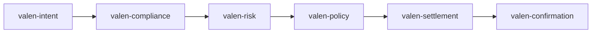

| Queue | Processor | Action |
|-------|-----------|--------|
| `valen-intent` | IntentProcessor | Stylus on-chain attestation |
| `valen-compliance` | ComplianceProcessor | Record compliance check |
| `valen-risk` | RiskProcessor | Budget + Robinhood + risk factors |
| `valen-policy` | PolicyProcessor | Approval gate |
| `valen-settlement` | SettlementProcessor | On-chain settlement + budget commit |
| `valen-confirmation` | ConfirmationProcessor | Tx receipt polling |
| `valen-dead-letter` | DeadLetterService | Failed job recovery |

**Supporting:** `PipelineRecoveryService` re-enqueues stuck executions every 30s.

**Deployment:** Render (`valen-api`, `valen-scheduler`, `valen-redis`)

---

## Security Model

### Threat Model

| Threat | Mitigation |
|--------|------------|
| Unauthorized agent execution | Mandate scope + JWT/API key auth + RBAC |
| Unlimited agent spend | Budget caps (DB + vault) + mandate maxTotal/maxPerTx |
| Compliance bypass | Fail-closed pipeline; on-chain re-validation at submit |
| Replay attacks | executionHash uniqueness; x402 nonce deduplication |
| Compromised relayer key | Scoped operator role; emergency pause via Guardian |
| Frontend tampering | Backend validates all intents; signatures verified server-side |

### Fail-Closed Architecture

> Every gate defaults to **refuse**. Missing mandate, stale scope snapshot, exceeded budget, failed compliance, or high-risk tier → refusal with auditable reason codes and public proof URL.

### Permission Model

| Role | Capabilities |
|------|--------------|
| `organization_owner` | Full org control, mandate signing, approvals |
| `developer` | Agent CRUD, execution submit |
| `compliance_officer` | Compliance attestations, audit export |
| `risk_officer` | Risk recalculation, approval queue |
| `auditor` | Read-only audit access |
| `platform_admin` | Emergency pause, dead-letter replay |

### Settlement Guarantees

- Funds move only through `ValenSettlement.executeSettlement`
- ERC-20 path requires prior approval to TokenSettlementAdapter
- Mandate usage recorded atomically at execute
- Budget vault `commitSpend` before token execute (Arbitrum Sepolia)
- On-chain audit commitments in `ValenAuditLog`

---

## Production Evidence

Verified on testnet as of **2026-06-13**. Live proof pack: https://valenai.vercel.app/proofs/pack

### Real Executions

| Type | ID | Chain | Tx / Notes |
|------|-----|-------|------------|
| USDC execution | `07736a69-…` | 421614 | Tx `0xf3f5526a…` — [proof](https://valenai.vercel.app/proofs/executions/07736a69) |
| USDG execution | `81aa0680-…` | 46630 | Robinhood settlement |
| TSLA allowed | via template | 46630 | Operator-relayed settlement |

### Real Refusals

| Type | ID | Reason |
|------|-----|--------|
| Budget exceeded | `b0e697f9-86c4-43d0-94ae-88c0f89cfa64` | `budget_exceeded` |
| TSLA refused | `512553dd-…` | Robinhood over-limit scenario |
| x402 refused | `dad9b8b5-5246-4424-8689-f0f8593bc860` | `budget_exceeded` at initiate |

### Real x402 Payments

| ID | Amount | Status | Tx |
|----|--------|--------|-----|
| `824c7b21-…` | 0.001 USDC | settled | `0x96b903ea…` |

### Real Settlements

Settlement txs verifiable on:
- **Arbitrum Sepolia:** https://sepolia.arbiscan.io
- **Robinhood Testnet:** https://explorer.testnet.chain.robinhood.com

### Verify Proofs

```bash
# CLI proof pack verification
cd backend && pnpm exec ts-node scripts/verify-proof-pack.ts
```

---

## Hackathon Impact

### Why This Is Innovative

VALEN is not another wallet or trading bot. It is the **first unified governance operating system** that combines:

- **ERC-8226 mandates** (scoped authority)
- **Stylus on-chain engines** (compliance, risk, eligibility, policy, budget)
- **Dual-chain settlement** (Arbitrum + Robinhood Chain)
- **x402 governed payments** (autonomous commerce with budget caps)
- **ERC-8004 identity** (discoverable agent profiles)
- **Public proofs** (every outcome verifiable at a URL)

No other hackathon project ties these standards together with **enforcement** and **proof generation** in a single production pipeline.

### Why This Is Difficult

| Challenge | How VALEN Solves It |
|-----------|---------------------|
| Hybrid on-chain/off-chain orchestration | BullMQ pipeline + Stylus attestation + Solidity settlement |
| Dual-chain contract deployment | Separate manifests per chain; shared architecture |
| Fail-closed compliance | Every gate produces auditable refusal, not silent failure |
| Real settlement (not mocks) | `ValenSettlement` submit/approve/execute on both chains |
| Proof as product | DB views + public API + frontend proof pages |
| Budget enforcement | DB + on-chain vault + Stylus engine (triple layer) |

### Why This Matters for AI Agents

Autonomous agents will handle treasury, payments, and trading without human clicks. Regulators and institutions require:

1. **Proof of authorization** — mandate hash on every outcome
2. **Proof of compliance** — Stylus engine hashes bound to execution
3. **Proof of refusal** — blocked actions are as valuable as settlements
4. **Discoverable identity** — ERC-8004 profiles link actions to agents

VALEN delivers all four today on testnet.

### Judge Demo Path (5 minutes)

1. Open https://valenai.vercel.app/proofs/pack — show live execution, refusal, payment proofs
2. Open https://valenai.vercel.app/agents/valen — ERC-8004 agent profile
3. Login → `/dashboard/executions/new?template=arbitrum-usdc` — submit governed USDC intent
4. Watch pipeline → settlement tx on Arbiscan → public proof URL
5. Try `/dashboard/assets/tsla` — Robinhood allowed vs refused scenarios

---

## Repository Structure

```
valen/
├── frontend/                 # Next.js 15 App Router dashboard + marketing
│   ├── src/app/              # Routes (dashboard, proofs, agents)
│   ├── src/components/       # UI components (command center, execution, marketing)
│   ├── src/lib/              # API client, intent templates, eligibility engine
│   └── public/               # Static assets, chain logos
├── backend/                  # NestJS API + BullMQ workers
│   ├── src/modules/          # Domain modules (settlement, x402, proofs, etc.)
│   ├── src/queues/           # BullMQ processors
│   ├── supabase/migrations/  # PostgreSQL schema
│   └── scripts/              # Proof verification, deployment helpers
├── contracts/                # Solidity (Foundry)
│   ├── src/                  # ValenSettlement, MandateRegistry, etc.
│   └── deployments/          # arbitrum-sepolia, robinhood-testnet manifests
├── stylus/                   # Rust/WASM Stylus engines
│   ├── compliance-engine/
│   ├── risk-engine/
│   ├── eligibility-engine/
│   ├── policy-engine/
│   ├── budget-engine/
│   └── deployments/          # Engine addresses per chain
├── infra/                    # Docker, Render blueprints
```

### Key Source Files

| Area | Path |
|------|------|
| Settlement contract | `contracts/src/settlement/ValenSettlement.sol` |
| Mandate registry | `contracts/src/settlement/ValenMandateRegistry.sol` |
| Proof service | `backend/src/modules/proofs/proofs.service.ts` |
| x402 service | `backend/src/modules/x402/x402.service.ts` |
| Mandate eligibility | `backend/src/common/utils/mandate-scope.util.ts` |
| Intent templates | `frontend/src/lib/intent-templates.ts` |
| Command agent | `frontend/src/components/command-center/command-agent-console.tsx` |
| Arbitrum deployment | `contracts/deployments/arbitrum-sepolia/deployment.json` |
| Robinhood deployment | `contracts/deployments/robinhood-testnet/deployment.json` |
| Stylus engines | `stylus/deployments/arbitrum-sepolia/engines.json` |

---

## Local Development

### Prerequisites

- Node.js ≥ 20
- pnpm ≥ 9
- PostgreSQL (Supabase) + Redis
- Alchemy API key
- Privy app credentials

### Quick Start

```bash
# Install dependencies
pnpm install

# Start local infra (PostgreSQL + Redis)
pnpm docker:up

# Backend (port 3000)
pnpm dev:backend

# Frontend (port 3001)
pnpm dev:frontend

# Worker (separate terminal)
cd backend && pnpm start:worker
```

### Environment Variables

**Backend required** (`backend/src/config/env.validation.ts`):

```env
DATABASE_URL=
SUPABASE_URL=
SUPABASE_SERVICE_ROLE_KEY=
REDIS_URL=
PRIVY_APP_ID=
PRIVY_APP_SECRET=
ALCHEMY_API_KEY=
PRIVATE_KEY=
ARBITRUM_SEPOLIA_VALEN_REGISTRY=
ARBITRUM_SEPOLIA_VALEN_SETTLEMENT=
ROBINHOOD_TESTNET_VALEN_REGISTRY=
ROBINHOOD_TESTNET_VALEN_SETTLEMENT=
```

**Frontend** (`.env.local`):

```env
NEXT_PUBLIC_API_URL=https://valen-api-m3g4.onrender.com
NEXT_PUBLIC_PRIVY_APP_ID=
NEXT_PUBLIC_CHAIN_IDS=421614,46630
```

### Build

```bash
# Full monorepo build
NODE_ENV=production pnpm build

# Frontend only
pnpm build:frontend

# Backend only
pnpm build:backend
```

> **Tip:** Always set `NODE_ENV=production` for production builds. Non-standard `NODE_ENV` values cause Next.js prerender errors.

### Database Migrations

```bash
cd backend && pnpm run migrate
```

---

## Future Work

Explicitly **not implemented** — marked for transparency:

| Item | Status |
|------|--------|
| Arbitrum One mainnet | 📋 Deferred |
| ERC-8004 NFT registry + on-chain mint | 📋 Metadata ready; mint awaits registry |
| External x402 facilitator (`X402_FACILITATOR_URL`) | 📋 Direct EIP-3009 used today |
| ValenEscrow in main settlement path | 📋 Deployed; not wired |
| MCP Server + TypeScript SDK (Phase J) | 📋 Not started |
| Robinhood BudgetEngine / BudgetVault | 📋 Arbitrum Sepolia only |
| Goldsky/subgraph indexer | 📋 Deferred |

Phases J–M (MCP SDK, demo packaging, submission) are planned but not started.

---

## Phase Completion

| Phase | Name | Status |
|-------|------|--------|
| A | Baseline lock | ✅ Complete |
| B | UX simplification | ✅ Complete |
| C | USDC-first | ✅ Complete |
| D | Robinhood headline | ✅ Complete |
| E | Identity/mandates | ✅ Complete |
| F | Budget engine | ✅ Complete |
| G | x402 | ✅ Complete |
| H | ERC-8004 visibility | ✅ Complete |
| I | Proof API | ✅ Complete |
| J–M | SDK, MCP, demo packaging | 📋 Not started |

---

## License

UNLICENSED — see repository for terms.

---

<div align="center">

**VALEN** — Where agents meet permission. Every action, proven.

[Launch App](https://valenai.vercel.app/login) · [Proof Pack](https://valenai.vercel.app/proofs/pack) · [API Docs](https://valen-api-m3g4.onrender.com/docs)

Built for the future of agentic finance on **Arbitrum** and **Robinhood Chain**.

</div>
