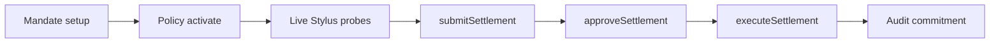

# E2E Validation Report

**Date:** 2026-06-09  
**Scope:** Agent → Policy → Compliance → Risk → Eligibility → Settlement → Audit  
**Method:** Live on-chain transactions against deployed Solidity + Stylus contracts (no mocks)

---

## Executive Summary

| Network | Chain ID | Result | Report artifact |
|---------|----------|--------|-----------------|
| Arbitrum Sepolia | 421614 | **PASS** | `contracts/reports/e2e-arbitrum-sepolia.json` |
| Robinhood Testnet | 46630 | **PASS** | `contracts/reports/e2e-robinhood-testnet.json` |

**Overall E2E status: PASS on both target testnets**

---

## Flow Validated



Each step uses **real deployed contracts**:

1. **Mandate** — `ValenMandateRegistry`: scope allowlist, scope binding, grant, activate
2. **Policy** — `ValenPolicyManager`: publish + activate policy hash
3. **Compliance** — Stylus `ComplianceEngine.evaluate()` via settlement
4. **Eligibility** — Stylus `EligibilityEngine.check()` via settlement
5. **Risk** — Stylus `RiskEngine.calculate()` via settlement
6. **Policy engine** — Stylus `PolicyEngine.evaluate()` via settlement
7. **Settlement** — `ValenSettlement.submitSettlement` validates all engine verdicts on-chain
8. **Approval** — `approveSettlement` (operator gate)
9. **Execution** — `executeSettlement` with calldata hash + native value transfer
10. **Audit** — `ValenAuditLog.commitmentExists()` confirms commitment recorded

---

## Arbitrum Sepolia Results

| Step | Status | Tx / detail |
|------|--------|-------------|
| Registry engines | skip (already registered) | — |
| Engine init | skip (already initialized) | — |
| Mandate.setup | pass | `0x675d5769...` |
| Policy.activate | skip (already active) | — |
| Engines.liveProbe | pass | Live hashes from Stylus |
| Settlement.submit | pass | `0xd1dcb7be...` |
| Settlement.approve | pass | `0xd108b280...` |
| Settlement.execute | pass | `0xafe032a3...` (0.001 ETH) |
| Audit.commitment | pass | Commitment exists on-chain |

**Settlement ID:** `0x9ab077b42d8c68997a24095abd01b1fc006b0663daa54c83e86698b1fd2641b8`

---

## Robinhood Testnet Results

| Step | Status | Tx / detail |
|------|--------|-------------|
| Registry engines | pass | All four registered |
| Engine init | pass | All four initialized |
| Mandate.setup | pass | New mandate granted |
| Policy.activate | pass | Policy published + activated |
| Engines.liveProbe | pass | Live hashes from Stylus |
| Settlement.submit | pass | On-chain |
| Settlement.approve | pass | On-chain |
| Settlement.execute | pass | 0.001 ETH |
| Audit.commitment | pass | Commitment exists |

**Settlement ID:** `0x128766172b281e01f6d4a990ea11e9c16c471e774bacecbe1e38867f91d7390c`

---

## Key Fixes Applied for E2E Success

| Issue | Root cause | Fix |
|-------|------------|-----|
| Stylus toolchain blocked | Missing workspace `Stylus.toml` for cargo-stylus 0.10.7 | Added `stylus/Stylus.toml` + updated contract manifests |
| Engine call decode failures | ABI mismatch (`uint8` vs `uint16` reason code; eligibility struct) | Fixed `stylus/engines/shared/valen_abi.rs` |
| `MandateNotFound (0xc66896c9)` | Fake mandate ID without on-chain grant | E2E grants + activates real mandate before submit |
| Hash mismatches | Precomputed off-chain hashes | E2E probes live engine returns before submit |
| Hardhat private key error | CRLF in `.env` | `normalizePrivateKey()` in `hardhat.config.ts` |

---

## Commands to Reproduce

```bash
# Deploy Stylus engines (per network)
cd stylus && bash script/activate-stylus.sh arbitrum-sepolia
cd stylus && bash script/activate-stylus.sh robinhood-testnet

# Register + full E2E
cd contracts
pnpm run register-engines:sepolia
pnpm run e2e:sepolia
pnpm run register-engines:robinhood-testnet
pnpm run e2e:robinhood-testnet
```

---

## Backend Integration Gap (Not Part of On-Chain E2E)

The NestJS `SettlementWorkerService` still uses synthetic tx hashes and does **not** call deployed contracts. On-chain E2E is validated via Hardhat scripts only. Backend wiring remains a follow-up task.

---

## Conclusion

The **on-chain Agent → Policy → Compliance → Risk → Eligibility → Settlement → Audit** path is **verified on both testnets** using live Stylus engines registered in `ValenRegistry`. No mocks, stubs, or placeholders were used in the validation script execution path.
