# VALEN Architecture Blueprint

**Status:** Final source of truth before Phase 3 implementation.  
**Version:** 1.0  
**Scope:** Architecture only. No implementation code. No pseudo code. No examples.  
**Supersedes for implementation:** PHASE1_VALEN_RESEARCH.md, VALEN_SYSTEM_DESIGN_FREEZE.md, VALEN_BACKEND_MASTERPLAN.md (as planning inputs; this document is authoritative for build).

---

# SYSTEM OVERVIEW

## What VALEN Is

VALEN is the **Compliance, Risk and Permission Layer for Agentic Finance**. It sits between autonomous agents and onchain financial execution, enforcing that no agent action proceeds to settlement without passing compliance, risk, and policy evaluation. VALEN is infrastructure, not a DEX, wallet, Robinhood clone, or AI chatbot.

## Core Mission

Enable institutions, fintech platforms, and agent developers to deploy autonomous financial agents on Arbitrum-class chains with enforceable guardrails: scoped mandates, deterministic policy evaluation, risk-tiered approvals, and immutable audit evidence.

## Core Value Proposition

| Stakeholder | Value |
|---|---|
| Agent developers | Typed SDK and API to submit intents; clear pass/fail verdicts before settlement |
| Compliance teams | Structured reason codes, audit trails, human oversight for high-risk actions |
| Fintech / RWA issuers | ERC-8226-aligned mandate model, pre-transfer enforcement, Robinhood Chain compatibility |
| Institutions | Production-grade hybrid onchain/offchain architecture with fail-closed compliance |

## Why Stylus Exists in the Architecture

Stylus (Rust/WASM on Arbitrum) executes compute-intensive compliance, risk, eligibility, and policy evaluation at 10–100× lower gas cost than equivalent Solidity for iterative scoring and rule chains. Storage costs are identical; compute is where VALEN's engines benefit. Stylus engines are called by ValenSettlement and return deterministic verdict hashes bound to every settlement decision. Stylus is a production requirement, not a hackathon differentiator.

## Why Robinhood Chain Exists in the Architecture

Robinhood Chain is an Arbitrum Orbit L2 optimized for tokenized RWAs — equities, ETFs, and regulated instruments. VALEN's mandate-scoped agent permission model maps directly to regulated asset workflows. Dual deployment on Arbitrum Sepolia/One and Robinhood Testnet/Mainnet satisfies Open House qualification, institutional narrative, and production multi-chain strategy. Chain ID 46630 (testnet); ETH gas; Stylus supported; Alchemy bundler and smart wallets available.

## Why Backend Decisions Were Made

| Decision | Rationale |
|---|---|
| NestJS | Modular DI, guards, queues, enterprise testing structure |
| Supabase PostgreSQL | Relational integrity for compliance evidence, RLS, managed Postgres |
| Redis + BullMQ | Async intent pipeline with retries, DLQ, idempotency without Kafka operational overhead |
| Render | Fast production deployment for API, workers, scheduler |
| Privy | Auth and embedded wallet onboarding without building wallet infrastructure |
| Alchemy | RPC, bundler, paymaster for ERC-4337 agent flows |
| Envio + RPC reconciliation | Indexing without operating custom streaming infrastructure prematurely |

## System Context Diagram

```text
┌──────────┐
│   User   │  Human operator, compliance officer, policy manager, auditor
└────┬─────┘
     │ HTTPS
     ▼
┌──────────┐     Privy SDK      ┌──────────┐
│ Frontend │◄──────────────────►│  Privy   │
│  Vercel  │                    └──────────┘
└────┬─────┘
     │ HTTPS / JWT
     ▼
┌──────────────────────────────────────────────────────────┐
│                      Backend                              │
│  NestJS API │ Workers │ Scheduler │ Render               │
│  ┌────────┐  ┌────────┐  ┌──────────┐                  │
│  │Postgres│  │ Redis  │  │ BullMQ   │                  │
│  │Supabase│  │ Cache  │  │ Queues   │                  │
│  └────────┘  └────────┘  └──────────┘                  │
└────┬───────────────────────────────┬─────────────────────┘
     │ JSON-RPC / UserOp              │ Indexer feed
     ▼                                ▼
┌──────────┐                    ┌──────────┐
│ Alchemy  │                    │  Envio   │
└────┬─────┘                    └────┬─────┘
     │                               │
     ▼                               │
┌──────────────────────────────────────────────────────────┐
│              Arbitrum / Robinhood Chain                   │
│                                                          │
│  ┌─────────────────┐      staticcall      ┌────────────┐ │
│  │ Solidity        │◄────────────────────►│ Stylus     │ │
│  │ Contracts       │                      │ Engines    │ │
│  │ Settlement      │                      │ Compliance │ │
│  │ MandateRegistry │                      │ Risk       │ │
│  │ PolicyManager   │                      │ Eligibility│ │
│  │ AuditLog        │                      │ Policy     │ │
│  └────────┬────────┘                      └────────────┘ │
│           │ execute                                       │
│           ▼                                               │
│  Target Token / DEX / RWA Contract                        │
└──────────────────────────────────────────────────────────┘
     │
     ▼
┌──────────┐  ┌──────────┐
│  Sentry  │  │ PostHog  │  Observability
└──────────┘  └──────────┘
```

## Canonical Flow

```text
User
  ↓
Frontend
  ↓
Backend
  ↓
Stylus Engines (onchain evaluation)
  ↓
Contracts (settlement gate)
  ↓
Arbitrum / Robinhood Chain
```

---

# COMPLETE EXECUTION FLOW

## 1. User Login

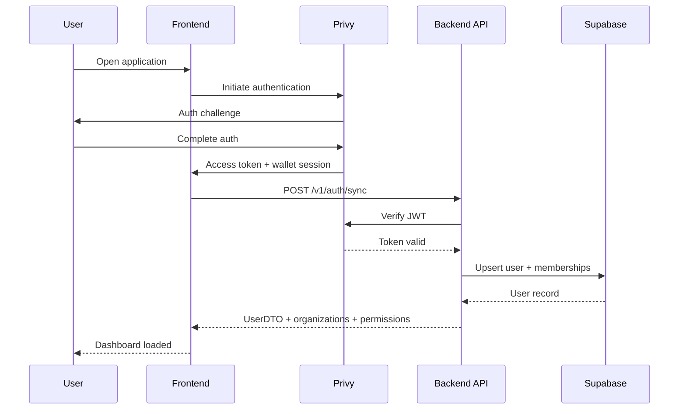

## 2. Agent Registration

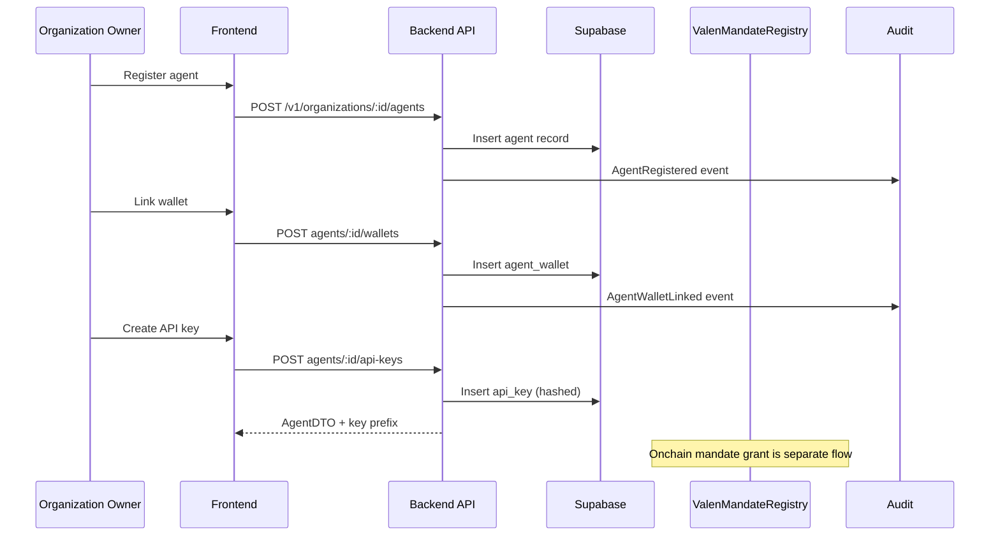

## 3. Policy Creation

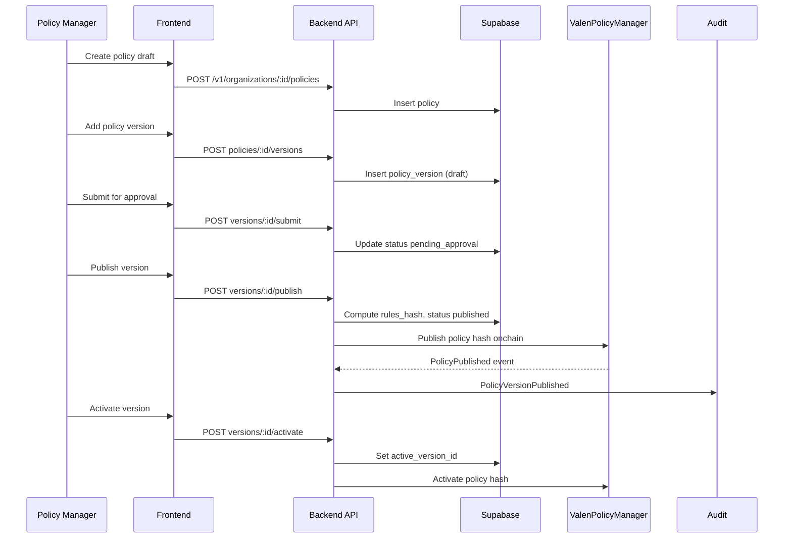

## 4. Compliance Evaluation

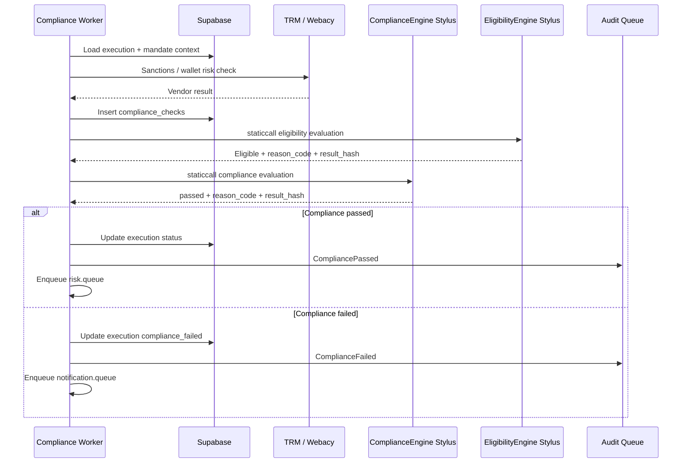

## 5. Risk Evaluation

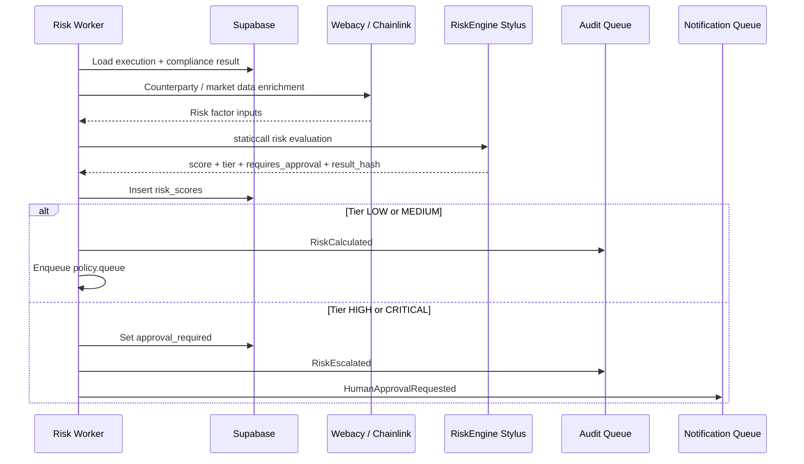

## 6. Settlement Request

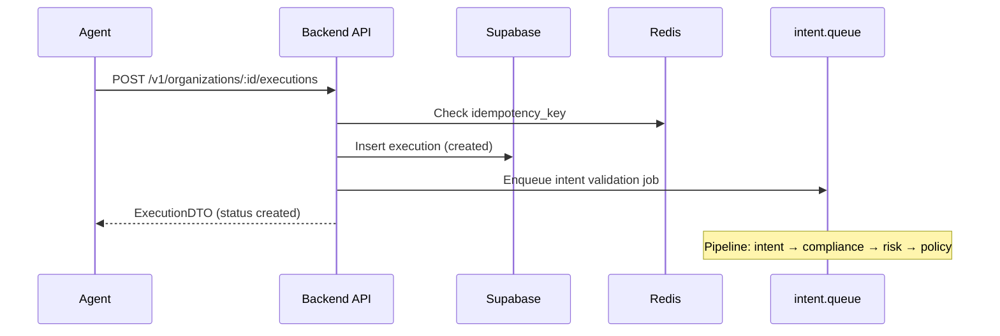

## 7. Settlement Approval

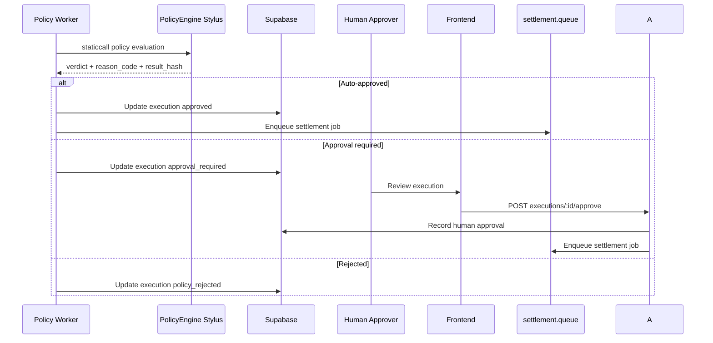

## 8. Settlement Execution

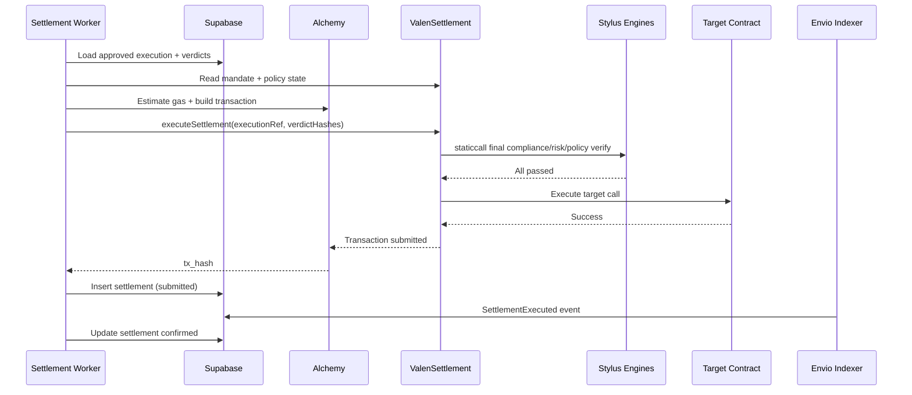

## 9. Audit Logging

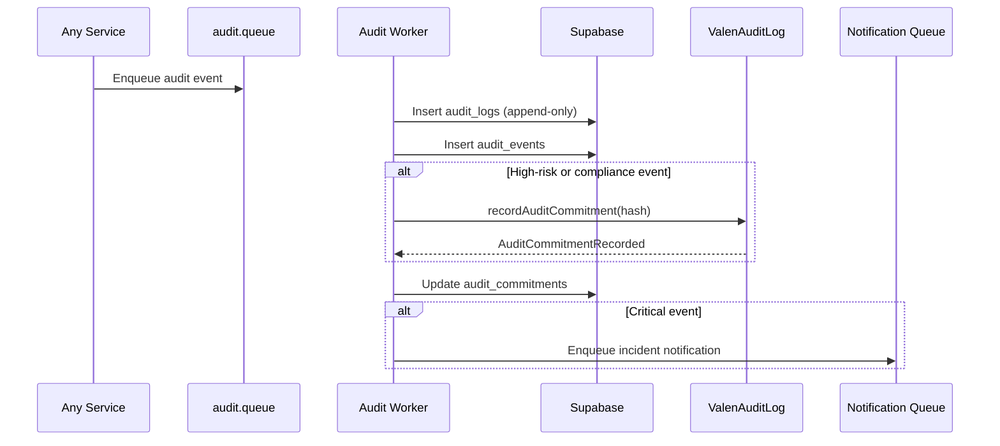

## 10. Emergency Pause

```mermaid
sequenceDiagram
    participant GA as Emergency Guardian
    participant F as Frontend Admin
    participant A as Backend API
    participant D as Supabase
    participant EG as ValenEmergencyGuardian
    participant VS as ValenSettlement
    participant N as Notification Queue
    participant S as Sentry

    GA->>F: Initiate emergency pause
    F->>A: POST /v1/admin/emergency/pause
    A->>D: Insert emergency_actions
    A->>EG: pauseSettlement(scope)
    EG->>VS: Set pause flag
    VS-->>EG: SettlementPaused event
    A->>D: Update organization/agent pause state
    A->>N: Critical incident notification
    A->>S: Alert EmergencyPauseActivated
    Note over VS: New settlements blocked; in-flight reconciled
```

---

# EVENT DRIVEN ARCHITECTURE

## Event Backbone

Postgres stores durable domain events. BullMQ dispatches async processing. Onchain contracts emit settlement-critical events. Indexers reconcile chain truth into read models. Events are append-only; corrections use compensating events.

## Master Event Flow Diagram

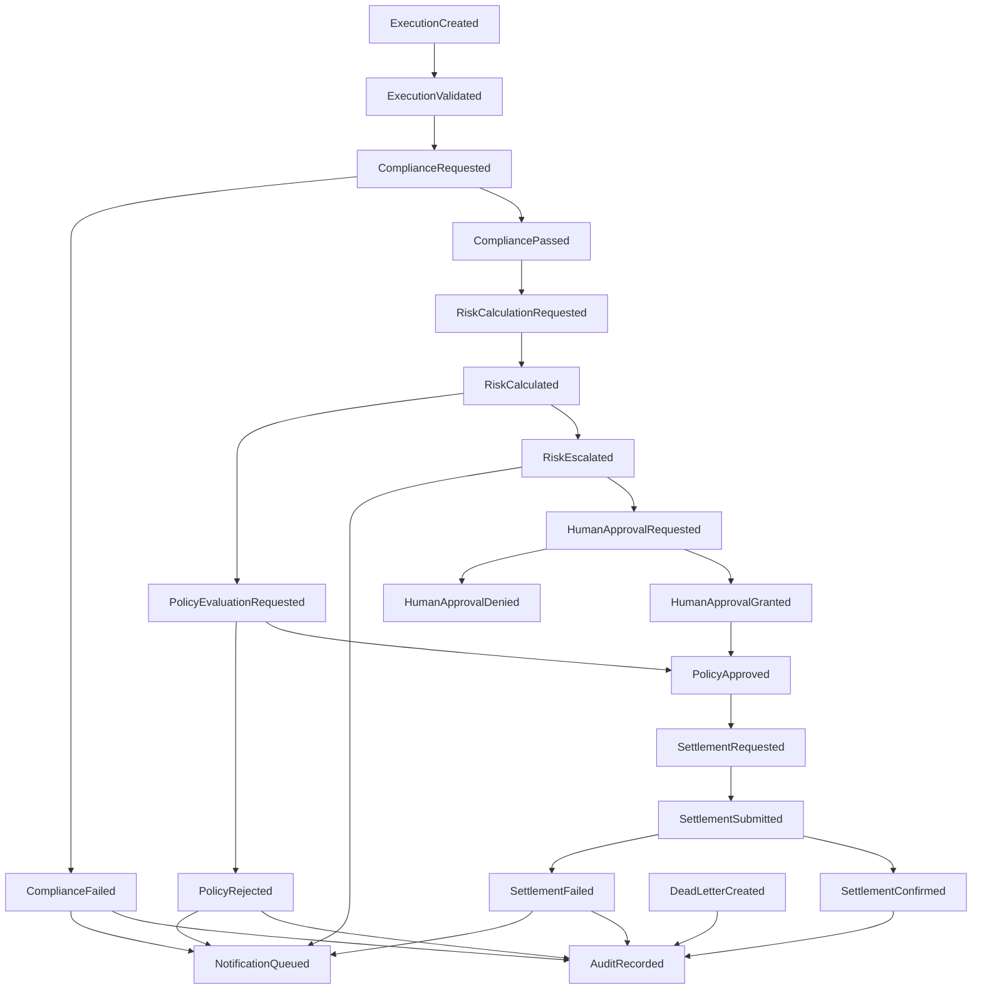

## Event Catalog

| Event | Producer | Consumer | Queue | Database Impact | Smart Contract Impact |
|---|---|---|---|---|---|
| UserCreated | Auth Module | Audit, Notification | audit.queue | Insert users | None |
| OrganizationCreated | Organization Module | Audit, Admin | audit.queue | Insert organizations | None |
| AgentRegistered | Agent Module | Audit, Mandate | audit.queue | Insert agents | Optional registry reference |
| AgentWalletLinked | Agent Module | Compliance, Settlement | audit.queue | Insert agent_wallets | None |
| AgentSuspended | Agent Module / Admin | Intent, Settlement, Notification | audit.queue, notification.queue | Update agents.status | None |
| MandateCreated | Mandate service / Indexer | Compliance, Policy | audit.queue | Insert mandates | ValenMandateRegistry.MandateGranted |
| MandateActivated | Contract Indexer | Intent, Settlement | indexer.queue | Update mandates | Onchain state |
| MandateRevoked | Admin / Indexer | Intent, Settlement, Notification | audit.queue, notification.queue | Update mandates | ValenMandateRegistry.MandateRevoked |
| MandateExpired | Scheduler | Intent, Settlement | maintenance.queue | Update mandates | Onchain expiry |
| ExecutionCreated | API / Agent SDK | Intent Worker | intent.queue | Insert executions | None |
| ExecutionValidated | Intent Worker | Compliance Worker | compliance.queue | Update executions, intent_validations | None |
| ExecutionRejected | Intent Worker | Notification, Audit | notification.queue, audit.queue | Update executions | None |
| ComplianceRequested | Intent Worker | Compliance Worker | compliance.queue | Insert compliance_checks pending | None |
| CompliancePassed | Compliance Worker | Risk Worker | risk.queue | Update compliance_checks, executions | Optional ComplianceEngine result hash stored |
| ComplianceFailed | Compliance Worker | Notification, Audit | notification.queue, audit.queue | Update compliance_checks, executions | None |
| RiskCalculationRequested | Compliance Worker | Risk Worker | risk.queue | Insert risk_scores pending | None |
| RiskCalculated | Risk Worker | Policy Worker | policy.queue | Insert risk_scores | Optional RiskEngine result hash |
| RiskEscalated | Risk Worker | Notification, Admin | notification.queue | Update executions approval_required | None |
| PolicyEvaluationRequested | Risk Worker | Policy Worker | policy.queue | Insert policy evaluation pending | None |
| PolicyApproved | Policy Worker | Settlement Worker | settlement.queue | Update executions approved | PolicyEngine result hash |
| PolicyRejected | Policy Worker | Notification, Audit | notification.queue, audit.queue | Update executions policy_rejected | None |
| HumanApprovalRequested | Policy / Risk Worker | Notification | notification.queue | Update executions | None |
| HumanApprovalGranted | Admin API | Settlement Worker | settlement.queue | Record approval | None |
| HumanApprovalDenied | Admin API | Notification, Audit | notification.queue, audit.queue | Update executions | None |
| SettlementRequested | Policy / Approval Worker | Settlement Worker | settlement.queue | Insert settlements pending | None |
| SettlementSubmitted | Settlement Worker | Confirmation Worker | confirmation.queue | Update settlements submitted | ValenSettlement transaction pending |
| SettlementConfirmed | Indexer / Confirmation Worker | Audit, Read Models | indexer.queue, audit.queue | Update settlements confirmed, executions executed | ValenSettlement.SettlementExecuted |
| SettlementFailed | Settlement Worker / Indexer | Retry, Notification, Audit | notification.queue, audit.queue | Update settlements failed | ValenSettlement.SettlementFailed |
| SettlementReconciled | Indexer Worker | Audit | audit.queue | Insert settlement_reconciliations | None |
| AuditRecorded | Audit Worker | Reporting, Monitoring | audit.queue | Insert audit_logs, audit_events | ValenAuditLog.AuditCommitmentRecorded |
| NotificationQueued | Any Module | Notification Worker | notification.queue | Insert notifications | None |
| NotificationDelivered | Notification Worker | Audit | audit.queue | Update notifications | None |
| NotificationFailed | Notification Worker | DLQ, Monitoring | dead-letter.queue | Update notifications | None |
| PolicyVersionPublished | Policy Module | Policy Worker, Audit | audit.queue | Insert policy_versions published | ValenPolicyManager.PolicyPublished |
| PolicyVersionActivated | Policy Module | Policy Worker | audit.queue | Update policies active_version | ValenPolicyManager.PolicyActivated |
| VendorCheckRequested | Compliance / Risk Worker | Vendor Worker | vendor.queue | Insert vendor check pending | None |
| VendorCheckCompleted | Vendor Adapter | Compliance / Risk Worker | compliance.queue or risk.queue | Update compliance_checks | None |
| VendorCheckFailed | Vendor Adapter | DLQ, Monitoring | dead-letter.queue | Update vendor check error | None |
| EmergencyPauseActivated | Admin / Guardian | All Workers, Notification | notification.queue | Insert emergency_actions | ValenEmergencyGuardian.EmergencyPauseActivated |
| EmergencyPauseLifted | Admin / Governance | All Workers | audit.queue | Update emergency_actions | ValenEmergencyGuardian.EmergencyPauseLifted |
| DeadLetterCreated | Queue System | Operations | dead-letter.queue | Insert dead_letter_jobs | None |

---

# QUEUE ARCHITECTURE

## BullMQ Design

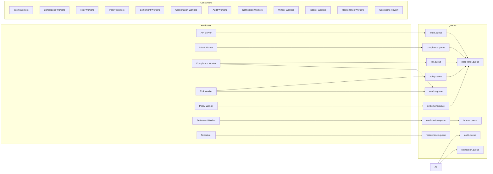

## Queue Specifications

| Queue | Producer | Consumer | Retry Strategy | DLQ Strategy | Failure Recovery |
|---|---|---|---|---|---|
| intent.queue | API, Agent SDK | Intent Workers | 1 immediate retry; validation failures non-retryable | Route to DLQ after max attempts; alert if compliance-related | Manual replay after data fix; idempotency key prevents duplicate executions |
| compliance.queue | Intent Worker | Compliance Workers | Exponential backoff 3 attempts; vendor timeout retryable | DLQ + Sentry alert; fail-closed if required vendor unavailable | Replay job; refresh vendor cache; escalate to Compliance Officer |
| risk.queue | Compliance Worker | Risk Workers | 2 retries for transient errors | DLQ for persistent model errors | Fix model config; replay; manual risk override only via human approval path |
| policy.queue | Risk Worker | Policy Workers | 2 retries | DLQ for policy evaluation errors | Reactivate previous policy version if bad publish; replay job |
| settlement.queue | Policy Worker, Approval API | Settlement Workers | Strict: 3 retries with nonce safety; non-retryable on revert | DLQ + critical alert; pause scope if spike | Reconcile chain state; replay only if tx not submitted; manual Settlement Operator review |
| confirmation.queue | Settlement Worker | Confirmation Workers | Repeated poll until timeout | DLQ after confirmation timeout | RPC direct verification; indexer replay; manual reconciliation |
| audit.queue | All services | Audit Workers | Aggressive retry 5 attempts | DLQ + critical alert; never silent drop | Replay from event log; backfill audit_logs |
| notification.queue | All services | Notification Workers | Exponential backoff 5 attempts | DLQ; disable failing webhook after threshold | Retry delivery; rotate webhook secret; does not block settlement |
| vendor.queue | Compliance, Risk Workers | Vendor Adapters | 3 retries with backoff | DLQ; required vendor failure triggers fail-closed | Cache stale result if within TTL; else block intent |
| indexer.queue | Envio webhook / poller | Indexer Workers | 5 retries | DLQ; alert on lag | Replay from last processed block |
| maintenance.queue | Scheduler | Maintenance Workers | 2 retries | DLQ low priority | Manual scheduler run |
| dead-letter.queue | All queues | Operations | No auto retry | Persistent until manual resolution | Admin replay with audit log; root cause fix required |

## Global Queue Rules

- Every job carries correlation_id, organization_id, execution_id where applicable.
- Idempotency enforced at job enqueue and processor level.
- Settlement queue has highest priority and strictest concurrency limits.
- Audit queue failures are critical severity.
- DLQ growth triggers Sentry alert and PostHog operational event.

---

# CONTRACT INTERACTION MAP

## Full Contract Dependency Graph

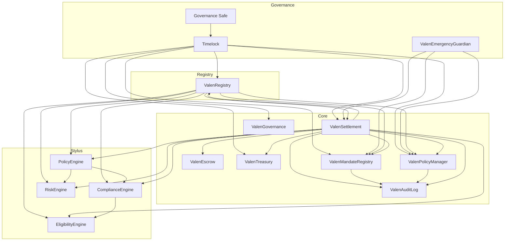

## Interaction Matrix

| Caller | Callee | Interaction Type | Purpose |
|---|---|---|---|
| ValenSettlement | ValenRegistry | read | Resolve engine and contract addresses |
| ValenSettlement | ValenMandateRegistry | read + write | Validate mandate; record usage |
| ValenSettlement | ValenPolicyManager | read | Verify active policy hash |
| ValenSettlement | ComplianceEngine | staticcall | Final compliance verification |
| ValenSettlement | EligibilityEngine | staticcall | Eligibility dimension check |
| ValenSettlement | RiskEngine | staticcall | Final risk tier verification |
| ValenSettlement | PolicyEngine | staticcall | Final policy verdict |
| ValenSettlement | ValenAuditLog | write | Record settlement audit commitment |
| ValenSettlement | ValenEscrow | write | Lock/release funds if escrow path enabled |
| ValenSettlement | ValenTreasury | write | Accrue protocol fee |
| ValenSettlement | Target Contract | write | Execute approved action |
| ComplianceEngine | EligibilityEngine | staticcall | Compose eligibility into compliance |
| PolicyEngine | ComplianceEngine result | read input | Policy uses compliance hash |
| PolicyEngine | RiskEngine result | read input | Policy uses risk hash |
| ValenEmergencyGuardian | ValenSettlement | write | Pause/unpause settlement |
| ValenEmergencyGuardian | ValenMandateRegistry | write | Freeze mandates |
| ValenRegistry | All contracts | registry | Address resolution |
| Backend | ValenSettlement | write | Submit approved settlement tx |
| Backend | ValenMandateRegistry | read | Mandate state for API |
| Backend | ValenPolicyManager | read | Policy hash for API |

## Contract Roles Summary

| Contract | Role |
|---|---|
| ValenRegistry | Canonical address book for contracts and Stylus engines |
| ValenPolicyManager | Onchain policy version hashes and activation |
| ValenMandateRegistry | Agent authority scoping and usage accounting |
| ValenSettlement | Final permission gate and execution dispatcher |
| ValenEscrow | Optional custody for controlled settlement flows |
| ValenTreasury | Protocol fee collection and withdrawal |
| ValenGovernance | Governance proposal and timelock coordination |
| ValenAuditLog | Immutable onchain audit commitments |
| ValenEmergencyGuardian | Scoped pause and freeze without fund access |
| ComplianceEngine | Deterministic compliance evaluation |
| RiskEngine | Deterministic risk scoring |
| EligibilityEngine | Principal/agent/asset/counterparty eligibility |
| PolicyEngine | Deterministic policy verdict |

---

# DATA FLOW ARCHITECTURE

## Component Data Flow Diagram

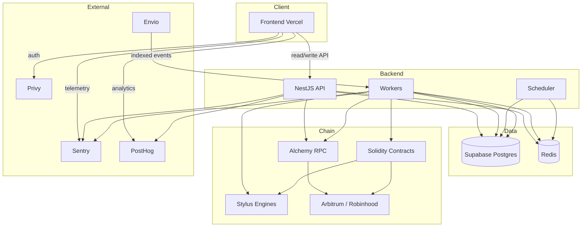

## Read Flow

| Step | Path | Data |
|---|---|---|
| Dashboard load | Frontend → API → Postgres | User, organization, agents, policies, recent executions |
| Execution detail | Frontend → API → Postgres | Execution, compliance_checks, risk_scores, settlement, audit timeline |
| Chain status | Frontend → API → Postgres (indexed) or Alchemy (live) | Settlement confirmation, tx hash, block number |
| Audit query | Frontend → API → Postgres | audit_logs filtered by organization, entity, date |
| Policy list | Frontend → API → Postgres | policies, active policy_versions |
| Mandate status | Frontend → API → Postgres + Alchemy read | mandates mirror + onchain state |

Read path never mutates. Cached reads use Redis for session, rate limits, and short-lived vendor result cache. Indexer-fed read models are preferred over live RPC for historical data.

## Write Flow

| Step | Path | Data |
|---|---|---|
| User action | Frontend → API → Postgres | organizations, agents, policies, approvals |
| Intent submission | Agent → API → Postgres → intent.queue | executions, idempotency_key |
| Compliance verdict | Worker → Postgres + optional Stylus | compliance_checks |
| Risk verdict | Worker → Postgres + optional Stylus | risk_scores |
| Policy verdict | Worker → Postgres + optional Stylus | policy evaluation state on executions |
| Settlement | Worker → Alchemy → ValenSettlement | settlements, tx_hash |
| Audit | Worker → Postgres + ValenAuditLog | audit_logs, audit_commitments |
| Notification | Worker → Postgres + external | notifications, webhook_deliveries |

All writes are transactional in Postgres where domain consistency requires it. Chain writes are separate and reconciled asynchronously.

## Cache Flow

| Cache | Location | TTL | Invalidation |
|---|---|---|---|
| Session context | Redis | Session lifetime | Logout, token expiry |
| Idempotency keys | Redis | 24 hours | After execution terminal state |
| Vendor compliance result | Redis | Per attestation expiry | Expiry, revocation |
| Vendor risk result | Redis | 15 minutes | New intent for same subject |
| Rate limit counters | Redis | 1 minute rolling | Automatic |
| Contract address registry | Redis | 1 hour | Contract deployment event |
| Nonce locks | Redis | Until tx confirmed | Confirmation or timeout |

Redis is never the source of truth for compliance or settlement state.

## Settlement Flow

```text
Agent intent
  → API validates + persists execution
  → intent.queue validates
  → compliance.queue evaluates (vendor + Stylus)
  → risk.queue scores (vendor + Stylus)
  → policy.queue verdict (Stylus)
  → human approval if required
  → settlement.queue builds tx
  → Alchemy submits to ValenSettlement
  → ValenSettlement staticcalls Stylus engines
  → ValenSettlement executes target
  → confirmation.queue polls receipt
  → indexer.queue reconciles event
  → Postgres updated to executed
  → audit.queue records commitment
  → notification.queue dispatches result
```

Chain state wins on conflict. Postgres reconciles to chain truth.

---

# SECURITY ARCHITECTURE

## Trust Boundaries

```text
┌─────────────────────────────────────────────────────────┐
│ UNTRUSTED: User browser, Agent SDK, Webhooks inbound    │
├─────────────────────────────────────────────────────────┤
│ SEMI-TRUSTED: Privy, Alchemy, Envio, TRM, Webacy        │
├─────────────────────────────────────────────────────────┤
│ TRUSTED: Backend API/Workers, Supabase (with RLS), Redis │
├─────────────────────────────────────────────────────────┤
│ HIGHLY TRUSTED: Solidity contracts, Stylus engines       │
├─────────────────────────────────────────────────────────┤
│ SOVEREIGN: Chain state (settlement finality)             │
└─────────────────────────────────────────────────────────┘
```

## Authentication Flow

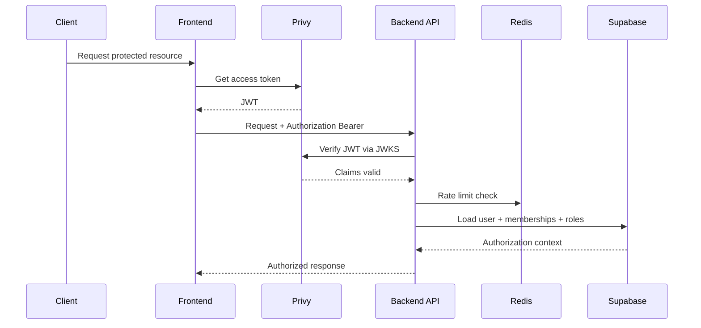

Human auth: Privy JWT. Agent auth: API key + optional wallet signature. Service account: scoped API key. No authorization from user-editable metadata.

## Authorization Flow

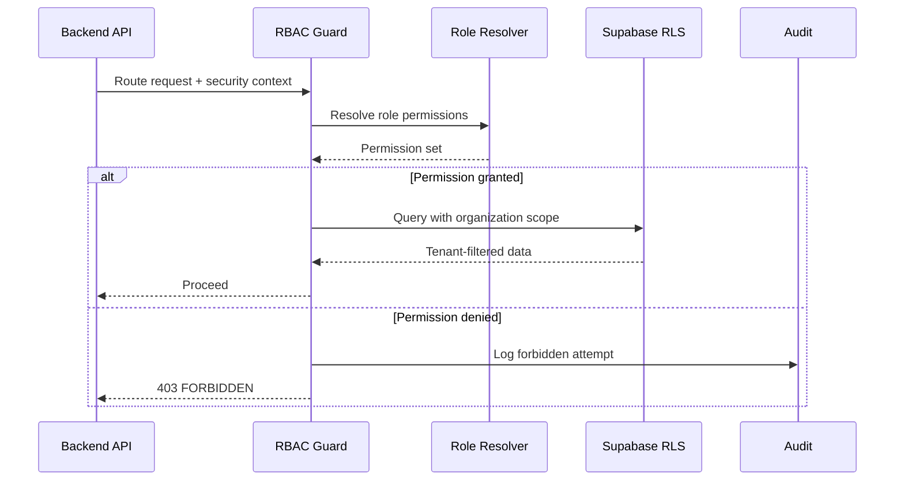

RBAC enforced at API guard layer. RLS enforced at database layer for defense in depth. Settlement and compliance tables writable only by backend service role.

## Settlement Security Flow

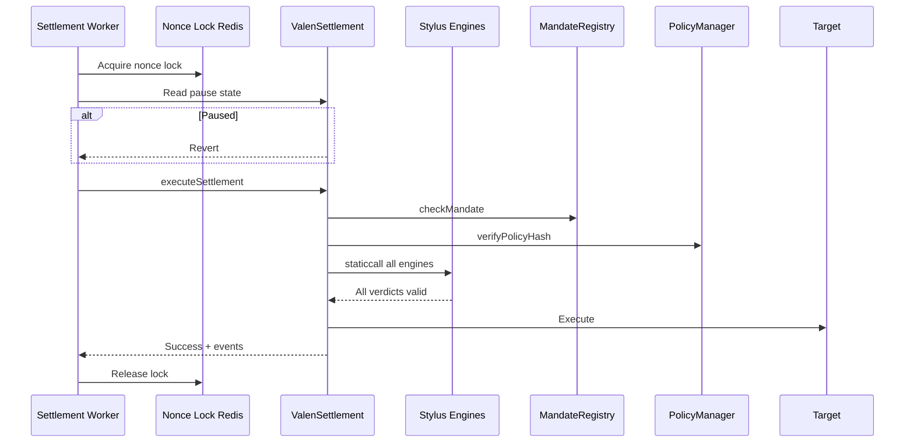

Checks: idempotency, mandate validity, policy version binding, engine result hashes, pause state, reentrancy guard, nonce serialization.

## Emergency Pause Flow

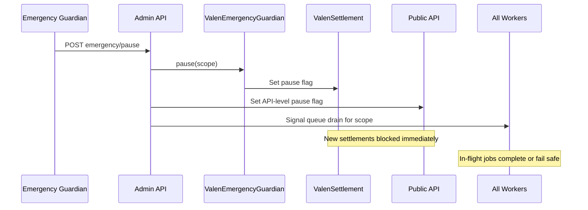

Guardian can pause but cannot upgrade, withdraw, or modify policy hashes.

## Upgrade Flow

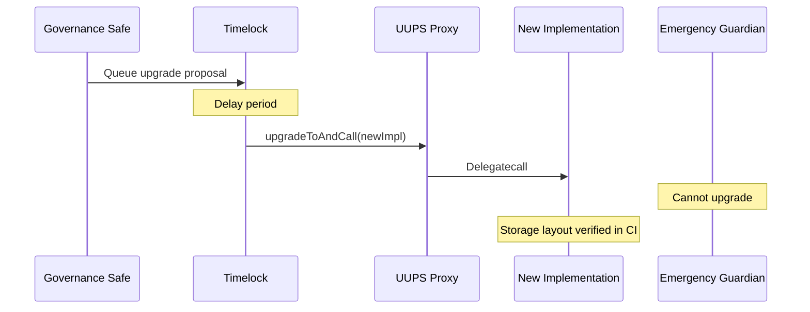

Stylus engines: deploy new version, activate, register in ValenRegistry, deprecate old pointer. No in-place Stylus upgrade assumed.

---

# DEPLOYMENT TOPOLOGY

## Infrastructure Diagram

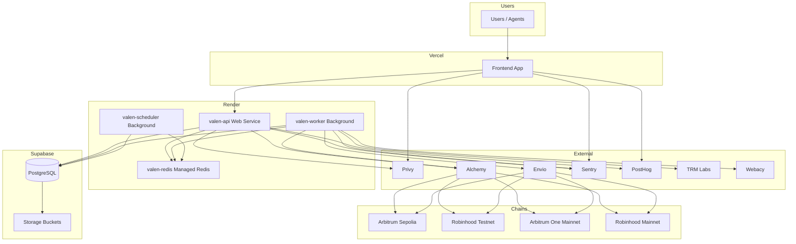

## Environment Matrix

| Environment | Frontend | API | Workers | Database | Redis | Chains |
|---|---|---|---|---|---|---|
| Local | localhost | localhost | localhost | local / dev Supabase | local Redis | fork / Sepolia |
| Dev | Vercel preview | Render dev | Render dev | Supabase dev | Render dev Redis | Arbitrum Sepolia |
| Staging | Vercel staging | Render staging | Render staging | Supabase staging | Render staging Redis | Sepolia + Robinhood Testnet |
| Production | Vercel production | Render production | Render production | Supabase production | Render production Redis | Arbitrum One + Robinhood Mainnet |

## Service Configuration

| Service | Health Check | Build | Start |
|---|---|---|---|
| valen-api | GET /health/ready | Install, build backend | Start API production mode |
| valen-worker | Worker heartbeat endpoint | Same backend build | Start worker mode |
| valen-scheduler | Scheduler heartbeat endpoint | Same backend build | Start scheduler mode |
| valen-redis | TCP connectivity | Managed service | Managed service |

## Chain Deployment Order

1. Stylus engines deploy and activate on target chain.
2. Solidity contracts deploy behind UUPS proxies.
3. ValenRegistry registers all addresses.
4. Ownership transfers to Timelock and multisigs.
5. Backend environment variables updated with addresses.
6. Envio indexer configured for contract events.
7. Smoke tests and E2E validation.

---

# FRONTEND CONTRACT

## API Base

- Base URL: `{BACKEND_BASE_URL}/v1`
- Authentication: `Authorization: Bearer {privy_access_token}` for human users; `Authorization: Bearer {api_key}` for agents and service accounts
- All responses include: `requestId`, `traceId`
- Error envelope: `{ error: { code, message, details? }, requestId, traceId }`
- Pagination: `?page=1&limit=20` returns `{ data: [], meta: { page, limit, total, hasMore } }`

## Pages and API Mapping

| Page | Route | APIs Used | Primary DTOs |
|---|---|---|---|
| Login | `/login` | POST /v1/auth/sync, GET /v1/me | UserDTO, OrganizationSummaryDTO |
| Organization Select | `/organizations` | GET /v1/me | OrganizationSummaryDTO |
| Dashboard | `/dashboard` | GET /v1/organizations/:id/executions?limit=10, GET /v1/organizations/:id/agents?status=active | ExecutionSummaryDTO, AgentSummaryDTO |
| Agents List | `/organizations/:id/agents` | GET /v1/organizations/:id/agents | AgentDTO |
| Agent Detail | `/organizations/:id/agents/:agentId` | GET agents/:agentId, GET agents/:agentId/wallets | AgentDTO, AgentWalletDTO |
| Agent Create | `/organizations/:id/agents/new` | POST /v1/organizations/:id/agents | CreateAgentRequestDTO, AgentDTO |
| Agent Wallets | `/organizations/:id/agents/:agentId/wallets` | POST agents/:agentId/wallets | LinkWalletRequestDTO, AgentWalletDTO |
| Agent API Keys | `/organizations/:id/agents/:agentId/keys` | POST agents/:agentId/api-keys | CreateApiKeyRequestDTO, ApiKeyDTO |
| Policies List | `/organizations/:id/policies` | GET /v1/organizations/:id/policies | PolicyDTO |
| Policy Detail | `/organizations/:id/policies/:policyId` | GET policies/:policyId, GET policy versions | PolicyDTO, PolicyVersionDTO |
| Policy Create | `/organizations/:id/policies/new` | POST policies, POST policies/:id/versions | CreatePolicyRequestDTO, PolicyVersionDTO |
| Policy Version Editor | `/organizations/:id/policies/:policyId/versions/:versionId` | PATCH version, POST submit, POST publish, POST activate | PolicyVersionDTO |
| Executions List | `/organizations/:id/executions` | GET /v1/organizations/:id/executions | ExecutionDTO |
| Execution Detail | `/organizations/:id/executions/:executionId` | GET execution, GET compliance, GET risk, GET settlement, GET timeline | ExecutionDetailDTO |
| Execution Submit | `/organizations/:id/executions/new` | POST /v1/organizations/:id/executions | SubmitIntentRequestDTO, ExecutionDTO |
| Approval Queue | `/organizations/:id/approvals` | GET executions?status=approval_required, POST executions/:id/approve | ExecutionDTO, ApprovalRequestDTO |
| Compliance | `/organizations/:id/compliance` | GET compliance/subjects/:ref, POST compliance/attestations | ComplianceSubjectDTO, AttestationRequestDTO |
| Settlement Monitor | `/organizations/:id/settlements` | GET executions/:id/settlement, POST settlements/:id/retry | SettlementDTO |
| Audit Logs | `/organizations/:id/audit` | GET /v1/organizations/:id/audit-logs | AuditLogDTO |
| Audit Export | `/organizations/:id/audit/export` | POST audit-exports | AuditExportRequestDTO, AuditExportDTO |
| Notifications | `/organizations/:id/notifications` | GET notifications, PATCH notifications/:id | NotificationDTO |
| Webhooks | `/organizations/:id/webhooks` | CRUD webhooks, POST test | WebhookDTO, WebhookTestResponseDTO |
| Team | `/organizations/:id/team` | GET team, POST invitations, PATCH members | TeamMemberDTO, InvitationRequestDTO |
| Organization Settings | `/organizations/:id/settings` | GET/PATCH organization | OrganizationDTO |
| Admin Organizations | `/admin/organizations` | GET /v1/admin/organizations, POST suspend | AdminOrganizationDTO |
| Admin DLQ | `/admin/dead-letter` | GET /v1/admin/dead-letter-jobs, POST replay | DeadLetterJobDTO |
| Admin Emergency | `/admin/emergency` | POST emergency/pause, POST emergency/unpause | EmergencyActionDTO |

## Request DTOs

| DTO | Fields |
|---|---|
| CreateAgentRequestDTO | name, description, agentType, defaultPolicyId, capabilities |
| LinkWalletRequestDTO | chainId, walletAddress, walletType, isPrimary |
| CreateApiKeyRequestDTO | name, scopes, expiresAt |
| CreatePolicyRequestDTO | name, description |
| CreatePolicyVersionRequestDTO | rules, activationStrategy, approvalRequirements |
| SubmitIntentRequestDTO | agentId, idempotencyKey, actionType, targetChainId, targetAddress, assetAddress, amount, mandateRef, payloadHash, payloadRef, metadata |
| ApprovalRequestDTO | decision, reason, approvalProofRef |
| AttestationRequestDTO | subjectType, subjectRef, provider, attestationHash, expiresAt, reasonCode |
| CreateWebhookRequestDTO | name, url, subscribedEvents |
| UpdateWebhookRequestDTO | name, url, subscribedEvents, status |
| InvitationRequestDTO | email, role |
| UpdateTeamMemberRequestDTO | role, status |
| UpdateOrganizationRequestDTO | name, defaultChainId, riskMode, complianceMode |
| AuditExportRequestDTO | startDate, endDate, format, entityTypes |
| EmergencyPauseRequestDTO | scope, scopeRef, reason |
| EmergencyUnpauseRequestDTO | scope, scopeRef, reason, governanceApprovalRef |

## Response DTOs

| DTO | Fields |
|---|---|
| UserDTO | id, email, displayName, status, lastLoginAt, createdAt |
| OrganizationSummaryDTO | id, name, slug, role, status, plan |
| OrganizationDTO | id, name, slug, status, plan, defaultChainId, riskMode, complianceMode, createdAt, updatedAt |
| TeamMemberDTO | id, userId, email, displayName, role, status, joinedAt |
| AgentDTO | id, organizationId, name, description, status, agentType, externalRef, defaultPolicyId, capabilities, createdAt, updatedAt |
| AgentSummaryDTO | id, name, status, agentType |
| AgentWalletDTO | id, agentId, chainId, walletAddress, walletType, status, isPrimary |
| ApiKeyDTO | id, name, keyPrefix, scopes, status, expiresAt, createdAt |
| PolicyDTO | id, organizationId, name, description, status, activeVersionId, createdAt, updatedAt |
| PolicyVersionDTO | id, policyId, versionNumber, status, rulesHash, publishedAt, publishedByUserId, createdAt |
| ExecutionDTO | id, organizationId, agentId, policyId, policyVersionId, mandateRef, idempotencyKey, actionType, status, targetChainId, targetAddress, assetAddress, valueAmount, createdAt, updatedAt |
| ExecutionSummaryDTO | id, agentId, actionType, status, createdAt |
| ExecutionDetailDTO | execution, compliance, risk, settlement, timeline |
| ComplianceCheckDTO | id, executionId, status, reasonCode, provider, providerRef, subjectType, subjectRef, attestationHash, expiresAt, checkedAt |
| ComplianceSubjectDTO | subjectRef, subjectType, latestAttestation, eligibilitySummary, checks |
| RiskScoreDTO | id, executionId, score, tier, modelVersion, factorSummary, requiresApproval, calculatedAt |
| SettlementDTO | id, executionId, chainId, contractAddress, targetAddress, status, txHash, userOperationHash, blockNumber, failureReason, submittedAt, confirmedAt |
| AuditLogDTO | id, organizationId, actorType, actorId, action, entityType, entityId, eventHash, chainId, txHash, createdAt |
| AuditTimelineEventDTO | timestamp, event, actor, entityType, entityId, summary, auditLogId |
| AuditExportDTO | id, status, format, downloadUrl, expiresAt, createdAt |
| NotificationDTO | id, recipientType, recipientRef, channel, template, status, priority, sentAt, createdAt |
| WebhookDTO | id, name, url, subscribedEvents, status, failureCount, createdAt, updatedAt |
| WebhookTestResponseDTO | success, statusCode, responseTime, error |
| DeadLetterJobDTO | id, queue, jobId, failureReason, retryCount, payloadRef, createdAt |
| AdminOrganizationDTO | id, name, slug, status, plan, executionCount, agentCount, createdAt |
| EmergencyActionDTO | id, scope, scopeRef, action, reason, actorId, createdAt, liftedAt |
| HealthResponseDTO | status, version, timestamp, dependencies |

## Execution Status Enum

`created`, `validated`, `compliance_failed`, `risk_failed`, `policy_rejected`, `approval_required`, `approved`, `settlement_submitted`, `executed`, `failed`, `cancelled`

## Risk Tier Enum

`low`, `medium`, `high`, `critical`

## Role Enum

`platform_admin`, `organization_owner`, `compliance_officer`, `risk_officer`, `policy_manager`, `settlement_operator`, `auditor`, `developer`, `agent`, `service_account`

## Error Response Model

| Field | Type | Description |
|---|---|---|
| error.code | string | Machine-readable error code |
| error.message | string | Human-readable message |
| error.details | object | Optional field-level validation errors |
| requestId | string | Request correlation id |
| traceId | string | Distributed trace id |

---

# IMPLEMENTATION READINESS REVIEW

## Architecture Completeness

| Area | Status | Notes |
|---|---|---|
| System overview and context | Complete | Hybrid onchain/offchain model defined |
| Execution flows | Complete | Ten sequence diagrams cover full lifecycle |
| Event architecture | Complete | Master catalog with producer/consumer/queue/DB/chain impact |
| Queue architecture | Complete | BullMQ design with DLQ and retry per queue |
| Contract interaction map | Complete | Full dependency graph |
| Data flow | Complete | Read, write, cache, settlement flows defined |
| Security architecture | Complete | Auth, authorization, settlement, pause, upgrade flows |
| Deployment topology | Complete | All environments and chains mapped |
| Frontend contract | Complete | Pages, APIs, DTOs, response models specified |
| RBAC | Complete in masterplan | Roles and permissions frozen |
| Wallet architecture | Complete in masterplan | Privy + Safe + managed signer |
| Account abstraction | Defined | Phase 2 path, not blocking Phase 3 start |
| Indexing | Complete | Envio primary + RPC reconciliation |
| Upgrade strategy | Complete | UUPS + Stylus versioned deployment |

## Missing Components

| Component | Severity | Resolution Before Phase 3 |
|---|---|---|
| Shared TypeScript types package | Medium | Generate from DTO definitions in Week 1 |
| Mandate onchain grant UI flow | Medium | Add Mandate Create page to frontend contract in Phase 3 |
| Envio subgraph/schema definition | Medium | Define in Phase 3 Week 1 parallel to contract deploy |
| Turnkey/KMS signer integration spec | High for mainnet | Dev/test uses private key; production signer spec required before mainnet |
| TRM enterprise contract | High for enterprise | Optional for Phase 3; required before enterprise launch |
| Legal/compliance disclaimer copy | Medium | Product/legal review parallel to build |
| Stylus keepalive automation | Medium | Scheduler job spec exists; implement in Phase 3 |
| Robinhood mainnet parameters | Low until mainnet | Testnet params frozen; mainnet TBD |

## Bottlenecks

| Bottleneck | Impact | Mitigation |
|---|---|---|
| Settlement queue serialisation | Throughput limit on concurrent settlements | Per-organization nonce lanes; horizontal workers with Redis locks |
| Compliance vendor latency | Intent pipeline delay | Vendor queue isolation; cache; async notification on slow path |
| Stylus staticcall in settlement tx | Gas cost and latency | Cache engine results in settlement approval step where architecturally valid |
| Supabase connection limits | API/worker scaling | Connection pooling; PgBouncer; read replicas at scale |
| Single-region Render | Availability risk | Multi-region plan for production growth; staging rehearsal |
| Indexer lag | Stale dashboard state | RPC reconciliation for critical settlements; lag alerts |

## Security Risks

| Risk | Severity | Mitigation Status |
|---|---|---|
| Settlement signer key compromise | Critical | Managed signer target defined; dev key only for testnet |
| RLS misconfiguration | Critical | RLS policies in migration plan; CI policy tests required |
| Mandate cap bypass | High | Onchain usage accounting; integration tests required |
| Vendor fail-open | High | Fail-closed architecture defined; must be enforced in code |
| Stylus engine version drift | High | Registry versioning; activation metadata tracking |
| Reentrancy in ValenSettlement | Critical | OZ patterns; checks-effects-interactions; test required |
| API key leakage | High | Hashed storage; scope limits; rotation |
| Emergency Guardian abuse | High | Scoped pause; cannot upgrade or withdraw; audit required |

## Scalability Risks

| Risk | Phase 3 Impact | Long-term Mitigation |
|---|---|---|
| Postgres write volume on audit_logs | Medium at 1000+ orgs | Partitioning; cold archive |
| BullMQ single Redis | Medium at high job volume | Redis cluster; dedicated Redis per queue class |
| Envio single indexer | Medium at multi-chain scale | Per-chain indexer instances |
| Alchemy rate limits | Medium at settlement spike | Fallback RPC pool; request budgeting |
| PostHog event volume | Low | Sampling; organization-level quotas |

## Mainnet Blockers

| Blocker | Required For | Owner |
|---|---|---|
| External smart contract audit | Arbitrum One + Robinhood Mainnet | Smart Contract Engineer + Security |
| Production signer (Turnkey/KMS) | Mainnet settlement | DevOps + Security |
| Timelock + multisig deployment | Mainnet ownership | Smart Contract Engineer |
| TRM or equivalent enterprise compliance | Enterprise customers | Business + Backend |
| Legal review of compliance positioning | Mainnet marketing | Legal |
| Stylus engine production keepalive | Mainnet Stylus | Stylus Engineer + Scheduler |
| Incident response runbook tested | Mainnet operations | DevOps |
| Robinhood mainnet chain parameters | Robinhood Mainnet | DevOps; wait for Robinhood |

## Readiness Score

| Category | Weight | Score | Weighted |
|---|---|---:|---:|
| Architecture completeness | 20% | 95 | 19.0 |
| Backend specification | 15% | 92 | 13.8 |
| Contract/Stylus specification | 20% | 90 | 18.0 |
| Security architecture | 15% | 85 | 12.75 |
| DevOps/deployment | 10% | 88 | 8.8 |
| Frontend contract | 10% | 93 | 9.3 |
| Operational readiness | 10% | 75 | 7.5 |
| Mainnet readiness | 10% | 60 | 6.0 |
| **Total** | **100%** | | **85.15** |

**READINESS SCORE: 85 / 100**

Phase 3 implementation can begin for testnet and internal beta. Mainnet launch requires resolving mainnet blockers above. Score reflects strong architectural completeness with remaining gaps in production signer, external audit, and enterprise compliance vendor contracts.

---

# ARCHITECTURE DECISIONS SUMMARY

| Decision | Choice |
|---|---|
| Backend framework | NestJS on Render |
| Database | Supabase PostgreSQL with RLS |
| Queue | Redis + BullMQ |
| Settlement authority | ValenSettlement Solidity |
| Compute engines | Stylus Rust |
| Auth | Privy |
| RPC / AA | Alchemy |
| Indexing | Envio + RPC reconciliation |
| Treasury/ownership | Safe multisig + Timelock |
| Emergency | ValenEmergencyGuardian |
| Upgrade | UUPS proxies + versioned Stylus |
| Observability | Sentry + PostHog |
| Frontend hosting | Vercel |
| Chains | Arbitrum Sepolia, Robinhood Testnet, then Arbitrum One, Robinhood Mainnet |

---

**Ready For Phase 3 Implementation**
