# VALEN — Complete Documentation

**Version:** 1.0  
**Last updated:** 2026-06-13  
**Status:** Phases A–I production-verified on Arbitrum Sepolia (421614) and Robinhood Chain Testnet (46630)  
**Audience:** Hackathon judges, investors, developers, protocol teams, future users, future contributors  

This document is the single authoritative reference for VALEN. Everything described here is implemented in the repository unless explicitly marked as *future-only* or *pending*.

---

## Table of Contents

1. [Executive Summary](#1-executive-summary)
2. [Product Vision](#2-product-vision)
3. [Core Concepts](#3-core-concepts)
4. [System Architecture](#4-system-architecture)
5. [User Journey](#5-user-journey)
6. [Agent Lifecycle](#6-agent-lifecycle)
7. [Budget Engine](#7-budget-engine)
8. [Policy Engine](#8-policy-engine)
9. [Compliance Engine](#9-compliance-engine)
10. [Settlement Layer](#10-settlement-layer)
11. [x402 Payment System](#11-x402-payment-system)
12. [ERC-8004 Identity Layer](#12-erc-8004-identity-layer)
13. [Robinhood Asset Settlement](#13-robinhood-asset-settlement)
14. [Proof System](#14-proof-system)
15. [Smart Contracts](#15-smart-contracts)
16. [Backend Services](#16-backend-services)
17. [Frontend](#17-frontend)
18. [Security Model](#18-security-model)
19. [Why VALEN Matters](#19-why-valen-matters)
20. [Future Expansion](#20-future-expansion)

---

# 1. Executive Summary

## What is VALEN?

**VALEN** is the **Compliance, Risk, and Permission Layer for Agentic Finance**. It sits between autonomous AI agents and on-chain financial execution, ensuring that no agent action reaches settlement without passing scoped authority checks, budget limits, compliance evaluation, risk scoring, and policy gates — and that every outcome produces a **verifiable proof**.

VALEN is **infrastructure**, not a wallet, DEX, Robinhood clone, or chatbot. It is the governed execution rail that institutions, fintech platforms, and agent developers use to deploy financial agents safely on Arbitrum-class chains and Robinhood Chain.

## Who is VALEN for?

| Audience | Use case |
|----------|----------|
| **Agent developers** | Submit governed intents via API; receive pass/fail verdicts before settlement |
| **Compliance teams** | Structured reason codes, audit trails, human oversight for high-risk actions |
| **Fintech / RWA issuers** | ERC-8226-aligned mandate model, pre-transfer enforcement, Robinhood Chain compatibility |
| **Institutions** | Hybrid on-chain/off-chain architecture with fail-closed compliance |
| **Hackathon judges / investors** | Live dual-chain demos with public proof URLs |

## What problem does VALEN solve?

Autonomous AI agents can now initiate financial transactions — transfers, payments, tokenized stock trades — at machine speed. Without governance:

- Agents can drain wallets beyond intended scope
- Compliance violations occur with no audit trail
- Organizations cannot prove *why* a transaction was allowed or refused
- Regulated assets (tokenized equities, stablecoins) require human-grade controls

VALEN solves this by making **permission, evaluation, and proof** first-class primitives. Every agent action flows through a deterministic pipeline before any funds move.

## Why is VALEN important? Why now?

The convergence of three forces makes VALEN timely:

1. **AI agents** are becoming autonomous economic actors (payments, procurement, treasury ops)
2. **On-chain finance** is expanding to regulated RWAs (Robinhood Chain tokenized stocks, USDG)
3. **Standards are emerging** — ERC-8226 mandates, ERC-8004 agent identity, x402 HTTP payments — but no unified layer ties them together with enforcement and proofs

VALEN is the missing **governance operating system** for this new stack.

## What makes VALEN unique?

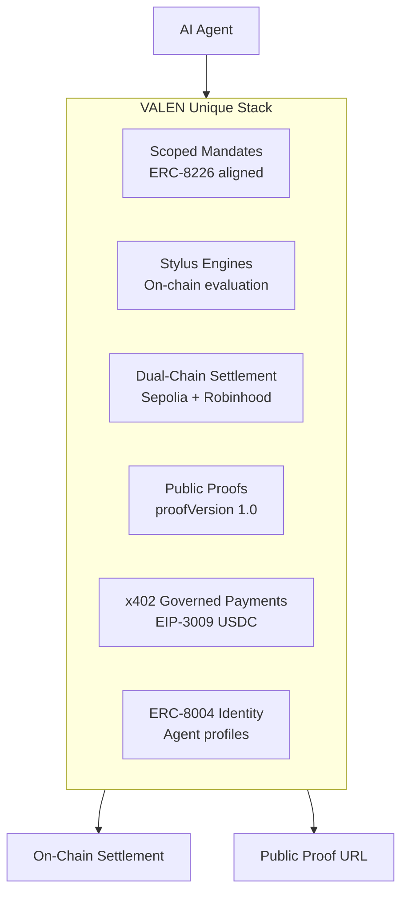

| Differentiator | Description |
|----------------|-------------|
| **Hybrid architecture** | Off-chain pipeline (NestJS + BullMQ) orchestrates on-chain Stylus engine reads and Solidity settlement |
| **Dual-chain production** | Arbitrum Sepolia (USDC, budget vault, x402) + Robinhood Testnet (USDG, TSLA, AMZN, PLTR, NFLX, AMD) |
| **Proof as product** | Every execution, refusal, and x402 payment has a public URL with evidence hash, mandate linkage, and ERC-8004 identity |
| **Fail-closed design** | Missing mandate, exceeded budget, failed compliance, or high-risk tier → refusal with auditable reason codes |
| **Stylus compute** | Compliance, risk, eligibility, policy, and budget engines run as Rust/WASM on Arbitrum at lower gas cost |

## Example: One governed USDC transfer

1. Organization owner creates agent `valen`, assigns policy, verifies wallet, signs EIP-712 mandate
2. Developer submits execution: transfer 0.001 USDC on Arbitrum Sepolia
3. Pipeline: intent → on-chain attestation (Stylus engines) → compliance → risk (budget check) → policy → settlement
4. Relayer submits `submitSettlement` → `approveSettlement` → `executeSettlement` on `ValenSettlement`
5. Public proof at `https://valenai.vercel.app/proofs/executions/{id}` shows settlement tx, mandate hash, evidence hash

**Production evidence:** execution `07736a69-…` settled at tx `0xf3f5526a…` (Arbitrum Sepolia, verified 2026-06-13).

## Production URLs

| Surface | URL |
|---------|-----|
| Frontend | https://valenai.vercel.app |
| API | https://valen-api-m3g4.onrender.com |
| Swagger | https://valen-api-m3g4.onrender.com/docs |
| Public proof pack | https://valenai.vercel.app/proofs/pack |
| Public agent profile | https://valenai.vercel.app/agents/valen |

---

# 2. Product Vision

## Long-term vision

VALEN aims to become the **default permission and proof layer** for autonomous finance — the infrastructure that every AI agent, fintech platform, and institution uses before money moves on-chain. The vision spans:

- **Agent economies:** millions of agents with scoped mandates, budgets, and verifiable identities
- **Regulated RWAs:** tokenized equities, ETFs, and stablecoins settled under policy
- **Autonomous commerce:** x402-style HTTP payments governed by VALEN budgets and compliance
- **Institutional adoption:** audit-grade evidence for regulators, auditors, and risk committees

## The future of autonomous finance

Financial agents will handle treasury rebalancing, vendor payments, payroll, trading, and customer refunds without human clicks on every transaction. This requires:

| Need | Why |
|------|-----|
| **Authority** | Agents must operate within explicitly granted scope — not unlimited wallet access |
| **Policies** | Organizational rules (allowed assets, caps, deny lists) must be enforceable |
| **Compliance** | KYC/AML, jurisdiction, and asset eligibility checks before execution |
| **Settlement** | Deterministic on-chain execution with mandate accounting |
| **Proofs** | Immutable evidence that a transaction was allowed, refused, or settled — linkable to agent identity |

## Why uncontrolled AI finance is dangerous

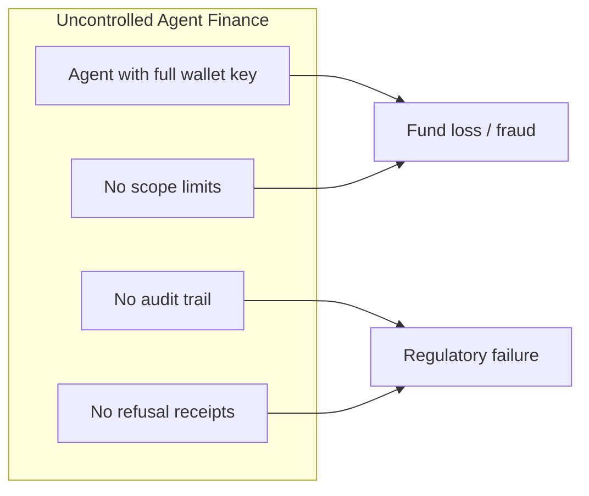

Without governance, a compromised or misconfigured agent can:

- Transfer unlimited funds to arbitrary addresses
- Trade restricted assets outside compliance windows
- Operate with no record of *who authorized what*
- Leave organizations unable to demonstrate due diligence

## How VALEN solves this

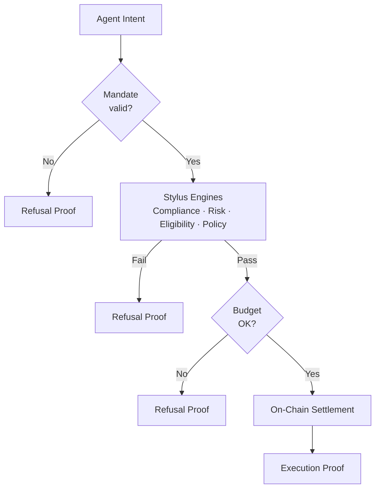

VALEN enforces a **fail-closed pipeline**:

1. **Mandates** bind agent identity to scope (chains, assets, actions, targets, caps)
2. **Stylus engines** evaluate compliance, risk, eligibility, and policy on-chain
3. **Budget engine** (DB + on-chain vault) caps spend per agent per period
4. **Settlement gate** (`ValenSettlement`) re-validates everything before token/native transfer
5. **Proofs** publish outcome to public URLs with evidence hashes and ERC-8004 identity linkage

Every refusal is as valuable as every success — organizations can prove they *blocked* an unauthorized action.

---

# 3. Core Concepts

Each concept below includes: **Definition**, **Purpose**, **Example**, **User value**, **System value**.

## Agent

| Field | Detail |
|-------|--------|
| **Definition** | A registered autonomous actor within an organization, identified by UUID, linked wallets, optional API keys, and governed by mandates and policies |
| **Purpose** | Represents the entity that submits intents; all executions are attributed to an agent |
| **Example** | Agent `valen` (slug: `valen`) on org with Arbitrum Sepolia wallet `0x483e…` |
| **User value** | Clear ownership and lifecycle (draft → active → suspended → revoked) |
| **System value** | Agent ID drives mandate matching, budget tracking, proof identity enrichment |

**Types:** `hosted`, `external`, `service`, `experimental` (stored in `agents.type`).

## Authority

| Field | Detail |
|-------|--------|
| **Definition** | The legal/organizational permission for an agent to act, expressed through verified wallet ownership and signed mandates |
| **Purpose** | Ensures only authorized principals grant agent scope |
| **Example** | Org owner verifies wallet via `personal_sign`, then signs EIP-712 mandate typed data |
| **User value** | Non-repudiable authorization chain |
| **System value** | Mandate signer address stored; proofs include `mandateSigner` and `mandateHash` |

## Mandate

| Field | Detail |
|-------|--------|
| **Definition** | ERC-8226-aligned scoped permission binding a principal, agent, scope hash, validity window, and spending caps (`maxPerTx`, `maxTotal`) |
| **Purpose** | On-chain and off-chain enforcement of what an agent may do |
| **Example** | Mandate allowing USDC transfer on chain 421614, max 1 USDC per tx, 10 USDC total |
| **User value** | Fine-grained control without micromanaging every transaction |
| **System value** | `ValenMandateRegistry.checkMandate()` at submit; `recordExecution()` at settle |

**Off-chain:** EIP-712 domain `VALEN Agent Mandate` v1, stored in `mandates` table.  
**On-chain:** `grantMandate` → `activateMandate` on `ValenMandateRegistry`.

## Budget

| Field | Detail |
|-------|--------|
| **Definition** | Per-agent spending envelope with cap, spent amount, period reset, and status (`active`, `exhausted`, `paused`) |
| **Purpose** | Hard limit on agent spend independent of mandate caps |
| **Example** | 1 USDC cap (1,000,000 base units) per 24h for demo agent on Arbitrum Sepolia |
| **User value** | Predictable spend; refusal when exceeded |
| **System value** | DB `agent_budgets` + on-chain `ValenBudgetVault.commitSpend()` + Stylus `BudgetEngine` |

## Policy

| Field | Detail |
|-------|--------|
| **Definition** | Organizational rule set with versioned lifecycle (draft → pending → published → active) and on-chain hash in `ValenPolicyManager` |
| **Purpose** | Encode business rules; bind to Stylus PolicyEngine evaluation |
| **Example** | Policy allowing USDC + Robinhood assets; deny list for refused scenarios |
| **User value** | Compliance-friendly rule management with audit trail |
| **System value** | `rules_hash` published on-chain; settlement requires active policy hash |

## Proof

| Field | Detail |
|-------|--------|
| **Definition** | Public, schema-frozen (`proofVersion: "1.0"`) record of an execution, refusal, or x402 payment |
| **Purpose** | Verifiable evidence for judges, auditors, and counterparties |
| **Example** | `GET /v1/public/proofs/executions/{id}` → settlement tx, evidence hash, identity |
| **User value** | Shareable URL proving governed outcome |
| **System value** | DB views `public_executions_v`, `public_refusals_v`, `public_payments_v` |

## Settlement

| Field | Detail |
|-------|--------|
| **Definition** | On-chain execution of an approved intent via `ValenSettlement` — native ETH or ERC-20 via `ValenTokenSettlementAdapter` |
| **Purpose** | Final fund movement only after all gates pass |
| **Example** | USDC `transferFrom(agent, target, amount)` through adapter after vault `commitSpend` |
| **User value** | Trust that money moves only when permitted |
| **System value** | Three-step on-chain flow: submit → approve → execute |

## Compliance

| Field | Detail |
|-------|--------|
| **Definition** | Evaluation that an intent meets regulatory and organizational compliance requirements |
| **Purpose** | Block non-compliant actions before settlement |
| **Example** | Stylus ComplianceEngine returns Pass with `complianceHash` bound to execution metadata |
| **User value** | Structured compliance evidence |
| **System value** | `compliance_checks` table; worker records `onchain-stylus` provider result |

## Risk

| Field | Detail |
|-------|--------|
| **Definition** | Scoring and tiering of execution risk; may require human approval |
| **Purpose** | Escalate high-risk actions; enforce budget and Robinhood policy |
| **Example** | Robinhood TSLA amount 250 → `risk_failed` with `refusalFactors` |
| **User value** | Human-in-the-loop for edge cases |
| **System value** | `risk_scores` table; policy processor branches on `requires_approval` |

## x402

| Field | Detail |
|-------|--------|
| **Definition** | HTTP 402 Payment Required pattern — machine-readable payment requests settled on-chain |
| **Purpose** | Enable agents to pay for API access, data, and services with governed USDC |
| **Example** | Agent initiates x402 payment 0.001 USDC; VALEN settles via EIP-3009 `transferWithAuthorization` |
| **User value** | Autonomous commerce with budget enforcement |
| **System value** | `x402_payments` table; public payment proofs |

## ERC-8004

| Field | Detail |
|-------|--------|
| **Definition** | Emerging standard for on-chain agent identity (NFT registry + metadata) |
| **Purpose** | Link agent actions to verifiable identity profiles |
| **Example** | Agent `valen` public profile at `/agents/valen` with `registration_pending` status |
| **User value** | Discoverable agent identity for counterparties |
| **System value** | `agent_identity` table + `ValenIdentityResolver` on Arbitrum Sepolia |

## Robinhood Assets

| Field | Detail |
|-------|--------|
| **Definition** | Tokenized assets on Robinhood Chain Testnet (chain ID 46630) registered in `RobinhoodAssetRegistry` and `assets` table |
| **Purpose** | Demonstrate governed settlement of regulated-style RWAs |
| **Example** | TSLA token transfer with allowed/refused scenarios |
| **User value** | Headline demo for Open House / institutional narrative |
| **System value** | `evaluateRobinhoodPolicy()` in risk worker; dedicated intent templates |

### Asset reference table

| Symbol | Chain | Address | Decimals | Role |
|--------|-------|---------|----------|------|
| **USDC** | 421614 | `0x75faf114eafb1BDbe2F0316DF893fd58CE46AA4d` | 6 | Primary stablecoin rail (Arbitrum Sepolia) |
| **USDG** | 46630 | `0x7E955252E15c84f5768B83c41a71F9eba181802F` | 6 | Robinhood official stablecoin |
| **TSLA** | 46630 | `0xC9f9c86933092BbbfFF3CCb4b105A4A94bf3Bd4E` | 18 | Tesla tokenized stock (testnet) |
| **AMZN** | 46630 | `0x5884aD2f920c162CFBbACc88C9C51AA75eC09E02` | 18 | Amazon tokenized stock |
| **PLTR** | 46630 | `0x1FBE1a0e43594b3455993B5dE5Fd0A7A266298d0` | 18 | Palantir tokenized stock |
| **NFLX** | 46630 | `0x3b8262A63d25f0477c4DDE23F83cfe22Cb768C93` | 18 | Netflix tokenized stock |
| **AMD** | 46630 | `0x71178BAc73cBeb415514eB542a8995b82669778d` | 18 | AMD tokenized stock |

---

# 4. System Architecture

## High-level architecture

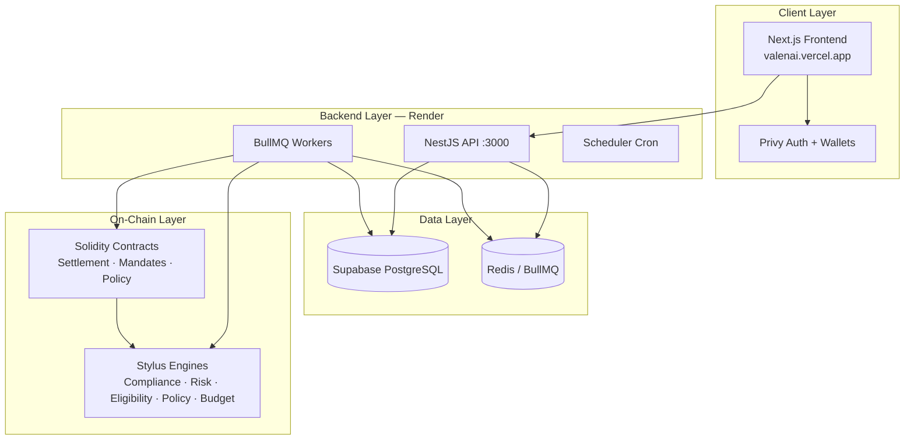

## Layer breakdown

### Frontend Layer
- **Stack:** Next.js 14 App Router, React Query, Tailwind CSS, Privy SDK
- **Chains:** Arbitrum Sepolia (421614), Robinhood Testnet (46630)
- **Auth:** Privy JWT → `POST /v1/auth/sync` → session token in sessionStorage

### Backend Layer
- **Stack:** NestJS, BullMQ, viem, Zod env validation
- **Entrypoints:** `main.ts` (API), `worker.ts` (pipeline), `scheduler.ts` (cron)
- **Deployment:** Render (`valen-api`, `valen-scheduler`, `valen-redis`)

### Contracts Layer
- **Stack:** Solidity 0.8.24, OpenZeppelin UUPS proxies, Foundry
- **Hub:** `ValenRegistry` — engine discovery, chain support
- **Gate:** `ValenSettlement` — final execution authority

### Settlement Layer
- `ValenSettlement` + `ValenTokenSettlementAdapter` + optional `ValenBudgetVault`
- Relayer wallet (`PRIVATE_KEY`) submits on-chain txs

### Proof Layer
- DB views → `ProofsService` → public API → frontend `/proofs/*` pages
- Schema version frozen at `1.0`

### Agent Layer
- `agents`, `agent_wallets`, `api_keys`, `agent_identity` tables
- ERC-8004 metadata + public slug

### Policy Layer
- Off-chain: `policies`, `policy_versions` with rules JSON
- On-chain: `ValenPolicyManager` hash lifecycle
- Stylus: `PolicyEngine.evaluate` + `evaluate_robinhood_policy`

### Budget Layer
- Off-chain: `agent_budgets`, `budget_events`
- On-chain: `ValenBudgetVault` (Arbitrum Sepolia only)
- Stylus: `BudgetEngine` (Arbitrum Sepolia only)

### Identity Layer
- `ValenIdentityResolver` (Arbitrum Sepolia)
- `agent_identity` DB records
- Public profiles at `/agents/{slug}`

### Compliance Layer
- Stylus `ComplianceEngine` + off-chain attestations API
- `compliance_checks`, `compliance_attestations` tables

### Robinhood Layer
- `RobinhoodAssetRegistry` on chain 46630
- `RobinhoodService` + `evaluateRobinhoodPolicy`
- 11 intent templates (allowed + refused per asset)

### x402 Layer
- `X402Service` + `X402ChainService` (EIP-3009)
- `x402_payments` table
- Budget pre-check at initiate; commit at settle

## Execution pipeline architecture

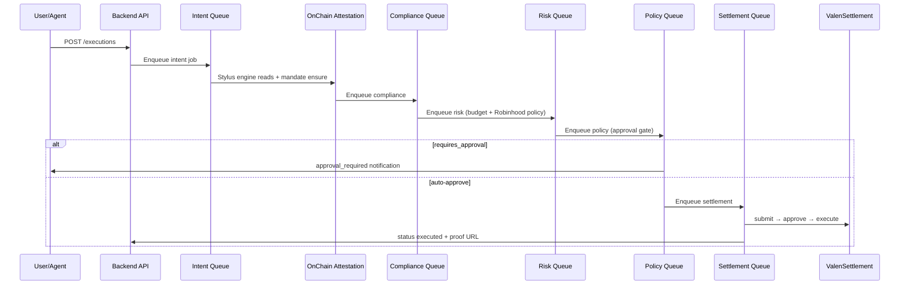

## Queue inventory

| Queue | Purpose |
|-------|---------|
| `valen-intent` | On-chain attestation via Stylus engines |
| `valen-compliance` | Record compliance check from attestation metadata |
| `valen-risk` | Budget + Robinhood policy + risk factors |
| `valen-policy` | Approval gate based on risk tier |
| `valen-settlement` | On-chain settlement + budget commit |
| `valen-confirmation` | Tx receipt polling |
| `valen-audit` | Async audit event persistence |
| `valen-notification` | In-app notifications |
| `valen-dead-letter` | Failed job recovery |

## Dual-chain deployment topology

| Component | Arbitrum Sepolia (421614) | Robinhood Testnet (46630) |
|-----------|---------------------------|---------------------------|
| ValenRegistry | ✅ | ✅ |
| ValenSettlement | ✅ | ✅ |
| ValenMandateRegistry | ✅ | ✅ |
| ValenTokenSettlementAdapter | ✅ USDC | ✅ USDG + stocks |
| ValenBudgetVault | ✅ | ❌ |
| ValenIdentityResolver | ✅ | ❌ |
| RobinhoodAssetRegistry | ❌ | ✅ |
| BudgetEngine (Stylus) | ✅ | ❌ |
| 4 core Stylus engines | ✅ | ✅ |

---

# 5. User Journey

## Overview: Connect Wallet → Final Proof Verification

VALEN guides users through a **7-step setup journey** codified in `buildSetupSteps()` (`frontend/src/lib/setup-state.ts`):

1. Organization ready
2. Agent created
3. Policy published
4. Wallet verified
5. Mandate signed
6. Intent executed
7. Proof verified

## Step-by-step journey

### Step 0: Landing and login

| Screen | Route | Action | Outcome |
|--------|-------|--------|---------|
| Marketing landing | `/` | Browse features, pricing, FAQ | User understands VALEN value prop |
| Login | `/login` | Privy auth (email, Google, wallet) | Access token obtained |

**Flow:**
1. User opens https://valenai.vercel.app
2. Clicks "Get Started" → `/login`
3. Privy modal: authenticate
4. Frontend calls `POST /v1/auth/sync` with Bearer token
5. Backend upserts user + organization memberships
6. Token stored in `sessionStorage`; redirect to `/dashboard`

**First visit:** Mission Control auto-redirects to `/onboarding` (sessionStorage flag per org).

### Step 1: Mission Control (Dashboard)

| Screen | Route | Action | Outcome |
|--------|-------|--------|---------|
| Mission Control | `/dashboard` | View setup progress, stats, budget meter | Orientation to primary journey |

**Displays:**
- Setup progress bar (7 steps)
- 12 stat cards (agents, executions, treasury, governance)
- Live USDC `BudgetMeter` for demo agent
- Quick links: latest proof, Robinhood demo, x402 payment
- Recent executions table

### Step 2: Create Agent

| Screen | Route | Action | Outcome |
|--------|-------|--------|---------|
| Register Agent | `/dashboard/register-agent` | Name, description, type | Agent created (auto-activated if draft) |
| Agent Detail | `/dashboard/agents/[agentId]` | View readiness checklist | Agent ready for policy/mandate |

**Form fields:** name, description, agent type (`hosted`, `external`, `service`, `experimental`)

**Readiness checklist on agent detail:**
- Agent active
- Policy assigned
- Verified wallet linked
- Signed mandate
- Optional API key
- ERC-8004 registration (pending in demo)

### Step 3: Set Rules (Policy)

| Screen | Route | Action | Outcome |
|--------|-------|--------|---------|
| Policies list | `/dashboard/policies` | View org policies | Policy inventory |
| New policy | `/dashboard/policies/new` | Select template, create | Draft policy |
| Policy detail | `/dashboard/policies/[policyId]` | Version lifecycle | Active policy hash on-chain |

**Policy version lifecycle:**
```
draft → pending_approval → published → active
```

**Policy templates** (`frontend/src/lib/policy-templates.ts`) provide starter rules for USDC-only, Robinhood-inclusive, and strict compliance configurations. Each template pre-fills allowed chains, actions, and asset lists so operators can publish within minutes.

**On-chain publish:** When a version is published, backend computes `rules_hash = keccak256(rulesJSON)` and calls `ValenPolicyManager.publishPolicy(orgId, rules_hash)`. Activation sets the hash as the org's active policy, which `ValenSettlement.submitSettlement` validates.

### Step 4: Fund & Authority (Wallets)

| Screen | Route | Action | Outcome |
|--------|-------|--------|---------|
| Wallets | `/dashboard/wallets` | Verify wallet, sign mandate, top up budget | Authority chain complete |

**Sub-flow A — Wallet verification:**
1. Select authority chain (421614 or 46630)
2. Auto-switch wallet network via `wallet-chain.ts`
3. `POST /wallets/challenge` → receive challenge message
4. User signs with `personal_sign`
5. `POST /wallets/verify` → wallet marked verified in `wallet_verifications` table

**Sub-flow B — Mandate signing (EIP-712):**
1. Select agent, policy, allowed chains/actions/assets/targets
2. Set limits: `maxPerTx`, `maxTotal`, validity window
3. `POST /mandates/typed-data` → EIP-712 typed data with domain `VALEN Agent Mandate` version `1`
4. User signs with `eth_signTypedData_v4` via `prepareMandateTypedDataForSigning()`
5. `POST /mandates` → backend verifies signature, stores mandate in DB
6. Backend `MandateChainService` may `grantMandate` + `activateMandate` on-chain with scope bindings

**Sub-flow C — Budget top-up:**
1. Select agent with USDC budget on Arbitrum Sepolia
2. Enter new cap amount (human-readable USDC)
3. `POST /budget/:agentId/topup` → updates `agent_budgets`, records `budget_events`
4. On-chain: operator calls `ValenBudgetVault.topUp()` in demo setup

**Wallet balances panel:** Shows multi-chain native and token balances for connected wallet via `useWalletBalances` hook (viem RPC reads).

### Step 5: Execute

| Screen | Route | Action | Outcome |
|--------|-------|--------|---------|
| New execution | `/dashboard/executions/new` | Select template, agent, amount, target | Execution submitted |
| Execution detail | `/dashboard/executions/[id]` | Monitor pipeline | Status transitions visible |

**Execute page features:**
- 13 intent templates selectable via dropdown or `?template=` query param
- Auto-select agent with matching mandate via `useEffect` + `mandateMatchesIntent()`
- `SelectedAssetBalance` — shows connected wallet balance for chosen token
- `BudgetMeter` — for Arbitrum USDC templates only
- Asset-specific settlement check panel for Robinhood stocks
- Client-side `compareAmountToBalance()` warns if amount exceeds wallet balance

**Example execution payload (USDC):**
```json
{
  "agentId": "64f56184-eacf-4eef-bc84-f3b863d3894f",
  "chainId": 421614,
  "actionType": "transfer",
  "assetAddress": "0x75faf114eafb1BDbe2F0316DF893fd58CE46AA4d",
  "amount": "1000",
  "targetAddress": "0xf76e6B0920e9332fF4410f6dD53F01722AbC71a3",
  "idempotencyKey": "exec-20260613-usdc-001",
  "metadata": { "templateId": "arbitrum-usdc" }
}
```

**Example execution payload (Robinhood TSLA refused):**
```json
{
  "agentId": "...",
  "chainId": 46630,
  "actionType": "robinhood_token_transfer",
  "assetAddress": "TSLA",
  "amount": "250000000000000000000",
  "targetAddress": "0xf76e6B0920e9332fF4410f6dD53F01722AbC71a3",
  "metadata": {
    "robinhood": { "ticker": "TSLA", "scenario": "refused-over-limit" }
  }
}
```

**Pipeline status transitions:**
```
created → validated → approved → settlement_submitted → executed
                                    ↓ (failures)
              compliance_failed | risk_failed | policy_rejected | failed
```

**Execution detail page** shows: pipeline timeline, compliance checks, risk score, settlement row with Arbiscan/explorer link, cancel button (if eligible), link to authenticated proof page.

### Step 6: Approvals (conditional)

| Screen | Route | Action | Outcome |
|--------|-------|--------|---------|
| Approvals | `/dashboard/approvals` | Review pending executions | Human approval |
| Execution detail | `/dashboard/executions/[id]` | Sign approval proof | Execution approved |

When Stylus RiskEngine returns `requiresApproval: true`:
- Policy processor sets status `approval_required`
- In-app notification sent via NotificationProcessor
- Approver connects wallet, signs approval via `approval-signature.ts`
- `POST /executions/:id/approve` → status `approved` → settlement queue

**Roles that can approve:** organization_owner, settlement_operator (per API guards).

### Step 7: Proof Verification

| Screen | Route | Action | Outcome |
|--------|-------|--------|---------|
| Auth proof | `/dashboard/executions/[id]/proof` | Full pipeline evidence | Internal verification |
| Public proof | `/proofs/executions/[id]` | Shareable URL | External verification |
| Refusal proof | `/proofs/refusals/[id]` | Refusal receipt | Proof of blocked action |
| Proof pack | `/proofs/pack` | Latest of each kind | Demo showcase |

**Public proof displays:**
- Status, action, asset, amount (human-readable via `formatBaseUnitsForDisplay`)
- Mandate signer address + mandate hash
- Settlement transaction hash with explorer link
- Evidence hash for independent verification
- ERC-8004 identity panel linking to `/agents/{slug}`

**Screenshot references for judges:**
- Mission Control: `/dashboard` — stat cards + 7-step setup progress bar
- Execute page: `/dashboard/executions/new?template=robinhood-tsla-allowed` — template picker + TSLA balance
- x402 payments: `/dashboard/payments` — initiate/execute flow
- Public proof pack: `/proofs/pack` — three proof cards (execution, refusal, payment)
- Agent profile: `/agents/valen` — ERC-8004 badge showing `registration_pending` with explanation

---

# 6. Agent Lifecycle

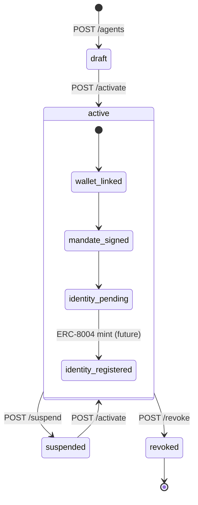

## Agent Creation

**API:** `POST /v1/organizations/:orgId/agents`

**Request:**
```json
{
  "name": "valen",
  "description": "Demo governed agent for USDC and Robinhood settlements",
  "type": "hosted"
}
```

**Stored fields:** `id` (UUID), `name`, `description`, `type`, `status`, `organization_id`, `public_slug` (auto-generated from name)

**Frontend:** `/dashboard/register-agent` — auto-activates draft agents on create via inline `api.agents.activate()` call.

**Agent types and intended use:**

| Type | Purpose |
|------|---------|
| `hosted` | Agent wallet managed by platform/org |
| `external` | Agent with externally managed keys |
| `service` | Backend service account agent |
| `experimental` | Sandbox/testing agent |

## Identity Registration

**API:** `GET /agents/:id/identity`, `POST /agents/:id/erc8004/register`

**Flow:**
1. `Erc8004Service.ensurePendingIdentity()` upserts `agent_identity` row
2. Status set to `registration_pending`
3. Metadata hash = keccak256 of canonical agent JSON (name, description, capabilities)
4. Default chain: 421614 (Arbitrum Sepolia)
5. On-chain: `ValenIdentityResolver.bindIdentity(agentKey, registry, tokenId, owner, tokenUri, metadataHash, registered)` — demo uses `registered=false`
6. Public slug enables profile at `/agents/{slug}`

**Demo state (honest):** Resolver bound at `0x2CF57Bf0a734Ea98e899b3557d7e0A144B434b77`; ERC-8004 NFT registry not deployed; UI explains "Registration Pending" = metadata ready, mint awaits registry.

## Authority Assignment

**Step 1 — Link agent wallet:**
```
POST /agents/:agentId/wallets
{ "address": "0x...", "chainId": 421614, "label": "primary" }
```

**Step 2 — Verify org authority wallet:**
Challenge/verify flow on `/dashboard/wallets` proves org owner controls signing key.

**Step 3 — Sign mandate:**
EIP-712 typed data signed by verified wallet → stored in `mandates` table with signature, signer address, scope fields.

**Step 4 — On-chain mandate:**
`MandateChainService.ensureActiveMandate()` checks known mandate IDs or dynamically grants + activates with 24h validity and scope bindings for asset/action.

## Budget Assignment

**Database:** `agent_budgets` row created via top-up or operator seed.

**On-chain (Arbitrum Sepolia only):** `ValenBudgetVault` deployed with immutable agent key (`keccak256(agentUUID)`), USDC asset, 86400s period.

**Demo configuration (Phase F):**
- Vault: `0x87876e15455F492F06612383f15F82F1fc42E2F2`
- Cap: 1 USDC (1,000,000 base units)
- Agent key: `0x483e006c252ec494695aaad6c7a209005ab20266a189818a836173675b280489`

## Policy Assignment

Agent executions require organization to have an **active policy version**. The agent detail readiness checklist verifies:
- Policy exists and has active version
- `rules_hash` published to `ValenPolicyManager`
- Agent's mandate references compatible scope

Policy rules JSON defines allowed chains, action types, asset lists, and target restrictions used during mandate creation and matching.

## Execution

Agent (or developer/service account with agent role) submits intent:

**Auth:** JWT (Privy) or API key with scopes

**Idempotency:** `idempotencyKey` prevents duplicate pipeline runs; stored in `intent_idempotency_keys`

**Pipeline trigger:** `ExecutionsService.create()` inserts execution row (status `created`) and enqueues `valen-intent` job

## Settlement

`SettlementWorkerService.processSettlement()`:
1. Re-attests via `OnChainAttestationService` if `metadata.onchain` missing
2. Re-checks mandate via `MandatesService.assertActiveForExecution()`
3. Creates settlement row in `settlements` table
4. Calls `SettlementChainService.executeSettlement()`:
   - `submitSettlement` on ValenSettlement
   - `approveSettlement`
   - `ValenBudgetVault.commitSpend()` (Arbitrum USDC path)
   - `executeSettlement` → TokenSettlementAdapter or native call
5. Updates execution status → `executed`
6. Calls `BudgetService.commitSpend(executionId)` for DB budget accounting
7. Enqueues confirmation processor for receipt polling

## Proof Generation

Automatic — no explicit "generate proof" action required.

**Views:** `public_executions_v`, `public_refusals_v`, `public_payments_v` project proof-ready records.

**Enrichment:** `ProofsService.enrich()` adds ERC-8004 identity from `agent_identity` + `agents.public_slug`.

**URLs returned at submission:** x402 initiate returns `proofUrl`; execution detail links to `/dashboard/executions/{id}/proof` and public `/proofs/executions/{id}`.

## Revocation

**Agent suspend:** `POST /agents/:id/suspend` — temporary pause; can re-activate.

**Agent revoke:** `POST /agents/:id/revoke` — permanent; no new executions accepted.

**Mandate revoke:** `POST /mandates/:id/revoke` — soft revoke in DB; on-chain `revokeMandate(mandateId)` available via operator.

**Emergency freeze:** `ValenEmergencyGuardian.freezeMandate(mandateId)` — on-chain immediate freeze.

## Termination

Revoked agents remain in database for audit compliance. All historical executions, settlements, proofs, and audit logs persist indefinitely. No hard-delete path in production API.

---

# 7. Budget Engine

Three enforcement layers: **DB** (`agent_budgets`), **on-chain vault** (`ValenBudgetVault` at `0x87876e…`), **Stylus BudgetEngine** (`0x5496dab1…`).

| Operation | API / Contract | When |
|-----------|----------------|------|
| Top-up | `POST /budget/:agentId/topup` | Manager sets cap |
| Evaluate | `BudgetService.evaluateExecution` | Risk worker |
| Commit | `commitSpend` DB + vault | Post-settlement |
| Refuse | `budget_exceeded` / `budget_paused` | Pre-settlement |

**Demo cap:** 1 USDC (1,000,000 base units), 24h period.

**Production evidence:** refusal `b0e697f9-86c4-43d0-94ae-88c0f89cfa64`; x402 refusal `dad9b8b5-5246-4424-8689-f0f8593bc860`.

---

# 8. Policy Engine

Off-chain policy versions + on-chain `ValenPolicyManager` + Stylus `PolicyEngine`.

**Enforcement:** mandate scope → attestation → Robinhood policy → budget → approval gate → on-chain re-validation at submit.

**Robinhood refused scenario:** amount 250, action `robinhood_token_transfer`, scenario metadata → `risk_failed`.

---

# 9. Compliance Engine

Pipeline: Intent → OnChain Attestation (Stylus ComplianceEngine) → Compliance worker → Risk.

**Engine (Sepolia):** `0xf6d515f09b1e14adb891c72605e1df12c7f5db6b`

**API:** attestations, subject lookup, execution compliance checks.

Fail-closed: compliance failure → `compliance_failed` + public refusal proof.

---

# 10. Settlement Layer

## Settlement architecture

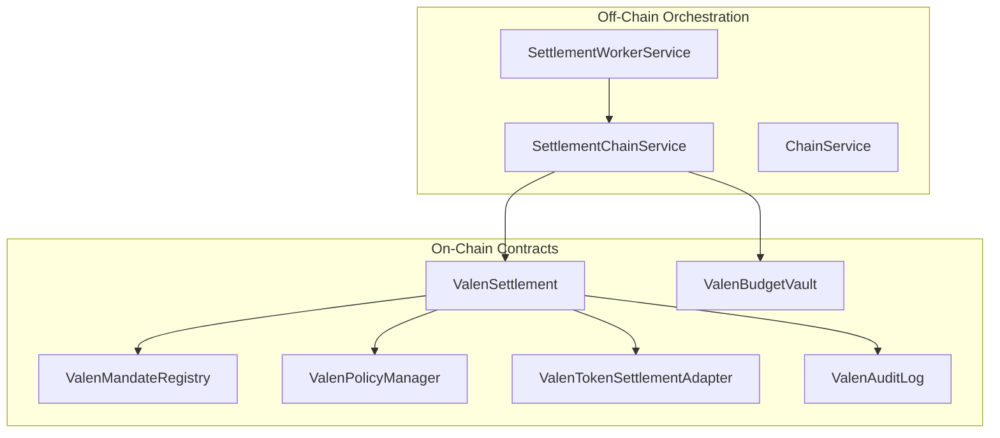

## Settlement contracts

| Contract | Arbitrum Sepolia | Robinhood Testnet |
|----------|------------------|-------------------|
| ValenSettlement | `0x993622D55Ea095aB71165Caf191B21E6e3A71D4A` | `0x91CdD9a481C732bEB09Ce039da23DC11e83547a4` |
| ValenTokenSettlementAdapter | `0x2120A24E060f9f2a16e1e96d5609b810b041aDF4` | `0x97F8d7AdD32Db13d6FEe23F7ea09296B532da336` |
| ValenMandateRegistry | `0xC3B422d77aBE0B7D3c8930d7f1FCFCa4657d41F2` | `0x3122B8446044E87A683C1104dc80f32d3Eb28CE4` |

## Settlement adapters

**ValenTokenSettlementAdapter** — ERC-20 settlement path:
- Callable only by `ValenSettlement`
- `settleToken(executionHash, token, from, to, amount)` → `safeTransferFrom(from, to, amount)`
- Deduplicates by `executionHash`
- Requires agent to have approved adapter for token spend

**Native path:** `executeSettlement` with `msg.value` → `target.call{value}(callData)` → treasury fee accrual

## Transfer flow (ERC-20)

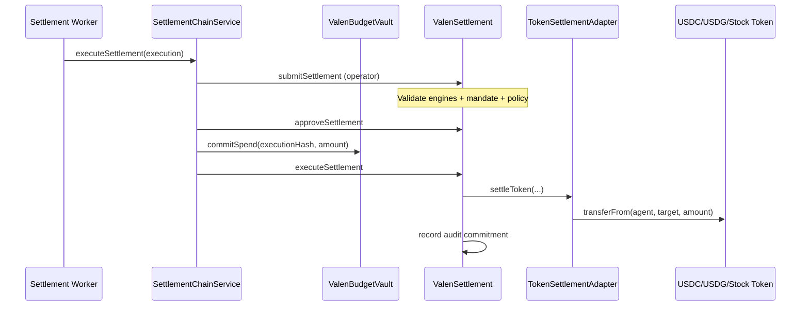

## Execution flow (three on-chain steps)

### Step 1: submitSettlement
- Role: `SETTLEMENT_OPERATOR_ROLE`
- Validates: unique executionHash, non-zero fields, callData hash
- Checks: active policy hash, mandate (if mandateId != 0)
- Calls four Stylus engines via `ValenRegistry`
- Creates `SettlementRecord` status `Requested`

### Step 2: approveSettlement
- Status → `Approved`

### Step 3: executeSettlement
- Verifies callData hash
- `mandateRegistry.recordExecution(mandateId, value, executionHash)`
- Records audit commitment in `ValenAuditLog`
- Token or native execution path
- Status → `Executed`

## Proof flow

After settlement:
1. `settlements` table updated with tx hash, status
2. Execution status → `executed`
3. `public_executions_v` view exposes record
4. Public proof URL: `/proofs/executions/{id}`

---

# 11. x402 Payment System

## What is x402?

**x402** implements the HTTP **402 Payment Required** pattern for machine-to-machine payments. A server returns 402 with payment instructions; the client (agent) pays on-chain and retries with proof of payment.

VALEN governs x402 payments so agents cannot pay beyond budget or outside mandate scope.

## Why x402 matters

- Enables **autonomous commerce** — agents pay for APIs, data, compute without human intervention
- Standardizes payment negotiation at the HTTP layer
- Combines with VALEN budgets for **governed micropayments**

## How VALEN uses x402

VALEN implements a **governed x402 rail** for USDC on Arbitrum Sepolia:

1. **Initiate** — create payment intent with budget pre-check
2. **Execute** — settle via EIP-3009 `transferWithAuthorization` (not external facilitator in current implementation)
3. **Proof** — public payment proof URL

**Note:** `X402_FACILITATOR_URL` is configured in env but settlement uses direct EIP-3009 via `X402ChainService`.

## Payment initiation

**API:** `POST /v1/organizations/:orgId/x402/initiate`

**Request:**
```json
{
  "agentId": "64f56184-eacf-4eef-bc84-f3b863d3894f",
  "mandateId": "...",
  "recipient": "0xRecipientAddress",
  "amount": "1000",
  "merchantUrl": "https://api.example.com/data",
  "chainId": 421614
}
```

**Processing:**
1. Parse amount as 6-decimal USDC base units
2. `BudgetService.getBudget(agentId)` — evaluate cap
3. If budget exceeded/paused → status `refused`, `refusal_reason` set
4. Insert `x402_payments` row with random 32-byte nonce, `evidence_hash`
5. Return `paymentId`, proof URLs, budget snapshot

**Response (initiated):**
```json
{
  "paymentId": "824c7b21-...",
  "status": "initiated",
  "proofUrl": "https://valenai.vercel.app/proofs/payments/824c7b21-...",
  "evidenceHash": "0x...",
  "budget": { "cap": "1000000", "spent": "999000", "remaining": "1000" }
}
```

## Budget verification

At initiate:
```
afterSpent = spent + amount
if status != 'active' → refused (budget_paused)
if afterSpent > cap → refused (budget_exceeded)
else → initiated
```

**Production evidence:** payment `dad9b8b5-…` refused with budget_exceeded.

## Policy verification

x402 flow requires valid `mandateId` at initiate. Mandate must cover USDC transfer on chain 421614. Org must have active policy (inherited from agent context).

## Compliance verification

x402 payments bypass the full execution pipeline but inherit budget governance. Full Stylus compliance path applies to execution intents, not x402 micropayments in current Phase G implementation.

## Settlement (execute)

**API:** `POST /v1/organizations/:orgId/x402/execute`

**Request:**
```json
{
  "paymentId": "824c7b21-..."
}
```

**Processing (`X402ChainService.settleWithAuthorization`):**
1. Reject if already `refused`; idempotent if `settled`
2. Duplicate nonce guard across settled payments
3. Settlement wallet signs EIP-3009 `TransferWithAuthorization` on USDC Sepolia
4. Submit `transferWithAuthorization(from, to, value, validAfter, validBefore, nonce, v, r, s)` on USDC contract
5. Update payment status → `settled`, record `settlement_tx`
6. `BudgetService.commitSpendForPayment(agentId, amount, paymentId)`

**USDC Sepolia:** `0x75faf114eafb1BDbe2F0316DF893fd58CE46AA4d`

**Production evidence:** payment `824c7b21-…` settled 0.001 USDC, tx `0x96b903ea…`, budget spent → 1000 (exhausted).

## Proof generation

Payment proofs served from `public_payments_v` view.

**API:** `GET /v1/public/proofs/payments/:paymentId`

**Schema:**
```json
{
  "proofVersion": "1.0",
  "id": "824c7b21-...",
  "kind": "payment",
  "chainId": 421614,
  "status": "settled",
  "asset": "USDC",
  "amount": "0.001",
  "settlementTx": "0x96b903ea...",
  "evidenceHash": "0x...",
  "identity": { "status": "registration_pending", "publicSlug": "valen" }
}
```

## Public proof URLs

| Type | URL pattern |
|------|-------------|
| Payment proof | `https://valenai.vercel.app/proofs/payments/{paymentId}` |
| Refused payment | `https://valenai.vercel.app/proofs/refusals/{paymentId}` |

Frontend routes through `/api-proxy` to avoid CORS issues with Render API.

## Verification flow

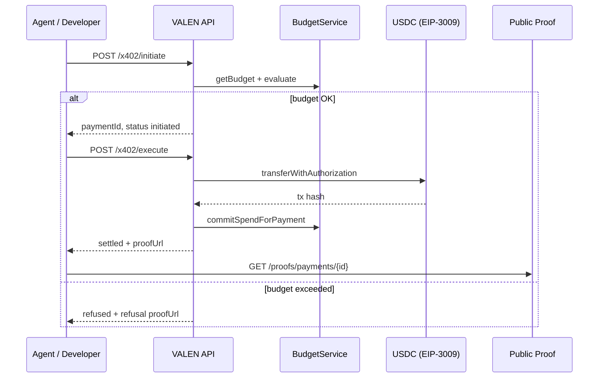

## Frontend UI

**Page:** `/dashboard/payments`

**Flow:**
1. Select active agent with USDC mandate on Arbitrum Sepolia
2. Enter recipient, amount, optional merchant URL
3. Click Initiate → shows payment ID and proof link
4. Click Execute → EIP-3009 settlement
5. Link to Arbiscan tx and public proof

## Operator API

Operator endpoints mirror org endpoints (secret header auth):
- `POST /v1/operator/organizations/:orgId/x402/initiate`
- `POST /v1/operator/organizations/:orgId/x402/execute`

---

# 12. ERC-8004 Identity Layer

## What is ERC-8004?

**ERC-8004** is an emerging Ethereum standard for **on-chain agent identity** — typically an NFT registry where each agent receives a token with metadata describing capabilities, owner, and resolver endpoints.

VALEN integrates ERC-8004 concepts to link governed executions to **discoverable agent profiles**.

## Agent identities in VALEN

Each agent may have an `agent_identity` record:
- `status`: `registration_pending` | `registered` | ...
- `registry_address`: future ERC-8004 registry (null in demo)
- `resolver_address`: `ValenIdentityResolver` on Arbitrum Sepolia
- `metadata_hash`: keccak256 of agent JSON metadata
- `public_slug`: URL slug for public profile (e.g., `valen`)
- `chain_id`: 421614

## Registry

**On-chain ERC-8004 NFT registry:** Not deployed in current demo. `ERC8004_REGISTRY_ADDRESS` env var optional.

**VALEN resolver:** `ValenIdentityResolver` at `0x2CF57Bf0a734Ea98e899b3557d7e0A144B434b77` (Arbitrum Sepolia only)

## Owner

Agent identity `owner_address` links to verified org wallet or agent wallet. Set during registration flow.

## Resolver

**ValenIdentityResolver** maps internal agent keys to ERC-8004-ready metadata:

```solidity
struct IdentityRecord {
    bytes32 agentKey;      // keccak256(agentUUID)
    address registry;      // future ERC-8004 registry
    uint256 tokenId;       // future NFT token ID
    address owner;
    string tokenUri;       // e.g. https://valenai.vercel.app/agents/erc8004/demo-agent.json
    bytes32 metadataHash;
    bool registered;       // false until NFT minted
    bool exists;
}
```

**Demo binding (Phase E):**
- Agent ID: `64f56184-eacf-4eef-bc84-f3b863d3894f`
- Agent key: `0x483e006c252ec494695aaad6c7a209005ab20266a189818a836173675b280489`
- Metadata hash: `0x29e56b0ef981e5633de62b720d63e776c351fe41f0e346d6f9d20a650fc1e341`
- `registered: false` — honest demo state

## Identity lifecycle

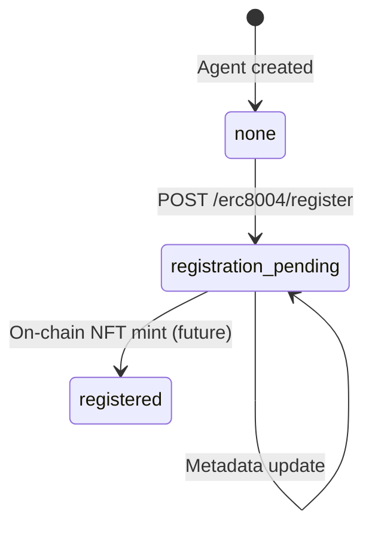

**Why "Registration Pending"?**

The demo prepares all ERC-8004 metadata and binds it to `ValenIdentityResolver`, but the actual ERC-8004 NFT registry contract is **optional and not deployed**. "Registration Pending" means metadata is ready; on-chain NFT mint awaits registry deployment.

## Identity registration

**API:** `POST /v1/organizations/:orgId/agents/:agentId/erc8004/register`

**Service:** `Erc8004Service.ensurePendingIdentity()`:
1. Upsert `agent_identity` with `registration_pending`
2. Compute metadata hash from agent JSON
3. Set default chain 421614, public slug

**Frontend:** `Erc8004Badge` component on agent detail explains pending state.

## Identity verification

Public profiles verifiable at:
- `GET /v1/public/agents/:slug`
- Frontend: `/agents/valen`

Returns agent info, ERC-8004 block, primary wallets, latest proof link.

## Public profile generation

**URL:** `https://valenai.vercel.app/agents/valen`

**Displays:**
- Agent name, description, type
- ERC-8004 status badge
- Primary wallet addresses
- Link to latest execution proof

## Proof linkage

Every public proof enriched with identity when `agentId` present:

```typescript
// ProofsService.enrich()
identity: {
  status: "registration_pending",
  registryAddress: null,
  resolverAddress: "0x2CF57Bf0a734Ea98e899b3557d7e0A144B434b77",
  tokenId: null,
  chainId: 421614,
  ownerAddress: "...",
  metadataHash: "0x29e56b0e...",
  publicSlug: "valen"
}
```

`PublicProofIdentityPanel` on all `/proofs/*` pages links to agent profile.

## Benefits

| Stakeholder | Benefit |
|-------------|---------|
| Counterparties | Verify agent identity before trusting proof |
| Auditors | Chain agent actions to identity metadata |
| Agent developers | Public discoverability |
| Protocol teams | Standard ERC-8004 alignment |

## Why this matters

Autonomous finance requires **identity**, not just keys. ERC-8004 provides a standard vocabulary; VALEN binds identity to **governed proofs** so anyone can answer: *who* acted, *under what authority*, and *what was the outcome*.

---

# 13. Robinhood Asset Settlement

## Overview

Robinhood Chain Testnet (chain ID **46630**) hosts tokenized assets — USDG stablecoin and five stock tokens. VALEN demonstrates governed settlement with **allowed** and **refused** scenarios for each asset.

## Assets

| Ticker | Address | Decimals | Name |
|--------|---------|----------|------|
| **USDG** | `0x7E955252E15c84f5768B83c41a71F9eba181802F` | 6 | Robinhood USDG stablecoin |
| **TSLA** | `0xC9f9c86933092BbbfFF3CCb4b105A4A94bf3Bd4E` | 18 | Tesla tokenized stock |
| **AMZN** | `0x5884aD2f920c162CFBbACc88C9C51AA75eC09E02` | 18 | Amazon tokenized stock |
| **PLTR** | `0x1FBE1a0e43594b3455993B5dE5Fd0A7A266298d0` | 18 | Palantir tokenized stock |
| **NFLX** | `0x3b8262A63d25f0477c4DDE23F83cfe22Cb768C93` | 18 | Netflix tokenized stock |
| **AMD** | `0x71178BAc73cBeb415514eB542a8995b82669778d` | 18 | AMD tokenized stock |

**Registry:** `RobinhoodAssetRegistry` at `0x4797e664b719504710c77ed1E8F8A33d09b42A5D`

## How assets are represented

1. **On-chain:** ERC-20 tokens on Robinhood Testnet
2. **Registry:** `RobinhoodAssetRegistry` catalogs assets with metadata
3. **Database:** `assets` table with chain_id 46630 entries
4. **Frontend:** `known-assets.ts`, `robinhood-assets.ts`, intent templates
5. **API:** `GET /v1/robinhood/assets`, `GET /v1/robinhood/assets/:ticker`

## How settlements occur

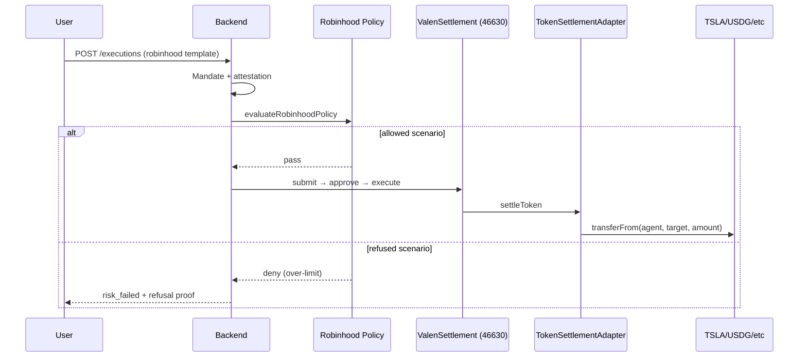

**Settlement adapter (Robinhood):** `0x97F8d7AdD32Db13d6FEe23F7ea09296B532da336`

**Action types:**
- Allowed templates: `transfer` or `erc20_transfer`
- Refused templates: `robinhood_token_transfer` with scenario metadata

## How proofs are generated

**Allowed settlement:**
- Execution status → `executed`
- Public proof: `/proofs/executions/{id}`
- Production: USDG execution `81aa0680-…` on chain 46630

**Refused:**
- Status → `risk_failed`
- Public proof: `/proofs/refusals/{id}`
- Production: TSLA refusal `512553dd-…`

## Policy enforcement

**Function:** `evaluateRobinhoodPolicy()` in `backend/src/modules/risk/robinhood.policy.ts`

**Checks:**
1. Ticker in supported list (TSLA, AMZN, PLTR, NFLX, AMD, USDG)
2. Not on denylist
3. Scenario not `refused` / `refused-over-limit`
4. Not `outside-window`

**Stylus:** `PolicyEngine.evaluate_robinhood_policy` on Robinhood Testnet

## Compliance

Robinhood executions pass through standard compliance attestation (Stylus ComplianceEngine on chain 46630: `0x2c1db0c436b72d94a4112f321dfbd13a976d8831`).

## Intent templates (11 Robinhood)

| Template ID | Asset | Scenario | Default amount |
|-------------|-------|----------|----------------|
| `robinhood-usdg-allowed` | USDG | allowed | small |
| `robinhood-tsla-allowed` | TSLA | allowed | 1 |
| `robinhood-tsla-refused` | TSLA | refused-over-limit | 250 |
| `robinhood-amzn-allowed` | AMZN | allowed | 1 |
| `robinhood-amzn-refused` | AMZN | refused-over-limit | 250 |
| ... | PLTR, NFLX, AMD | allowed + refused each | |

**Demo page:** `/dashboard/demo/robinhood` and `/dashboard/demo/robinhood/[ticker]`

## Flow diagram

```mermaid
flowchart TD
    A[Select Robinhood Template] --> B{Mandate matches<br/>ticker + chain?}
    B -->|No| X[Submit blocked]
    B -->|Yes| C[Submit execution]
    C --> D[Attestation on 46630]
    D --> E{Robinhood Policy}
    E -->|refused scenario| F[risk_failed]
    E -->|allowed| G[Settlement on 46630]
    F --> H[/proofs/refusals/id]
    G --> I[/proofs/executions/id]
```

---

# 14. Proof System

## Overview

Proofs are VALEN's **product surface** — the verifiable evidence that governed finance occurred (or was correctly refused). Schema frozen at **`proofVersion: "1.0"`**.

## Proof kinds

| Kind | Source view | Trigger statuses | Public route |
|------|-------------|------------------|--------------|
| **execution** | `public_executions_v` | `executed`, `settlement_submitted` | `/proofs/executions/:id` |
| **refusal** | `public_refusals_v` | `compliance_failed`, `risk_failed`, `policy_rejected`, `failed`, `cancelled` | `/proofs/refusals/:id` |
| **payment** | `public_payments_v` | x402 `settled`, `refused` | `/proofs/payments/:id` |

**Refusal fallback:** refused x402 payments also served via `/proofs/refusals/:id` if not in refusals view.

## Proof creation

Proofs are **read-only projections** from database views — not manually created. Views join executions/settlements/payments with agent and mandate data.

**Migration:** `backend/supabase/migrations/20260101000024_phase_i_proofs.sql`

## Proof storage

| Table/View | Purpose |
|------------|---------|
| `executions` | Source execution records |
| `settlements` | Settlement tx hashes |
| `x402_payments` | Payment records |
| `public_executions_v` | Public execution proof projection |
| `public_refusals_v` | Public refusal proof projection |
| `public_payments_v` | Public payment proof projection |

## Proof verification

**API (no auth):**
- `GET /v1/public/proofs/executions/:id`
- `GET /v1/public/proofs/refusals/:id`
- `GET /v1/public/proofs/payments/:id`
- `GET /v1/public/proofs/pack`

**CLI:** `backend/scripts/verify-proof-pack.ts` — validates `proofVersion === '1.0'`

**Frontend verifier:** Public pages display all fields; user cross-checks settlement tx on block explorer.

## Proof hashes

| Hash | Computation | Purpose |
|------|-------------|---------|
| **evidenceHash** | `hashPayload(intent + context)` | Binds proof to original intent |
| **mandateHash** | EIP-712 mandate digest | Links to authority |
| **complianceHash** | Stylus ComplianceEngine output | On-chain compliance binding |
| **riskHash** | Stylus RiskEngine output | On-chain risk binding |
| **metadataHash** | keccak256(agent JSON) | ERC-8004 identity binding |

## Evidence anchors

On settlement execute, `ValenAuditLog.recordAuditCommitment(executionHash, commitment)` creates immutable on-chain anchor.

Off-chain: `audit_commitments` table mirrors commitment data.

## Public proofs

**Schema (`PublicProof`):**
```typescript
{
  proofVersion: '1.0',
  id: string,
  kind: 'execution' | 'refusal' | 'payment',
  chainId: number,
  publishedAt: string,
  action?: string,
  asset?: string | null,
  amount?: string | null,
  status: string,
  mandateSigner?: string | null,
  mandateHash?: string | null,
  settlementTx?: string | null,
  evidenceHash?: string | null,
  refusalFactors?: Record<string, unknown> | null,
  agentId?: string,
  identity?: PublicProofIdentity | null
}
```

## Settlement proofs

Execution proofs for successful settlements include:
- `settlementTx` — on-chain transaction hash
- `status: executed`
- Explorer links: Arbiscan (421614) or Robinhood explorer (46630)

**Example:** `https://valenai.vercel.app/proofs/executions/07736a69-...`

## Refusal proofs

Refusal proofs include:
- `refusalFactors` — JSON with reason codes (e.g., `budget_exceeded`, Robinhood scenario)
- `status` — failure status
- No settlement tx

**Example:** `https://valenai.vercel.app/proofs/refusals/b0e697f9-...`

## Compliance proofs

Compliance failures captured in refusal proofs with factors from pipeline metadata. External compliance attestations stored separately in `compliance_attestations` (not directly in public proof schema).

## Proof pack

`GET /v1/public/proofs/pack` returns latest one of each kind:

```json
{
  "proofVersion": "1.0",
  "executions": [{ ... }],
  "refusals": [{ ... }],
  "payments": [{ ... }]
}
```

**Frontend:** `/proofs/pack` — three proof cards for demo/judge review.

## Identity enrichment

`ProofsService.enrich()` loads `agent_identity` + `agents.public_slug` for any proof with `agentId`. Displayed via `PublicProofIdentityPanel` linking to `/agents/{slug}`.

---

# 15. Smart Contracts

Every deployed contract documented below. Addresses are **Arbitrum Sepolia (421614)** unless noted as Robinhood (46630).

## ValenRegistry

| Field | Detail |
|-------|--------|
| **Purpose** | Canonical hub for engine discovery, contract registration, chain support |
| **Address** | `0x53EeC68c869E06B659A87b9e049a379ba3a5FA0F` (421614) / `0x8A80D270dd7028536ecB6f92b04eec11F929d603` (46630) |
| **Upgradeable** | Yes (UUPS) |
| **Key functions** | `registerEngine`, `getEngine`, `registerContract`, `isChainSupported` |
| **Relationships** | Referenced by Settlement, MandateRegistry, PolicyManager, Treasury, Escrow |
| **Security** | `DEFAULT_ADMIN_ROLE`, timelock upgrade authority |

## ValenSettlement

| Field | Detail |
|-------|--------|
| **Purpose** | Final settlement gate — validates engines, mandates, policies before fund movement |
| **Address** | `0x993622D55Ea095aB71165Caf191B21E6e3A71D4A` (421614) / `0x91CdD9a481C732bEB09Ce039da23DC11e83547a4` (46630) |
| **Upgradeable** | Yes (UUPS) |
| **Key functions** | `submitSettlement`, `approveSettlement`, `executeSettlement`, `setTokenSettlementAdapter`, `enableTokenSettlementAsset` |
| **Relationships** | Calls MandateRegistry, PolicyManager, AuditLog, Treasury, TokenSettlementAdapter, Stylus engines via Registry |
| **Security** | `SETTLEMENT_OPERATOR_ROLE`, scoped pause, reentrancy guard |

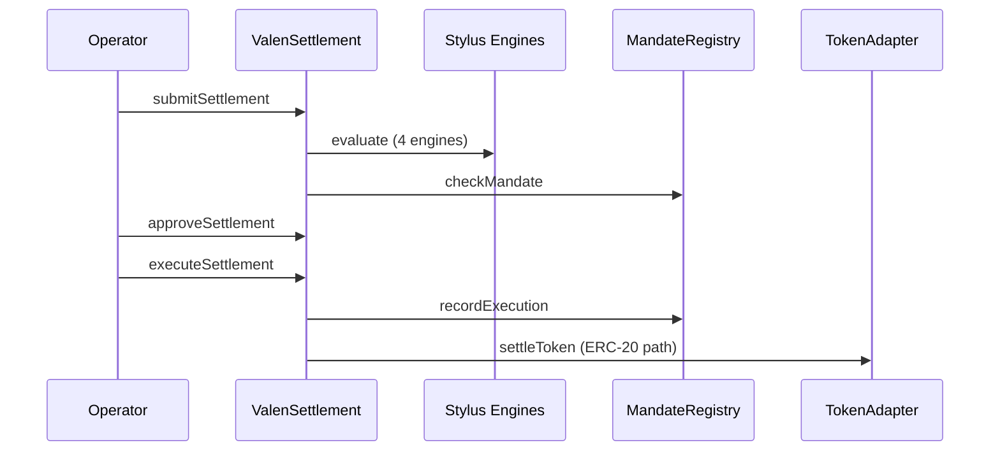

## ValenMandateRegistry

| Field | Detail |
|-------|--------|
| **Purpose** | ERC-8226-aligned agent mandate lifecycle and usage accounting |
| **Address** | `0xC3B422d77aBE0B7D3c8930d7f1FCFCa4657d41F2` (421614) / `0x3122B8446044E87A683C1104dc80f32d3Eb28CE4` (46630) |
| **Key functions** | `grantMandate`, `activateMandate`, `revokeMandate`, `checkMandate`, `recordExecution`, `allowScope`, `allowScopeBinding`, `freezeMandate` |
| **Relationships** | `settlementContract` set to ValenSettlement; settlement-only `recordExecution` |
| **Security** | Mandate IDs deterministic from principal+agent+scope+time+nonce; caps enforced at check and record |

## ValenPolicyManager

| Field | Detail |
|-------|--------|
| **Purpose** | On-chain policy hash lifecycle per organization |
| **Address** | `0x72eB4D7e57D4b582c5B05d255c1faE723507a03d` (421614) / `0x2741bAF6F51e5Ab67E81DdDCb1439679Bebd2d2F` (46630) |
| **Key functions** | `publishPolicy`, `activatePolicy`, `retirePolicy`, `freezePolicy`, `isPolicyActive` |
| **Relationships** | Settlement checks `isPolicyActive(policyVersionHash)` at submit |

## ValenTokenSettlementAdapter

| Field | Detail |
|-------|--------|
| **Purpose** | ERC-20 settlement executor callable only by ValenSettlement |
| **Address** | `0x2120A24E060f9f2a16e1e96d5609b810b041aDF4` (421614) / `0x97F8d7AdD32Db13d6FEe23F7ea09296B532da336` (46630) |
| **Upgradeable** | No |
| **Key functions** | `settleToken(executionHash, token, from, to, amount)` |
| **Security** | Only settlement contract caller; deduplication by executionHash |

## ValenBudgetVault

| Field | Detail |
|-------|--------|
| **Purpose** | Per-agent ERC-20 budget envelope with periodic cap (Arbitrum Sepolia only) |
| **Address** | `0x87876e15455F492F06612383f15F82F1fc42E2F2` |
| **Upgradeable** | No |
| **Key functions** | `topUp`, `remaining`, `commitSpend` |
| **Roles** | `BUDGET_MANAGER_ROLE`, `SETTLEMENT_ROLE` |
| **Demo config** | USDC asset, 1 USDC cap, 86400s period, agent key for demo agent |

## ValenIdentityResolver

| Field | Detail |
|-------|--------|
| **Purpose** | Maps agent keys to ERC-8004-ready identity metadata |
| **Address** | `0x2CF57Bf0a734Ea98e899b3557d7e0A144B434b77` (421614 only) |
| **Key functions** | `bindIdentity`, `getIdentity` |
| **Note** | Not an ERC-8004 NFT contract — metadata pointer layer |

## RobinhoodAssetRegistry

| Field | Detail |
|-------|--------|
| **Purpose** | Canonical registry for Robinhood Chain demo assets |
| **Address** | `0x4797e664b719504710c77ed1E8F8A33d09b42A5D` (46630 only) |
| **Key functions** | Asset registration with ticker, address, decimals, metadata |

## ValenTreasury

| Field | Detail |
|-------|--------|
| **Purpose** | Protocol fee accrual and withdrawal (native + ERC-20) |
| **Address** | `0x094B10D817f4603e9a4734B52c4c7A1Bf389658D` (421614) / `0xd9aDaab0E9660777B979D4C44294bE07E10470c8` (46630) |
| **Key functions** | `accrueFee`, `withdraw` |

## ValenEscrow

| Field | Detail |
|-------|--------|
| **Purpose** | Optional ERC-20 custody: deposit, lock, release, refund |
| **Address** | `0x485eba92e9Bf0e035216726A0EC194dd397311BC` (421614) / `0xf88690425201906eDcA2CDe0427055590eDfDc20` (46630) |
| **Note** | Not wired into main `executeSettlement` path today — parallel custody layer |

## ValenGovernance + ValenTimelock

| Field | Detail |
|-------|--------|
| **Purpose** | Governance proposal tracking with 86400s timelock delay |
| **Governance** | `0xF7623E69a21ad43f3678a9FA2bA931e59f7F1574` (421614) |
| **Timelock** | `0xAe853e326bCF38f6f9131eA0f5298C88084D72bc` (421614) |
| **Key functions** | Propose, queue, execute via timelock; UUPS upgrades |

## ValenAuditLog

| Field | Detail |
|-------|--------|
| **Purpose** | Immutable on-chain audit commitment ledger |
| **Address** | `0xBe1b5F1055C21D715185612947f681059B585cEE` (421614) / `0x21EC2E12865b5a307A3708ACbA85f2FE2a98B8BF` (46630) |
| **Key functions** | `recordAuditCommitment` — called by authorized emitters (Settlement) |

## ValenEmergencyGuardian

| Field | Detail |
|-------|--------|
| **Purpose** | Non-upgradeable emergency pause/freeze controller |
| **Address** | `0x3424a2ea234Ba819FceF1Beea32Ab39C42e235d9` (421614) / `0xb6a36B53E46A0D9ee3c1D589e936b0214aFA9303` (46630) |
| **Key functions** | `pauseScope` on Settlement, `freezeMandate`, `freezePolicy` |

## ValenAccessControl + ValenERC1967Proxy

| Field | Detail |
|-------|--------|
| **Purpose** | Shared access control base + thin ERC1967 proxy wrapper |
| **Roles** | `DEFAULT_ADMIN_ROLE`, `SETTLEMENT_OPERATOR_ROLE`, `EMERGENCY_GUARDIAN_ROLE`, `BUDGET_MANAGER_ROLE`, `IDENTITY_MANAGER_ROLE` |

## Stylus Engines (registered in ValenRegistry)

### Arbitrum Sepolia (421614)

| Engine | Address |
|--------|---------|
| ComplianceEngine | `0xf6d515f09b1e14adb891c72605e1df12c7f5db6b` |
| RiskEngine | `0x8eb252ff6f05b1ee767bb816e5786ad72e5b4073` |
| EligibilityEngine | `0x03e00644c2bbb45ab4566e34c30929dd017ee5bd` |
| PolicyEngine | `0x3eb88dde893288faea417b413a55a5b4d3256108` |
| BudgetEngine | `0x5496dab17a35580e595bfae135b7677b8a3ade0a` |

### Robinhood Testnet (46630)

| Engine | Address |
|--------|---------|
| ComplianceEngine | `0x2c1db0c436b72d94a4112f321dfbd13a976d8831` |
| RiskEngine | `0xae57003e42e3548a9d39cd55bcdfac04363b1d63` |
| EligibilityEngine | `0x1f3fb438824140b7e1125502f80b686d95072939` |
| PolicyEngine | `0xe1ae5ec5b4416e7d725981946e11af0a44bf4ecd` |

## Mock contracts (test only)

- `MockERC20.sol`, `TestToken.sol` — test ERC-20 with public mint; not deployed to production networks.

---

# 16. Backend Services

## Architecture

Three entrypoints:
- **`main.ts`** — NestJS HTTP API (port 3000)
- **`worker.ts`** — BullMQ pipeline consumers
- **`scheduler.ts`** — Cron jobs (pipeline recovery, heartbeat)

## Module inventory

| Module | Service(s) | Purpose |
|--------|------------|---------|
| AuthModule | AuthService, PrivyService | JWT sync, user profile |
| OrganizationsModule | OrganizationsService, TeamService, WalletVerificationsService | Org CRUD, team, wallet verify |
| AgentsModule | AgentsService, AgentWalletsService, AgentApiKeysService | Agent lifecycle |
| PoliciesModule | PoliciesService, PolicyVersionsService | Policy CRUD + version workflow |
| MandatesModule | MandatesService | EIP-712 mandates |
| ComplianceModule | ComplianceService, ComplianceWorkerService | Compliance API + pipeline |
| RiskModule | RiskService, RiskWorkerService | Risk API + pipeline |
| SettlementModule | ExecutionsService, SettlementService, SettlementWorkerService, ChainService, SettlementChainService, AlchemyService | Executions + on-chain settlement |
| BudgetModule | BudgetService | Agent budgets |
| X402Module | X402Service, X402ChainService | Governed x402 payments |
| ProofsModule | ProofsService | Public proof API |
| Erc8004Module | Erc8004Service | Agent identity |
| RobinhoodModule | RobinhoodService | Robinhood asset API |
| AssetsModule | AssetsService | Asset catalog |
| AuditModule | AuditService, AuditWorkerService | Audit logs |
| NotificationsModule | NotificationsService, NotificationWorkerService | In-app notifications |
| WebhooksModule | WebhooksService | Outbound webhooks |
| AdminModule | AdminService, DeadLetterService, EmergencyService | Platform admin |
| OperatorModule | OperatorService, OperatorQueueService, OperatorChainService | Operator dashboard |
| DashboardModule | DashboardService | Mission Control summary |
| HealthModule | HealthService | Liveness/readiness |
| StylusModule | StylusEngineService, MandateChainService, OnChainAttestationService | On-chain attestation |
| ObservabilityModule | SentryService, PosthogService | Telemetry |

## Processors

| Processor | Queue | Action |
|-----------|-------|--------|
| IntentProcessor | valen-intent | OnChainAttestationService.attestExecution |
| ComplianceProcessor | valen-compliance | Record compliance check |
| RiskProcessor | valen-risk | Budget + Robinhood + risk factors |
| PolicyProcessor | valen-policy | Approval gate |
| SettlementProcessor | valen-settlement | On-chain settlement + budget commit |
| ConfirmationProcessor | valen-confirmation | Tx receipt polling |
| AuditProcessor | valen-audit | Async audit persistence |
| NotificationProcessor | valen-notification | In-app delivery |

## Complete API route reference

### Public (no auth)
```
GET  /health/live
GET  /health/ready
GET  /health/deep
GET  /v1/assets?chainId=
GET  /v1/assets/:chainId/:symbol
GET  /v1/robinhood/assets
GET  /v1/robinhood/assets/:ticker
GET  /v1/public/proofs/executions/:id
GET  /v1/public/proofs/refusals/:id
GET  /v1/public/proofs/payments/:id
GET  /v1/public/proofs/pack
GET  /v1/public/payments/:paymentId
GET  /v1/public/agents/:agentSlug
```

### Authenticated (JWT / API key)
```
POST /v1/auth/sync
GET  /v1/me
POST /v1/organizations
GET  /v1/organizations/:organizationId
PATCH /v1/organizations/:organizationId
GET  /v1/organizations/:organizationId/team
POST /v1/organizations/:organizationId/team/invitations
PATCH /v1/organizations/:organizationId/team/:memberId
GET  /v1/organizations/:organizationId/wallets
POST /v1/organizations/:organizationId/wallets/challenge
POST /v1/organizations/:organizationId/wallets/verify
POST /v1/organizations/:organizationId/agents
GET  /v1/organizations/:organizationId/agents
GET  /v1/organizations/:organizationId/agents/:agentId
GET  /v1/organizations/:organizationId/agents/:agentId/identity
POST /v1/organizations/:organizationId/agents/:agentId/erc8004/register
PATCH /v1/organizations/:organizationId/agents/:agentId
POST /v1/organizations/:organizationId/agents/:agentId/wallets
POST /v1/organizations/:organizationId/agents/:agentId/activate
POST /v1/organizations/:organizationId/agents/:agentId/suspend
POST /v1/organizations/:organizationId/agents/:agentId/revoke
POST /v1/organizations/:organizationId/agents/:agentId/api-keys
GET  /v1/organizations/:organizationId/agents/:agentId/api-keys
POST /v1/organizations/:organizationId/policies
GET  /v1/organizations/:organizationId/policies
GET  /v1/organizations/:organizationId/policies/:policyId
POST /v1/organizations/:organizationId/policies/:policyId/versions
POST .../versions/:versionId/submit
POST .../versions/:versionId/publish
POST .../versions/:versionId/activate
GET  /v1/organizations/:organizationId/mandates
GET  /v1/organizations/:organizationId/mandates/:mandateId
POST /v1/organizations/:organizationId/mandates/typed-data
POST /v1/organizations/:organizationId/mandates
POST /v1/organizations/:organizationId/mandates/:mandateId/revoke
POST /v1/organizations/:organizationId/executions
GET  /v1/organizations/:organizationId/executions
GET  /v1/organizations/:organizationId/executions/:executionId
POST /v1/organizations/:organizationId/executions/:executionId/cancel
GET  /v1/organizations/:organizationId/executions/:executionId/timeline
POST /v1/organizations/:organizationId/executions/:executionId/approve
GET  /v1/organizations/:organizationId/executions/:executionId/settlement
POST /v1/organizations/:organizationId/executions/:executionId/settle
POST /v1/organizations/:organizationId/settlements/:settlementId/retry
GET  /v1/organizations/:organizationId/executions/:executionId/compliance
POST /v1/organizations/:organizationId/compliance/attestations
GET  /v1/organizations/:organizationId/compliance/subjects/:subjectRef
GET  /v1/organizations/:organizationId/executions/:executionId/risk
POST /v1/organizations/:organizationId/executions/:executionId/risk/recalculate
GET  /v1/organizations/:organizationId/risk/models
GET  /v1/organizations/:organizationId/budget/:agentId
GET  /v1/organizations/:organizationId/budget/:agentId/events
POST /v1/organizations/:organizationId/budget/:agentId/topup
POST /v1/organizations/:organizationId/x402/initiate
POST /v1/organizations/:organizationId/x402/execute
GET  /v1/organizations/:organizationId/x402/payments/:paymentId
GET  /v1/organizations/:organizationId/dashboard/summary
GET  /v1/organizations/:organizationId/audit-logs
POST /v1/organizations/:organizationId/audit-exports
GET  /v1/organizations/:organizationId/notifications
PATCH /v1/organizations/:organizationId/notifications/:notificationId
POST /v1/organizations/:organizationId/webhooks
GET  /v1/organizations/:organizationId/webhooks
PATCH /v1/organizations/:organizationId/webhooks/:webhookId
DELETE /v1/organizations/:organizationId/webhooks/:webhookId
POST /v1/organizations/:organizationId/webhooks/:webhookId/test
```

### Admin (platform_admin role)
```
GET  /v1/admin/organizations
POST /v1/admin/organizations/:organizationId/suspend
GET  /v1/admin/dead-letter-jobs
POST /v1/admin/dead-letter-jobs/:jobId/replay
POST /v1/admin/emergency/pause
POST /v1/admin/emergency/unpause
```

### Operator (secret header)
```
GET  /v1/operator/health
GET  /v1/operator/env
GET  /v1/operator/database/:table
GET  /v1/operator/queues
POST /v1/operator/organizations/:organizationId/executions
POST /v1/operator/organizations/:organizationId/executions/:executionId/trigger/:stage
POST /v1/operator/settlement/onchain/submit|approve|execute
POST /v1/operator/organizations/:organizationId/x402/initiate|execute
POST /v1/operator/governance/proposal|queue|execute
GET  /v1/operator/contracts
GET  /v1/operator/stylus
GET  /v1/operator/treasury
```

## Database schema (key tables)

| Table | Purpose |
|-------|---------|
| users, organizations, team_members | Identity and RBAC |
| agents, agent_wallets, api_keys | Agent management |
| agent_identity | ERC-8004 metadata |
| policies, policy_versions | Policy lifecycle |
| mandates | Signed EIP-712 mandates |
| executions, intent_idempotency_keys | Intent pipeline |
| compliance_checks, compliance_attestations | Compliance evidence |
| risk_models, risk_scores | Risk evaluation |
| settlements, contract_deployments | On-chain settlement records |
| agent_budgets, budget_events | Budget tracking |
| x402_payments | x402 payment records |
| audit_logs, audit_events, audit_commitments | Audit trail |
| notifications, webhooks | Comms |
| assets | Asset catalog |
| dead_letter_jobs, emergency_actions | Ops |

## Integrations

| Integration | Purpose |
|-------------|---------|
| **Privy** | Auth + embedded wallets |
| **Supabase/PostgreSQL** | Primary database |
| **Redis/BullMQ** | Job queues |
| **Alchemy** | RPC for Arbitrum Sepolia |
| **Robinhood RPC** | `https://rpc.testnet.chain.robinhood.com` |
| **Render** | API + worker + scheduler hosting |
| **Vercel** | Frontend hosting |
| **Sentry** | Error tracking |
| **PostHog** | Product analytics |

## Environment variables (required)

```
NODE_ENV, PORT, DATABASE_URL, SUPABASE_URL, SUPABASE_SERVICE_ROLE_KEY,
REDIS_URL, PRIVY_APP_ID, PRIVY_APP_SECRET, ALCHEMY_API_KEY, PRIVATE_KEY,
ARBITRUM_SEPOLIA_VALEN_REGISTRY, ARBITRUM_SEPOLIA_VALEN_SETTLEMENT,
ROBINHOOD_TESTNET_VALEN_REGISTRY, ROBINHOOD_TESTNET_VALEN_SETTLEMENT
```

**Optional:** budget vault, identity resolver, ERC-8004 registry, token adapters, operator secret, observability keys.

---

# 17. Frontend

## Stack

- **Framework:** Next.js 14 App Router
- **Styling:** Tailwind CSS
- **State:** React Query (`use-valen-api.ts`), React Context (auth, org)
- **Auth:** Privy SDK (chains 421614, 46630)
- **Web3:** viem for balance reads and typed data signing

## Pages

### Public
| Route | Purpose |
|-------|---------|
| `/` | Marketing landing |
| `/login` | Privy authentication |
| `/agents/[agentSlug]` | Public ERC-8004 agent profile |
| `/proofs/pack` | Latest proof pack |
| `/proofs/executions/[id]` | Public execution proof |
| `/proofs/refusals/[id]` | Public refusal receipt |
| `/proofs/payments/[id]` | Public x402 payment proof |

### Dashboard (auth-gated)
| Route | Purpose |
|-------|---------|
| `/dashboard` | **Command Center** — NL command surface, status strip, governance pipeline, asset strip, x402 drawer |
| `/dashboard/agents/studio` | Agent Studio 5-step wizard (Identity → Rules → Authority → Budget → Publish) |
| `/dashboard/agents`, `/dashboard/agents/[id]` | Agent fleet + detail (IdentityCard, Governance Crew) |
| `/dashboard/assets`, `/dashboard/assets/[ticker]` | Unified tokenized assets hub (USDC + Robinhood) |
| `/dashboard/proofs` | Proof Center with outcome filters |
| `/dashboard/policies`, `/new`, `/[id]` | Policy management |
| `/dashboard/authority` | Wallet verify + mandate signing (replaces `/dashboard/wallets`) |
| `/dashboard/budgets` | USDC budget caps |
| `/dashboard/executions/new` | Intent builder (command parser prefill via `?template=&amount=`) |
| `/dashboard/executions`, `/[id]`, `/[id]/proof` | Execution monitoring + pipeline strip |
| `/dashboard/payments` | x402 USDC flow (also available as Command Center drawer) |
| `/dashboard/approvals` | Approval queue |
| `/dashboard/settlements` | Settlement monitoring |
| `/dashboard/compliance` | Compliance evidence |
| `/dashboard/audit` | Audit logs |
| `/dashboard/governance` | Governance status |
| `/dashboard/treasury` | Treasury balances |
| `/dashboard/contracts` | Contract addresses |
| `/dashboard/webhooks` | Webhook CRUD |
| `/dashboard/team` | Team management |
| `/dashboard/settings` | Org settings |
| `/dashboard/resources` | Documentation links |

**Redirects (middleware):** `/onboarding` → `/dashboard`; `/dashboard/wallets` → `/dashboard/authority`; `/dashboard/register-agent` → `/dashboard/agents/studio`; `/dashboard/demo/robinhood*` → `/dashboard/assets`

## Key components

| Component | Purpose |
|-----------|---------|
| `AppShell` | Sidebar + header + ⌘K command palette |
| `CommandSurface` | NL command input, preview card, gate banner |
| `CommandPalette` | Global search (⌘K / Ctrl+K) |
| `GovernancePipelineStrip` | Intent → Policy → Budget → Risk → Execution → Proof |
| `X402PaymentDrawer` | Inline x402 flow from Command Center |
| `AssetStrip` | Quick-launch governed assets from dashboard |
| `AgentStudio` | 5-step agent lifecycle wizard |
| `IdentityCard` | ERC-8004 hero on agent detail |
| `GovernanceCrewDiagram` | Mandate → Policy → Budget → Relayer → Proof actors |
| `ResponsiveDataList` | Table on desktop, cards on mobile |
| `TechnicalDisclosure` | Collapsed UUIDs/hashes |
| `Sidebar` | Reduced IA: Command · Agents · Proofs · Control · More |
| `AuthGuard` | Redirect unauthenticated users |
| `BudgetMeter` | USDC cap/spent/remaining |
| `Erc8004Badge` | Identity status + register action |
| `ProofShareBar` | Sticky share URL on public proofs |
| `PipelineTimeline` | Execution pipeline events |
| `StatusBadge` | Status visualization |

## State management

- **`AuthContext`** — JWT token, user profile from `/v1/me`
- **`OrgContext`** — selected organization from user's memberships
- **React Query** — all API data fetching with cache invalidation on mutations
- **sessionStorage** — auth token, onboarding flags

## Design philosophy

1. **Command-first UX** — 80%+ actions from Command Center (NL input, chips, ⌘K palette)
2. **Proof as product** — every success/failure links to public proof URL
3. **Agent Studio lifecycle** — identity → rules → authority → budget → publish without page hopping
4. **Chain-aware UX** — auto network switch, chain badges, asset-specific balances
5. **Fail-closed feedback** — inline gate banners, mandate mismatch hints, budget warnings before submit

## API client

`frontend/src/lib/api.ts` — typed REST client to Render backend.

Public proofs route through `/api-proxy` in browser to avoid CORS (`public-proofs.ts`).

---

# 18. Security Model

## Trust assumptions

| Assumption | Detail |
|------------|--------|
| Settlement relayer | `PRIVATE_KEY` holder is trusted operator; submits on-chain txs |
| Privy | Auth provider correctly verifies user identity |
| Org owners | Correctly configure policies, mandates, budgets |
| Stylus engines | Deployed code matches audited artifacts; registry addresses correct |
| Supabase | Database integrity and availability |

## Threat model

| Threat | Mitigation |
|--------|------------|
| Unauthorized agent execution | Mandate scope checks + API key/JWT auth + RBAC |
| Unlimited agent spend | Budget caps (DB + vault) + mandate maxTotal/maxPerTx |
| Compliance bypass | Fail-closed pipeline; on-chain re-validation at submit |
| Replay attacks | executionHash uniqueness; x402 nonce deduplication |
| Compromised relayer key | Scoped operator role; emergency pause via Guardian |
| Frontend tampering | Backend validates all intents; signatures verified server-side |

## Risk mitigation

- **Pipeline recovery:** `PipelineRecoveryService` re-enqueues stuck executions every 30s
- **Dead letter queue:** Failed jobs captured for admin replay
- **Emergency pause:** `ValenEmergencyGuardian.pauseScope` freezes settlement
- **Idempotency:** `intent_idempotency_keys` prevents duplicate submissions
- **Reentrancy guard:** On ValenSettlement execute path

## Policy enforcement guarantees

- Off-chain policy version must be `active` with published `rules_hash`
- On-chain `ValenPolicyManager.isPolicyActive()` checked at settlement submit
- Stylus PolicyEngine evaluation bound to attestation metadata

## Proof guarantees

- Public proofs are read-only projections — cannot be forged via API
- `evidenceHash` binds proof to original intent payload
- `settlementTx` verifiable on block explorer
- On-chain audit commitments in `ValenAuditLog`

## Settlement guarantees

- Funds move only through `ValenSettlement.executeSettlement`
- ERC-20 path requires prior approval to TokenSettlementAdapter
- Mandate usage recorded atomically at execute
- Budget vault `commitSpend` before token execute (Arbitrum Sepolia)

## Authority guarantees

- Mandates require EIP-712 signature from verified org wallet
- `MandateChainService` ensures on-chain mandate active before attestation
- Mandate revocation immediately blocks new executions

---

# 19. Why VALEN Matters

## Benefits for users

- **Safety:** Agents operate within explicit scope — not unlimited wallet access
- **Transparency:** Public proof URLs for every outcome
- **Simplicity:** 7-step journey from connect to proof
- **Control:** Budget caps, mandate limits, human approval for high-risk actions

## Benefits for developers

- **100+ API endpoints** with Swagger documentation
- **Typed SDK-ready** REST API for agent integration
- **13 intent templates** for quick testing
- **Dual-chain support** out of the box
- **Clear error codes** and refusal factors for debugging

## Benefits for AI systems

- **Governed autonomy:** Agents can act independently within defined boundaries
- **Structured verdicts:** Pass/fail with reason codes, not silent failures
- **x402 integration:** Autonomous micropayments with budget enforcement
- **Identity linkage:** ERC-8004 profiles connect actions to agent metadata

## Benefits for organizations

- **Audit-grade evidence:** Immutable proofs + on-chain audit commitments
- **Compliance workflow:** Policy versioning, compliance attestations, audit exports
- **Team RBAC:** organization_owner, developer, compliance_officer, risk_officer, auditor roles
- **Emergency controls:** Platform admin pause, mandate/policy freeze

## Benefits for financial automation

- **Pre-transfer enforcement:** Nothing settles without passing all gates
- **Multi-asset support:** USDC, USDG, tokenized stocks
- **Periodic budgets:** Operational spend predictability
- **Refusal receipts:** Prove that unauthorized actions were blocked

## Benefits for agent economies

- **Standard alignment:** ERC-8226 mandates, ERC-8004 identity, x402 payments
- **Public discoverability:** Agent profiles at `/agents/{slug}`
- **Proof pack:** Demo-ready evidence for investors and judges
- **Multi-chain:** Arbitrum + Robinhood Chain from single platform

## Benefits for autonomous commerce

- **Governed x402:** HTTP 402 payments with budget pre-check
- **EIP-3009 settlement:** Gas-efficient USDC authorization
- **Merchant integration:** `merchantUrl` field links payment to service

## The VALEN difference

> *"Proof is the product."*

Other systems move money. VALEN proves that money moved **correctly** — or proves that it **correctly refused** to move. In regulated finance, the refusal receipt is as valuable as the settlement receipt.

---

# 20. Future Expansion

## What can be built on top of VALEN

| Layer | Examples |
|-------|----------|
| **Agent SDK** | TypeScript/Python SDK wrapping executions, proofs, x402 |
| **MCP Server** | Phase J — 9 tools (`valen.execute`, `valen.proof.fetch`, etc.) |
| **Marketplace** | Agent discovery via ERC-8004 profiles + proof history |
| **Treasury automation** | Multi-agent budget pools, recurring mandates |
| **Compliance integrations** | TRM, Webacy, Chainalysis attestations |
| **Institutional dashboard** | Phase K — Mission Control cockpit |

## Future agent ecosystems

- Multi-org agent federation with cross-org proof verification
- Agent reputation scoring based on proof history
- Delegated sub-mandates for agent-to-agent authority transfer
- ERC-4337 smart wallet agents with paymaster integration

## Future settlement systems

- **Arbitrum One mainnet** — explicitly deferred; future phase only
- Escrow-integrated settlement via `ValenEscrow.lockForSettlement`
- Cross-chain intent settlement with bridge adapters
- DEX swap intents with slippage policies

## Future identity systems

- Full ERC-8004 NFT registry deployment and on-chain mint
- Resolver → registry binding for `registered: true` state
- Verifiable credentials linked to agent identity
- Cross-chain identity anchoring

## Future payment systems

- External x402 facilitator integration via `X402_FACILITATOR_URL`
- Multi-asset x402 (beyond USDC)
- Subscription/recurring x402 with rolling budgets
- Payment streaming with continuous budget evaluation

## Planned phases (J–M, not started)

| Phase | Name | Goal |
|-------|------|------|
| **J** | MCP Server + TypeScript SDK | Programmatic agent access |
| **K** | Mission Control | Advanced cockpit dashboard |
| **L** | Demo Packaging | Demo script, screenshots |
| **M** | Submission Package | HackQuest copy, final docs |

## Deferred infrastructure

- Arbitrum One mainnet rollout
- Optional Goldsky/subgraph indexer
- Advanced Governance UI
- Full Envio indexing pipeline

---

## Appendix A: Production Deployment Reference

| Resource | Value |
|----------|-------|
| Frontend | https://valenai.vercel.app |
| API | https://valen-api-m3g4.onrender.com |
| Swagger | https://valen-api-m3g4.onrender.com/docs |
| GitHub | https://github.com/goat-dev8/valen |
| Deployer EOA | `0xf76e6B0920e9332fF4410f6dD53F01722AbC71a3` |
| Demo agent slug | `valen` |
| Demo agent ID | `64f56184-eacf-4eef-bc84-f3b863d3894f` |

## Appendix B: Phase Completion Status

| Phase | Status |
|-------|--------|
| A — Baseline lock | ✅ Complete |
| B — UX simplification | ✅ Complete |
| C — USDC-first | ✅ Complete |
| D — Robinhood headline | ✅ Complete |
| E — Identity/mandates | ✅ Complete |
| F — Budget engine | ✅ Complete |
| G — x402 | ✅ Complete |
| H — ERC-8004 visibility | ✅ Complete |
| I — Proof API | ✅ Complete |
| J–M | 📋 Not started |

## Appendix C: Key File References

| Area | Path |
|------|------|
| Architecture blueprint | `docs/VALEN_ARCHITECTURE_BLUEPRINT.md` |
| Implementation summary | `docs/summary.md` |
| Master execution plan | `MASTER_EXECUTION_PLAN.md` |
| Arbitrum deployment | `contracts/deployments/arbitrum-sepolia/deployment.json` |
| Robinhood deployment | `contracts/deployments/robinhood-testnet/deployment.json` |
| Stylus engines (Sepolia) | `stylus/deployments/arbitrum-sepolia/engines.json` |
| Stylus engines (Robinhood) | `stylus/deployments/robinhood-testnet/engines.json` |
| Intent templates | `frontend/src/lib/intent-templates.ts` |
| Proof service | `backend/src/modules/proofs/proofs.service.ts` |
| x402 service | `backend/src/modules/x402/x402.service.ts` |
| Settlement contract | `contracts/src/settlement/ValenSettlement.sol` |
| Mandate registry | `contracts/src/settlement/ValenMandateRegistry.sol` |
| Robinhood constants | `backend/src/common/constants/robinhood.constants.ts` |

---

*This document was generated from the VALEN codebase as of 2026-06-13. For live status, consult `docs/summary.md`.*

