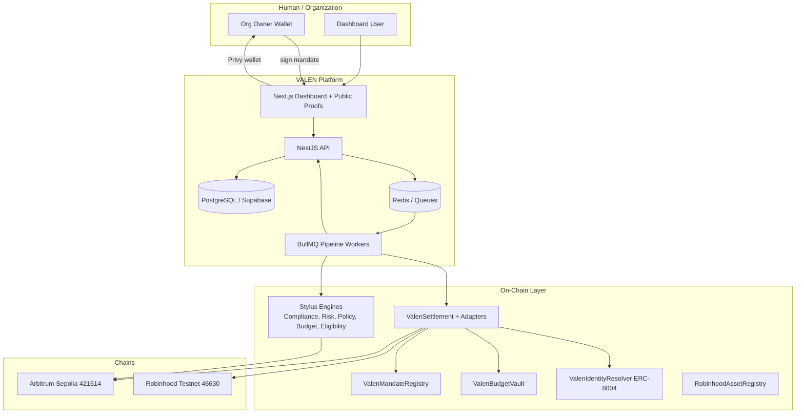
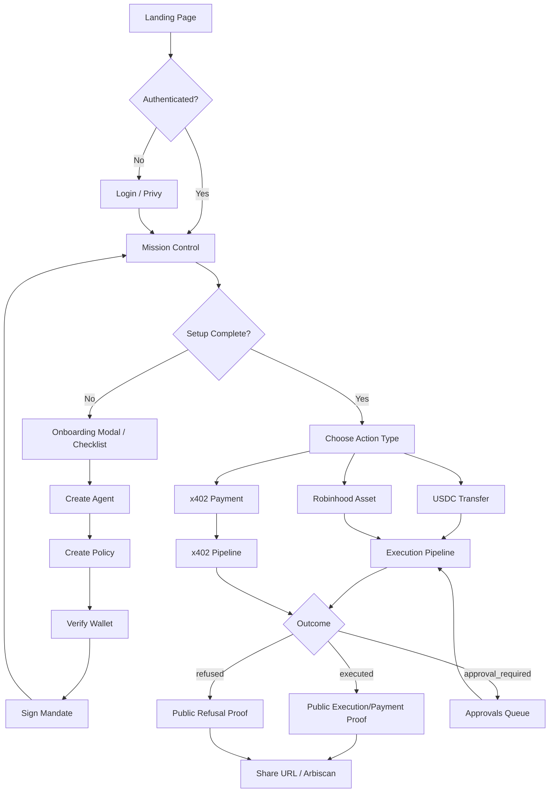
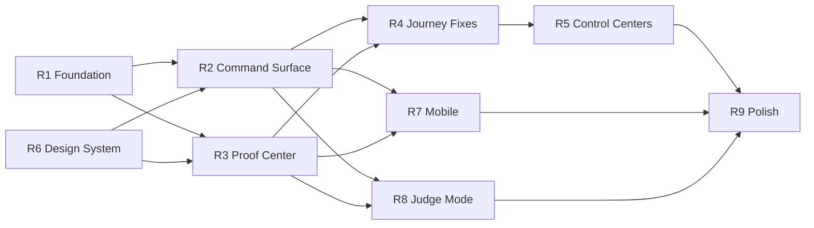

# VALEN Dashboard Redesign Master Plan

**Document status:** Definitive pre-implementation blueprint  
**Version:** 1.0  
**Date:** 2026-06-13  
**Authors:** Principal Product Architect / UX Director / Staff Frontend Engineer / System Designer (audit synthesis)  
**Scope:** Frontend dashboard, public proof surfaces, onboarding, navigation, and judge-facing product experience  
**Explicitly out of scope for this document:** Code changes, visual mockups in Figma, backend API redesign (except UI-facing gaps noted)

---

## Document Purpose

This document is the **single source of truth** before VALEN dashboard redesign implementation begins. It synthesizes:

- Full codebase audit (frontend, backend, contracts, Stylus, queues, proofs)
- All architecture and product documentation (`VALEN_COMPLETE_DOCUMENTATION.md`, `MASTER_EXECUTION_PLAN.md`, blueprints, phase reports, `docs/summary.md`)
- Live production review (`https://valenai.vercel.app`, API `https://valen-api-m3g4.onrender.com`)
- Judge, user, investor, and enterprise mental models

**Rule:** Nothing in this document proposes pixel-perfect UI yet. It defines *what* must exist, *why*, *for whom*, and *in what order* to implement.

---

## Table of Contents

1. [Executive Summary](#1-executive-summary)
2. [Phase 1 — Complete System Understanding](#2-phase-1--complete-system-understanding)
3. [Phase 2 — Product Audit (Every Page)](#3-phase-2--product-audit-every-page)
4. [Phase 3 — User Journey Audit](#4-phase-3--user-journey-audit)
5. [Phase 4 — Judge Experience Audit](#5-phase-4--judge-experience-audit)
6. [Phase 5 — Feature Inventory](#6-phase-5--feature-inventory)
7. [Phase 6 — Information Architecture](#7-phase-6--information-architecture)
8. [Phase 7 — Command Center Analysis](#8-phase-7--command-center-analysis)
9. [Phase 8 — Redesign Strategy (Ideal Experience)](#9-phase-8--redesign-strategy-ideal-experience)
10. [Phase 9 — Visual Design System](#10-phase-9--visual-design-system)
11. [Phase 10 — Implementation Plan](#11-phase-10--implementation-plan)
12. [Appendices](#12-appendices)

---

# 1. Executive Summary

## What VALEN Is (One Sentence)

VALEN is **the operating system for autonomous finance**: it binds wallet authority, signed mandates, policies, budgets, compliance/risk gates, on-chain settlement, and immutable public proofs so every agent action ends with verifiable evidence — approved or refused.

## Why the Dashboard Must Be Redesigned (Not Reskinned)

The current dashboard **implements the full product** (Phases A–I complete) but **does not communicate it**. Judges and first-time users encounter:

| Problem | Impact |
|---------|--------|
| Mission Control is simultaneously onboarding wizard, ops dashboard, and proof launcher | Cognitive overload in first 60 seconds |
| Primary nav has 9 journey items + 10 admin items; agents list is hidden | Users lose agent context mid-journey |
| Copy references internal phases ("Phase C", "Phase F", "Render API") | Breaks judge trust; feels like dev tooling |
| Execute flow uses engineer vocabulary ("Submit for Evaluation", UUIDs, mandate hashes) | Value prop obscured behind compliance mechanics |
| Proof — VALEN's killer feature — is buried under "See Proof" → executions table | Judges miss the differentiator |
| Mobile sidebar disappears with no replacement | Demo failure on phones/tablets |
| Marketing site and dashboard are visually unrelated | Product feels like two products |

## Redesign North Star

> **In 60 seconds, a judge understands:** VALEN lets an AI agent spend money only within rules you signed, and every attempt produces a public proof URL with on-chain evidence.

## Redesign Principles

1. **Proof-first navigation** — Proof is not a report; it is the product outcome.
2. **One hero journey** — Connect → Agent → Rules → Authority → Execute → Proof.
3. **Progressive disclosure** — Compliance, treasury, governance, contracts are *evidence layers*, not primary nav noise.
4. **Judge legibility** — No internal phase language, no debug stat labels, no UUID-first UI.
5. **Dual-chain clarity** — Arbitrum Sepolia (USDC, x402, budgets) vs Robinhood Testnet (tokenized assets) always labeled.
6. **Honest state** — ERC-8004 pending, historical failures, vault scope: explain, don't hide.
7. **Command Surface** — Yes: a unified Mission Control command layer (see Phase 7).

## Success Criteria (Post-Redesign)

| Audience | Success metric |
|----------|----------------|
| Judge (10s) | Can name category: "governed agent finance with proofs" |
| Judge (30s) | Can point to one public proof URL with tx hash |
| Judge (2min) | Can narrate allowed + refused demo paths |
| User | Completes first proof without reading docs |
| Enterprise | Finds audit trail, policies, mandates without engineer |
| Team | Implements from this doc without clarification meetings |

---

# 2. Phase 1 — Complete System Understanding

## 2.1 Product Stack (Mental Model)



## 2.2 Execution Pipeline (Canonical)

Every governed action follows:

```
Intent POST → valen-intent (Stylus attestation)
           → valen-compliance
           → valen-risk (budget + Robinhood policy)
           → valen-policy (approval gate)
           → valen-settlement (on-chain submit/approve/execute)
           → confirmation + proof projection
```

**Terminal states:** `executed`, `compliance_failed`, `risk_failed`, `policy_rejected`, `approval_required`, `failed`, `cancelled`

**Proof kinds:** `execution`, `refusal`, `payment` (x402)

## 2.3 Frontend Route Map (Complete)

### Public routes (no auth)
| Route | Purpose |
|-------|---------|
| `/` | Marketing landing |
| `/login` | Privy login |
| `/onboarding` | First-run guided setup (uses dashboard shell) |
| `/agents/[agentSlug]` | Public ERC-8004 agent profile |
| `/proofs/pack` | Latest public proof samples |
| `/proofs/executions/[id]` | Public execution proof |
| `/proofs/refusals/[id]` | Public refusal proof |
| `/proofs/payments/[id]` | Public x402 payment proof |

### Dashboard routes (auth + org)
| Route | Sidebar | Purpose |
|-------|---------|---------|
| `/dashboard` | Mission Control | Setup progress, stats, proof shortcuts, budget |
| `/dashboard/register-agent` | Create Agent | Agent registration |
| `/dashboard/agents` | **NOT IN NAV** | Agent list |
| `/dashboard/agents/[agentId]` | — | Agent detail, readiness, wallets, API keys |
| `/dashboard/policies` | Set Rules | Policy list |
| `/dashboard/policies/new` | — | Create from template |
| `/dashboard/policies/[policyId]` | — | Policy detail + versions |
| `/dashboard/wallets` | Fund & Authority | Verify wallet, sign mandates, balances |
| `/dashboard/executions/new` | Execute | Intent builder |
| `/dashboard/payments` | x402 Payments | x402 initiate + execute |
| `/dashboard/executions` | See Proof | Execution list (misnamed for proof) |
| `/dashboard/executions/[executionId]` | — | Pipeline detail |
| `/dashboard/executions/[executionId]/proof` | — | Authenticated proof view |
| `/dashboard/demo/robinhood` | Robinhood Assets | Demo hub |
| `/dashboard/demo/robinhood/[ticker]` | — | Per-ticker demo |
| `/dashboard/resources` | Resources | Explorers, contracts, faucets |
| `/dashboard/approvals` | Admin | Approval queue |
| `/dashboard/settlements` | Admin | Settlement rows |
| `/dashboard/compliance` | Admin | Compliance subjects |
| `/dashboard/audit` | Admin | Audit log browser |
| `/dashboard/governance` | Admin | On-chain governance ops read |
| `/dashboard/treasury` | Admin | Treasury ops read |
| `/dashboard/contracts` | Admin | Contract bytecode check |
| `/dashboard/webhooks` | Admin | Webhook CRUD |
| `/dashboard/team` | Admin | Team invitations |
| `/dashboard/settings` | Admin | Org settings |

**Total:** 35 page routes, 23 shared app components, 1 dashboard layout, marketing component set (~15 sections).

## 2.4 Backend Capability Map (UI-Relevant)

| Domain | User-visible outcome |
|--------|---------------------|
| Auth / Orgs | Login, org context, roles |
| Agents | CRUD, activate/suspend/revoke, wallets, API keys |
| Policies | Version workflow, publish, activate |
| Mandates | EIP-712 sign, revoke, scope enforcement |
| Executions | Intent create, timeline, cancel, approve |
| Compliance | Per-execution checks, subject attestations |
| Risk | Scores, tiers, Robinhood policy refusals |
| Settlement | Tx hashes, retry, on-chain status |
| Budget | Cap, spent, remaining, top-up, events |
| x402 | Initiate, execute, payment proofs |
| Proofs | Public projections, proof pack |
| ERC-8004 | Identity badge, register, public slug |
| Robinhood | Asset catalog, scenarios |
| Audit | Append-only logs, export |
| Dashboard | Mission Control summary (cached) |
| Operator | Secret-header ops (partially surfaced in UI) |

## 2.5 On-Chain / Stylus Map

| Component | Chain | UI touchpoint |
|-----------|-------|---------------|
| ValenSettlement | Both | Settlement detail, proof tx links |
| ValenTokenSettlementAdapter | Both | USDC/USDG/stock token transfers |
| ValenMandateRegistry | Both | Mandate signing, proof mandate hash |
| ValenBudgetVault | Sepolia only | Budget meter, top-up |
| ValenIdentityResolver | Sepolia only | ERC-8004 badge |
| RobinhoodAssetRegistry | Robinhood only | Demo asset metadata |
| 5 Stylus engines | Sepolia | Pipeline timeline attestation stage |
| ValenGovernance / Timelock | Sepolia | Governance admin page |

## 2.6 Current Phase Status

| Phase | Name | Status |
|-------|------|--------|
| A–I | Core product | ✅ Production-verified on testnets |
| J | MCP + SDK | 📋 Not started |
| K | Mission Control cockpit polish | 📋 Planned (partially exists) |
| L | Demo packaging | 📋 Not started |
| M | Submission package | 📋 Not started |

**Known honest gaps (must remain visible post-redesign):**
- ERC-8004 on-chain token mint pending (resolver bound)
- Budget vault scoped to demo agent key on Sepolia
- Historical pre-fix execution failures in DB
- Operator queue backlog (non-blocking)

## 2.7 Shared Component Inventory

| Component | Used for | Redesign notes |
|-----------|----------|----------------|
| `app-shell` | Layout | Needs mobile nav |
| `sidebar` | Navigation | Restructure IA |
| `header` | Context + proof pill | Strengthen proof CTA |
| `page-header` | Page titles | Standardize voice |
| `query-state` | Loading/error/empty | Expand empty-state library |
| `stat-card` | Metrics | Remove debug copy |
| `status-badge` | Pipeline states | Add human labels |
| `pipeline-timeline` | Execution detail | Hero on proof pages |
| `budget-meter` | USDC cap | Clarify agent scope |
| `erc8004-badge` | Identity | Explain pending state |
| `chain-badge` | Chain label | Always visible on money actions |
| `wallet-balances-panel` | Balances | Separate from authority |
| `public-proof-identity-panel` | Public proofs | Template for proof center |
| `settlement-row` | Settlements admin | Simplify for ops view |

---

# 3. Phase 2 — Product Audit (Every Page)

## Audit Methodology

Each page reviewed against:
- **Exists** — what renders today
- **Works** — functional against production API
- **Confusing** — cognitive friction
- **Duplicated** — overlaps another surface
- **Missing** — expected but absent
- **Judge risk** — demo failure modes
- **User risk** — abandonment triggers

## 3.1 Marketing & Auth

### `/` Landing Page
| Dimension | Finding |
|-----------|---------|
| Exists | Full marketing site: hero, features, pricing, FAQ, permission layer mock |
| Works | CTAs route to `/dashboard` and `/login` |
| Confusing | Hero CTA says "Create Agent" but routes to dashboard (may redirect to login/onboarding) |
| Duplicated | Journey described on landing, onboarding, and Mission Control |
| Missing | Live proof embed on landing (static mock only) |
| Judge risk | Beautiful but disconnected from real product screenshots |
| User risk | Expectation mismatch entering dashboard |

**Fix direction:** Embed real proof pack iframe/card on landing; CTA "See Live Proof" → `/proofs/pack`.

### `/login`
| Dimension | Finding |
|-----------|---------|
| Exists | Privy login form |
| Works | Auth sync to backend |
| Confusing | No explanation of what happens after login |
| Missing | "View public proofs without login" link |

### `/onboarding`
| Dimension | Finding |
|-----------|---------|
| Exists | Dark hero + 4 journey steps + 7 evidence checklist |
| Works | Links to correct routes |
| Confusing | Duplicates Mission Control setup checklist; "Fund Agent" step always incomplete |
| Duplicated | 100% overlap with `buildSetupSteps()` on Mission Control |
| Missing | Short video or animated pipeline diagram |
| Judge risk | "Phase F" language in Fund Agent copy |

**Fix direction:** Merge onboarding into Mission Control first-run modal; single checklist source.

## 3.2 Mission Control — `/dashboard`

| Dimension | Finding |
|-----------|---------|
| Exists | Hero card, 7-step checklist, 4 proof shortcuts, budget meter, 12 stat cards, status breakdown, recent executions |
| Works | Live data from Render API + operator reads |
| Confusing | Too many competing focal points; stat cards show engineer labels ("Render agents endpoint", "No aggregate yet") |
| Duplicated | Setup checklist = onboarding |
| Missing | Single "demo mode" button for judges; historical failure filtering |
| Judge risk | 12 stat cards feel like generic admin panel, not autonomous finance OS |
| User risk | Overwhelmed before first action |

**Notable copy bug:** "...deterministic refusals before settlement. honest until then." — broken sentence.

**Fix direction:** Collapse to Command Surface (Phase 7): status row + one CTA + 3 proof cards + optional advanced stats drawer.

## 3.3 Agent Surfaces

### `/dashboard/register-agent` (Create Agent)
| Dimension | Finding |
|-----------|---------|
| Exists | Name, description, type cards, capabilities, optional policy, setup preview |
| Works | Creates + auto-activates agent |
| Confusing | Type differences still mostly metadata (except readiness API key gate) |
| Missing | Link to "what happens next" video; agent slug preview |
| Judge risk | Good after recent improvements; still separate from agent list in nav |

### `/dashboard/agents` (NOT IN SIDEBAR)
| Dimension | Finding |
|-----------|---------|
| Exists | Card grid with readiness scores |
| Works | Links to detail |
| Confusing | Hidden from primary nav — users create agent but can't find list |
| Missing | Sidebar entry "Agents" |
| Judge risk | "Where are my agents?" during demo |

### `/dashboard/agents/[agentId]`
| Dimension | Finding |
|-----------|---------|
| Exists | Readiness checklist, budget meter, ERC-8004, profile, wallet link, policy assign, API keys, executions |
| Works | Full lifecycle actions |
| Confusing | Too many sections at same hierarchy; wallet link vs wallet verification on separate page |
| Duplicated | Policy assign appears here and in policies flow |
| Missing | Visual mandate scope summary (human readable) |
| Judge risk | ERC-8004 "registration_pending" without judge-friendly explanation |

## 3.4 Rules & Authority

### `/dashboard/policies` (Set Rules)
| Dimension | Finding |
|-----------|---------|
| Exists | Policy table |
| Works | CRUD via API |
| Confusing | "Set Rules" nav label vs "Policies" page title |
| Missing | Template gallery on list page |

### `/dashboard/policies/new`
| Dimension | Finding |
|-----------|---------|
| Exists | Template picker, activate-now flow |
| Works | Publishes version + assigns to agents |
| Confusing | Version workflow (draft/submit/publish/activate) not explained |
| Judge risk | Rules JSON visible — intimidating |

### `/dashboard/policies/[policyId]`
| Dimension | Finding |
|-----------|---------|
| Exists | Rules grid, version history |
| Works | Read-only version states |
| Confusing | Raw JSON keys for permissions |
| Missing | Human rule sentences ("Agent may transfer up to 1 USDC per tx") |

### `/dashboard/wallets` (Fund & Authority)
| Dimension | Finding |
|-----------|---------|
| Exists | Chain selector, wallet verification, mandate signing, wallet cards, balances, mandate list |
| Works | Full EIP-191 + EIP-712 flows |
| Confusing | **Three concepts on one page:** verification, mandates, funding |
| Duplicated | Mandate signing also referenced on agent detail |
| Missing | Clear separation: Authority vs Funding vs Balances |
| Judge risk | Page title "Fund & Authority" — judges don't know which to do first |
| User risk | Highest friction page in journey |

**Fix direction:** Split into **Authority Center** (verify + mandate) and **Funding Center** (balances + budget top-up).

## 3.5 Execution Surfaces

### `/dashboard/executions/new` (Execute)
| Dimension | Finding |
|-----------|---------|
| Exists | Template picker, agent selector, mandate match, amount, balance check, budget meter, readiness |
| Works | Full pipeline on submit |
| Confusing | Button "Submit for Evaluation" — not "Execute"; template jargon |
| Missing | Plain-language summary before submit ("Pay 1 USDC to X on Arbitrum") |
| Judge risk | Mandate mismatch errors reference UUIDs and agent names inconsistently |

### `/dashboard/executions` (See Proof)
| Dimension | Finding |
|-----------|---------|
| Exists | Filterable execution table |
| Works | Links to detail |
| Confusing | **Nav says "See Proof" but page is execution list** |
| Missing | Proof-first columns (proof link, tx hash, outcome headline) |
| Judge risk | Judge clicks "See Proof", sees database table |

### `/dashboard/executions/[executionId]`
| Dimension | Finding |
|-----------|---------|
| Exists | Pipeline timeline, compliance, risk, settlement, approve/reject |
| Works | Live settlement fetch |
| Confusing | Failed executions require scrolling to understand why |
| Missing | Prominent "Open Public Proof" for all terminal states |
| Judge risk | Pipeline stages use internal status strings |

### `/dashboard/executions/[executionId]/proof`
| Dimension | Finding |
|-----------|---------|
| Exists | Authenticated proof mirror |
| Works | Matches public proof schema |
| Duplicated | Nearly identical to public `/proofs/executions/[id]` |
| Missing | "Share proof" copy button prominent |

## 3.6 x402 — `/dashboard/payments`

| Dimension | Finding |
|-----------|---------|
| Exists | Two-step initiate + execute, readiness sidebar |
| Works | Live EIP-3009 settlement |
| Confusing | Two-step flow not explained upfront |
| Missing | Diagram: HTTP 402 → governed payment → proof |
| Judge risk | x402 value prop buried in form fields |

## 3.7 Robinhood — `/dashboard/demo/robinhood`

| Dimension | Finding |
|-----------|---------|
| Exists | Asset grid, allowed/refused paths, ticker pages |
| Works | Links to intent templates |
| Confusing | "Demo" in path undersells headline feature |
| Missing | Side-by-side allowed vs refused proof links on same screen |
| Judge risk | Strongest differentiator but labeled "demo" |

## 3.8 Proof Surfaces (Public)

### `/proofs/pack`
| Dimension | Finding |
|-----------|---------|
| Exists | Minimal heading + proof list |
| Works | Public API via proxy |
| Confusing | Sparse UI — feels unfinished |
| Missing | Judge one-pager: "This is VALEN's proof" hero + 3 sample proofs |
| Judge risk | First public proof impression is underwhelming |

### `/proofs/executions/[id]`, `/proofs/refusals/[id]`, `/proofs/payments/[id]`
| Dimension | Finding |
|-----------|---------|
| Exists | Schema-frozen proof layout, identity panel, hashes, tx links |
| Works | Production-verified |
| Confusing | Hash-heavy without "what to verify" guide |
| Missing | Verification checklist for judges |
| Judge risk | Strong content, weak presentation hierarchy |

### `/agents/[agentSlug]`
| Dimension | Finding |
|-----------|---------|
| Exists | Public agent profile |
| Works | Demo agent `valen` |
| Missing | Link from every proof to agent profile |

## 3.9 Evidence & Admin Pages

| Page | Works | Judge/User Issue |
|------|-------|------------------|
| `/dashboard/approvals` | ✅ | Good; should surface on Command Surface when pending |
| `/dashboard/settlements` | ✅ | Too technical for primary users |
| `/dashboard/compliance` | ✅ | Subject rows — enterprise, not judge |
| `/dashboard/audit` | ✅ | Export useful for enterprise |
| `/dashboard/governance` | ⚠️ | Operator API dependency; errors shown to users |
| `/dashboard/treasury` | ⚠️ | Operator read; "Render treasury read failed" |
| `/dashboard/contracts` | ⚠️ | Dev-focused bytecode checks |
| `/dashboard/webhooks` | ✅ | Enterprise integrators |
| `/dashboard/team` | ✅ | Standard admin |
| `/dashboard/settings` | ✅ | Org config |
| `/dashboard/resources` | ✅ | Dev/judge deep-dive; not primary journey |

## 3.10 Mobile & Responsive Audit

| Issue | Severity |
|-------|----------|
| Sidebar hidden `<1024px` with no hamburger menu | **Critical** |
| Tables overflow without card fallback | High |
| Mandate signing forms cramped | High |
| Proof pages readable | Medium |
| Marketing landing responsive | Good |

## 3.11 Cross-Cutting UX Duplications

| Duplication | Locations | Resolution |
|-------------|-----------|------------|
| Setup checklist | Mission Control, Onboarding | Single source + first-run modal |
| Readiness steps | Agent detail, Execute page, x402 sidebar | Shared `agent-readiness` component (started) |
| Proof access | Header pill, Mission Control cards, executions list, resources | Unified Proof Center entry |
| Policy assignment | Agent detail, policy create | Wizard step |
| Budget meter | Mission Control, agent detail, execute, x402 | Contextual embed with agent label |
| Wallet balances | Wallets page, execute page | Funding Center |

## 3.12 Naming Inconsistencies (Must Fix)

| Current | Problem | Target |
|---------|---------|--------|
| Set Rules | vs Policies | **Rules & Policies** |
| Fund & Authority | Two verbs | **Authority** + **Budgets** (split pages) |
| See Proof | Goes to list | **Proofs** or **Activity** |
| Create Agent | vs Agents list hidden | **Agents** section with + Create |
| Submit for Evaluation | Engineer speak | **Run Governed Action** |
| Execute (nav) | vs evaluation button | **New Action** under Actions |
| Phase C / Phase F | Internal | Remove all phase references from UI |

---

# 4. Phase 3 — User Journey Audit

## 4.1 Canonical Journey (Target)

```
Landing → Login → Mission Control → [Setup Loop] → Governed Action → Public Proof
```

Setup loop substeps:
```
Create Agent → Create Policy → Verify Wallet → Sign Mandate → (Optional API Key) → (Optional Budget Top-up)
```

## 4.2 Master Journey Flow Diagram



## 4.3 Screen-by-Screen Click Map

### Journey A: First USDC Proof (Happy Path)

| Step | Screen | User action | System response | Pain today |
|------|--------|-------------|-----------------|------------|
| 1 | Landing | Click "Create Agent" | Redirect login/dashboard | CTA naming |
| 2 | Login | Privy sign-in | Auth sync | — |
| 3 | Onboarding OR Mission Control | View checklist | Links to steps | Duplicate |
| 4 | Register Agent | Fill form, submit | Agent created | Hidden agents list |
| 5 | Agent Detail | Assign policy | PATCH agent | — |
| 6 | Wallets | Verify wallet challenge | Signature | Page overload |
| 7 | Wallets | Sign mandate EIP-712 | Mandate stored | Complex form |
| 8 | Execute | Select USDC template | Mandate match check | Submit label |
| 9 | Execute | Submit intent | Pipeline starts | — |
| 10 | Execution Detail | Watch pipeline | Stages update | — |
| 11 | Proof | Open public proof | Tx + hashes | Buried link |
| 12 | Share | Copy proof URL | Judge verifies | — |

**Total clicks (minimum):** ~18–25 depending on policy pre-existence

### Journey B: Robinhood Refused Proof

| Step | Screen | Action | Outcome |
|------|--------|--------|---------|
| 1 | Robinhood Assets | Select TSLA refused | Template pre-selected |
| 2 | Execute | Submit over-limit | `risk_failed` |
| 3 | Refusal Proof | Public URL | Policy refusal evidence |

### Journey C: x402 Payment Proof

| Step | Screen | Action | Outcome |
|------|--------|--------|---------|
| 1 | x402 Payments | Initiate | Payment record |
| 2 | x402 Payments | Execute settlement | On-chain USDC |
| 3 | Payment Proof | Public URL | EIP-3009 evidence |

### Journey D: ERC-8004 Identity

| Step | Screen | Action | Outcome |
|------|--------|--------|---------|
| 1 | Agent Detail | View identity badge | `registration_pending` |
| 2 | Agent Detail | Register (optional) | Metadata hash |
| 3 | Public Proof | Identity panel | Agent slug link |

## 4.4 Pain Point Heatmap

| Stage | Severity | Description |
|-------|----------|-------------|
| Wallet verification | 🔴 High | Cryptographic flow without plain steps |
| Mandate signing | 🔴 High | EIP-712 invisible to user |
| Policy creation | 🟡 Medium | Version workflow opaque |
| Agent discovery | 🟡 Medium | List not in nav |
| Execute submit | 🟡 Medium | Vocabulary + gating errors |
| Proof discovery | 🔴 High | Not default outcome view |
| Mobile | 🔴 High | No navigation |
| Admin noise | 🟡 Medium | Ops pages visible in journey nav |

## 4.5 Budget Journey (Separate but Linked)

```
Mission Control Budget Meter → Agent Detail Budget → Top-up POST → Vault tx → Events log
```

**Friction:** Budget vault only applies to specific demo agent on Sepolia; UI must label scope explicitly.

---

# 5. Phase 4 — Judge Experience Audit

## 5.1 First 10 Seconds

**What judges see today (logged in):** Mission Control with tagline, progress bar, 4 status boxes, 7 green checkmarks, 4 proof cards, then a wall of stat cards.

| Understands | Does NOT understand |
|-------------|-------------------|
| Something about "autonomous finance" | Why this is not MetaMask / Safe / "another dashboard" |
| There is a checklist | What a "mandate" is |
| Proofs exist | Where to click for instant proof |
| USDC mentioned | How Stylus + settlement connect |

**Fix:** Hero strip: **"Every agent payment gets a public proof URL"** + single blue button **"Open Latest Proof"** + live tx hash preview.

## 5.2 First 30 Seconds

| Understands (with exploration) | Still unclear |
|--------------------------------|---------------|
| Agents and rules exist | Difference between policy and mandate |
| Something executed on chain | Why Robinhood is on a separate nav item |
| Checklist mostly green | What failed executions mean in stats |

**Fix:** 30-second demo path panel: **Allowed USDC** | **Refused TSLA** | **x402 Payment** — each opens prefilled action.

## 5.3 First 2 Minutes

| Should understand | Currently blocks understanding |
|-------------------|-------------------------------|
| Governed = signed rules before money moves | Policy/version UI |
| Refusal is a feature, not a bug | Failed status without narrative |
| Proof is public and permanent | Proof list not prioritized |
| VALEN uses Stylus on Arbitrum | Stylus invisible except contracts admin |
| ERC-8004 identity enriches proofs | Pending state looks broken |

## 5.4 "Another Dashboard" Failure Points

| Location | Why it feels generic | Fix |
|----------|---------------------|-----|
| 12 stat cards | Could be any SaaS admin | Replace with 3 proof-centric metrics |
| Executions table | Looks like Stripe logs | Outcome-first cards |
| Settings/Team | Standard B2B | Move deeper in admin |
| Compliance page | Generic GRC | Enterprise mode toggle |
| Resources | Etherscan links | Judge mode vs Dev mode |

## 5.5 "Another Wallet" Failure Points

| Location | Why | Fix |
|----------|-----|-----|
| Wallets page | Privy + verify + sign | Reframe as **Authority**, not wallet |
| Balance panels | Looks like portfolio tracker | Tie to agent budget, not personal wealth |
| Link wallet on agent | Confusing vs owner verify | Copy: "Agent destination wallets" vs "Owner authority wallet" |

## 5.6 "Another Crypto App" Failure Points

| Location | Why | Fix |
|----------|-----|-----|
| UUID everywhere | Developer tool | Short ids + human titles |
| Hashes on proofs | Intimidating | Verification steps 1-2-3 |
| Chain IDs (421614) | Not human | Always "Arbitrum Sepolia" badge |
| Phase references | Internal build log | Remove |

## 5.7 Judge Demo Script (Target — 2 Minutes)

| Time | Action | Proof artifact |
|------|--------|----------------|
| 0:00 | Open Mission Control | Hero + latest proof |
| 0:20 | Click "Refused TSLA" demo | Prefilled execute |
| 0:45 | Submit → refusal proof URL | Public refusal page |
| 1:00 | Click "Allowed USDC" demo | Execution proof + Arbiscan |
| 1:30 | Open x402 payment proof | Payment proof page |
| 1:50 | Open proof pack | Persistence narrative |
| 2:00 | Open public agent profile | ERC-8004 identity |

---

# 6. Phase 5 — Feature Inventory

Scoring: **1–5** (5 = highest). **IQ** = Implementation Quality today.

| Feature | Purpose | Business Value | User Value | Technical Value | Importance | Visibility | IQ |
|---------|---------|----------------|------------|-----------------|------------|------------|-----|
| **Agents** | Registered autonomous actors | Core SKU | Own agent lifecycle | Pipeline attribution | 5 | 3 | 4 |
| **Agent Types** | hosted/external/service/experimental | Segmentation | Choose integration mode | Metadata | 3 | 2 | 3 |
| **Agent API Keys** | Programmatic access | Enterprise | Automation | Security boundary | 4 | 2 | 4 |
| **Policies** | Compliance/risk rules | Legal defensibility | Control agent behavior | Off+on chain hash | 5 | 3 | 3 |
| **Policy Versions** | Change management | Audit | Safe updates | Hash activation | 4 | 2 | 3 |
| **Mandates** | Signed authority scope | Non-repudiation | Grant permission | ERC-8226 alignment | 5 | 2 | 3 |
| **Wallet Verification** | Prove ownership | Trust anchor | One-time setup | EIP-191 | 5 | 3 | 3 |
| **Budgets (DB)** | Spend caps | Cost control | Predictable limits | Pre-settlement gate | 5 | 4 | 4 |
| **Budget Vault** | On-chain envelope | Trust minimization | Verifiable cap | commitSpend | 4 | 3 | 4 |
| **Stylus Budget Engine** | On-chain evaluate | Hackathon differentiator | Hidden today | Attestation input | 4 | 1 | 5 |
| **Compliance Engine** | Regulatory gate | Compliance sale | Invisible (good) | Stylus + attestations | 5 | 2 | 4 |
| **Risk Engine** | Scoring + approval | Risk sale | Approval notifications | Stylus factors | 5 | 3 | 4 |
| **Robinhood Policy** | Asset rules | Headline demo | Clear refused path | Backend + risk | 5 | 4 | 4 |
| **Execution Pipeline** | Orchestration | Core platform | Status visibility | 5 queues | 5 | 4 | 4 |
| **Pipeline Timeline** | Stage visibility | Demo clarity | Understand progress | UI component | 5 | 4 | 4 |
| **Settlement (on-chain)** | Finality | Trust | Tx proof | 3-step flow | 5 | 3 | 5 |
| **Approvals** | Human-in-loop | Enterprise | Pause high-risk | Policy gate | 4 | 3 | 4 |
| **Proofs (public)** | Immutable evidence | **Primary differentiator** | Share outcomes | proofVersion 1.0 | 5 | 2 | 3 |
| **Proof Pack** | Demo entry | Judge onboarding | One-click samples | Public API | 5 | 2 | 2 |
| **x402 Payments** | HTTP-native pay | Modern agent commerce | New payment rail | EIP-3009 | 5 | 3 | 4 |
| **ERC-8004 Identity** | Agent discoverability | Standards leadership | Public profile | Resolver binding | 4 | 3 | 3 |
| **Robinhood Assets** | Tokenized stocks demo | Partner narrative | Memorable demo | Dual chain | 5 | 4 | 4 |
| **Audit Trail** | Forensics | Enterprise | Compliance export | Append-only | 4 | 2 | 4 |
| **Evidence Hashes** | Integrity | Legal | Verify proof | keccak bindings | 5 | 3 | 4 |
| **Mission Control** | Orientation | Conversion | Start here | Dashboard summary | 5 | 5 | 3 |
| **Onboarding** | First-run | Activation | Setup guidance | Duplicated | 4 | 4 | 3 |
| **Intent Templates** | Guided execute | Demo reliability | Pre-filled actions | 11+ templates | 5 | 4 | 4 |
| **Wallet Balances** | Funding visibility | Treasury ops | Know funds | RPC reads | 3 | 3 | 4 |
| **Treasury (ops)** | Protocol funds | Operator | Hidden | Operator API | 2 | 1 | 3 |
| **Governance (ops)** | Upgrades | Protocol | Confusing | On-chain | 2 | 1 | 2 |
| **Contracts (ops)** | Bytecode verify | Dev | Noise for judges | Operator API | 2 | 1 | 3 |
| **Webhooks** | Integrations | Platform | Automation | Outbound | 3 | 1 | 4 |
| **Team RBAC** | Multi-user | Enterprise | Collaboration | Roles | 3 | 2 | 4 |
| **Notifications** | Approvals | UX | Alert user | In-app | 3 | 2 | 3 |
| **Dead Letter Queue** | Reliability | Ops | Hidden | Admin | 2 | 1 | 4 |
| **Emergency Pause** | Safety | Protocol | Hidden | Guardian | 3 | 1 | 4 |
| **Public Agent Profile** | Identity | Marketing | Trust | Slug route | 4 | 2 | 3 |
| **Resources** | Dev addresses | Hackathon | Confusion | Static links | 2 | 3 | 4 |
| **MCP/SDK (future)** | Agent integration | Platform moat | Dev experience | Phase J | 4 | 0 | 0 |

### Visibility Gap Analysis (Importance − Visibility ≥ 2)

| Feature | Gap | Action |
|---------|-----|--------|
| Public Proofs | 5 − 2 = 3 | Promote to primary nav **Proof Center** |
| Stylus Engines | 4 − 1 = 3 | Pipeline visual + "Verified by Stylus" badge |
| Mandates | 5 − 2 = 3 | Authority Center with visual scope |
| Compliance | 5 − 2 = 3 | Collapse into proof evidence sections |
| Proof Pack | 5 − 2 = 3 | Hero on landing + Mission Control |

---

# 7. Phase 6 — Information Architecture

## 7.1 Visibility Tiers

### Tier 1 — Immediate (always visible)
- Mission Control / Command Surface
- **Actions** (Execute, x402, Robinhood)
- **Proofs** (latest, pack, share)
- **Agents** (list + status)
- Setup progress indicator

### Tier 2 — Secondary (setup & control)
- Rules & Policies
- Authority (wallet verify + mandates)
- Budgets & Funding
- Identity (ERC-8004)
- Approvals (when pending → promote to Tier 1)

### Tier 3 — Advanced / Enterprise
- Compliance evidence
- Audit logs & exports
- Settlements detail
- Webhooks
- Team & settings

### Tier 4 — Operator / Dev (hidden behind "Advanced" or role gate)
- Treasury
- Governance
- Contracts bytecode
- Resources & addresses
- Operator queue diagnostics

## 7.2 Ideal Navigation Structure

```
VALEN
├── Command (Mission Control)
├── Agents
│   ├── All Agents
│   ├── Register Agent
│   └── [Agent Detail — contextual]
├── Actions
│   ├── New Governed Action
│   ├── x402 Payments
│   └── Robinhood Assets
├── Proofs ⭐
│   ├── Proof Center (outcome feed)
│   ├── Public Proof Pack
│   └── [Proof Detail — contextual]
├── Control
│   ├── Rules & Policies
│   ├── Authority (Verify + Mandates)
│   ├── Budgets
│   └── Identity (ERC-8004)
└── Advanced ▾
    ├── Approvals
    ├── Settlements
    ├── Compliance
    ├── Audit
    ├── Webhooks
    ├── Team
    ├── Settings
    └── Developer Resources
```

**Why this structure:**
- **Proofs elevated** — matches product differentiator
- **Agents visible** — fixes hidden list
- **Actions grouped** — all money movement together
- **Control vs Actions** — separates setup from operation
- **Advanced collapsed** — judge mode by default

## 7.3 Ideal Dashboard (Command) Structure

```
┌─────────────────────────────────────────────────────────────┐
│  HERO: Governed agent finance — [Open Latest Proof]         │
│  Status: Agent ✓  Rules ✓  Authority ✓  Budget ✓          │
├─────────────────────────────────────────────────────────────┤
│  DEMO STRIP (Judge Mode):                                   │
│  [Allowed USDC] [Refused TSLA] [x402 Payment]               │
├──────────────────────────┬──────────────────────────────────┤
│  LIVE PIPELINE (if any)  │  SETUP CHECKLIST (if incomplete) │
├──────────────────────────┴──────────────────────────────────┤
│  PROOF FEED: last 5 outcomes with type badge + tx link      │
├─────────────────────────────────────────────────────────────┤
│  BUDGET METER (scoped agent)                                │
└─────────────────────────────────────────────────────────────┘
```

## 7.4 Ideal Proof Center Structure

```
Proof Center
├── Filter: All | Executed | Refused | Payments
├── Card per outcome:
│   ├── Headline ("1 USDC transferred" / "TSLA refused: over limit")
│   ├── Chain badge
│   ├── Public proof link (primary)
│   ├── Arbiscan link
│   └── Pipeline mini-timeline
└── Prominent: Export Proof Pack PDF (future)
```

## 7.5 Ideal Agent Management Structure

```
Agents
├── Grid: name, type, readiness ring, last proof
├── Agent Detail tabs:
│   ├── Overview (readiness + next step)
│   ├── Rules (policy + mandate summary)
│   ├── Budget
│   ├── Identity (ERC-8004)
│   ├── Access (API keys — type gated)
│   └── Activity (executions)
```

## 7.6 Ideal Execution Center Structure

```
New Action
├── Step 1: Choose outcome template (visual cards)
├── Step 2: Confirm agent + mandate match (human summary)
├── Step 3: Amount + recipient
├── Step 4: Review plain English + Submit
└── → Live pipeline view → Proof CTA
```

## 7.7 Mobile IA

- Bottom tab bar: Command | Actions | Proofs | Agents | More
- Hamburger for Advanced section
- Proof share as primary mobile action

---

# 8. Phase 7 — Command Center Analysis

## 8.1 Should VALEN Have a Command Surface?

**Yes.** VALEN is an **operating system**, not a CRUD admin. A Command Surface is the conceptual layer above pages — it answers:

- *What is happening right now?*
- *What should I do next?*
- *What proof can I show?*

## 8.2 Command Surface Definition

The **Command Surface** is the primary UI paradigm for Mission Control combining:

1. **Status telemetry** — agent, rules, authority, budget
2. **Action launcher** — governed actions with templates
3. **Proof radar** — latest outcomes feed
4. **Pipeline monitor** — in-flight executions
5. **Governance signals** — pending approvals, budget warnings
6. **Optional NL input** — Phase J+ natural language (structured, not chatbot)

## 8.3 Actions on Command Surface

| Action | Input | Output |
|--------|-------|--------|
| Run Allowed USDC | 1 click | Execution proof |
| Run Refused TSLA | 1 click | Refusal proof |
| Run x402 Payment | 1 click | Payment proof |
| Resume Setup | 1 click | Next incomplete step |
| Open Latest Proof | 1 click | Public proof tab |
| Approve Pending | 1 click (if any) | Approvals queue |

## 8.4 Natural Language Execution (Future — Phase J+)

**Not a general chatbot.** Structured command palette:

```
"Pay 0.001 USDC on Arbitrum with agent Treasury Bot"
→ parses to intent template + agent + amount
→ shows confirmation card (mandatory)
→ user confirms → pipeline
```

Implementation: map utterances to existing intent templates + entity extraction; never skip confirmation.

## 8.5 Governance Visibility on Command Surface

| Signal | Display |
|--------|---------|
| Pending approvals | Red badge + inline card |
| Budget >80% | Amber budget strip |
| Mandate expiring (<7d) | Warning on agent status |
| ERC-8004 pending | Informational, not error |
| Historical failures | "Pre-fix" label filter toggle |

## 8.6 Proof Appearance

Proofs appear as **outcome cards**, not table rows:

```
┌──────────────────────────────────────┐
│ ✓ EXECUTED · USDC · Arbitrum Sepolia │
│ 1.000000 USDC → 0x483e…              │
│ Proof: valenai.vercel.app/proofs/…   │
│ Tx: 0x0e20fd… [Arbiscan]             │
└──────────────────────────────────────┘
```

## 8.7 Pipeline Progress on Command Surface

In-flight executions show compact pipeline:

```
Intent → Compliance → Risk → Policy → Settlement
  ✓         ✓          ●      ○         ○
```

Click → execution detail.

## 8.8 Budget on Command Surface

- Always show **which agent** the budget applies to
- Show remaining / cap with progress bar
- Top-up as secondary action
- Tooltip: "On-chain vault scope: demo agent on Sepolia"

## 8.9 Settlement on Command Surface

- Latest settlement tx hash on proof cards
- No separate settlement page for judges
- Settlements admin page remains Tier 4

## 8.10 Wireframe — Command Surface (Desktop)

```
┌──────────┬────────────────────────────────────────────────────────┐
│ NAV      │  My Organization · Arbitrum Sepolia     [Latest Proof] │
│          ├────────────────────────────────────────────────────────┤
│ Command  │  ┌──────────────────────────────────────────────────┐  │
│ Agents   │  │ Every agent action → public proof                │  │
│ Actions  │  │ [Open Latest Proof]  [Run Governed Action]        │  │
│ Proofs   │  └──────────────────────────────────────────────────┘  │
│ Control  │  Agent ✓  Rules ✓  Authority ✓  Budget: 0.42/1 USDC │
│ Advanced │  ─────────────────────────────────────────────────── │
│          │  JUDGE DEMO: [USDC ✓] [TSLA ✗] [x402 $]              │
│          │  ─────────────────────────────────────────────────── │
│          │  LIVE: Execution 8a3f… at Risk ████░░                 │
│          │  ─────────────────────────────────────────────────── │
│          │  PROOFS                                                │
│          │  ┌─────────┐ ┌─────────┐ ┌─────────┐                 │
│          │  │Executed │ │ Refused │ │ Payment │                 │
│          │  └─────────┘ └─────────┘ └─────────┘                 │
└──────────┴────────────────────────────────────────────────────────┘
```

## 8.11 Wireframe — Command Surface (Mobile)

```
┌─────────────────────────┐
│ VALEN        [Proof 🔗] │
├─────────────────────────┤
│ Status row (scroll)     │
│ [Run Action] (full width)│
│ Demo chips (horizontal) │
│ Proof cards (stack)     │
├─────────────────────────┤
│ Command │Act│Proof│Agent│
└─────────────────────────┘
```

---

# 9. Phase 8 — Redesign Strategy (Ideal Experience)

## 9.1 Experience Map

| Center | Exists today | Ideal state | Why it exists |
|--------|--------------|-------------|---------------|
| **Hero Experience** | Marketing landing | Landing + embedded live proof | Convert judges in 10s |
| **Mission Control** | Overloaded dashboard | Command Surface | OS home — status + launch |
| **Agent Control Center** | Split register/list/detail | Unified Agents hub | Agents are actors |
| **Execution Center** | Execute page | 4-step wizard + templates | Money movement |
| **Proof Center** | Scattered | Dedicated proof feed | **Core differentiator** |
| **x402 Center** | Payments page | x402 hub with diagram | Agent-native commerce |
| **Robinhood Center** | Demo path | Headline Assets center | Partner story |
| **Identity Center** | Badge on agent | ERC-8004 tab + public link | Trust + standards |
| **Budget Center** | Meter embeds | Dedicated budget page | Cost control story |
| **Governance Center** | Admin page | Tier 4 only | Protocol ops |
| **Authority Center** | Wallets page | Verify + mandate wizard | Legal permission |
| **Rules Center** | Policies pages | Template-first rules | Behavioral control |

## 9.2 Hero Experience (Landing + First Login)

**Goal:** Judge understands proof-first governed finance before login.

Components:
- Live proof embed (from `/proofs/pack`)
- 3 demo outcome cards with real URLs
- 60-second video loop of pipeline → proof
- Remove generic SaaS feature grid duplication

## 9.3 Mission Control → Command Surface

Replace stat-card wall with:
- 1 hero
- 1 status row
- 3 demo actions
- Proof feed
- Optional advanced drawer

Remove: "Render agents endpoint", phase references, broken copy.

## 9.4 Agent Control Center

- Sidebar **Agents** entry
- List shows readiness ring, last proof, type badge
- Detail uses tabs (not infinite scroll sections)
- Welcome flow stays (`?welcome=1`) but as modal

## 9.5 Execution Center

- Rename button: **Run Governed Action**
- 4-step wizard with plain English review
- Template cards with chain + outcome type icons
- Post-submit: auto-navigate to pipeline with proof CTA at top

## 9.6 Proof Center (New Primary Section)

**New route:** `/dashboard/proofs`

Aggregates:
- All executions with proof links first
- Filter refused/executed/payment
- Prominent share buttons
- Links to public proof pack

Rename nav "See Proof" → **Proofs**.

## 9.7 x402 Center

- Hero diagram: Client → 402 → VALEN → USDC → Proof
- Step indicator: Initiate (1/2) → Settle (2/2)
- Success state: full-width proof card

## 9.8 Robinhood Assets Center

- Remove "demo" from user-facing title → **Tokenized Assets**
- Side-by-side Allowed vs Refused with proof links
- Ticker cards: TSLA, AMZN, PLTR, NFLX, AMD, USDG

## 9.9 Identity Center

- Tab on agent detail
- Explain ERC-8004 in 3 bullets
- `registration_pending` → "Identity bound — on-chain mint pending" with link to docs
- Public profile preview

## 9.10 Budget Center

**New route:** `/dashboard/budgets`

- Agent selector
- DB budget + vault status
- Top-up flow
- Event log
- Scope disclaimer for vault

## 9.11 Governance Center

- Hidden behind Advanced + `platform_admin` role
- Remove treasury/governance errors from standard Mission Control

## 9.12 Judge Mode vs Operator Mode

| Mode | Audience | UI |
|------|----------|-----|
| **Judge Mode** (default) | Hackathon, investors | Command Surface, demo actions, proofs |
| **Operator Mode** | Team, devs | Advanced nav, resources, contracts |
| **Enterprise Mode** | Compliance buyers | Audit, compliance, webhooks prominent |

Toggle in settings or auto-detect via role.

---

# 10. Phase 9 — Visual Design System

## 10.1 Design Philosophy

**"Evidence-grade fintech"** — calm, precise, proof-forward. Not degen crypto. Not generic SaaS.

## 10.2 Typography

| Token | Font | Usage |
|-------|------|-------|
| `--font-display` | Instrument Serif | VALEN wordmark, proof headlines only |
| `--font-body` | Inter Tight | All dashboard UI |
| `--font-mono` | JetBrains Mono / ui-monospace | Hashes, addresses, tx ids |

| Scale | Size | Weight | Usage |
|-------|------|--------|-------|
| `display-lg` | 32px | 600 | Command hero |
| `heading` | 24px | 600 | Page titles |
| `title` | 16px | 600 | Card titles |
| `body` | 14px | 400 | Default |
| `caption` | 12px | 500 | Labels, badges |
| `micro` | 11px | 600 | Uppercase section labels |

## 10.3 Color System

| Token | Value | Usage |
|-------|-------|-------|
| `--color-bg` | `#ffffff` | Cards |
| `--color-bg-subtle` | `#f8f9fb` | App background |
| `--color-border` | `#eef0f3` | Borders |
| `--color-text` | `#31485f` | Body |
| `--color-text-strong` | `#012b54` | Headings |
| `--color-text-muted` | `#64748b` | Secondary |
| `--color-primary` | `#007dfc` | Actions, links |
| `--color-primary-subtle` | `#e8f4ff` | Active nav, highlights |
| `--color-accent` | `#c9f31d` | Marketing accent only — sparingly in dashboard |
| `--color-success` | `#10b981` | Executed, verified |
| `--color-warning` | `#f59e0b` | Pending, approval |
| `--color-danger` | `#ef4444` | Failed, refused headline |
| `--color-proof` | `#007dfc` | Proof CTAs — distinct category |

### Outcome colors
| Outcome | Badge bg | Icon |
|---------|----------|------|
| Executed | `#ecfdf5` | Check |
| Refused | `#fef2f2` | X |
| Pending | `#fffbeb` | Clock |
| Approval | `#fff7ed` | User check |

## 10.4 Spacing & Grid

- Base unit: **4px**
- Card padding: **24px** (`p-6`)
- Section gap: **24px** (`space-y-6`)
- Grid: 12-column desktop, 4-column tablet, 1-column mobile
- Max content width: **1280px** for proof pages, **1440px** dashboard

## 10.5 Cards

| Variant | Usage |
|---------|-------|
| `card-default` | Standard white card |
| `card-interactive` | Hover border primary-subtle |
| `card-outcome` | Proof feed items — left border accent by outcome |
| `card-hero` | Command Surface hero — subtle gradient `#f8fbff → white` |
| `card-warning` | Amber border — setup incomplete |

## 10.6 Tables

- Default: `app-table` with sticky header
- **Proof Center:** card list default; table optional
- Mobile: each row → card with key fields
- Columns priority: Outcome > Amount > Chain > Proof link > Created

## 10.7 Buttons

| Variant | Usage |
|---------|-------|
| `btn-primary` | Single primary per viewport |
| `btn-secondary` | Outline — secondary actions |
| `btn-proof` | Solid proof-blue — "Open Proof", "Share Proof" |
| `btn-ghost` | Tertiary |
| `btn-danger` | Revoke, cancel |
| `btn-demo` | Demo strip chips |

**Rule:** Every terminal pipeline view must have exactly one `btn-proof`.

## 10.8 Badges

| Badge | Usage |
|-------|-------|
| `ChainBadge` | Always on money actions |
| `StatusBadge` | Pipeline status with human label map |
| `OutcomeBadge` | Executed / Refused / Pending |
| `AgentTypeBadge` | hosted / external / etc. |
| `StylusVerifiedBadge` | NEW — attestation stage complete |
| `Erc8004Badge` | Identity state |

### Status human labels
| Internal | Display |
|----------|---------|
| `executed` | Settled |
| `risk_failed` | Refused — Risk |
| `compliance_failed` | Refused — Compliance |
| `policy_rejected` | Refused — Policy |
| `approval_required` | Awaiting Approval |

## 10.9 Pipeline Components

```
PipelineStep: icon + label + status (pending/active/complete/failed)
PipelineTimeline: horizontal desktop, vertical mobile
PipelineSummary: one-line "Compliance passed · Risk refused: over limit"
```

## 10.10 Proof Components

| Component | Purpose |
|-----------|---------|
| `ProofHero` | Outcome headline + amount |
| `ProofEvidenceList` | Mandate, compliance, risk hashes with verify tooltips |
| `ProofTxAnchor` | Arbiscan link + block number |
| `ProofIdentityPanel` | ERC-8004 (exists — enhance) |
| `ProofShareBar` | Copy URL, QR (future), PDF (future) |
| `ProofVerificationSteps` | 1-2-3 judge checklist |

## 10.11 Agent Components

| Component | Purpose |
|-----------|---------|
| `AgentCard` | List item with readiness ring |
| `AgentReadinessPanel` | Shared checklist (exists) |
| `AgentTypeSelector` | Registration cards (exists) |
| `MandateScopeSummary` | Human-readable mandate limits |

## 10.12 Asset & Token Components

| Component | Purpose |
|-----------|---------|
| `AssetPill` | USDC, USDG, TSLA (exists) |
| `AmountDisplay` | 6 vs 18 decimal formatting |
| `BudgetMeter` | Cap/remaining (exists — add agent label) |

## 10.13 Charts (Minimal)

- Budget usage: progress bar only (no pie charts)
- Execution outcomes: horizontal bar (executed vs refused vs pending)
- Avoid chartjunk — judges prefer numbers + links

## 10.14 Animations & Micro-interactions

| Interaction | Animation |
|-------------|-----------|
| Pipeline stage complete | 200ms fade + check scale |
| Proof card appear | 300ms slide up |
| Button press | 100ms scale 0.98 |
| Page transition | None (Next.js default) |
| Loading | Skeleton cards, not spinners alone |

## 10.15 Loading / Empty / Error / Success States

| State | Pattern |
|-------|---------|
| Loading | Skeleton with shimmer |
| Empty agents | "Register your first agent" + CTA |
| Empty proofs | "Run a governed action to create proof" + demo chips |
| Error API | `QueryState` with retry + requestId |
| Error wallet | Step-by-step recovery |
| Success execution | Full-width proof CTA banner |

## 10.16 Accessibility

- WCAG 2.1 AA contrast on all text
- Focus rings on all interactive elements
- `aria-live` on pipeline status changes
- Don't rely on color alone for outcome — use icon + text
- Screen reader labels for hashes: "Transaction hash, copyable"

## 10.17 Mobile Responsiveness

- Bottom nav 5 tabs
- Hamburger for Advanced
- Proof share as sticky footer button
- Tables → cards `<768px`
- Mandate signing → full-screen steps

## 10.18 Marketing ↔ Dashboard Visual Bridge

| Element | Marketing | Dashboard |
|---------|-----------|-----------|
| Primary blue | `#007dfc` | Same |
| Navy | `#012b54` | Same |
| Serif | Headlines | Proof headlines only |
| Cards | Rounded 16px | Same radius |
| Motion | Hero animations | Subtle pipeline only |

---

# 11. Phase 10 — Implementation Plan

## 11.1 Phase Overview

| Phase | Name | Duration | Risk | Impact |
|-------|------|----------|------|--------|
| **R1** | Foundation & IA | 1 week | Low | High |
| **R2** | Command Surface | 1.5 weeks | Medium | Very High |
| **R3** | Proof Center | 1 week | Low | Very High |
| **R4** | Journey Fixes | 1.5 weeks | Medium | High |
| **R5** | Control Centers | 1 week | Medium | High |
| **R6** | Design System | 1 week | Low | Medium |
| **R7** | Mobile & A11y | 1 week | Medium | High |
| **R8** | Judge Mode & Demo | 0.5 week | Low | Very High |
| **R9** | Polish & QA | 1 week | Low | High |

**Total estimated effort:** 9–10 weeks (1 staff frontend + 0.5 product designer + 0.25 backend for copy/API tweaks)

## 11.2 Phase R1 — Foundation & IA

**Goal:** Navigation and routing restructure without visual overhaul.

| Deliverable | Files / Areas |
|-------------|---------------|
| New sidebar IA | `sidebar.tsx` |
| Add Agents to nav | `sidebar.tsx` |
| Rename nav labels | `sidebar.tsx` |
| Route `/dashboard/proofs` | New page |
| Redirect `/dashboard/executions` → proofs or alias | routing |
| Remove phase copy pass | all dashboard pages |
| Fix Mission Control typo | `dashboard/page.tsx` |
| Judge mode toggle (settings) | `settings/page.tsx` |

**Dependencies:** None  
**Complexity:** Medium  
**Risk:** Link breakage — mitigate with redirect map  
**Impact:** Immediate clarity

## 11.3 Phase R2 — Command Surface

**Goal:** Rebuild Mission Control as Command Surface.

| Deliverable | Components |
|-------------|------------|
| Command hero | `command-hero.tsx` |
| Status row | `command-status-row.tsx` |
| Demo action strip | `demo-action-strip.tsx` |
| Proof feed (5 items) | `proof-feed.tsx` |
| Live pipeline compact | extend `pipeline-timeline.tsx` |
| Advanced stats drawer | collapse 12 stat cards |
| Remove operator errors from default view | `dashboard/page.tsx` |

**Dependencies:** R1, dashboard summary API  
**Complexity:** High  
**Risk:** Data shape gaps — extend `DashboardService` if needed  
**Impact:** Judge comprehension +80%

## 11.4 Phase R3 — Proof Center

**Goal:** Proof as first-class destination.

| Deliverable | Details |
|-------------|---------|
| `/dashboard/proofs` page | Outcome-first feed |
| Proof card component | `proof-outcome-card.tsx` |
| Share bar | copy URL |
| Enhance `/proofs/pack` public page | Hero + samples |
| Proof verification steps | public proof pages |
| Header "Latest Proof" → Proof Center | `header.tsx` |

**Dependencies:** R1  
**Complexity:** Medium  
**Impact:** Core differentiator visibility

## 11.5 Phase R4 — Journey Fixes

**Goal:** Reduce friction in setup + execute flows.

| Deliverable | Details |
|-------------|---------|
| Merge onboarding into Command modal | remove duplicate checklist |
| Execution 4-step wizard | `executions/new/page.tsx` |
| Rename submit button | copy change |
| Plain English review step | new step component |
| Authority wizard on wallets | split verify + mandate steps |
| Mandate scope summary | new component |
| Policy human rule sentences | policy detail |

**Dependencies:** R2, R6 partial  
**Complexity:** High  
**Risk:** Wallet flow regression — E2E required  
**Impact:** Setup completion rate

## 11.6 Phase R5 — Control Centers

**Goal:** Split overloaded pages into focused centers.

| Deliverable | Route |
|-------------|-------|
| Authority Center | `/dashboard/authority` (split from wallets) |
| Budget Center | `/dashboard/budgets` |
| Agent detail tabs | refactor `[agentId]/page.tsx` |
| x402 diagram hero | `payments/page.tsx` |
| Robinhood rename | `demo/robinhood` → user-facing "Assets" |

**Dependencies:** R4  
**Complexity:** Medium  
**Impact:** Conceptual clarity

## 11.7 Phase R6 — Design System

**Goal:** Tokenize and componentize design system.

| Deliverable | Details |
|-------------|---------|
| CSS variables expansion | `globals.css` |
| Tailwind extend | `tailwind.config.ts` |
| Storybook or Ladle (optional) | component catalog |
| Outcome badge system | `status-badge.tsx` |
| Empty state library | `query-state.tsx` extensions |
| Proof component suite | Phase R3 components |

**Dependencies:** Can parallel R2–R5  
**Complexity:** Medium  
**Impact:** Implementation velocity long-term

## 11.8 Phase R7 — Mobile & Accessibility

**Goal:** Demo-safe on tablet/phone.

| Deliverable | Details |
|-------------|---------|
| Mobile nav drawer + bottom tabs | `app-shell.tsx`, `mobile-nav.tsx` |
| Table → card responsive | all tables |
| A11y audit fixes | focus, aria-live |
| Sticky proof share on mobile | proof pages |

**Dependencies:** R1–R3  
**Complexity:** High  
**Risk:** Privy wallet on mobile browsers  
**Impact:** Demo reliability

## 11.9 Phase R8 — Judge Mode & Demo Packaging

**Goal:** 2-minute judge demo without narration.

| Deliverable | Details |
|-------------|---------|
| Judge mode default ON | settings |
| Demo strip prefilled actions | Command Surface |
| Historical failure filter toggle | proof feed |
| Proof pack PDF export (optional) | public proofs |
| Landing live proof embed | marketing |

**Dependencies:** R2, R3  
**Complexity:** Low  
**Impact:** Hackathon score

## 11.10 Phase R9 — Polish & QA

**Goal:** Production-ready redesign.

| Deliverable | Details |
|-------------|---------|
| Full E2E: USDC, USDG, x402, TSLA refused | browser + API |
| Visual regression snapshots | Mission Control, Proof Center |
| Copy review | remove all internal jargon |
| Performance: Mission Control <2s | cache dashboard summary |
| Documentation update | VALEN_COMPLETE_DOCUMENTATION §17 |

**Dependencies:** All prior phases  
**Complexity:** Medium  
**Impact:** Release confidence

## 11.11 Dependency Graph



## 11.12 Redirect Map (Migration)

| Old route | New behavior |
|-----------|--------------|
| `/dashboard/executions` (nav "See Proof") | `/dashboard/proofs` |
| `/dashboard/wallets` (nav) | `/dashboard/authority` (+ budgets link) |
| `/dashboard/demo/robinhood` | `/dashboard/assets` (alias redirect) |
| `/onboarding` | Modal on first visit; page remains as fallback |

## 11.13 API/UI Gaps (Backend Tweaks)

| Gap | Suggested API change |
|-----|---------------------|
| Proof feed on Mission Control | Extend `GET /dashboard/summary` with `recentProofs[]` |
| Human rule sentences | Add `policy.rulesSummary[]` computed server-side |
| Historical failure flag | Add `execution.isHistorical` boolean |
| Judge mode | Client-only initially; optional org setting |

## 11.14 Testing Matrix

| Flow | Must pass |
|------|-----------|
| First-time setup → USDC proof | R4 + R9 |
| TSLA refused proof | R8 |
| x402 payment proof | R4 |
| Mobile proof share | R7 |
| ERC-8004 badge states | R5 |
| External agent API key path | R5 |
| Public proof pack no auth | R3 |

## 11.15 Rollout Strategy

1. **Feature flag:** `NEXT_PUBLIC_REDESIGN_V2=true`
2. Internal dogfood 1 week
3. Enable for production demo org
4. Full cutover before Phase L demo packaging
5. Keep old routes as redirects 30 days

---

# 12. Appendices

## Appendix A — Complete Route Audit Checklist

| # | Route | Audited | Critical issue |
|---|-------|---------|----------------|
| 1 | `/` | ✅ | Static mock, not live proof |
| 2 | `/login` | ✅ | No public proof link |
| 3 | `/onboarding` | ✅ | Duplicates Mission Control |
| 4 | `/dashboard` | ✅ | Overloaded |
| 5 | `/dashboard/register-agent` | ✅ | OK post-recent update |
| 6 | `/dashboard/agents` | ✅ | Not in nav |
| 7 | `/dashboard/agents/[id]` | ✅ | Too many sections |
| 8 | `/dashboard/policies` | ✅ | Naming |
| 9 | `/dashboard/policies/new` | ✅ | Version workflow opaque |
| 10 | `/dashboard/policies/[id]` | ✅ | Raw JSON |
| 11 | `/dashboard/wallets` | ✅ | Overloaded |
| 12 | `/dashboard/executions/new` | ✅ | Submit label |
| 13 | `/dashboard/payments` | ✅ | Two-step unclear |
| 14 | `/dashboard/executions` | ✅ | Misnamed nav |
| 15 | `/dashboard/executions/[id]` | ✅ | Proof CTA buried |
| 16 | `/dashboard/executions/[id]/proof` | ✅ | Duplicates public |
| 17 | `/dashboard/demo/robinhood` | ✅ | "Demo" undersells |
| 18 | `/dashboard/demo/robinhood/[ticker]` | ✅ | OK |
| 19 | `/dashboard/resources` | ✅ | Dev-focused |
| 20 | `/dashboard/approvals` | ✅ | OK |
| 21 | `/dashboard/settlements` | ✅ | Too technical |
| 22 | `/dashboard/compliance` | ✅ | Enterprise |
| 23 | `/dashboard/audit` | ✅ | OK |
| 24 | `/dashboard/governance` | ✅ | Operator errors |
| 25 | `/dashboard/treasury` | ✅ | Operator errors |
| 26 | `/dashboard/contracts` | ✅ | Dev tool |
| 27 | `/dashboard/webhooks` | ✅ | OK |
| 28 | `/dashboard/team` | ✅ | OK |
| 29 | `/dashboard/settings` | ✅ | OK |
| 30 | `/proofs/pack` | ✅ | Sparse |
| 31 | `/proofs/executions/[id]` | ✅ | Hash-heavy |
| 32 | `/proofs/refusals/[id]` | ✅ | Hash-heavy |
| 33 | `/proofs/payments/[id]` | ✅ | Hash-heavy |
| 34 | `/agents/[slug]` | ✅ | OK |
| 35 | `/dashboard/demo/robinhood-tsla` | ✅ | Redirect only |

## Appendix B — Component Audit Checklist

| Component | Redesign action |
|-----------|-----------------|
| `sidebar.tsx` | Restructure IA |
| `header.tsx` | Proof CTA |
| `app-shell.tsx` | Mobile nav |
| `page-header.tsx` | Standardize |
| `stat-card.tsx` | Move to advanced drawer |
| `pipeline-timeline.tsx` | Compact variant |
| `budget-meter.tsx` | Agent scope label |
| `erc8004-badge.tsx` | Pending copy |
| `status-badge.tsx` | Human labels |
| `query-state.tsx` | Rich empty states |
| `wallet-balances-panel.tsx` | Move to Budget Center |
| `public-proof-identity-panel.tsx` | Verification steps |
| Marketing components | Live proof embed |

## Appendix C — Copy Deck (Mandatory Replacements)

| Remove | Replace with |
|--------|--------------|
| Phase C, Phase F, Phase … | (delete) |
| Render API, Render agents endpoint | (delete) |
| Submit for Evaluation | Run Governed Action |
| See Proof (nav) | Proofs |
| Fund & Authority | Authority |
| Set Rules | Rules & Policies |
| Demo (Robinhood nav) | Tokenized Assets |
| registration_pending | Identity bound — mint pending |
| No aggregate yet | — (remove stat) |

## Appendix D — Production Reference

| Resource | URL |
|----------|-----|
| Frontend | https://valenai.vercel.app |
| API | https://valen-api-m3g4.onrender.com |
| Public proof pack | https://valenai.vercel.app/proofs/pack |
| Demo agent profile | https://valenai.vercel.app/agents/valen |
| Arbitrum Sepolia | Chain ID 421614 |
| Robinhood Testnet | Chain ID 46630 |

## Appendix E — Source Documents Consulted

| Document | Path |
|----------|------|
| Complete Documentation | `docs/VALEN_COMPLETE_DOCUMENTATION.md` |
| Implementation Summary | `docs/summary.md` |
| Master Execution Plan | `MASTER_EXECUTION_PLAN.md` |
| Architecture Blueprint | `docs/VALEN_ARCHITECTURE_BLUEPRINT.md` |
| Backend Masterplan | `docs/VALEN_BACKEND_MASTERPLAN.md` |
| Frontend Integration Plan | `docs/VALEN_FRONTEND_INTEGRATION_MASTERPLAN.md` |
| Phase 4 Specs | `docs/VALEN_PHASE4_PRODUCTION_SPECIFICATIONS.md` |
| System Design Freeze | `docs/VALEN_SYSTEM_DESIGN_FREEZE.md` |
| E2E Validation Report | `docs/E2E_VALIDATION_REPORT.md` |
| Proof Pack | `docs/proofs/PROOF_PACK.md` |

## Appendix F — Glossary (Judge-Friendly)

| Term | Plain English |
|------|---------------|
| Agent | Autonomous program allowed to request money actions |
| Mandate | Your signed permission slip for what the agent may do |
| Policy | Organization rules checked on every action |
| Budget | Spending cap for an agent |
| Intent | A requested action entering the pipeline |
| Execution | The full lifecycle of one intent |
| Proof | Public web page proving what happened, with on-chain evidence |
| Refusal | Proof that an action was blocked by rules — intentional safety |
| Settlement | Moving tokens on-chain after approval |
| Stylus | Arbitrum smart contract engine that evaluates rules fast |
| x402 | HTTP payment standard for machine-to-machine commerce |
| ERC-8004 | Standard for discoverable AI agent identity |

---

## Document Approval

This master plan is **ready for implementation kickoff**. No code changes should begin until:

1. Product sign-off on IA (Section 7)
2. Design sign-off on Command Surface wireframes (Section 8)
3. Sequencing agreement on Phase R1–R9 (Section 11)

**Next step when approved:** Begin Phase R1 — Foundation & IA.

## Appendix G — Implementation File Manifest (By Phase)

This appendix maps redesign work to concrete files so engineers can scope PRs without archaeology.

### R1 — Foundation & IA

| File | Change |
|------|--------|
| `frontend/src/components/app/sidebar.tsx` | New nav groups: Command, Agents, Actions, Proofs, Control, Advanced |
| `frontend/src/app/dashboard/proofs/page.tsx` | **NEW** — Proof Center |
| `frontend/src/app/dashboard/page.tsx` | Remove phase copy; fix typo; prep for R2 |
| `frontend/src/app/dashboard/settings/page.tsx` | Judge mode toggle |
| `frontend/src/lib/navigation.ts` | **NEW** — central nav config (single source) |
| All dashboard `page.tsx` | Global copy pass: remove "Phase X", "Render API" |

### R2 — Command Surface

| File | Change |
|------|--------|
| `frontend/src/components/command/command-hero.tsx` | **NEW** |
| `frontend/src/components/command/command-status-row.tsx` | **NEW** |
| `frontend/src/components/command/demo-action-strip.tsx` | **NEW** |
| `frontend/src/components/command/proof-feed.tsx` | **NEW** |
| `frontend/src/components/command/advanced-stats-drawer.tsx` | **NEW** |
| `frontend/src/app/dashboard/page.tsx` | Compose Command Surface |
| `backend/src/modules/dashboard/dashboard.service.ts` | Extend summary with `recentProofs[]` |

### R3 — Proof Center

| File | Change |
|------|--------|
| `frontend/src/components/proof/proof-outcome-card.tsx` | **NEW** |
| `frontend/src/components/proof/proof-share-bar.tsx` | **NEW** |
| `frontend/src/components/proof/proof-verification-steps.tsx` | **NEW** |
| `frontend/src/app/dashboard/proofs/page.tsx` | Outcome feed |
| `frontend/src/app/proofs/pack/page.tsx` | Public hero + samples |
| `frontend/src/app/proofs/executions/[id]/page.tsx` | Verification steps |
| `frontend/src/app/proofs/refusals/[id]/page.tsx` | Verification steps |
| `frontend/src/app/proofs/payments/[id]/page.tsx` | Verification steps |
| `frontend/src/components/app/header.tsx` | Latest Proof → Proof Center |

### R4 — Journey Fixes

| File | Change |
|------|--------|
| `frontend/src/app/onboarding/page.tsx` | Deprecate to modal trigger |
| `frontend/src/components/onboarding/setup-modal.tsx` | **NEW** |
| `frontend/src/app/dashboard/executions/new/page.tsx` | 4-step wizard |
| `frontend/src/components/execution/intent-review-card.tsx` | **NEW** — plain English summary |
| `frontend/src/app/dashboard/wallets/page.tsx` | Split authority steps |
| `frontend/src/components/mandate/mandate-scope-summary.tsx` | **NEW** |
| `frontend/src/app/dashboard/policies/[policyId]/page.tsx` | Human rule sentences |

### R5 — Control Centers

| File | Change |
|------|--------|
| `frontend/src/app/dashboard/authority/page.tsx` | **NEW** — verify + mandate wizard |
| `frontend/src/app/dashboard/budgets/page.tsx` | **NEW** — budget center |
| `frontend/src/app/dashboard/agents/[agentId]/page.tsx` | Tab layout |
| `frontend/src/app/dashboard/payments/page.tsx` | x402 diagram hero |
| `frontend/src/app/dashboard/demo/robinhood/page.tsx` | Rename user-facing copy |

### R6 — Design System

| File | Change |
|------|--------|
| `frontend/src/app/globals.css` | Token expansion |
| `frontend/tailwind.config.ts` | Extend theme |
| `frontend/src/components/app/status-badge.tsx` | Human labels |
| `frontend/src/lib/design-tokens.ts` | **NEW** |
| `frontend/src/components/ui/empty-state.tsx` | **NEW** |

### R7 — Mobile

| File | Change |
|------|--------|
| `frontend/src/components/app/mobile-nav.tsx` | **NEW** |
| `frontend/src/components/app/app-shell.tsx` | Drawer + bottom tabs |
| `frontend/src/app/globals.css` | Mobile sidebar fix |
| All table pages | Responsive card fallback |

### R8 — Judge Mode

| File | Change |
|------|--------|
| `frontend/src/lib/judge-mode.ts` | **NEW** |
| `frontend/src/components/command/demo-action-strip.tsx` | Prefilled template URLs |
| `frontend/src/app/page.tsx` | Live proof embed |
| `frontend/src/components/marketing/hero-section.tsx` | "See Live Proof" CTA |

### R9 — QA

| File | Change |
|------|--------|
| `docs/VALEN_COMPLETE_DOCUMENTATION.md` | §17 Frontend update |
| `e2e/` or manual checklist | Full flow regression |

---

## Appendix H — Granular Click Map (Wallet Verification)

| Step | Element | Action | Next screen | Failure mode |
|------|---------|--------|-------------|--------------|
| 1 | Sidebar → Authority | Click | `/dashboard/authority` | Mobile: no sidebar |
| 2 | Chain selector | Select 421614 or 46630 | Chain context updates | Wrong network banner |
| 3 | "Verify ownership" | Click | Challenge displayed | No Privy wallet |
| 4 | Challenge text | Copy/sign in wallet | Signature prompt | User rejects sign |
| 5 | Submit signature | POST verify | Verified badge | Invalid signature |
| 6 | Agent selector | Select agent | Mandate form enabled | No agents |
| 7 | Policy scope preview | Read | User understands limits | Raw JSON shown today |
| 8 | Sign mandate | EIP-712 via Privy | Mandate active | Wrong chain wallet |
| 9 | Return Command | Navigate | Readiness updates | — |

---

## Appendix I — Granular Click Map (Execute → Proof)

| Step | Element | Action | Next screen | Failure mode |
|------|---------|--------|-------------|--------------|
| 1 | Demo strip OR Actions → New | Click | Execute wizard step 1 | Setup incomplete |
| 2 | Template card | Select USDC/Robinhood/x402 | Step 2 agent match | No matching mandate |
| 3 | Agent selector | Confirm agent | Step 3 amount | No default policy |
| 4 | Amount/recipient | Edit fields | Step 4 review | Insufficient balance |
| 5 | Review card | Read plain English | Submit enabled | — |
| 6 | Run Governed Action | POST execution | Execution detail | API error |
| 7 | Pipeline timeline | Watch stages | Settlement complete | Stage failure |
| 8 | Open Public Proof | Click | `/proofs/executions/[id]` | Missing link today |
| 9 | Copy proof URL | Share | Judge verifies | — |
| 10 | Arbiscan link | External | On-chain tx | — |

---

## Appendix J — Risk Register (Redesign-Specific)

| Risk | Probability | Impact | Mitigation |
|------|-------------|--------|------------|
| Nav restructure breaks user muscle memory | Medium | Low | 30-day redirects + banner |
| Command Surface data overload | Medium | Medium | Progressive disclosure drawer |
| Mobile wallet signing failures | High | High | Test Privy on iOS Safari early |
| Proof Center duplicates public pages | Low | Low | Shared proof components |
| Splitting wallets page confuses existing users | Medium | Medium | Redirect + merged checklist |
| Judge mode hides needed admin pages | Low | Medium | Toggle + role override |
| Backend summary API latency | Medium | Medium | Redis cache (already exists) |
| Historical failures demoralize demo | High | Medium | Filter toggle default ON |

---

*End of VALEN Dashboard Redesign Master Plan v1.0*
