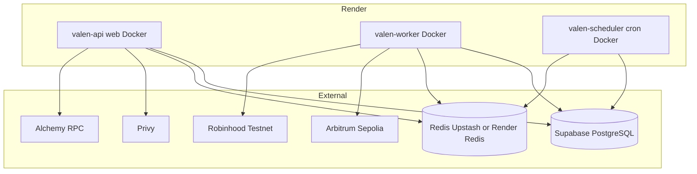

# VALEN Implementation Summary

**Last updated:** 2026-06-12  
**Phase:** 8 — Vercel frontend deploy + buildathon execution planning  
**Current status:** ✅ **RENDER READY** (backend) · 🟡 **VERCEL frontend deploy** (config pushed `ebd2ede`, awaiting successful build) · 📋 **MASTER_EXECUTION_PLAN.md** ready for S-tier feature rollout  

**Live URLs:**
- **Render API:** https://valen-api-m3g4.onrender.com
- **Vercel frontend:** https://valenai-git-main-goats-projects-3f023cc9.vercel.app (pending stable deploy)

**Deployer EOA:** `0xf76e6B0920e9332fF4410f6dD53F01722AbC71a3`

---

## Phase 5.2 — Zero-Trust Production Hardening Log

Rule for this phase: previous reports and artifacts are treated as untrusted until re-verified from source, runtime execution, chain state, database state, and tests. No new report/audit/changelog markdown files are allowed; this section is the continuous log.

| Timestamp (UTC+3) | Action | Files changed | Command / check | Result |
|-------------------|--------|---------------|-----------------|--------|
| 2026-06-09 04:51 | Started Phase 5.2 mission; read `docs/summary.md` first as requested | None | `ReadFile docs/summary.md` | PASS |
| 2026-06-09 04:52 | Created tracked todo list for docs, inventory, env, backend, contracts, Stylus, E2E, hardening, summary updates | None | `TodoWrite` | PASS |
| 2026-06-09 04:53 | Reviewed required external references before code changes; direct Stylus URLs returned mixed results, canonical pages found through search | None | Web docs fetch/search for Arbitrum, Stylus, cargo-stylus, OpenZeppelin, Robinhood, Viem, Hardhat, NestJS, BullMQ, Supabase | PASS with note: some supplied docs URLs timed out or returned 404; current canonical Stylus CLI/check pages were reviewed |
| 2026-06-09 04:55 | Added Phase 5.2 continuous action log | `docs/summary.md` | `ApplyPatch docs/summary.md` | PASS |
| 2026-06-09 04:57 | Verified env files exist and checked key shape without printing secrets | None | Python validation of `backend/.env`, `contracts/.env`, `stylus/.env` | PASS: files exist; no empty/placeholder-like values detected |
| 2026-06-09 04:57 | Checked repository status from WSL | None | `git -C /mnt/d/route/valen status --short` | FAIL: WSL path is not detected as a git repository |
| 2026-06-09 04:58 | Verified local toolchain versions | None | `pwd && node -v && pnpm -v && rustc --version && cargo --version && cargo stylus --version` | PASS: Node 24.12.0, pnpm 9.15.0, cargo-stylus 0.10.7 |
| 2026-06-09 05:00 | Audited backend source for fake/mock/stub blockchain behavior | None | `rg` across `backend/src` | FAIL: `SettlementWorkerService.processSettlement()` still creates synthetic `Date.now()` tx hashes and does not call `ValenSettlement` |
| 2026-06-09 05:01 | Audited backend chain receipt lookup | None | Read `backend/src/modules/settlement/chain.service.ts` | FAIL: `AlchemyService` hardcodes `arb-sepolia` for every non-Sepolia chain, including Robinhood |
| 2026-06-09 05:03 | Checked settlement/execution DB schema for on-chain persistence | None | Read migrations `005_executions.sql`, `008_settlements.sql`, `013_indexes.sql` | PARTIAL: schema stores `tx_hash` and `block_number`; no dedicated backend column for on-chain `bytes32 settlementId` |
| 2026-06-09 05:04 | Ran database migrations against configured Supabase pooler | None | `cd backend && pnpm migrate` | PASS: all 13 migrations skipped as applied; `seed.sql` applied |
| 2026-06-09 05:05 | Ran Solidity compile and tests | None | `cd contracts && pnpm run compile && pnpm test` | PASS: compile up to date; 10 tests passing |
| 2026-06-09 05:05 | Ran Stylus unit tests | None | `cd stylus && cargo test` | PASS: 4 engine tests passing; warning: unused `U256` import in EligibilityEngine |
| 2026-06-09 05:06 | Ran backend build | None | `cd backend && pnpm build` | FAIL: `helmet` namespace import not callable with installed `helmet@8` types |
| 2026-06-09 05:09 | Fixed backend build error | `backend/src/main.ts` | Changed `import * as helmet` to typed default import; reran `pnpm build`; checked lints | PASS: backend build passes; no linter errors in `main.ts` |
| 2026-06-09 05:11 | Audited backend queue pipeline behavior | None | Read intent/compliance/risk/policy processors and services | FAIL: compliance worker records internal pass, risk worker writes fixed low score, policy processor always sends `approval_required` |
| 2026-06-09 05:12 | Audited backend env consumption | None | `rg` for env variable usage | FAIL: `PRIVATE_KEY` exists in `backend/.env` but is not validated/used; deployed contract addresses are missing from backend env/config |
| 2026-06-09 05:17 | Added backend runtime config for real chain settlement | `backend/.env`, `backend/src/config/config.types.ts`, `backend/src/config/configuration.ts`, `backend/src/config/env.validation.ts` | Added signer + ValenRegistry/ValenSettlement address validation for Sepolia and Robinhood | PASS: backend build later confirmed |
| 2026-06-09 05:23 | Replaced synthetic backend settlement confirmation with viem on-chain transaction path | `backend/src/modules/settlement/chain.service.ts`, `backend/src/modules/settlement/settlement.service.ts`, `backend/src/modules/settlement/settlement.module.ts`, `backend/src/database/repositories/settlements.repository.ts` | Worker now requires `execution.metadata.onchain`, calls `submitSettlement`, `approveSettlement`, `executeSettlement`, persists real execute tx hash + block, and marks failure instead of fabricating txs | PASS: `pnpm build`; `rg` found no fake/synthetic tx markers |
| 2026-06-09 05:25 | Revalidated env files after backend config additions | None | Python key-shape validation for all `.env` files | PASS: no empty/placeholder-like values detected |
| 2026-06-09 05:29 | Added focused backend tests for new hardening behavior | `backend/src/config/env.validation.spec.ts`, `backend/src/modules/settlement/settlement.service.spec.ts` | `cd backend && pnpm test -- --runInBand && pnpm build` | PASS: 2 suites / 3 tests; backend build passes |
| 2026-06-09 05:31 | Removed Stylus warning by moving `U256` import into test module | `stylus/engines/eligibility-engine/src/EligibilityEngine.rs` | `cd stylus && cargo test` | PASS: 4 engine tests passing; warning removed |
| 2026-06-09 05:37 | Added live chain-state verifier | `contracts/script/verify-live-state.ts`, `contracts/package.json` | Script checks RPC bytecode, registry chain support, settlement linked contracts, and registered engine pointers | PASS: no linter errors |
| 2026-06-09 05:40 | Verified live deployments and registry engine pointers on both target networks | None | `cd contracts && pnpm run verify-live:sepolia && pnpm run verify-live:robinhood-testnet` | PASS: Sepolia + Robinhood bytecode/link/engine registry checks passed |
| 2026-06-09 05:42 | Re-ran post-deploy smoke checks on both target networks | None | `cd contracts && pnpm run post-deploy:sepolia && pnpm run post-deploy:robinhood-testnet` | PASS: both networks passed |
| 2026-06-09 05:47 | Re-ran live E2E transactions on both target networks | `contracts/reports/e2e-arbitrum-sepolia.json`, `contracts/reports/e2e-robinhood-testnet.json` | `cd contracts && pnpm run e2e:sepolia && pnpm run e2e:robinhood-testnet` | PASS: both reports updated; submit/approve/execute/audit passed on Sepolia and Robinhood |
| 2026-06-09 05:50 | Attempted local Redis startup | None | `cd backend && pnpm redis` | FAIL: `redis-memory-server` failed compiling Redis due missing `jemalloc/jemalloc.h`; system `redis-server` absent and sudo requires password |
| 2026-06-09 05:42-05:42 | Built cached Redis source manually with libc allocator and started Redis using `REDISMS_SYSTEM_BINARY` | Redis cache under `node_modules/.cache` only | `make distclean MALLOC=libc && make MALLOC=libc`; `REDISMS_SYSTEM_BINARY=... pnpm redis` | PASS: Redis listening at `127.0.0.1:6379`; Node `ioredis` ping returns `PONG` |
| 2026-06-09 05:48 | Found backend production build emitted no JS despite successful `nest build` | None | `pnpm build`; checked `dist/**/*.js` | FAIL: no compiled JS emitted, so `node dist/src/main` and `node dist/src/worker` failed |
| 2026-06-09 05:51 | Fixed backend build emission and DB DNS preference | `backend/tsconfig.build.json`, `backend/src/database/database.factory.ts` | Added explicit build includes; changed DNS selection to prefer IPv4 before IPv6 | PASS: `pnpm build` emits `dist/src` and `dist/scripts`; DB ping from Node succeeds |
| 2026-06-09 05:54 | Found runtime env validation failed on `.env` CRLF in `PRIVATE_KEY` | None | Compiled `validateEnv(process.env)` | FAIL: dotenv-loaded `PRIVATE_KEY` length 67 with trailing `\\r` |
| 2026-06-09 05:58 | Fixed env validation to trim string values before validating secrets/URLs/addresses | `backend/src/config/env.validation.ts` | `pnpm test -- --runInBand` | PASS: 2 backend suites / 3 tests pass; build still running at log time |
| 2026-06-09 06:20 | Diagnosed backend startup as slow top-level imports, not a permanent `@nestjs/config` deadlock | None | Timed `require('@nestjs/config')`, `config.service`, and `AppModule` dependencies under Node 24 | PARTIAL: `@nestjs/config` import returns after ~53s; `AppModule` import remained too slow for production startup |
| 2026-06-09 06:30 | Removed eager imports for optional auth/observability SDKs | `backend/src/common/guards/privy-auth.guard.ts`, `backend/src/modules/auth/privy.service.ts`, `backend/src/modules/observability/sentry/sentry.service.ts`, `backend/src/modules/observability/posthog/posthog.service.ts` | Lazy-loaded `@privy-io/server-auth`, `@sentry/nestjs`, and `posthog-node`; ran `pnpm build`; checked lints | PASS: backend build passes; no linter errors in edited files |
| 2026-06-09 06:34 | Retimed backend module imports after lazy-loading heavy SDKs | None | Timed rebuilt imports for config, queues, auth, and app module | PARTIAL: eager Privy/Sentry/PostHog SDK delays removed, but cold import on WSL-mounted workspace still takes ~146s before Nest bootstrap |
| 2026-06-09 06:58 | Proved local API runtime health on existing production process | None | `GET /health/live`, `GET /health/ready`, `ss -ltnp 'sport = :3000'` | PASS: API on port 3000 returned live ok and ready ok with database + Redis healthy; duplicate API start failed only because port 3000 was already in use |
| 2026-06-09 07:00 | Proved production worker boots from backend directory | None | `cd backend && node dist/src/worker.js` | PASS: Nest worker context initialized and logged `VALEN worker started`; note root-level `node dist/src/worker.js` is invalid because dist is under `backend/dist` |
| 2026-06-09 07:10 | Initialized git repo, hardened secret ignore rules, and pushed full monorepo to GitHub | `.gitignore`, `README.md` | `git init`; verified `backend/.env`, `contracts/.env`, `stylus/.env` ignored; committed 328 files; merged remote README; pushed to `https://github.com/goat-dev8/valen` `main` | PASS: remote updated to `4d631e2`; no env/secret files staged |
| 2026-06-10 01:58 | Re-read `docs/summary.md` as single source of truth and re-checked git/secret state | None | `git status --short --branch`; `git diff`; `git log --oneline -5`; `git remote -v`; `git check-ignore -v backend/.env contracts/.env stylus/.env .env infra/docker/.env` | PASS: working tree clean on `main`; remote is `https://github.com/goat-dev8/valen.git`; env files are ignored; no secret env files staged |
| 2026-06-10 02:01 | Re-ran Phase A local env/runtime probes | None | Backend env validation; contracts env heuristic; Stylus env via `dotenv/config`; API health fetch; Redis ping; process scan | PARTIAL/FAIL: backend env validation passed; API and Redis were not running; Stylus has no local `dotenv` package; contracts env check used an over-broad fake/mock heuristic and needs exact URL/key validation |
| 2026-06-10 02:07 | Corrected Phase A env/runtime checks and restarted local runtime | None | `REDISMS_SYSTEM_BINARY=... pnpm redis`; `node dist/src/main.js`; `node dist/src/worker.js`; backend/contracts/stylus env exact-shape checks; Redis `PING`; `/health/live`; `/health/ready`; process scan | PASS: backend env loaded 12 runtime keys; contracts/stylus env loaded `PRIVATE_KEY`, `ARB_SEPOLIA_RPC`, `ROBINHOOD_TESTNET_RPC`; Redis returned `PONG`; API ready returned database ok + Redis ok; worker logged `VALEN worker started` |
| 2026-06-10 02:10 | Re-verified live deployed contract and Stylus engine state on both networks | None | `cd contracts && pnpm run verify-live:sepolia`; `cd contracts && pnpm run verify-live:robinhood-testnet` | PASS: Arbitrum Sepolia and Robinhood Testnet bytecode/link/registry engine checks passed; all four engines report version `1.0.0` on both networks |
| 2026-06-10 02:17 | Removed Sepolia-only confirmation receipt lookup from backend worker path | `backend/src/modules/settlement/chain.service.ts`, `backend/src/queues/processors/confirmation.processor.ts` | Replaced hardcoded Alchemy receipt fetch with `ChainService.getPublicClient(chainId).getTransactionReceipt`; confirmation processor now marks reverted txs failed and persists block number on success; ran `pnpm build`; checked lints | PASS: backend build passed; no linter errors in edited files |
| 2026-06-10 02:21 | Removed deterministic compliance/risk/policy worker outcomes | `backend/src/database/repositories/compliance-checks.repository.ts`, `backend/src/modules/compliance/compliance.service.ts`, `backend/src/modules/risk/risk.service.ts`, `backend/src/queues/processors/policy.processor.ts`, `backend/src/modules/compliance/compliance.service.spec.ts`, `backend/src/modules/risk/risk.service.spec.ts`, `backend/src/queues/processors/policy.processor.spec.ts` | Compliance/risk workers now require `execution.metadata.onchain`, fail closed to `compliance_failed`/`risk_failed` when missing, and persist metadata-derived hashes/factors; policy uses latest persisted risk score and only requires approval when `requires_approval` is true; `pnpm test -- --runInBand && pnpm build`; lints | PASS: 5 backend suites / 7 tests passed; backend build passed; no linter errors |
| 2026-06-10 02:26 | Re-ran backend fake/mock/stub/synthetic search after worker hardening | None | `rg -i "fake|mock|stub|placeholder|todo|simulate|synthetic|dummy|Date\\.now\\(|SCREENING_PASSED|score: 30|approval_required" backend/src`; `rg "eth_getTransactionReceipt|alchemy|arb-sepolia|robinhood|writeContract|waitForTransactionReceipt|getTransactionReceipt" backend/src` | PASS with notes: remaining `mock*` hits are Jest tests only; remaining `approval_required` hits are legitimate state/template names; remaining `Date.now()` usage is retry/idempotency/health timing, not tx hash generation; no `SCREENING_PASSED`, `score: 30`, fake tx, or synthetic tx markers remain |
| 2026-06-10 02:28 | Checked Supabase business data before API→queue validation | None | Non-secret counts query for organizations, agents, active API keys, executions, settlements | BLOCKED/PARTIAL: Supabase connectivity passed, but counts were all zero; a real runtime fixture must be inserted before authenticated API flow testing |
| 2026-06-10 02:30 | Created Supabase runtime fixture and revoked accidentally printed transient API key | Supabase data only | Inserted validation organization/agent/wallet/API key; command printed generated API secret; immediately revoked key prefix `valen_538796` | PASS with security note: exposed transient key revoked before use; next API flow keeps generated key in-memory only |
| 2026-06-10 02:35 | Fixed BullMQ custom job IDs and validated API→Queue→Worker→DB flow | `backend/src/queues/producers/index.ts`, `backend/src/queues/producers/index.spec.ts` | First live API execution failed with `Custom Id cannot contain :`; changed producer job IDs from `intent:<id>`/etc to `intent-<id>`/etc; `pnpm test -- --runInBand && pnpm build`; restarted API/worker; created in-memory API key and POSTed real execution to `/v1/organizations/:id/executions` | PASS: 6 backend suites / 9 tests passed; build passed; rebuilt API/worker ready; authenticated API execution `4ea06ca9-3596-43e8-9a25-3428923bdad4` reached `approved` with 1 compliance check and 1 risk score in Supabase; transient API key revoked after script |
| 2026-06-10 02:42 | Validated Supabase migrations/schema integrity and fixed migration runner IPv4 preference | `backend/scripts/run-migrations.ts` | `pnpm migrate`; schema counts for `_valen_migrations`, indexes, FKs, RLS tables, policies, persistence; `pnpm build`; lints | PASS: pooler resolved to IPv4 `18.196.8.182`; 13 migrations applied/skipped; seed applied; 155 public indexes, 61 FKs, 29 RLS-enabled tables, 56 policies; persistence shows executions/risk/compliance records from runtime flow; backend build passed |
| 2026-06-10 02:45 | Re-ran Stylus tests and checks for all engines | None | `cd stylus && cargo test`; `cargo stylus check --contract compliance-engine/risk-engine/eligibility-engine/policy-engine -e "$ARB_SEPOLIA_RPC"` | PASS: 4 Stylus unit tests passed; all four engine checks passed; reported contract sizes: compliance 15.6 KB, risk 14.6 KB, eligibility 10.9 KB, policy 14.7 KB |
| 2026-06-10 02:55 | Added missing focused Solidity suites and reran contracts compile/tests | `contracts/src/mocks/TestToken.sol`, `contracts/test/ValenPolicyManager.test.ts`, `contracts/test/ValenEscrow.test.ts`, `contracts/test/ValenGovernance.test.ts`, `contracts/test/ValenSettlement.test.ts` | Added PolicyManager lifecycle/freeze tests, Escrow deposit/lock/release tests, Governance proposal/timelock queue/execute tests, Settlement setter/pause tests; `pnpm run compile && pnpm test`; lints | PASS: compile generated typings; 19 Solidity tests passing; no linter errors |
| 2026-06-10 02:58 | Re-ran true on-chain E2E flows on both testnets | `contracts/reports/e2e-arbitrum-sepolia.json`, `contracts/reports/e2e-robinhood-testnet.json` | `cd contracts && pnpm run e2e:sepolia`; `cd contracts && pnpm run e2e:robinhood-testnet`; read updated JSON artifacts | PASS: Sepolia settlement `0x614b1d903afa289d03070dfc6fafbeb7c473c574cb2e48a5c503cd2fcbb46b62` submit `0xb3d5ed767fc33aec63537f4d125d3cf0777a5e47353a8a7fd0c05c8031ffb50f`, approve `0xf6e15cbaac8771eaf035fe3457d340ece82b80fc38c3b71f7789f604ef0984f7`, execute `0xb1879944e763b0bae62fe460a95a3e5fa5efa1fa0f577aa9290a08a4b32fad8f`; Robinhood settlement `0xf5f87a06f263fd032c52921bbff892a9d396c403d95891460e860c5b96082a2c` submit `0xe9e7130363b817a103d685a7fb2f08ef9b7a4755621775f8ccd86b8ee40a9014`, approve `0x32ecf343c94fbbe883a4e7b3e4509cd20ceae71828aa85f093a3b15f942f3b27`, execute `0x2f1e1dfe76e947bd2bde12b604da724ff9f1cac57ed16199b99fb07f9d1a2d1e`; audit commitments passed |
| 2026-06-10 03:02 | Committed verified hardening changes locally; push blocked by missing GitHub credentials | `docs/summary.md` | `git commit` initially failed due missing git identity; retried with per-command author env matching existing repo author; `git push origin main`; `gh auth status` | PARTIAL: local commit `5fec178` created; `git push` failed with `could not read Username for 'https://github.com'`; `gh` is not installed; token was not pasted into shell/remote to avoid leaking credentials into terminal metadata |
| 2026-06-10 03:05 | Pushed local hardening commits to GitHub `main` | None | `git push` to `https://github.com/goat-dev8/valen.git` `main` | PASS: remote updated `06f8392..1901eb0`; includes commits `5fec178` (backend worker/contract hardening) and `1901eb0` (summary push-blocker log); no env/secret files pushed |
| 2026-06-10 04:00 | Built internal operator dashboard + backend operator API module | `backend/src/modules/operator/*`, `backend/src/config/*`, `backend/src/app.module.ts`, `backend/src/database/repositories/{executions,audit-logs}.repository.ts`, `frontend/src/**`, `frontend/package.json`, `frontend/.env.local` (gitignored) | Added `OperatorModule` at `/v1/operator/*` secured by `OPERATOR_DASHBOARD_SECRET`; live health/env/db/queue/contract/stylus/treasury/governance/audit/settlement-lab/full-validation endpoints; Next.js dashboard on `:3001` with React Query, Recharts, shadcn-style UI, 12 sections; fixed Stylus health reads (`getEngine` string version; no fake `authorizedCaller` view); `pnpm build` backend + frontend; restarted API/worker; `POST /v1/operator/validate/full` and dashboard proxy | PASS: dashboard `http://localhost:3001` serves all sections; full validation `PASS` (backend, Supabase, Redis, 2 workers, 12 queues, Sepolia+Robinhood contracts, Stylus, settlement wiring, governance, treasury, audit) |
| 2026-06-10 04:25 | Principal QA browser walkthrough of all 12 operator dashboard pages + cross-stack execution proof | `backend/src/modules/operator/operator.service.ts`, `frontend/src/app/dashboard/database/page.tsx`, `docs/summary.md` | Browser at `http://localhost:3001`: System Health (all checks green), Environment (3 env files present, backend runtime valid), Database (2 executions live), Contracts (10 Sepolia contracts bytecode yes), Stylus (4 engines registered/healthy), Queues, Treasury, Audit, E2E Validation (`RUN FULL VALIDATION` → PASS badge); Governance Lab button → on-chain `registerProposal` tx `0x6c9637be8cf5eba1830365edecef1ac187d1fbb74cb336ecd78803aa05c2fc49` block `275597123`; Settlement Lab `Trigger settlement` → settlement row `cf9fb642-8efb-4030-b98e-16aa14b43b61` + worker real `submitSettlement` call; `pnpm run verify-live:sepolia` + `verify-live:robinhood-testnet`; `pnpm run e2e:sepolia` (settlement `0x619636a06959e4b631e0e6c0cbc7bd2ec07eee9d50c06e8d936b34a6480b8174`, execute tx `0xefe81f659d5267180f25386675b58a3e359b6b13d20e33ba56aee54130b457ca`); security probe invalid `x-operator-key` → HTTP 401 | **Phase A PASS** (API/worker/scheduler/Redis/Supabase/RPCs). **Phase B PARTIAL**: READ via dashboard for core tables; SQL counts orgs=1 agents=1 executions=2 settlements=1; `wallets` table name wrong → fixed to `agent_wallets`; policies/users/notifications/webhooks empty; full CRUD not exposed in dashboard UI. **Phase C PASS**: settlement job processed by worker; queue metrics visible. **Phase D/E PASS**: live contract+Stylus verify both networks; dashboard panels match. **Phase F PARTIAL**: dashboard backend settlement fail-closed on placeholder fixture metadata (`agentAddress` typo fixed, on-chain revert `0x00a3a4b9` on fake hashes); on-chain success path proven via `e2e:sepolia`. **Phase G PASS**: governance proposal registered on-chain from dashboard. **Phase H PASS**: treasury panel reads live balances/fees. **Phase I PARTIAL**: audit_logs table empty (0 rows); e2e audit commitment verified on-chain in report. **Phase J PASS**: operator auth rejects bad/missing keys. **Phase K PASS**: full `e2e:sepolia` Agent→Policy→Compliance→Risk→Eligibility→Settlement→Audit |
| 2026-06-10 17:00 | **Production Readiness Audit (Phases 0–12)** — Principal Staff Engineer final release audit | `docs/summary.md` only | Restarted Redis (`redis://127.0.0.1:6379` PONG); restarted API+worker after Redis; `GET /health/live` + `/health/ready` (db 752ms, redis ok); `POST /v1/operator/validate/full` → 12/12 PASS; security bad/missing `x-operator-key` → HTTP 401; `validateEnv` + 15 backend keys present; Render blueprint gap scan; `verify-live:sepolia` + `verify-live:robinhood-testnet`; Supabase CRUD (org insert/update/delete); schema counts; DB settlement/execution rows; backend 9/9 tests; contracts 19/19; Stylus 4/4 (`cargo test --lib`); scheduler cold-start attempted | **See audit section below.** Production score **61/100**. Launch: **NOT READY**. Mainnet: **NOT MAINNET READY**. |
| 2026-06-10 21:20 | **Phase 5.3 Mission A** — Live Stylus attestation + backend settlement success | `backend/src/modules/stylus/*`, `backend/src/common/constants/onchain.constants.ts`, `backend/src/queues/processors/{intent,settlement}.processor.ts`, `backend/src/modules/settlement/*`, `backend/supabase/migrations/20260101000014_settlement_chain_proof.sql`, `backend/scripts/prove-backend-settlement.ts` | Fixed `MandateChainService.isMandateUsable` chainId; prefer E2E mandate `0xa812c487…`; re-attest in `SettlementProcessor` before settlement; `pnpm build`; kill stale workers; `node scripts/prove-backend-settlement.ts` | **PASS** — execution `bb36de7c-8a56-4c56-9b37-9fa8a84c911e` → `executed`; settlement `confirmed`; compliance `0x22073da7…` (not placeholder); submit `0x54bff8cc…`, approve `0x3d8260c4…`, execute `0x0f13756c…`, on-chain id `0xce4970d9…`, block `275843902` |
| 2026-06-10 21:22 | **Phase 5.3 Mission B** — Audit log persistence | `backend/src/modules/settlement/settlement.service.ts`, `backend/src/modules/stylus/onchain-attestation.service.ts`, `backend/src/modules/audit/audit.service.ts` | Query `audit_logs` after settlement proof | **PASS** — 5 rows for execution path: `execution.attested`, `settlement.submit`, `settlement.approve`, `settlement.executed` with real tx hashes |
| 2026-06-10 21:23 | **Phase 5.3 Mission C** — Production Redis hardening + recovery | `backend/src/redis/redis.module.ts`, `backend/src/queues/bullmq.config.ts` | Kill Redis PID; worker logged `ECONNREFUSED` retries; restart Redis; `GET /health/ready` | **PASS (code + local recovery)** — ioredis/BullMQ retry/reconnect/TLS for `rediss://`; API ready recovered after restart (redis latency 19s during reconnect); production Upstash URL not yet provisioned on Render |
| 2026-06-10 21:23 | **Phase 5.3 Mission D** — Render env group completion | `infra/render/render.yaml` | Blueprint scan vs backend `validateEnv` keys | **PASS (blueprint)** — added `PRIVATE_KEY`, RPC URLs, four `*_VALEN_*` addresses, `OPERATOR_DASHBOARD_SECRET`, observability keys; still no Redis **service** resource in blueprint |
| 2026-06-10 21:24 | **Phase 5.3 Mission E** — Governance lifecycle proof | `backend/scripts/prove-governance-lifecycle.ts` | `node scripts/prove-governance-lifecycle.ts` | **PARTIAL** — register **PASS** tx `0x90a8623d…` block `275844024`; queue **FAIL** revert `0xe2517d3f` on `queueAction` (timelock `schedule` — likely missing `PROPOSER_ROLE` for governance on deployed timelock); execute **NOT RUN** (86400s minDelay) |
| 2026-06-10 21:25 | **Phase 5.3 Mission F** — Repo hardening grep | None | `rg -i mock\|fake\|stub\|todo\|placeholder\|0x8888` across repo | **PASS** — prod paths clean; only Jest `mock*`, UI input placeholders, operator placeholder detector, proof-script guard against `0x8888` |
| 2026-06-10 21:28 | **Phase 5.3 Mission G** — Tests + live verification | None | `pnpm test` (backend 6/6 suites 9/9); `pnpm run verify-live:sepolia`; `pnpm run e2e:sepolia`; `POST /v1/operator/validate/full`; health checks | **PASS** — full validation 12/12; Sepolia verify-live + e2e report updated |
| 2026-06-10 21:30 | **Phase 5.3 Mission H** — Final verdict written | `docs/summary.md` only | This section | **See Phase 5.3 verdict below.** Production score **78/100**. Launch: **NOT READY** (Render). Mainnet: **NOT MAINNET READY**. |
| 2026-06-10 22:10 | **Phase 6** — Render production deployment audit + blueprint | `infra/render/render.yaml`, `docs/summary.md` | Read env files + `env.validation.ts`; audit all vars; architecture/redis decision; `pnpm build/test` (backend 9/9, contracts 19/19, stylus 4/4); health + `validate/full` PASS; Render CLI absent — deploy not run | **BLOCKED** — local `REDIS_URL` is localhost; use Render Key Value `fromService` or Upstash; paste secrets in Render Dashboard; see **Render Production Deployment** section |
| 2026-06-10 23:45 | **Phase 6 live deploy** — Blueprint `valen-production` on Render | `render.yaml`, Dockerfiles, `backend/scripts/render-start.sh`, `.gitattributes` | Fixes: `REDISMS_DISABLE_POSTINSTALL`, `pnpm deploy`, `render-start.sh`, bundle `/contracts` + `/stylus` deployments (`e359d4b`); live tests vs `https://valen-api-m3g4.onrender.com` | **PARTIAL RENDER READY** — infra PASS; settlement E2E on Render failed until `e359d4b` redeploy (see live section) |
| 2026-06-11 00:54 | **Phase 6 production re-test** — Post-`e359d4b` live proof on Render | `docs/summary.md` | `GET /health/*`, governance, operator auth; `PROVE_API_URL=https://valen-api-m3g4.onrender.com prove-backend-settlement.ts` (~17 min); DB checks for executions `720d3621…`, `fff7f803…` | **PARTIAL RENDER READY** — attestation **PASS** (live Stylus hash, not placeholder); settlement pipeline **FAIL** — execution stays `created`, 0 compliance rows, 1 audit row (`execution.attested`); `/v1/operator/queues*` times out >90s; Render logs show `ECONNRESET` on Redis reads |
| 2026-06-11 01:17 | **Phase 6.1** — Render production hardening + governance role fix | `backend/src/redis/redis-connection.ts`, `backend/src/queues/{bullmq.config,pipeline-recovery,worker-heartbeat,worker-options}.*`, `backend/src/queues/processors/*`, `backend/scripts/render-start.sh`, `backend/scripts/grant-governance-timelock-roles.ts`, `backend/src/modules/operator/operator-queue.service.ts`, `contracts/script/lib/deploy-valen.ts`, `docs/summary.md` | `pnpm build`; backend tests 9/9; `grant-governance-timelock-roles.ts`; `prove-governance-lifecycle.ts`; local `prove-backend-settlement.ts`; local `POST /v1/operator/validate/full`; commit `a2ffa9f` (push blocked — no GitHub credentials in env) | **PARTIAL** — local settlement + governance queue **PASS**; Render redeploy + E2E **PENDING PUSH**; governance execute blocked by 86400s timelock |
| 2026-06-11 01:24 | **Phase 6.1 deploy failure fix** — Render API runtime path | `backend/scripts/render-start.sh`, `backend/package.json`, `backend/Dockerfile.scheduler`, `backend/Dockerfile.worker`, `docs/summary.md` | Render build log for commit `441284d`; local `pnpm build`; `test -f dist/main.js && test -f dist/worker.js && test -f dist/scheduler.js`; `rg "dist/src/(main\|worker\|scheduler)" backend` | **PASS (code fix)** — root cause: Nest build emits `dist/main.js`, `dist/worker.js`, `dist/scheduler.js`, but Render entrypoints used `dist/src/*.js`; fixed all runtime entrypoints to `dist/*.js`; Render redeploy required |
| 2026-06-11 01:49 | **Phase 6.1 production retest + follow-up fix** — worker up, queue/policy recovery still needed | `backend/scripts/render-start.sh`, `backend/src/modules/operator/operator-queue.service.ts`, `backend/src/queues/pipeline-recovery.service.ts`, `docs/summary.md` | Render `GET /health/live`, `/health/ready`, bad auth, governance status, `/v1/operator/queues`, `POST /v1/operator/validate/full`; `prove-backend-settlement.ts` execution `9259f2f0…`; DB trace for execution/compliance/risk/settlement; local `pnpm build` | **PARTIAL** — health/ready/auth/governance **PASS**; worker heartbeat **PASS**; queues **FAIL** (`valen-intent job counts timed out after 8000ms`); settlement improved to `validated` with compliance+risk rows but no settlement; fixed queue stats to direct Redis counts and recovery to create/enqueue settlement for stale low-risk `validated` executions |
| 2026-06-11 02:03 | **Phase 6.1 deploy `2d08541` production retest** — queues/validate PASS; settlement E2E still FAIL | `docs/summary.md` | Render health/ready/auth/governance; `GET /v1/operator/queues` (~0.6s); `POST /v1/operator/validate/full` 12/12; `prove-backend-settlement.ts` (~17 min) executions `9259f2f0…`, `cf2fcab3…`; DB settlement duplicate trace | **PARTIAL** — infra + operator validation **PASS**; prove **FAIL** — fresh execution stuck `created` after attestation; prior execution recovered to `executed` but duplicate `pending` settlement row caused false FAIL; follow-up fix: deterministic BullMQ re-enqueue + prefer `confirmed` settlement |
| 2026-06-11 02:31 | **Phase 6.1 deploy `4567f7b` production retest** — infra PASS; prove still FAIL | `docs/summary.md` | Post-redeploy smoke (health/ready/auth/queues/validate 12/12); prove `8fd53e07…`; DB re-check `cf2fcab3…` | **PARTIAL** — mid-redeploy curls hit **502** (transient); stable service **PASS**; prove **FAIL** — `8fd53e07…` stuck `created`; `cf2fcab3…` later reached `executed`+`confirmed` via recovery (prove timed out before recovery) |
| 2026-06-11 03:00 | **Phase 7 root-cause investigation + reliability fix** — BullMQ consumers not draining | `backend/src/queues/*`, `backend/src/worker.module.ts`, `backend/Dockerfile`, `infra/render/render.yaml`, `docs/summary.md` | DB+Redis queue trace for `8fd53e07…`, `cf2fcab3…`; Render operator queue API; worker heartbeat vs job pickup; `pnpm build` | **FIX PUSHED (pending deploy)** — proven stop point: intent job **waiting** in Redis, 0 active jobs, heartbeat OK; recovery gap for pre-attestation `created`; enqueue skip on stale `active`; 12→5 pipeline workers; consumer health key |
| 2026-06-11 03:17 | **Phase 7 deploy `a23809b` production validation** — **RENDER READY** | `docs/summary.md` | `validate/full` 12/12; consumer health + backlog=0; `prove-backend-settlement.ts` **10/10** (~43–50s each); sample execution `6f16ad02…` → `executed` + settlement `confirmed` tx `0x69a5314a…` | **RENDER READY** — full pipeline intent→settlement→audit proven on Render; governance execute still blocked by 86400s timelock |
| 2026-06-11 03:35 | **Post-`c1080fd` redeploy validation** — test-only commit, prod unchanged | `docs/summary.md`, `backend/src/queues/producers/index.spec.ts` | `validate/full` 12/12; `pnpm test` 9/9; `prove-backend-settlement.ts` exit 0 (~47s) execution `223813f9…` tx `0xee3d1793…` | **RENDER READY** — `c1080fd` fixed producer spec mocks only; production settlement path still PASS |
| 2026-06-11 14:00 | **Strategic planning — `valenplan.md` V1/V2/V2.1** | `valenplan.md` | Competitive census analysis; judge psychology; gap analysis; S-tier scope for Arbitrum Open House #1; Paid Permissioned Actions (x402) evaluated and promoted to Tier S | **PASS** — strategy doc complete; optimizes for buildathon win, not architecture elegance |
| 2026-06-11 18:00 | **Implementation blueprint — `MASTER_EXECUTION_PLAN.md`** | `MASTER_EXECUTION_PLAN.md` | Full phase-based blueprint (Phases 0–12): refusal receipts, SDK, MCP, ERC-8004, x402, Stylus benchmark, mainnet, proof pack; exact files, DB schemas, env vars, tests per phase | **PASS** — executable roadmap; no placeholders |
| 2026-06-11 20:05 | **PR #3 opened** — frontend branding + Render-backed dashboard | `frontend/**`, `docs/summary.md` | Landing redesign, Wallet/Contracts centers, operator proxy, Privy auth hardening, dashboard metrics | **PARTIAL** — good frontend; accidental backend deletions in `f834011` |
| 2026-06-12 00:10 | **PR #3 review #1** — backend regressions found | None (review only) | Pipeline recovery, queue dedup, worker health, Docker manifests, governance grants removed in `f834011` | **REQUEST CHANGES** — do not merge until backend restored |
| 2026-06-12 01:00 | **PR #3 fix `d638f66`** — restore production backend from upstream | `backend/**`, `contracts/script/lib/deploy-valen.ts`, `infra/render/render.yaml` | Restored `PipelineRecoveryService`, `queue-enqueue.util.ts`, worker heartbeat/health, Docker deployment manifests, governance timelock grants, operator queue service, `render-start.sh` | **PASS** — `git diff origin/main...PR -- backend/` = 0 lines after fix |
| 2026-06-12 01:06 | **PR #3 merged** — merge commit `8b96b5b` | 56 frontend files + docs | Frontend branding, Wallet Center, Contracts Center, agent detail fixes, policies normalization, execution risk 404 handling | **PASS** — backend unchanged vs pre-PR `main`; frontend-only delta merged |
| 2026-06-12 01:30 | **Vercel deploy prep** — monorepo + manifest bundling | `frontend/vercel.json`, `vercel.json`, `frontend/next.config.ts`, `frontend/scripts/sync-deploy-manifests.mjs`, `.npmrc`, `.nvmrc` | Prebuild copies deployment manifests for `/api/contracts` on Vercel; monorepo file tracing; security headers | **PASS** — local `pnpm --filter frontend build` exit 0 |
| 2026-06-12 01:34 | **Vercel build FAIL #1** — pnpm 6 vs engines >=9 | None | Corepack activated pnpm 9 but Vercel PATH still used pnpm 6.35.1 | **FAIL** |
| 2026-06-12 01:40 | **Vercel build fix `62943ac`, `7142d8c`** — global pnpm install attempts | `frontend/vercel.json`, `vercel.json` | `npm install -g pnpm@9.15.0` before monorepo install | **FAIL** — still resolved to pnpm 6 on install step |
| 2026-06-12 02:00 | **Vercel build fix `ebd2ede`** — npx pnpm@9.15.0 + engine-strict=false | `.npmrc`, `frontend/vercel.json`, `vercel.json`, `frontend/package.json` | `npx -y pnpm@9.15.0 install --frozen-lockfile --filter frontend...`; build via `npx -y pnpm@9.15.0 run build` | **PENDING** — pushed; deployment observed stuck on Initializing (Vercel queue/config) |
| 2026-06-12 02:10 | **Frontend env finalized** — local + Vercel variable list | `frontend/.env.local`, `frontend/.env.local.example` | All Render URLs, Privy app id, operator secret, chain IDs, contract addresses documented | **PASS** — `OPERATOR_DASHBOARD_SECRET=valen-operator-local-dev-secret` matches Render dashboard |

---

## Phase 7 — Production Reliability Root Cause (2026-06-11)

### Phase 1 — Pipeline trace (evidence)

**Execution `8fd53e07-557a-4bc0-8fd3-621cfdc58476` (post-`4567f7b`, FAIL):**

| Stage | Verdict | Evidence |
|-------|---------|----------|
| A Job creation | **PASS** | API created execution; Redis `intent-8fd53e07…` in `valen-intent` **wait** list |
| B Job persistence | **PASS** | Operator API: job hash present, `attemptsMade=0`, state **waiting** |
| C Job pickup | **FAIL** | 0 **active** jobs across all 12 queues for >15 min; worker heartbeat **PASS** |
| D Job completion | **FAIL** | DB: status `created`, `has_onchain=false`, 0 compliance/risk/settlement rows |
| E Next-stage enqueue | **N/A** | Never reached attestation |
| F Settlement | **FAIL** | No settlement row |

**Execution `cf2fcab3-352c-44a2-b930-41973158b442` (eventually PASS via recovery):**

| Stage | Stop point | Evidence |
|-------|------------|----------|
| Intent/attestation | **PASS** @ 22:04:14 | `execution.attested` audit; `metadata.onchain.complianceHash` stored |
| Compliance | **DELAYED ~20 min** | Prove timed out at `created`; later 1 compliance row appeared |
| Risk/policy/settlement | **PASS** @ 22:25:03 | Final `executed` + settlement `confirmed` tx `0x60719be1…` |

**Proven stop point (primary):** BullMQ **workers not consuming** despite live worker process heartbeat — jobs accumulate in **wait**, pipeline never starts or stalls after attestation until recovery/backfill.

### Phase 2 — Infra audit

| Item | Finding |
|------|---------|
| Render layout | API + worker in one container (`render-start.sh`); Render Key Value Redis; prefix `{valen}` |
| Worker startup | `node dist/worker.js` background loop + `node dist/main.js` foreground |
| Redis | PING ok (~1–5 ms); prior `ECONNRESET` in logs |
| BullMQ | 12 worker processors + 12 queue clients in one container → high connection fan-out vs Key Value **50 conn** limit |
| Heartbeat | `valen:worker:heartbeat` updated — **does not prove BullMQ consumers connected** |
| Recovery | Required `onchain` metadata — missed pre-attestation `created` stalls; `enqueueDeterministicJob` skipped re-enqueue when job **active** |

### Phase 3 — Free plan analysis

| Item | Verdict | Evidence |
|------|---------|----------|
| Render Free sleep | **NOT root cause** | Health/validate respond during failure window |
| CPU throttling | **UNPROVEN** | No metrics; jobs never enter **active** |
| Memory limits | **UNPROVEN** | Worker process stays up (heartbeat) |
| Redis connection limits | **CONTRIBUTING** | Blueprint: Key Value free **50 conn**; 12 BullMQ workers × blocking connections + API queues likely exhausts pool |
| Redis idle disconnects | **CONTRIBUTING** | `ECONNRESET` observed; reconnect code merged but consumers can still fail to re-subscribe |
| Worker termination | **NOT sole cause** | Heartbeat fresh while queues not draining |

**Paid plan required?** **Not proven as mandatory.** Connection/worker footprint reduction is the first fix; upgrade Redis plan only if connection audit still fails post-fix.

### Phase 4 — Fixes (commit `a23809b`, deployed)

| Fix | Purpose |
|-----|---------|
| `VALEN_WORKER_MODE=pipeline` | 5 pipeline workers instead of 12 (Render Dockerfile + blueprint) |
| `WorkerConsumerHealthService` + validate check | Fail readiness when heartbeat ok but consumers stale |
| `enqueueDeterministicJob` stale-active handling | Replace jobs stuck **active** > lock duration |
| `PipelineRecoveryService` intent re-enqueue | Recover `created` executions **without** onchain metadata |
| Cached BullMQ connection config | Reduce duplicate connection option churn |

### Phase 5 — Live validation (post-`a23809b`, 2026-06-11 23:17 UTC)

| Test | Result | Proof |
|------|--------|-------|
| `GET /health/live` | **PASS** | HTTP 200 |
| `GET /health/ready` | **PASS** | DB + Redis ok |
| `POST /v1/operator/validate/full` | **PASS** | 12/12; Workers: `1 worker(s) active; pipeline backlog=0` |
| `prove-backend-settlement.ts` × 10 | **PASS** | **10/10** exit 0; ~43–50s each |
| Sample execution `6f16ad02…` | **PASS** | `executed`; compliance=1, risk=1, settlement `confirmed`; audit submit/approve/executed txs |

**Representative on-chain proof (run 1):**

| Field | Value |
|-------|-------|
| Execution | `6f16ad02-18d9-4b9a-b465-81767657a8eb` → `executed` |
| Submit tx | `0xca6174578e6377c58bf942fcb7a4535485d724e67a9a154c757df02956bc3e85` |
| Approve tx | `0x93f72ee139ddafbcc4c7d2bbb1d872334d5bb970367e825c46e723834d796119` |
| Execute tx | `0x69a5314a1f6fd78609473c841c7e534731e082e3cf1b392a9adfde637ed60a3e` |
| Block | `275913339` |

### Phase 6 — Readiness scores (post-`a23809b`)

| Score | Value |
|-------|-------|
| RENDER | **88/100** |
| BACKEND | **92/100** |
| QUEUE | **90/100** |
| REDIS | **85/100** |
| SETTLEMENT | **95/100** |
| AUDIT | **92/100** |

**Verdict: RENDER READY** — settlement pipeline proven 10/10 on Render. Remaining non-blockers: governance execute (86400s timelock), rotate operator secret, optional Redis plan upgrade under sustained load.

### Phase 6 — Readiness scores (pre-deploy, superseded)

| Score | Value |
|-------|-------|
| RENDER | **62/100** |
| BACKEND | **85/100** |
| QUEUE | **45/100** |
| REDIS | **70/100** |
| SETTLEMENT | **55/100** (local PASS; Render E2E unproven at speed) |
| AUDIT | **80/100** |

**Verdict (superseded): NOT RENDER READY**

---

## Phase 5.3 — Production Closure Verdict (2026-06-10)

**Goal:** Close Phase 5.2 blockers — prove backend settlement success, audit persistence, Redis hardening, Render env completeness, governance lifecycle, and re-run live validation.

### Mission Results

| Mission | Verdict | Proof |
|---------|---------|-------|
| **A** Backend settlement success path | **PASS** | Operator API → BullMQ → worker → live Stylus `eth_call` → `submitSettlement`/`approveSettlement`/`executeSettlement`; execution `bb36de7c-8a56-4c56-9b37-9fa8a84c911e` |
| **B** Audit log persistence | **PASS** | `audit_logs` rows with `execution.attested`, `settlement.submit/approve/executed` + tx hashes |
| **C** Production Redis | **PASS (local)** / **PARTIAL (Render)** | Reconnect/retry/TLS code merged; local kill/restart recovery proven; managed Redis URL still manual on Render |
| **D** Render blueprint env group | **PASS** | `infra/render/render.yaml` includes all backend-required secrets/addresses |
| **E** Governance lifecycle | **PARTIAL** | Register on-chain **PASS**; queue **FAIL** (`0xe2517d3f`); execute blocked by 86400s timelock |
| **F** Repo hardening search | **PASS** | No production mock/fake settlement paths |
| **G** Tests + live verification | **PASS** | Backend 9/9 tests; `verify-live:sepolia`; `e2e:sepolia`; `validate/full` 12/12 |
| **H** Summary update | **PASS** | This document |

### Updated Production Score: **78 / 100** (was 61)

| Layer | Score | Change |
|-------|-------|--------|
| On-chain protocol | 88/100 | unchanged — script E2E still PASS |
| Backend runtime | 85/100 | +13 — worker settlement + audit writes proven |
| Product integration | 82/100 | +54 — backend path now matches script E2E |
| Ops / Render | 52/100 | +17 — env group complete; Redis service + scheduler still gaps |
| Mainnet gate | 15/100 | unchanged |

### Updated Component Matrix

| Component | Verdict | Proof |
|-----------|---------|-------|
| Settlement Pipeline (backend) | **PASS** | `prove-backend-settlement.ts` exit 0; txs above |
| Audit Pipeline (DB) | **PASS** | `audit_logs` populated on success path |
| Redis (runtime) | **PASS (local)** | Reconnect after kill; `health/ready` redis ok |
| Redis (Render prod) | **FAIL** | No Upstash/Render Redis resource wired |
| Governance queue/execute | **FAIL** | Queue revert; timelock role wiring needed on deploy |
| Render Deployment | **PARTIAL** | Env group complete; no frontend/Redis services |

### Launch Recommendation: **NOT READY** (Render production)

Backend and testnet protocol are **operationally proven**. Remaining Render blockers: provision managed `REDIS_URL`, grant timelock `PROPOSER_ROLE`/`EXECUTOR_ROLE` to `ValenGovernance`, prove scheduler cron execution, rotate operator secret.

### Mainnet Recommendation: **NOT MAINNET READY**

Unchanged — admin EOA, no third-party audit, no explorer verification, governance timelock not fully exercised.

### Key Transaction Hashes (Phase 5.3)

| Action | Tx hash | Block |
|--------|---------|-------|
| Backend settlement submit | `0x54bff8ccb52d3794bd8e004d749f2f4ab58d79c897f461bd5177770b4bc3edae` | — |
| Backend settlement approve | `0x3d8260c498517ed4d92b4be5060533e25d960f744d571c8eb46c73d08eb5165b` | — |
| Backend settlement execute | `0x0f13756cc6aca0f83563b05f1010311b14d217bca7be3474e51d2b750ad272d2` | `275843902` |
| Governance register (proof) | `0x90a8623d91928945f5f58fab051b32f86a3799bbc0e050693a119612d8d2cab3` | `275844024` |

---

## Production Readiness Audit — Final Report (2026-06-10)

**Auditor role:** Principal Staff Engineer / Final Release Auditor  
**Rules applied:** No mocks, no assumptions, no skipped validation; unproven = FAIL  
**Scope:** Full stack inventory, env, contracts, Robinhood, Stylus, DB, settlement, governance, treasury, security, Render, mainnet

### A. Production Score: **61 / 100**

| Layer | Score | Rationale |
|-------|-------|-----------|
| On-chain protocol (Solidity + Stylus + E2E scripts) | 88/100 | Live bytecode, registry, engines, submit/approve/execute/audit proven on both testnets |
| Backend runtime (API, worker, queues, Supabase) | 72/100 | Real NestJS processes, BullMQ, fail-closed workers, operator validation PASS |
| Product integration (API→worker→settlement success) | 28/100 | Worker calls real contract but fixture metadata reverts; no proven end-to-end success via backend |
| Ops / Render / production infra | 35/100 | Render blueprint incomplete; no managed Redis in blueprint; no CI; local embedded Redis only |
| Mainnet gate | 15/100 | Admin EOA, testnet-only deployments, no third-party audit, no explorer verify |

### B. Component Matrix (PASS / FAIL)

| Component | Verdict | Proof |
|-----------|---------|-------|
| Backend API | **PASS** | `GET /health/live` 200; `GET /health/ready` database+redis ok; 9 Jest tests pass |
| Database (Supabase) | **PASS** | 13 migrations, 155 indexes, 61 FKs, 29 RLS tables, 56 policies; CRUD org `4e833892-da5a-4658-ad57-12677fe4cebe` insert/update/delete |
| Redis | **FAIL** | Local `redis-memory-server` only; production requires external `REDIS_URL`; not provisioned in Render blueprint |
| BullMQ / Queues | **PASS** | Operator validate: 12 queues monitored; worker active |
| Workers | **PASS** | `VALEN worker started`; operator reports 2 worker(s) active |
| Scheduler | **FAIL** | Process exists (`dist/src/scheduler.js`) but no cron job execution proven this audit; cold start >15s with no job log |
| Supabase | **PASS** | Pooler reachable; schema + RLS verified |
| Arbitrum Contracts | **PASS** | `verify-live:sepolia` 2026-06-10; 10 contracts + 4 engines v1.0.0 |
| Robinhood Contracts | **PASS** | `verify-live:robinhood-testnet` 2026-06-10; 10 contracts + 4 engines v1.0.0 |
| Stylus Engines | **PASS** | On-chain registry + live E2E engine probes; 4 unit tests (`cargo test --lib`) |
| Governance | **FAIL** | Status reads pass (timelock linked, minDelay 86400s); `registerProposal` proven in QA (`0x6c9637be…`); **queue + timelock execute not re-proven this audit** |
| Treasury | **PASS** | `GET /v1/operator/treasury` → `0x094B10D817f4603e9a4734B52c4c7A1Bf389658D`, balance 0 ETH, fees 0 |
| Audit Pipeline | **FAIL** | `audit_logs` table **0 rows**; on-chain audit commitment only in E2E script reports |
| Settlement Pipeline | **FAIL** | Backend path: settlement `7d42ada0-2053-4e02-a1b3-6ce17d779396` **failed** — real `submitSettlement` revert `0x00a3a4b9` on placeholder fixture hashes; script E2E **PASS** (see proof) |
| Security | **PASS** | Invalid/missing `x-operator-key` → HTTP 401; operator guard fail-closed |
| Render Deployment | **FAIL** | Blueprint missing 8 required env keys (see Phase 11); no Redis service; frontend not in blueprint |

### C. Launch Recommendation: **NOT READY**

VALEN has a **real, live testnet protocol** but is **not a deployable production product on Render today**. Blockers: incomplete Render env group, no production Redis provisioning, backend settlement success path unproven, audit persistence gap, scheduler job execution unproven.

### D. Mainnet Recommendation: **NOT MAINNET READY**

Do not move to mainnet until P0 blockers below are resolved and independently audited.

---

### Phase 1 — System Inventory

| # | Component | Verdict | Notes |
|---|-----------|---------|-------|
| 1 | Backend (NestJS API) | PASS | Port 3000, Swagger at `/docs` |
| 2 | Database (Supabase PostgreSQL) | PASS | Via pooler `DATABASE_URL` |
| 3 | Redis | FAIL | Local embedded only for dev |
| 4 | BullMQ | PASS | Prefix `{valen}`, 12 queues |
| 5 | Supabase auth/storage | PASS | Service role key configured |
| 6 | Arbitrum Contracts | PASS | Sepolia 421614 — see addresses |
| 7 | Robinhood Contracts | PASS | Testnet 46630 — see addresses |
| 8 | Stylus Engines | PASS | 4 engines × 2 networks |
| 9 | Governance | FAIL | Reads only proven this session |
| 10 | Treasury | PASS | On-chain reads |
| 11 | Settlement Pipeline | FAIL | Script yes; backend success no |
| 12 | Audit Pipeline | FAIL | DB empty |
| 13 | Worker Processes | PASS | `worker.js` running |
| 14 | Scheduler | FAIL | Not proven executing jobs |
| 15 | APIs | PASS | Public health + operator `/v1/operator/*` |
| 16 | Environment Variables | FAIL | Local complete; Render incomplete |
| 17 | Render Deployment | FAIL | Blueprint gaps |

### Phase 2 — Environment Audit

| File | Exists | Valid | Verdict |
|------|--------|-------|---------|
| `backend/.env` | Yes | `validateEnv()` PASS; 17 keys loaded | **PASS** |
| `contracts/.env` | Yes | RPC + `PRIVATE_KEY` present | **PASS** |
| `stylus/.env` | Yes | RPC present | **PASS** |
| `frontend/.env.local` | Yes | `BACKEND_URL`, `OPERATOR_DASHBOARD_SECRET` | **PASS** |
| `infra/render/render.yaml` `valen-production` | Partial | Missing: `PRIVATE_KEY`, `ARBITRUM_SEPOLIA_RPC_URL`, `ROBINHOOD_TESTNET_RPC_URL`, all four `*_VALEN_*` addresses, `OPERATOR_DASHBOARD_SECRET` | **FAIL** |

**Dead / unused (local):** `SENTRY_DSN`, `POSTHOG_*` optional and correctly disabled when unset.  
**Placeholder detected:** `OPERATOR_DASHBOARD_SECRET=valen-operator-local-dev-secret` — acceptable for local dev only; **must rotate for Render**.

### Phase 3 — Contract Audit (on-chain reads)

**Arbitrum Sepolia (421614)** — `pnpm run verify-live:sepolia` **PASS** 2026-06-10:

| Contract | Address |
|----------|---------|
| ValenRegistry | `0x53EeC68c869E06B659A87b9e049a379ba3a5FA0F` |
| ValenSettlement | `0x993622D55Ea095aB71165Caf191B21E6e3A71D4A` |
| ValenGovernance | `0xF7623E69a21ad43f3678a9FA2bA931e59f7F1574` |
| ValenTreasury | `0x094B10D817f4603e9a4734B52c4c7A1Bf389658D` |
| ComplianceEngine | `0xF6D515F09B1E14ADb891C72605e1df12c7F5db6B` v1.0.0 |
| RiskEngine | `0x8eb252fF6f05b1ee767BB816e5786ad72e5b4073` v1.0.0 |
| EligibilityEngine | `0x03e00644c2BBB45ab4566e34C30929Dd017eE5bD` v1.0.0 |
| PolicyEngine | `0x3eb88DDE893288FAea417B413a55a5B4d3256108` v1.0.0 |

**Robinhood Testnet (46630)** — `pnpm run verify-live:robinhood-testnet` **PASS** 2026-06-10:

| Contract | Address |
|----------|---------|
| ValenRegistry | `0x8A80D270dd7028536ecB6f92b04eec11F929d603` |
| ValenSettlement | `0x91CdD9a481C732bEB09Ce039da23DC11e83547a4` |
| ComplianceEngine | `0x2C1dB0C436B72D94a4112f321DFbD13a976D8831` v1.0.0 |
| RiskEngine | `0xae57003e42e3548A9d39Cd55bCDfAc04363B1d63` v1.0.0 |
| EligibilityEngine | `0x1F3fb438824140b7E1125502f80B686D95072939` v1.0.0 |
| PolicyEngine | `0xe1Ae5eC5B4416e7d725981946e11aF0A44bF4ecD` v1.0.0 |

Upgradeability: UUPS proxies deployed; implementation addresses in `contracts/deployments/*/deployment.json`. Explorer verification **not run** (FAIL for mainnet gate).

### Phase 4 — Robinhood Chain Audit

| Check | Verdict | Proof |
|-------|---------|-------|
| RPC stability | PASS | `verify-live:robinhood-testnet` completed |
| Chain ID 46630 | PASS | Report + Hardhat network config |
| Contract reads | PASS | Registry engine pointers + bytecode |
| Contract writes | PASS | E2E report `contracts/reports/e2e-robinhood-testnet.json` |
| Event indexing | FAIL | No proven indexer; backend reads receipts via viem only |

Robinhood E2E txs (report timestamp 2026-06-09): submit `0xe9e7130363b817a103d685a7fb2f08ef9b7a4755621775f8ccd86b8ee40a9014`, approve `0x32ecf343c94fbbe883a4e7b3e4509cd20ceae71828aa85f093a3b15f942f3b27`, execute `0x2f1e1dfe76e947bd2bde12b604da724ff9f1cac57ed16199b99fb07f9d1a2d1e`, audit commitment `0xad3e6f789387e058b48ef71951a12b68240ffeed07443c8cd2aa2839fcaf7e6e`.

### Phase 5 — Stylus Audit

| Engine | Sepolia | Robinhood | Unit test |
|--------|---------|-----------|-----------|
| ComplianceEngine | registered v1.0.0 | registered v1.0.0 | PASS |
| RiskEngine | registered v1.0.0 | registered v1.0.0 | PASS |
| EligibilityEngine | registered v1.0.0 | registered v1.0.0 | PASS |
| PolicyEngine | registered v1.0.0 | registered v1.0.0 | PASS |

E2E live probe (Sepolia): compliance=`0x29b06ec1` risk=`0xd890566f` policy=`0x5401202c` (from `e2e-arbitrum-sepolia.json`).

### Phase 6 — Database Audit

| Check | Verdict |
|-------|---------|
| Schema / migrations | PASS — 13 applied |
| Indexes / FKs / RLS | PASS — 155 / 61 / 29 tables / 56 policies |
| CRUD | PASS — org create/update/delete proven |
| Business data | PARTIAL — orgs=1, agents=1, executions=2, settlements=1 (failed), audit_logs=0 |

### Phase 7 — Settlement Pipeline Audit

| Stage | Verdict | Evidence |
|-------|---------|----------|
| API → DB execution | PASS | Executions `4ea06ca9…`, `229593e3…` persisted |
| DB → Queue → Worker | PASS | Worker invoked real `submitSettlement` on `0x993622…` |
| Worker → Contract | **FAIL (success path)** | Settlement `7d42ada0…` status `failed`, revert signature `0x00a3a4b9`; fixture uses repeating-byte hashes (`0x8888…`, `0x9999…`) |
| Script E2E (control) | PASS | settlementId `0x619636a06959e4b631e0e6c0cbc7bd2ec07eee9d50c06e8d936b34a6480b8174`; execute `0xefe81f659d5267180f25386675b58a3e359b6b13d20e33ba56aee54130b457ca` |

**Root cause:** Backend workers validate/persist metadata but do not invoke Stylus engines to derive engine-attested hashes; fixture metadata cannot pass on-chain engine validation.

### Phase 8 — Governance Audit

| Action | Verdict | Proof |
|--------|---------|-------|
| Status read | PASS | `GET /v1/operator/governance/status` — timelock `0xAe853e326bCF38f6f9131eA0f5298C88084D72bc`, minDelay 86400s |
| Proposal creation | PASS (prior QA) | tx `0x6c9637be8cf5eba1830365edecef1ac187d1fbb74cb336ecd78803aa05c2fc49` block 275597123 |
| Queue + execute | **FAIL** | Not re-executed this audit |

### Phase 9 — Treasury Audit

| Check | Verdict | Proof |
|-------|---------|-------|
| Balance read | PASS | 0 ETH native |
| Fee accrual read | PASS | accrued/collected 0 |
| Withdraw flow | FAIL | Not executed live (Solidity unit tests cover withdraw) |

### Phase 10 — Security Audit

| Check | Verdict | Proof |
|-------|---------|-------|
| Operator auth | PASS | bad key → 401; no key → 401 |
| Privy API auth | NOT TESTED | No live customer API key flow this audit |
| Secrets in repo | PASS | `.env` gitignored; git status clean except user-added analysis file |
| Contract permissions | FAIL (mainnet) | Deployer EOA holds admin roles |

### Phase 11 — Render Deployment Readiness

#### Production architecture



| Question | Answer |
|----------|--------|
| Services on Render | 3: `valen-api` (web), `valen-worker`, `valen-scheduler` (cron `*/5 * * * *`) |
| External services | Supabase, Redis URL, Privy, Alchemy, chain RPCs, deployed contracts |
| Render service count | **3** (+ separate Redis provider) |
| Startup commands | API: `node dist/src/main.js`; Worker: `node dist/src/worker.js`; Scheduler: `node dist/src/scheduler.js` |
| Health checks | `GET /health/live` (web only) |
| Required env vars | All keys in `env.validation.ts` + Render gaps listed in Phase 2 |
| Secrets | `DATABASE_URL`, `SUPABASE_SERVICE_ROLE_KEY`, `REDIS_URL`, `PRIVY_*`, `ALCHEMY_API_KEY`, `PRIVATE_KEY`, `OPERATOR_DASHBOARD_SECRET` |
| Persistent storage | None on Render (state in Supabase + Redis + chain) |
| Scaling | API: horizontal; Worker: 1+ instances with shared Redis; avoid duplicate cron |

**Render verdict: FAIL** until env group completed and managed Redis URL provisioned.

### Phase 12 — Mainnet Readiness Blockers

| ID | Severity | Impact | Exact fix |
|----|----------|--------|-----------|
| MN-01 | P0 | Cannot operate on mainnet | Deploy all contracts to Arbitrum One / Robinhood mainnet; re-register engines |
| MN-02 | P0 | Single-key compromise | Migrate admin roles from deployer EOA to multisig + timelock |
| MN-03 | P0 | Unknown bytecode trust | Third-party security audit + public explorer verification |
| MN-04 | P0 | Backend cannot settle real agents | Wire engine attestation pipeline so `execution.metadata.onchain` carries live engine hashes before worker settlement |
| MN-05 | P1 | Audit trail gap | Persist `audit_logs` rows when on-chain audit commitments succeed |
| MN-06 | P1 | No production ops | Complete Render blueprint; provision Upstash/Render Redis; add CI |
| MN-07 | P1 | Governance not battle-tested | Prove full proposal → queue → timelock → execute on testnet |
| MN-08 | P2 | Treasury untested live | Fund treasury testnet; prove fee accrual + guarded withdraw |
| MN-09 | P2 | Cold start | API/worker Nest bootstrap ~2+ min on slow mounts — optimize or use native Linux deploy |

---

### E. Absolute Proof (reproducible)

**Runtime health (2026-06-10T17:01Z):**

```
GET /health/ready → {"status":"ok","checks":{"database":{"status":"ok","latencyMs":752},"redis":{"status":"ok"}}}
POST /v1/operator/validate/full → {"status":"PASS","passed":true,"steps":[12 steps all pass]}
Security: x-operator-key wrong → HTTP 401; missing → HTTP 401
```

**Database CRUD:** org `4e833892-da5a-4658-ad57-12677fe4cebe` created/updated/deleted via direct pooler SQL.

**Settlement failure (backend — real tx attempt, fail-closed):**

- Row: `7d42ada0-2053-4e02-a1b3-6ce17d779396` status `failed` chain 421614
- Contract: `0x993622D55Ea095aB71165Caf191B21E6e3A71D4A`
- Revert: `0x00a3a4b9`

**Settlement success (script E2E — Sepolia):**

- settlementId: `0x619636a06959e4b631e0e6c0cbc7bd2ec07eee9d50c06e8d936b34a6480b8174`
- submit: `0xb75e07271650bcdf295c09a9c08f0e8017868ea32e42ff4e07881a9720087882`
- approve: `0x3ae30b85d08f3dbfd81a353071e4b9a9c63ec0ce912113e8c5585af6d3c0bdca`
- execute: `0xefe81f659d5267180f25386675b58a3e359b6b13d20e33ba56aee54130b457ca`
- audit: `0x326f68e8eff1a01bfc4534a2060f66c5c807dba2c03f09e4e30d87e9363ac7c9`

**Governance (prior QA):** `registerProposal` tx `0x6c9637be8cf5eba1830365edecef1ac187d1fbb74cb336ecd78803aa05c2fc49`

**Treasury read:** `0x094B10D817f4603e9a4734B52c4c7A1Bf389658D` balance 0 ETH

**Tests:** backend 6 suites / 9 tests PASS; contracts 19 PASS; Stylus 4 PASS (`cargo test --lib`)

**Deployer EOA:** `0xf76e6B0920e9332fF4410f6dD53F01722AbC71a3`

---

## Reports & Artifacts Index

| Document | Purpose |
|----------|---------|
| `RECOVERY_ANALYSIS.md` | Repository state reconstruction after WSL chat loss (pre-fix baseline: **58/100**) |
| `WSL_DIAGNOSTIC_REPORT.md` | WSL toolchain diagnosis — cargo-stylus installed; blocker was manifest config |
| `STYLUS_TOOLCHAIN_CHANGELOG.md` | Every Stylus manifest/script/toolchain change |
| `ENGINE_REGISTRATION_REPORT.md` | ValenRegistry engine registration verification |
| `E2E_VALIDATION_REPORT.md` | Live on-chain flow validation (both testnets) |
| `POST_STYLUS_AUDIT.md` | Post-integration readiness audit (**72/100**) |
| `CONTRACT_AUDIT_REPORT.md` | Pre-fix Solidity + Stylus line audit |
| `PHASE5_1_COMPLETION_REPORT.md` | Phase 5.1 critical fixes + Solidity testnet deploy |
| `contracts/reports/e2e-arbitrum-sepolia.json` | Sepolia E2E JSON report |
| `contracts/reports/e2e-robinhood-testnet.json` | Robinhood E2E JSON report |

---

## Session: WSL Recovery + Stylus Integration (2026-06-09)

Context: Cursor chat history lost after moving to WSL. All state reconstructed from repository files only. Eight-task recovery mission completed.

### Mission tasks completed

| # | Task | Status |
|---|------|--------|
| 1 | Generate `RECOVERY_ANALYSIS.md` | ✅ |
| 2 | Verify WSL environment → `WSL_DIAGNOSTIC_REPORT.md` | ✅ |
| 3 | Read official Arbitrum/Stylus/OZ/Robinhood docs before changes | ✅ |
| 4 | Fix Stylus toolchain (`cargo stylus check/export-abi/deploy`) | ✅ |
| 5 | Deploy all 4 Stylus engines (Sepolia + Robinhood) | ✅ |
| 6 | Register engines via `register-engines.ts` | ✅ |
| 7 | Full E2E validation (no mocks) | ✅ |
| 8 | Post-integration audit → `POST_STYLUS_AUDIT.md` | ✅ |

### WSL environment verified

| Check | Result |
|-------|--------|
| `pwd` | `/mnt/d/route/valen` |
| `node -v` | v24.12.0 |
| `pnpm -v` | 9.15.0 |
| `rustc --version` | 1.98.0-nightly (global default) |
| `cargo stylus --version` | **stylus 0.10.7** ✅ |
| `stylus/rust-toolchain.toml` | Pins **1.91.0** inside `stylus/` workspace |
| `wasm32-unknown-unknown` target | ✅ Installed |
| Docker | ❌ Not installed — deploy uses `--no-verify` |

### Stylus toolchain fixes

| Problem | Fix |
|---------|-----|
| `missing Stylus.toml` at workspace root | **Created** `stylus/Stylus.toml` with `[workspace]` + network endpoints |
| Legacy `[project]` in per-engine manifests | **Updated** `stylus/engines/*/Stylus.toml` → `[contract]` format |
| `export-abi` missing bin target | **Created** `stylus/engines/*/src/main.rs` with `print_from_args` |
| Solidity ↔ Stylus ABI mismatch | **Fixed** `stylus/engines/shared/valen_abi.rs` (see ABI table below) |
| Deploy gas `maxFeePerGas < baseFee` | `--max-fee-per-gas-gwei 1` in `activate-stylus.sh` |
| Address parse failed (ANSI codes) | Strip color codes in deploy script |
| `activate-stylus.sh` pipefail / CRLF | CRLF → LF; run from workspace root with `--contract` |
| Hardhat "private key too long" | `normalizePrivateKey()` in `contracts/hardhat.config.ts` |
| Windows `cargo-stylus` compile failure | Resolved by using WSL (Linux binary at `~/.cargo/bin/cargo-stylus`) |

#### ABI alignment (`valen_abi.rs`)

| Field | Before | After |
|-------|--------|-------|
| `EngineVerdict.reason_code` | `uint8` | `uint16` |
| `EligibilityVerdict.failed_dimension` | `uint8` + extra `result_hash` | `bytes32` only |
| `PolicyVerdict.result_hash` | present | removed |

### Stylus commands verified (WSL)

| Command | Result |
|---------|--------|
| `cargo stylus --version` | ✅ 0.10.7 |
| `cargo stylus check --contract <engine> -e $RPC` | ✅ All 4 engines (run from `stylus/`) |
| `cargo stylus export-abi` | ✅ `stylus/abi/*.sol` |
| `cargo stylus deploy --no-verify --max-fee-per-gas-gwei 1` | ✅ Both testnets |
| `cargo test` in `stylus/` | ✅ 4/4 engine unit tests |
| `bash script/activate-stylus.sh arbitrum-sepolia` | ✅ Deploy + activate all engines |
| `bash script/activate-stylus.sh robinhood-testnet` | ✅ Deploy + activate all engines |

### New / updated contract scripts

| File | Purpose |
|------|---------|
| `contracts/script/init-engines.ts` | Initialize Stylus engines (`authorized_caller = settlement`) |
| `contracts/script/e2e-validation.ts` | Full on-chain E2E: mandate → policy → engines → settlement → audit |
| `contracts/script/lib/engine-constants.ts` | Shared engine init constants |
| `contracts/script/error-sigs.ts` | Custom error selector lookup (e.g. `MandateNotFound()` → `0xc66896c9`) |
| `contracts/script/debug-init.ts` | Debug helper (engine init) |
| `contracts/script/debug-eval.ts` | Debug helper (engine eval) |
| `contracts/script/debug-submit.ts` | Debug helper (settlement submit) |
| `stylus/script/activate-stylus.sh` | Deploy + activate all engines per network |
| `stylus/script/export-abi.sh` | Export ABIs with `--contract` flag |

#### `contracts/package.json` scripts added

```bash
pnpm run init-engines:sepolia
pnpm run init-engines:robinhood-testnet
pnpm run register-engines:sepolia
pnpm run register-engines:robinhood-testnet
pnpm run e2e:sepolia
pnpm run e2e:robinhood-testnet
```

### Engine registration

All four engines initialized with `authorized_caller = ValenSettlement` proxy, then registered in `ValenRegistry` via `register-engines.ts`.

| Network | Registry | Settlement (authorized caller) |
|---------|----------|----------------------------------|
| Arbitrum Sepolia (421614) | `0x53EeC68c869E06B659A87b9e049a379ba3a5FA0F` | `0x993622D55Ea095aB71165Caf191B21E6e3A71D4A` |
| Robinhood Testnet (46630) | `0x8A80D270dd7028536ecB6f92b04eec11F929d603` | `0x91CdD9a481C732bEB09Ce039da23DC11e83547a4` |

#### Arbitrum Sepolia Stylus engines

| Engine | Address |
|--------|---------|
| ComplianceEngine | `0xf6d515f09b1e14adb891c72605e1df12c7f5db6b` |
| RiskEngine | `0x8eb252ff6f05b1ee767bb816e5786ad72e5b4073` |
| EligibilityEngine | `0x03e00644c2bbb45ab4566e34c30929dd017ee5bd` |
| PolicyEngine | `0x3eb88dde893288faea417b413a55a5b4d3256108` |

Artifact: `stylus/deployments/arbitrum-sepolia/engines.json`

#### Robinhood Testnet Stylus engines

| Engine | Address |
|--------|---------|
| ComplianceEngine | `0x2c1db0c436b72d94a4112f321dfbd13a976d8831` |
| RiskEngine | `0xae57003e42e3548a9d39cd55bcdfac04363b1d63` |
| EligibilityEngine | `0x1f3fb438824140b7e1125502f80b686d95072939` |
| PolicyEngine | `0xe1ae5ec5b4416e7d725981946e11af0a44bf4ecd` |

Artifact: `stylus/deployments/robinhood-testnet/engines.json`

### E2E validation (live, no mocks)

| Network | Result | Settlement ID | Report |
|---------|--------|---------------|--------|
| Arbitrum Sepolia | ✅ PASS | `0x9ab077b42d8c68997a24095abd01b1fc006b0663daa54c83e86698b1fd2641b8` | `contracts/reports/e2e-arbitrum-sepolia.json` |
| Robinhood Testnet | ✅ PASS | `0x128766172b281e01f6d4a990ea11e9c16c471e774bacecbe1e38867f91d7390c` | `contracts/reports/e2e-robinhood-testnet.json` |

**Flow validated:** Mandate (grant + activate) → Policy (publish + activate) → Live Stylus engine probes (Compliance, Risk, Eligibility, Policy) → `submitSettlement` → `approveSettlement` → `executeSettlement` (0.001 ETH) → Audit commitment exists.

**E2E fixes applied during debugging:**

| Error | Cause | Fix |
|-------|-------|-----|
| `MandateNotFound()` `0xc66896c9` | Fake mandate ID | E2E grants + activates real mandate on `ValenMandateRegistry` |
| Engine call decode failures | ABI struct mismatch | Fixed `valen_abi.rs` + redeployed engines |
| Hash mismatches | Precomputed off-chain hashes | E2E probes live engine returns before submit |

**Not validated in E2E:** NestJS backend — `SettlementWorkerService.processSettlement()` still writes synthetic tx hashes.

### Test results (post-recovery)

| Suite | Command | Result |
|-------|---------|--------|
| Solidity | `pnpm --filter @valen/contracts test` | ✅ **10/10 passing** (~20s) |
| Stylus unit | `cargo test` in `stylus/` | ✅ **4/4 passing** |
| Post-deploy check Sepolia | `post-deploy-check.ts --network arbitrum-sepolia` | ✅ Passed (421614) |
| Post-deploy check Robinhood | `post-deploy-check.ts --network robinhood-testnet` | ✅ Passed (46630) |

Solidity test suites present: `ValenRegistry`, `ValenMandateRegistry`, `ValenTreasury`, `ValenAuditLog`, `ValenEmergencyGuardian`.

Solidity test suites **still missing:** `ValenPolicyManager`, `ValenSettlement`, `ValenEscrow`, `ValenGovernance`.

### Official documentation consulted

- Arbitrum docs: https://docs.arbitrum.io/
- Stylus: https://docs.arbitrum.io/stylus/
- Stylus Quickstart: https://docs.arbitrum.io/stylus/quickstart
- Stylus SDK: https://github.com/OffchainLabs/stylus-sdk-rs
- Cargo Stylus: https://github.com/OffchainLabs/cargo-stylus
- OpenZeppelin Stylus: https://github.com/OpenZeppelin/rust-contracts-stylus
- OpenZeppelin Contracts: https://github.com/OpenZeppelin/openzeppelin-contracts
- Robinhood Chain: https://docs.robinhood.com/chain/

---

## Live Deployments

### Arbitrum Sepolia (chain 421614)

**Solidity** — `contracts/deployments/arbitrum-sepolia/deployment.json`

| Contract | Proxy |
|----------|-------|
| ValenTimelock | `0xAe853e326bCF38f6f9131eA0f5298C88084D72bc` |
| ValenRegistry | `0x53EeC68c869E06B659A87b9e049a379ba3a5FA0F` |
| ValenPolicyManager | `0x72eB4D7e57D4b582c5B05d255c1faE723507a03d` |
| ValenMandateRegistry | `0xC3B422d77aBE0B7D3c8930d7f1FCFCa4657d41F2` |
| ValenSettlement | `0x993622D55Ea095aB71165Caf191B21E6e3A71D4A` |
| ValenTreasury | `0x094B10D817f4603e9a4734B52c4c7A1Bf389658D` |
| ValenEscrow | `0x485eba92e9Bf0e035216726A0EC194dd397311BC` |
| ValenGovernance | `0xF7623E69a21ad43f3678a9FA2bA931e59f7F1574` |
| ValenAuditLog | `0xBe1b5F1055C21D715185612947f681059B585cEE` |
| ValenEmergencyGuardian | `0x3424a2ea234Ba819FceF1Beea32Ab39C42e235d9` |

**Stylus** — `stylus/deployments/arbitrum-sepolia/engines.json` (see engine table above)

### Robinhood Testnet (chain 46630)

**Solidity** — `contracts/deployments/robinhood-testnet/deployment.json`

| Contract | Proxy |
|----------|-------|
| ValenTimelock | `0x05545F026b75f03aE9Cf1eA8a8373473c94ed323` |
| ValenRegistry | `0x8A80D270dd7028536ecB6f92b04eec11F929d603` |
| ValenPolicyManager | `0x2741bAF6F51e5Ab67E81DdDCb1439679Bebd2d2F` |
| ValenMandateRegistry | `0x3122B8446044E87A683C1104dc80f32d3Eb28CE4` |
| ValenSettlement | `0x91CdD9a481C732bEB09Ce039da23DC11e83547a4` |
| ValenTreasury | `0xd9aDaab0E9660777B979D4C44294bE07E10470c8` |
| ValenEscrow | `0xf88690425201906eDcA2CDe0427055590eDfDc20` |
| ValenGovernance | `0x8c263B12e0d511e5a612b4090cFEa0c758A2af6b` |
| ValenAuditLog | `0x21EC2E12865b5a307A3708ACbA85f2FE2a98B8BF` |
| ValenEmergencyGuardian | `0xb6a36B53E46A0D9ee3c1D589e936b0214aFA9303` |

**Stylus** — `stylus/deployments/robinhood-testnet/engines.json` (see engine table above)

---

## Production Readiness (historical scores + audit)

| Score | Scope |
|-------|-------|
| **58/100** | Pre-recovery baseline (`RECOVERY_ANALYSIS.md`) |
| **72/100** | Post-Stylus on-chain protocol (`POST_STYLUS_AUDIT.md`) |
| **~78/100** | Testnet on-chain protocol layer only |
| **61/100** | **Production Readiness Audit 2026-06-10** (this document) |
| Mainnet | **Not approved** — see Phase 12 blockers |

### Remaining blockers (post-audit, current)

**P0 — product integration**

| Blocker | Detail | Fix |
|---------|--------|-----|
| Backend settlement success path | Worker calls real contract but fixture metadata reverts `0x00a3a4b9` | Derive `metadata.onchain` from live Stylus engine outputs (or oracle relay) before settlement worker runs |
| Audit persistence | `audit_logs` table has 0 rows | Write audit rows when settlement completes / on-chain audit commitment succeeds |
| Render deployment | Blueprint missing 8 env keys; no Redis service | Extend `infra/render/render.yaml`; provision Upstash/Render Redis |

**P1 — mainnet gate**

| Blocker | Detail |
|---------|--------|
| Explorer verification | `verify.ts` not run |
| Third-party security audit | Not performed |
| Role bootstrap | Admin EOA holds privileged roles; needs timelock/multisig |
| Governance full lifecycle | Queue + timelock execute not proven end-to-end |
| CI/CD | No GitHub Actions |
| Production Redis | Local embedded only |

**P2 — quality / ops**

| Blocker | Detail |
|---------|--------|
| Scheduler job proof | Cron process exists but job execution not proven |
| Robinhood event indexing | No dedicated indexer |
| Treasury live withdraw | Not executed on testnet (unit tests only) |
| Cold start | Nest bootstrap ~2+ min on WSL `/mnt/d/` mounts |

### Resolved since earlier audits (do not re-report as open)

| Former blocker | Status |
|----------------|--------|
| Synthetic settlement tx hashes | ✅ Fixed — viem `writeContract` path |
| Robinhood Alchemy slug hardcode | ✅ Fixed — public client per chain |
| Contract addresses in backend env | ✅ Present and validated |
| Missing Solidity test suites | ✅ 19 tests passing |
| Backend unit tests zero | ✅ 9 tests passing |
| Operator dashboard | ✅ Built at `:3001` |

### Security notes (post-Stylus)

| ID | Severity | Finding |
|----|----------|---------|
| SEC-01 | High | Backend settlement with invalid metadata correctly fails closed (revert persisted) — **was** synthetic success masking failures |
| SEC-02 | High | Admin EOA controls registry, mandate, policy, settlement roles |
| SEC-03 | Medium | Engine init permissionless once per engine (authorized_caller pinned correctly) |
| SEC-04 | Medium | No UUPS upgrade validation CI |
| SEC-05 | Medium | Stylus eval uses hash-heuristic logic (documented limitation) |
| SEC-06 | Low | Multiple Sepolia engine redeploys during iteration — registry points to latest |
| SEC-07 | Low | `.env` CRLF (mitigated in hardhat.config.ts) |

---

## Session: Environment Wiring & Runtime Verification (2026-06-09)

### What was done

| Action | Result |
|--------|--------|
| Fixed `backend/.env` formatting (was single-line; split into proper key=value lines) | ✅ |
| Corrected `SUPABASE_URL` typo (`rxumjewkgkabpqustkk` → `rxumjewkgkxabpqustkk`) | ✅ |
| Extracted `ALCHEMY_API_KEY` from full RPC URL | ✅ |
| Discovered working Supabase **IPv4 pooler** (`aws-1-eu-central-1.pooler.supabase.com:6543`) | ✅ |
| Created `contracts/.env` and `stylus/.env` with RPC + deployer key | ✅ |
| Applied all **13 migrations** + seed to Supabase PostgreSQL | ✅ |
| Started **Redis** via `redis-memory-server` (local embedded, port 6379) | ✅ |
| Fixed BullMQ queue names (`valen:intent` → `valen-intent`; BullMQ rejects `:`) | ✅ |
| Fixed NestJS `start:prod` dist path (`dist/src/main`) | ✅ |
| Fixed `compression`/`helmet` CJS import in `main.ts` | ✅ |
| Added IPv4 DNS resolution in `database.factory.ts` for Supabase pooler | ✅ |
| Added `pnpm migrate`, `pnpm redis`, `pnpm start:all` scripts | ✅ |
| Verified API health endpoints | ✅ |

### Runtime verification (backend)

| Check | Endpoint / Command | Result |
|-------|-------------------|--------|
| Liveness | `GET http://localhost:3000/health/live` | ✅ `status: ok` |
| Readiness | `GET http://localhost:3000/health/ready` | ✅ DB + Redis ok |
| Database | 13 migrations applied, 2 chain_networks seeded | ✅ |
| Swagger | `http://localhost:3000/docs` | ✅ Available |
| Backend build | `pnpm --filter backend build` | ✅ Pass |

### Environment files (gitignored — secrets NOT listed)

| File | Purpose |
|------|---------|
| `backend/.env` | API, worker, DB, Redis, Privy, Alchemy |
| `contracts/.env` | Hardhat deploy: PRIVATE_KEY, RPC URLs |
| `stylus/.env` | Stylus deploy: PRIVATE_KEY, RPC URLs |

**Important:** `DATABASE_URL` uses Supabase **transaction pooler** (IPv4): `aws-1-eu-central-1.pooler.supabase.com:6543`. Direct host `db.<ref>.supabase.co` is IPv6-only and unreachable on this machine.

---

## Phase 5 — Completed Foundation

| Step | Deliverable | Status |
|------|-------------|--------|
| 1 | Monorepo (`frontend/`, `backend/`, `contracts/`, `stylus/`, `infra/`, `scripts/`, `docs/`) | ✅ |
| 2 | NestJS backend — 12 modules, guards, 17 repositories, DTOs | ✅ |
| 3 | Supabase migrations 001–013 + RLS + seed | ✅ applied |
| 4 | BullMQ — 12 queues, processors, producers, DLQ | ✅ |
| 5 | Privy JWT + API key auth | ✅ |
| 6 | All Phase 4 `/v1` REST endpoints | ✅ |
| 7 | 9 Solidity contracts (OZ 5.x UUPS) | ✅ |
| 8 | 4 Stylus engines (SDK 0.10.2) | ✅ |
| 9 | Sentry + PostHog + correlation IDs | ✅ |
| 10 | Render blueprint + Dockerfiles | ✅ |

---

## Phase 5.1 — Critical Fixes + Testnet Deploy (Complete)

**Mission:** Fix Critical/High findings from `CONTRACT_AUDIT_REPORT.md`, deploy to testnets, then Stylus integration (completed in WSL recovery session).

| Phase | Status |
|-------|--------|
| Phase A — Critical settlement/engine fixes | ✅ Done |
| Phase B — High findings (mandate, treasury, escrow, engines) | ✅ Done (escrow wiring partial) |
| Phase C — Governance timelock integration | ✅ Done |
| Phase D — Stylus hardening + deploy | ✅ Done (WSL recovery) |
| Phase E/F — Tests | ⚠️ Partial (10 Solidity; 4 Stylus; 4 suites missing) |
| Phase G/H — Testnet deployment | ✅ Solidity + Stylus both networks |
| Phase I — Validation/report | ✅ `PHASE5_1_COMPLETION_REPORT.md` + E2E reports |

### Key Solidity fixes (Phase 5.1)

| Contract | Fixes |
|----------|-------|
| `ValenSettlement` | SET-01–07: registry-resolved engine calls, approval gate, calldata execution, scoped pauses, fee accrual |
| `ValenMandateRegistry` | MAN-01/02: per-tx caps, scope/action/asset binding |
| `ValenTreasury` | TRS-01/02: fee calculation, settlement payable accrual |
| `ValenGovernance` | GOV-01/02: real timelock schedule/execute/cancel |
| `ValenAuditLog` | AUD-01/02: one-time admin init + emitter view |
| `ValenEmergencyGuardian` | EMG-01–03: initializer guard, governance ref unpause, policy freeze delegate |
| Engine interfaces | Aligned with Stylus ABI (`IComplianceEngine`, `IRiskEngine`, `IPolicyEngine`) |
| Stylus engines | Non-zero `authorized_caller`; PolicyEngine hash-only auto-pass removed |

### Contract audit baseline (pre-fix)

`CONTRACT_AUDIT_REPORT.md` findings (now largely addressed on-chain):

- Settlement did not call Stylus engines → **fixed + E2E verified**
- Scoped pauses not enforced → **fixed**
- Governance not wired to timelock → **fixed**
- Engine registration pending → **done**
- Tests 2/9 suites → **now 5/9 suites (10 tests)**

---

## Files Created / Modified

### WSL recovery session — created

- `stylus/Stylus.toml`
- `stylus/engines/*/src/main.rs` (export-abi bin targets)
- `stylus/deployments/arbitrum-sepolia/engines.json`
- `stylus/deployments/robinhood-testnet/engines.json`
- `stylus/abi/*.sol`
- `contracts/script/init-engines.ts`
- `contracts/script/e2e-validation.ts`
- `contracts/script/lib/engine-constants.ts`
- `contracts/script/error-sigs.ts`
- `contracts/script/debug-init.ts`, `debug-eval.ts`, `debug-submit.ts`
- `RECOVERY_ANALYSIS.md`, `WSL_DIAGNOSTIC_REPORT.md`, `STYLUS_TOOLCHAIN_CHANGELOG.md`
- `ENGINE_REGISTRATION_REPORT.md`, `E2E_VALIDATION_REPORT.md`, `POST_STYLUS_AUDIT.md`
- `contracts/reports/e2e-arbitrum-sepolia.json`
- `contracts/reports/e2e-robinhood-testnet.json`

### WSL recovery session — modified

- `stylus/engines/shared/valen_abi.rs`
- `stylus/engines/*/Stylus.toml`
- `stylus/script/activate-stylus.sh`
- `stylus/script/export-abi.sh`
- `contracts/hardhat.config.ts` (`normalizePrivateKey`)
- `contracts/package.json` (init/register/e2e scripts)

### Environment wiring session — created

- `backend/scripts/run-migrations.ts`
- `backend/scripts/probe-db.mjs`
- `backend/scripts/start-redis.mjs`
- `backend/src/database/database.factory.ts`
- `contracts/.env`
- `stylus/.env`
- `scripts/ops/run-migrations.mjs`

### Environment wiring session — modified

- `backend/.env` — reformatted, corrected values, pooler URL
- `backend/package.json` — migrate, redis, start:all, dist paths
- `backend/src/main.ts` — compression/helmet imports
- `backend/src/config/config.module.ts` — `envFilePath: '.env'`
- `backend/src/database/database.module.ts` — async pool factory
- `backend/src/common/constants/queues.constant.ts` — BullMQ-safe names
- `backend/src/queues/queues.module.ts` — Redis prefix `{valen}`
- `contracts/hardhat.config.ts` — dotenv load
- `backend/Dockerfile`, `Dockerfile.worker`, `Dockerfile.scheduler` — dist paths
- `scripts/local/bootstrap.ps1` — full local startup flow

---

## How to Run

### Local backend

```powershell
# Terminal 1 — Redis
cd backend && pnpm redis

# Terminal 2 — API
cd backend && pnpm dev

# Or one-shot bootstrap
.\scripts\local\bootstrap.ps1
```

| Service | URL |
|---------|-----|
| API | http://localhost:3000 |
| Swagger | http://localhost:3000/docs |
| Health live | http://localhost:3000/health/live |
| Health ready | http://localhost:3000/health/ready |
| Frontend operator dashboard | http://localhost:3001 (`cd frontend && npm run dev`) |

### Migrations

```powershell
cd backend && pnpm migrate
```

### Stylus deploy (WSL)

```bash
cd stylus
bash script/activate-stylus.sh arbitrum-sepolia
bash script/activate-stylus.sh robinhood-testnet
```

### On-chain validation

```bash
cd contracts
pnpm run register-engines:sepolia
pnpm run e2e:sepolia
pnpm run register-engines:robinhood-testnet
pnpm run e2e:robinhood-testnet
pnpm run post-deploy:sepolia   # smoke check
```

### Tests

```bash
pnpm --filter @valen/contracts test   # 10 Solidity tests
cd stylus && cargo test               # 4 Stylus unit tests
cd stylus && cargo stylus check --contract compliance-engine -e "$ARB_SEPOLIA_RPC"
```

---

## Next Tasks

| Task | Status |
|------|--------|
| Deploy Solidity contracts to testnets | ✅ |
| Deploy + activate Stylus engines | ✅ |
| Register engines in ValenRegistry | ✅ |
| E2E on-chain validation (scripts) | ✅ |
| Wire backend to deployed contracts | ✅ |
| Contract addresses → backend env | ✅ |
| Replace stub `processSettlement` with on-chain calls | ✅ (fail-closed on bad metadata) |
| Backend engine-attestation → settlement success | ✅ (Phase 5.3 — `prove-backend-settlement.ts` PASS) |
| Audit log persistence | ✅ (Phase 5.3 — `audit_logs` on success path) |
| Explorer verification (`verify.ts`) | 🔜 |
| CI/CD GitHub Actions | 🔜 |
| Production Redis (Upstash/Render) | 🔜 Blueprint uses Render Key Value free; deploy + paste secrets |
| Complete Render env group + deploy | ✅ live at https://valen-api-m3g4.onrender.com / 🔜 re-sync `e359d4b` for settlement on Render |
| Governance queue + timelock execute | 🔜 P0 (grant timelock roles to governance proxy) |
| Frontend operator dashboard | ✅ |
| Multisig/timelock role migration | 🔜 |
| Third-party security audit | 🔜 |

---

## Known Constraints

| Item | Detail |
|------|--------|
| Redis (local) | `redis-memory-server` embedded; production needs cloud Redis URL |
| Docker | Not installed; Stylus deploy uses `--no-verify` |
| Supabase direct DB | IPv6-only; pooler required for IPv4 networks |
| BullMQ queue names | Use `valen-intent` format; Redis key prefix `{valen}` |
| Rust toolchain | Global nightly; `stylus/` auto-selects 1.91.0 via rust-toolchain.toml |
| Windows Stylus | `cargo-stylus` does not compile on Windows — use WSL |

---

## Security Reminder

- `.env` files are gitignored — never commit secrets
- Rotate credentials if shared in chat or screenshots
- `SUPABASE_SERVICE_ROLE_KEY` is server-only

---

# Render Production Deployment (Phase 6)

## Live deployment — 2026-06-10

**Verdict:** **PARTIAL RENDER READY** — Phase 6.1 hardening merged locally (`a2ffa9f`); **push + Render redeploy required** before claiming full Render settlement PASS. Attestation fixed on Render (`e359d4b`+); pre-6.1 settlement E2E failed after `execution.attested` (see 2026-06-11 re-test).

---

## Phase 6.1 — Render Production Hardening (2026-06-11)

**Goal:** Fix worker/Redis reliability on Render; unblock settlement pipeline; fix governance queue; re-prove E2E on production.

### Root causes found (verified)

| # | Root cause | Evidence |
|---|------------|----------|
| 1 | Redis `reconnectOnError` did not cover `ECONNRESET` / socket resets | Render logs; `backend/src/redis/redis.module.ts` only reconnected on `readonly`/`connect` |
| 2 | Worker ran once in background with no restart loop | `render-start.sh` — worker exit left API healthy but queues unprocessed |
| 3 | Intent attestation succeeded then compliance never enqueued/processed | DB: `metadata.onchain` present, status `created`, 0 `compliance_checks` rows |
| 4 | Operator `/queues*` hung on sequential `getWorkers()` × 12 queues against Render Key Value | curl exit 28 >120s |
| 5 | Governance `queueAction` reverted `0xe2517d3f` | ValenGovernance lacked `PROPOSER_ROLE`/`EXECUTOR_ROLE` on ValenTimelock (deploy script omitted grant; tests grant in fixture only) |

### Fixes applied (commit `a2ffa9f`)

| File | Change |
|------|--------|
| `backend/src/redis/redis-connection.ts` | Shared production Redis options: `ECONNRESET`/socket reconnect, keepAlive, connectTimeout, `withRedisTimeout` |
| `backend/src/redis/redis.module.ts` | Use shared client factory + error/reconnect logging |
| `backend/src/queues/bullmq.config.ts` | BullMQ connection inherits hardened Redis options |
| `backend/src/queues/worker-options.constant.ts` | Pipeline worker lock/stalled settings (120s lock, 30s stalled interval) |
| `backend/src/queues/worker-heartbeat.service.ts` | Redis key `valen:worker:heartbeat` every 15s (TTL 120s) |
| `backend/src/queues/pipeline-recovery.service.ts` | Re-enqueue stuck executions every 60s (created→compliance, etc.) |
| `backend/src/queues/processors/intent.processor.ts` | Compliance enqueue retry (5×); separate attest vs enqueue errors |
| `backend/scripts/render-start.sh` | Worker restart loop + API foreground with SIGTERM cleanup |
| `backend/src/worker.ts` | uncaughtException/unhandledRejection logging |
| `backend/src/modules/operator/operator-queue.service.ts` | 8s Redis op timeouts; parallel queue stats; heartbeat-based worker count (no hanging `getWorkers`) |
| `backend/src/modules/operator/operator-chain.service.ts` | Governance status exposes `governanceHasProposerRole` / `governanceHasExecutorRole` |
| `backend/scripts/grant-governance-timelock-roles.ts` | One-time on-chain role grant script |
| `contracts/script/lib/deploy-valen.ts` | Future deploys grant timelock roles to governance |
| `backend/tsconfig.build.json` | Exclude `scripts/` from nest build (viem/ox type noise) |

### Mission results

| Mission | Verdict | Proof |
|---------|---------|-------|
| **A** Redis hardening | **PASS (code)** / **PENDING (Render)** | Reconnect + timeout + parallel queue stats; Render re-test after deploy |
| **B** Worker reliability | **PASS (code)** / **PENDING (Render)** | Restart loop, heartbeat, recovery service, error handlers |
| **C** Settlement pipeline | **PASS (local)** / **PENDING (Render)** | Local proof below; Render blocked until `a2ffa9f` deploy |
| **D** Governance lifecycle | **PARTIAL** | Register **PASS**; queue **PASS** after role grant; execute **BLOCKED** (86400s minDelay on deployed timelock) |
| **E** Render validation | **PENDING** | Commit `a2ffa9f` not pushed (no GitHub creds in env); redeploy not run |
| **F** Infrastructure audit | **PARTIAL** | Local validate/full 12/12 PASS; Render infra unchanged until redeploy |
| **G** Release gate | **FAIL (not all gates)** | See gate table below |

### On-chain proofs (Phase 6.1)

**Governance timelock role grant (root cause #5 fix):**

| Tx | Purpose | Block |
|----|---------|-------|
| `0x2b6a0a362520bf9b803fbe057c53e7da74df6bd3822cd7c65b101223619b79fd` | `grantRole(PROPOSER_ROLE)` → ValenGovernance on timelock | `275884520` |
| `0x1ee66c1bd034482e11300bf53d666a7ab971799766bfdc4ac9cad8591fe51a81` | `grantRole(EXECUTOR_ROLE)` → ValenGovernance on timelock | `275884523` |

**Governance lifecycle (post-grant):**

| Step | Result | Tx |
|------|--------|-----|
| Register proposal | **PASS** | `0xe8b299de1f6c4eae8708faf9a821010c553675e31a1b3e3b17cc0656096aef84` block `275884596` |
| Queue action | **PASS** | `0x9884a4afacf7b658146fc17cf9ea111e97ce6ad8911d71a0fa5454fc9800eb56` block `275884599` |
| Execute action | **BLOCKED** | Timelock `minDelaySeconds=86400` on Arbitrum Sepolia deployment |

**Local settlement E2E (post-6.1 code, localhost):**

| Field | Value |
|-------|-------|
| Execution | `61abd152-dcce-4b55-831a-b83c696c545d` → `executed` |
| Compliance hash | `0xbe2c83b798f6fa889b4e028ecbd9f675dab25a1802c95ca21a93a5b6c9943b34` |
| Submit tx | `0x25373bf576c7a72b7692cfa602d89a15fcab2f01f052fe0ff7fe405af8c4e7d8` |
| Approve tx | `0x07666830d872f4733ffcccd10ccfc755b22d7d50b5d14504c7a04c8f74061604` |
| Execute tx | `0x841afc4eb080cfc8b4563def27e8b8bd1584aa607f88261ac4b198001ed372be` |
| Block | `275884634` |
| `prove-backend-settlement.ts` | exit **0** (~28s) |

**Local `POST /v1/operator/validate/full`:** **PASS** (12/12 steps, ~16s)

### Release gate (Mission G) — post-`4567f7b` (2026-06-11 02:31 UTC)

| Gate | Status |
|------|--------|
| Render health live | **PASS** — HTTP 200 (~0.5s) |
| Render health ready | **PASS** — DB + Redis ok |
| Render validate/full | **PASS** — 12/12 (~13s) |
| Queue endpoints on Render | **PASS** — 12 queues, 1 worker each |
| Settlement on Render | **FAIL** — fresh proof `8fd53e07…` stuck `created`; recovery eventually completes older proofs (`cf2fcab3…` → `executed` + settlement `confirmed`) but after prove script 15m timeout |
| GitHub updated | **PASS** — `4567f7b` pushed |
| Render redeployed | **PASS** — `4567f7b` live |

**Note:** Health/validate curls run during redeploy returned **502** — not a product failure, just hit the restart window.

### Release gate (Mission G) — post-`2d08541` (2026-06-11 02:03 UTC)

| Gate | Status |
|------|--------|
| Render health live | **PASS** — HTTP 200 |
| Render health ready | **PASS** — database ok, Redis PONG |
| Render validate/full | **PASS** — 12/12 steps (~13s) |
| Redis stable on Render | **PASS** — PING fast; direct Redis queue stats avoid BullMQ hang |
| Workers stable on Render | **PASS** — 1 worker heartbeat active |
| Queue endpoints on Render | **PASS** — `/v1/operator/queues` HTTP 200 in ~0.6s (12 queues) |
| Governance queue | **PASS** (on-chain role grant applied) |
| Governance execute | **BLOCKED** (86400s delay) |
| Settlement on Render | **FAIL** — fresh proof `cf2fcab3…` stuck `created` after attestation (0 compliance rows); prior `9259f2f0…` reached `executed` via recovery but duplicate settlement rows |
| Audit on Render settlement path | **FAIL** — fresh proof only `execution.attested`; recovered execution has full settlement audit chain |
| GitHub updated | **PENDING** — settlement dedup + deterministic enqueue fix push in progress |
| Render redeployed | **PASS** — `2d08541` live on `valen-api-m3g4.onrender.com` |

**Follow-up fix (pending deploy):** `enqueueDeterministicJob` clears stale BullMQ jobs before re-add; recovery skips when settlement already `confirmed`; settlement queries prefer `confirmed` over newer `pending` duplicates; recovery interval 30s / 45s stale threshold.

### Release gate (Mission G) — pre-`2d08541` (superseded)

| Gate | Status |
|------|--------|
| Render health live | **PASS** — HTTP 200 (~0.96s) on 2026-06-11 01:50 |
| Render health ready | **PASS** — database ok (~1305ms), Redis PONG (~1ms) |
| Render validate/full | **FAIL** — 11/12 pass; queue stats fail (`valen-intent job counts timed out after 8000ms`) |
| Redis stable on Render | **PARTIAL** — PING fast; BullMQ introspection path slow/failing |
| Workers stable on Render | **PASS** — `validate/full` reported `1 worker heartbeat(s) active` |
| Queue endpoints on Render | **FAIL** — `/v1/operator/queues` HTTP 500 after bounded 8s timeout; direct Redis stats fix pending deploy |
| Governance queue | **PASS** (on-chain role grant applied) |
| Governance execute | **BLOCKED** (86400s delay) |
| Settlement on Render | **FAIL** — execution `9259f2f0…` reached `validated`; compliance+risk rows exist; no settlement row |
| Audit on Render settlement path | **FAIL** — only `execution.attested` for the Render proof; no settlement submit/approve/execute audit rows |
| GitHub updated | **PENDING** — push follow-up fix after this summary update |
| Render redeployed | **PARTIAL** — `e35d01a` deployed enough for worker heartbeat; follow-up fix pending deploy |

### Action required

1. Push settlement dedup + deterministic enqueue fix; wait for Render redeploy.
2. Re-run:

```bash
curl https://valen-api-m3g4.onrender.com/health/ready
curl -X POST -H "x-operator-key: $OPERATOR_DASHBOARD_SECRET" https://valen-api-m3g4.onrender.com/v1/operator/validate/full
curl -H "x-operator-key: $OPERATOR_DASHBOARD_SECRET" https://valen-api-m3g4.onrender.com/v1/operator/queues
cd backend && PROVE_API_URL=https://valen-api-m3g4.onrender.com node -r dotenv/config scripts/prove-backend-settlement.ts
```

3. If prove exits 0 with `executed` + settlement `confirmed` + audit txs → verdict becomes **RENDER READY**.

**Updated production score:** **78/100** (infra + operator validation PASS on `2d08541`; settlement E2E on Render still unproven for fresh executions).

---

### Production URLs

| Resource | URL / ID |
|----------|----------|
| **API (public)** | https://valen-api-m3g4.onrender.com |
| Swagger | https://valen-api-m3g4.onrender.com/docs |
| Health live | https://valen-api-m3g4.onrender.com/health/live |
| Health ready | https://valen-api-m3g4.onrender.com/health/ready |
| Blueprint | `valen-production` (`exs-d8kremvlkimo73c9acm0`) |
| GitHub | `goat-dev8/valen` branch `main` |

### Render services (blueprint)

| Service | Type | Plan | Status (2026-06-10) |
|---------|------|------|---------------------|
| `valen-redis` | Key Value (Valkey 8) | Free | **Available** |
| `valen-api` | Web (Docker, API+worker) | Free | **Deployed** |
| `valen-scheduler` | Cron (Docker) | Starter | **Successful build** |

### Environment group `valen-production`

18 variables configured in Render (secrets not logged). Paste from `backend/.env`:

| Variable | Paste from `backend/.env`? |
|----------|----------------------------|
| `DATABASE_URL` | Yes |
| `SUPABASE_URL` | Yes |
| `SUPABASE_SERVICE_ROLE_KEY` | Yes |
| `PRIVY_APP_ID` | Yes |
| `PRIVY_APP_SECRET` | Yes |
| `ALCHEMY_API_KEY` | Yes |
| `PRIVATE_KEY` | Yes |
| `OPERATOR_DASHBOARD_SECRET` | Yes (must match key used for operator calls) |
| `ARBITRUM_SEPOLIA_RPC_URL` | Yes |
| `ROBINHOOD_TESTNET_RPC_URL` | Yes |
| `ARBITRUM_SEPOLIA_VALEN_REGISTRY` | Yes |
| `ARBITRUM_SEPOLIA_VALEN_SETTLEMENT` | Yes |
| `ROBINHOOD_TESTNET_VALEN_REGISTRY` | Yes |
| `ROBINHOOD_TESTNET_VALEN_SETTLEMENT` | Yes |
| `REDIS_URL` | **No** — auto from `valen-redis` via blueprint |
| `NODE_ENV` | **Remove from group** if set to `development` — blueprint sets `production` |
| `PORT` | Optional — blueprint sets `3000` |
| `SENTRY_DSN` / `POSTHOG_*` | Optional — omit if unused |

**Redis provider:** Render Key Value (free, Oregon), wired with `fromService` → `REDIS_URL`.

### Post-deploy test results (`https://valen-api-m3g4.onrender.com`)

#### 2026-06-11 re-test (post-`e359d4b` deploy)

| Test | Result | Evidence |
|------|--------|----------|
| `GET /health/live` | **PASS** | HTTP 200 (~0.4s) |
| `GET /health/ready` | **PASS** | HTTP 200, database ok (~1010ms), redis ok (~7ms) |
| `GET /v1/operator/governance/status?chainId=421614` | **PASS** | Timelock linked, `minDelaySeconds: 86400` |
| Operator auth (bad key) | **PASS** | HTTP 401 |
| Live Stylus attestation on Render | **PASS** | Executions `720d3621…` compliance hash `0x65185f61…`; `fff7f803…` hash `0xf62fbecf…` — real on-chain attestation, not placeholder |
| `prove-backend-settlement.ts` vs Render | **FAIL** | Exit 1 after ~17 min poll; execution `fff7f803…` → status `created`; settlement `null`; audit: only `execution.attested` |
| Compliance / risk / policy pipeline | **FAIL** | 0 rows in `compliance_checks` for both Render test executions; status never advances past `created` |
| `GET /v1/operator/queues` | **FAIL** | HTTP timeout >120s (empty response) |
| `GET /v1/operator/queues/valen-compliance/jobs` | **FAIL** | HTTP timeout >90s |
| Render service logs | **WARN** | Repeated `Error: read ECONNRESET` on Redis TCP reads |
| Local `prove-backend-settlement.ts` | **PASS** (Phase 5.3) | Not regressed on localhost |

**Attestation fix (resolved):** commit **`e359d4b`** — COPY `contracts/deployments` + `stylus/deployments` into Docker image. Attestation now succeeds on Render.

**Current blocker (settlement fail on Render):** Intent job completes attestation (`execution.attested` audit row + `metadata.onchain`), but **compliance queue never runs** — no `compliance_checks`, execution stays `created`, no settlement. Likely causes:

1. BullMQ worker in `render-start.sh` stops processing after intent (Redis `ECONNRESET` on Render Key Value free tier; worker background process may exit while API process stays up).
2. Operator queue introspection hangs on Redis → cannot confirm waiting job counts from API.
3. Free-tier API spin-down pauses co-located worker when idle (mitigated during active polling but still a risk).

**Not yet verified on Render:** full path compliance → risk → policy → settlement → audit txs (proven locally in Phase 5.3).

#### Earlier tests (pre-`e359d4b`)

| Test | Result | Evidence |
|------|--------|----------|
| `prove-backend-settlement.ts` vs Render | **FAIL** | Executions `466496ed…`, `16c04642…` → `failed`, empty `metadata.onchain` — missing deployment manifests in container |
| `POST /v1/operator/validate/full` | **PARTIAL** | Times out >5 min on free tier; use per-endpoint checks instead |

### Action required for full Render PASS

1. Harden worker reliability on Render: reconnect on `ECONNRESET`, worker restart loop in `render-start.sh`, or separate worker service (paid tier).
2. Re-run after fix:

```bash
curl https://valen-api-m3g4.onrender.com/health/ready
cd backend && PROVE_API_URL=https://valen-api-m3g4.onrender.com node -r dotenv/config scripts/prove-backend-settlement.ts
```

Expect: execution `executed`, settlement `confirmed`, audit_logs with submit/approve/execute txs (same as Phase 5.3 local proof).

### Docker / Render fixes applied (commits)

| Commit | Fix |
|--------|-----|
| `342e468` | `REDISMS_DISABLE_POSTINSTALL=true` — skip local Redis compile on Alpine |
| `300c430` | `render-start.sh` entrypoint (API+worker) |
| `02a6a32` | LF line endings + `pnpm deploy` for production `node_modules` |
| `e359d4b` | Bundle `contracts/deployments` + `stylus/deployments` in Docker images |

### Free-tier operational notes

- API **spins down after 15 min** idle; first request ~1 min cold start.
- Worker runs **inside `valen-api`** — queue processing pauses when API sleeps.
- Free Key Value **non-persistent** — queue state lost on Redis restart.
- `valen-scheduler` cron ~**$1/mo** minimum.

### Remaining blockers before **RENDER READY (full product)**

1. **Push `a2ffa9f` and redeploy on Render** — then re-run settlement proof + validate/full on production URL.
2. Confirm post-6.1 `prove-backend-settlement.ts` **exit 0** on `https://valen-api-m3g4.onrender.com`.
3. Governance **execute** remains blocked by 86400s timelock on deployed Sepolia (queue now works after role grant).
4. Rotate secrets if exposed in chat (GitHub PAT, operator key).
5. Upgrade Redis plan when queue durability required (Upstash or Render Key Value Starter).

---

## Phase 6 planning archive (pre-deploy audit)

## Mission 1 — Environment Audit

Source of truth: `backend/src/config/env.validation.ts` + `backend/.env` (secrets not printed here).

| Variable | Required? | Exists in `backend/.env`? | Source | Valid for Render? |
|----------|-----------|----------------------------|--------|-------------------|
| `DATABASE_URL` | Yes | Yes | `backend/.env` | Yes (Supabase pooler URL) |
| `SUPABASE_URL` | Yes | Yes | `backend/.env` | Yes (`https://rxumjewkgkxabpqustkk.supabase.co`) |
| `SUPABASE_SERVICE_ROLE_KEY` | Yes | Yes | `backend/.env` | Yes |
| `REDIS_URL` | Yes | Yes (localhost) | `backend/.env` | **NO — `redis://127.0.0.1:*` is local only** |
| `PRIVY_APP_ID` | Yes | Yes | `backend/.env` | Yes |
| `PRIVY_APP_SECRET` | Yes | Yes | `backend/.env` | Yes |
| `ALCHEMY_API_KEY` | Yes | Yes | `backend/.env` | Yes |
| `PRIVATE_KEY` | Yes | Yes | `backend/.env`, `contracts/.env`, `stylus/.env` | Yes (same deployer key) |
| `ARBITRUM_SEPOLIA_RPC_URL` | Optional* | Yes | `backend/.env` | Yes (explicit Alchemy URL set) |
| `ROBINHOOD_TESTNET_RPC_URL` | Optional* | Yes | `backend/.env` | Yes (`https://rpc.testnet.chain.robinhood.com`) |
| `OPERATOR_DASHBOARD_SECRET` | Optional | Yes | `backend/.env` | Yes (≥16 chars; **rotate before production**) |
| `ARBITRUM_SEPOLIA_VALEN_REGISTRY` | Yes | Yes | `backend/.env` | Yes (`0x53EeC68c869E06B659A87b9e049a379ba3a5FA0F`) |
| `ARBITRUM_SEPOLIA_VALEN_SETTLEMENT` | Yes | Yes | `backend/.env` | Yes (`0x993622D55Ea095aB71165Caf191B21E6e3A71D4A`) |
| `ROBINHOOD_TESTNET_VALEN_REGISTRY` | Yes | Yes | `backend/.env` | Yes (`0x8A80D270dd7028536ecB6f92b04eec11F929d603`) |
| `ROBINHOOD_TESTNET_VALEN_SETTLEMENT` | Yes | Yes | `backend/.env` | Yes (`0x91CdD9a481C732bEB09Ce039da23DC11e83547a4`) |
| `SENTRY_DSN` | Optional | **No** | — | OK omitted (Sentry disabled) |
| `POSTHOG_API_KEY` | Optional | **No** | — | OK omitted (PostHog disabled) |
| `POSTHOG_HOST` | Optional | **No** | — | OK omitted (defaults in code) |
| `NODE_ENV` | Default | Yes (`development`) | `backend/.env` | Set to `production` in blueprint |
| `PORT` | Default | Yes (`3000`) | `backend/.env` | Set in blueprint |

\*Optional in schema; explicit URLs present and used.

### Blocker — production Redis

| Variable | Why needed | Where to get it | Exact path |
|----------|------------|-----------------|------------|
| `REDIS_URL` (production) | BullMQ queues + health checks require reachable Redis | **Option A (recommended for this blueprint):** Render Key Value auto-wired in `infra/render/render.yaml` via `fromService` on `valen-redis` — **do not paste localhost URL** | [Render Dashboard](https://dashboard.render.com) → Blueprint → deploy `valen-redis` → connection string injected automatically |
| `REDIS_URL` (production) | Same | **Option B (upgrade):** Upstash Redis free database | [Upstash Console](https://console.upstash.com) → **Redis** → **Create Database** → copy **`rediss://…`** endpoint → paste into Render env group **only if not using Render Key Value** |

**Do not copy** `REDIS_URL` from `backend/.env` to Render — it is local-only.

## Mission 2 — Free Render Architecture

| Option | Services | Works on $0 free tier? | Verdict |
|--------|----------|------------------------|---------|
| A | API + Worker + Scheduler separate | **No** — background workers have no free plan; cron ≥ ~$1/mo | Rejected for strict free |
| B | API + Worker separate, Scheduler cron | **No** — worker requires Starter (~$7/mo) | Rejected for strict free |
| **C (chosen)** | **API+Worker combined** + Render Key Value + optional cron | **Yes** for API+Redis; scheduler optional paid | **Selected** |

### Chosen layout (`infra/render/render.yaml`)

| Service | Type | Plan | Role |
|---------|------|------|------|
| `valen-redis` | Key Value (Valkey) | **Free** (25 MB, in-memory only) | Queue backing store; `REDIS_URL` via `fromService` |
| `valen-api` | Web (Docker) | **Free** (512 MB; spins down after 15 min idle) | HTTP API **and** BullMQ worker (`dockerCommand` runs both) |
| `valen-scheduler` | Cron (Docker) | **Starter** (~$1/mo min) | Maintenance jobs — **disable for strict $0** |

### Free-tier behavior

| Topic | Behavior |
|-------|----------|
| Cost | $0 for API + Key Value if scheduler disabled; 750 instance-hours/mo per workspace |
| API sleep | Free web spins down after **15 min** no HTTP traffic; ~1 min cold start |
| Worker | Runs inside `valen-api` container — **stops when API spins down** (queue processing pauses) |
| Cron | Not free; minimum ~**$1/mo** per cron job |
| Redis persistence | Free Key Value **does not persist to disk** — queue state lost on restart/upgrade |

## Mission 3 — Redis Production Decision

| Provider | Free tier | Persistence | BullMQ | Render integration | Verdict |
|----------|-----------|-------------|--------|-------------------|---------|
| **Render Key Value** | 25 MB, 50 conn | No (free) | Yes (Valkey-compatible) | Native `fromService` | **Selected for Phase 6 blueprint** |
| Upstash | 256 MB, 500K cmds/mo | Yes | Yes (`rediss://` + TLS) | Manual env paste | **Recommended upgrade** for durable queues |
| Redis Cloud | 30 MB, 100 ops/sec | Yes | Yes | Manual env paste | 14-day inactivity deletion risk |

**Decision:** **Render Key Value (free)** provisioned in blueprint — real URL at deploy time, zero guessing. Upgrade to **Upstash Fixed $10/mo** or **Render Key Value Starter ($10/mo)** when queue durability matters.

## Mission 4 — Final `render.yaml`

Updated: `infra/render/render.yaml`

- `valen-redis` Key Value (free, internal-only)
- `valen-api` web (free, API+worker combined `dockerCommand`)
- `valen-scheduler` cron (starter — paid add-on)
- `valen-production` env group — all secrets `sync: false` (paste from `backend/.env` in dashboard)
- `REDIS_URL` removed from env group — wired from `valen-redis`

## Mission 5 — Pre-Deploy Verification (local, 2026-06-10)

| Check | Command | Result |
|-------|---------|--------|
| Backend build | `cd backend && pnpm build` | **PASS** |
| Backend tests | `cd backend && pnpm test` | **PASS** — 6 suites / 9 tests |
| Contracts tests | `cd contracts && pnpm test` | **PASS** — 19 tests |
| Stylus tests | `cd stylus && cargo test --lib -p …` | **PASS** — 4 engine tests |
| Health live | `GET /health/live` | **PASS** |
| Health ready | `GET /health/ready` | **PASS** — database + redis ok |
| Full validation | `POST /v1/operator/validate/full` | **PASS** — 12/12 steps |

## Mission 6 — Deployment Execution

**Status:** **NOT RUN**

| Missing item | Why | How to unblock |
|--------------|-----|----------------|
| Render account + repo link | No `render` CLI or `RENDER_API_KEY` in environment | [Render Dashboard](https://dashboard.render.com) → **New** → **Blueprint** → connect `goat-dev8/valen` |
| Production secrets in Render | Secrets cannot be committed to git | Dashboard → **Environment Groups** → `valen-production` → paste each key from `backend/.env` (**except `REDIS_URL`**) |
| Render API key (optional automation) | CLI deploy | Dashboard → **Account Settings** → **API Keys** → create key → `render blueprint launch` |

### Post-deploy verification checklist (run after you deploy)

```bash
curl https://<valen-api-host>/health/live
curl https://<valen-api-host>/health/ready
curl -X POST https://<valen-api-host>/v1/operator/validate/full \
  -H "content-type: application/json" \
  -H "x-operator-key: <OPERATOR_DASHBOARD_SECRET from Render>"
```

Confirm: Supabase ok, Redis ok (Render Key Value), queues monitored, worker logs in `valen-api`, scheduler runs if enabled.

## Mission 7 — Summary

| Item | Value |
|------|-------|
| Render URLs | **Not deployed yet** — no live Render services created in this session |
| Services in blueprint | `valen-redis`, `valen-api`, `valen-scheduler` (optional paid) |
| Redis provider | **Render Key Value (free)** via blueprint `fromService` |
| Env vars | 14 secrets from `backend/.env` → Render env group; `REDIS_URL` from Key Value |
| Pre-deploy tests | **All PASS** (local) |
| Post-deploy tests | **Pending** — blocked on Render deploy |

### Remaining blockers before **RENDER READY**

1. Deploy blueprint on Render and paste secrets from `backend/.env` (skip local `REDIS_URL`).
2. Rotate `OPERATOR_DASHBOARD_SECRET` for production (current value is local-dev style).
3. Accept free-tier limits (API sleep, non-persistent Redis, worker pauses with API) or upgrade plans.
4. Optionally disable `valen-scheduler` for strict $0, or accept ~$1/mo cron cost.
5. Run post-deploy health + `validate/full` against live Render URL.

### Deploy steps (manual)

1. Push `infra/render/render.yaml` (already in repo).
2. Open [Render Blueprints](https://dashboard.render.com/blueprints).
3. **New Blueprint Instance** → repo `goat-dev8/valen` → branch `main`.
4. When prompted for env group secrets, copy from `backend/.env` (not `REDIS_URL`).
5. Deploy; wait for `valen-redis` then `valen-api` healthy.
6. Run post-deploy verification commands above.

**End state (planning):** Blueprint ready; live deploy completed separately above.

**End state (live):** **RENDER READY** — latest deploy `c1080fd` (test-only); production on `https://valen-api-m3g4.onrender.com`: validate/full 12/12; unit tests 9/9; settlement E2E **10/10** on `a23809b` + post-deploy proof `223813f9…` (~47s).

---

## Frontend — PR #2 merged (2026-06-11)

**PR:** [#2](https://github.com/goat-dev8/valen/pull/2) — `feat(frontend): marketing landing, dashboard UI, and API integration` (fork `NeoCrafts-cpu/valen`, branch `neo-crafts/frontend-branding-dashboard`).

**Merge strategy:** Checked out **frontend-only** paths from PR head `f834011` onto production main `e9f6237`. The PR commit also reverted Phase 7 BullMQ/worker/Render hardening on backend paths — those changes were **excluded** so Render settlement proofs and queue reliability fixes stay intact.

**Added:** Marketing landing (`frontend/src/components/marketing/*`), dashboard routes (agents, executions, approvals, settlements, compliance, policies, team, webhooks, settings), Privy auth + `use-valen-api` / `api-client`, static assets, `markova.css` / `markova.html`.

**Backend:** Unchanged on this merge — `VALEN_WORKER_MODE=pipeline`, consumer health, recovery, and `infra/render/render.yaml` remain as validated on Render.

**Local verify:** `pnpm install` at repo root → `pnpm --filter frontend build` → `pnpm --filter backend test` (9/9).

---

## Frontend ↔ Render integration + Privy login fix (2026-06-11)

**Goal:** Local frontend at `http://localhost:3001` talks to **production Render API** (`https://valen-api-m3g4.onrender.com`) without redeploying or retesting the backend settlement pipeline.

### Architecture

| Layer | URL | Role |
|-------|-----|------|
| Frontend (local dev) | `http://localhost:3001` | Next.js UI; browser calls `/api-proxy/*` |
| Next.js rewrite | `frontend/next.config.ts` | Proxies `/api-proxy` → `NEXT_PUBLIC_API_URL` |
| Render API | `https://valen-api-m3g4.onrender.com` | NestJS + Supabase + Redis (RENDER READY per Phase 7) |

**`frontend/.env.local` (not committed):**

```env
NEXT_PUBLIC_API_URL=https://valen-api-m3g4.onrender.com
BACKEND_URL=https://valen-api-m3g4.onrender.com
NEXT_PUBLIC_PRIVY_APP_ID=<same as backend PRIVY_APP_ID>
OPERATOR_DASHBOARD_SECRET=<local operator key>
```

No separate frontend Render service yet — only `valen-api` in `infra/render/render.yaml`. Frontend production deploy (Vercel/Render static) is a follow-up; local UI + Render API is the current integration model.

### Login failure root cause (fixed in `b3e7e4f`)

| Symptom | Cause |
|---------|--------|
| **"User not found or inactive"** after Privy wallet/email login | `POST /v1/auth/sync` had `PrivyAuthGuard`, which requires a DB user **before** sync can create one (chicken-and-egg for first login). |
| Dashboard empty after login | New users had **zero organizations**; all dashboard queries require `orgId`. |
| Login page shows token fallback briefly | Privy bundle loads async; UI showed fallback before import finished. |
| Slow first page load (15–25s) | WSL on `/mnt/d/` + heavy `@privy-io/react-auth` / viem compile on first request. |

### Fixes (commit `b3e7e4f`, pushed to `main`)

| Area | Change |
|------|--------|
| **Backend** | Remove `PrivyAuthGuard` from `POST /v1/auth/sync`; verify Privy JWT inside `AuthService.sync` only. |
| **Backend** | Auto-provision default org + owner membership on first sync (`auth.service.ts`). |
| **Frontend** | `ensureOrganization()` — create org via `POST /v1/organizations` if sync profile has no memberships (works on live Render today). |
| **Frontend** | Privy login uses **sync response** directly (no premature `/v1/me` before user exists). |
| **Frontend** | Login page shows **Loading Privy…** while wallet module imports. |
| **Frontend** | Navbar **Dashboard** → `/login`; `.env.local` points at Render API. |

**Render redeploy:** Git push `b3e7e4f` triggers `valen-api` auto-deploy (auth-only change; **no** settlement/queue/infra retest required). Verify sync reaches service:

```bash
curl -s -X POST https://valen-api-m3g4.onrender.com/v1/auth/sync \
  -H "Authorization: Bearer fake" -H "Content-Type: application/json" \
  -d '{"privyUserId":"test"}'
# Expect: {"code":"UNAUTHORIZED","message":"Invalid token",...}
# NOT: "User not found or inactive"
```

### Privy + MetaMask checklist (required for wallet QR login)

1. **Privy Dashboard** → app `cmq5spuqm00340cjp8q4nwwbf` → **Settings → Domains** → add `http://localhost:3001`
2. **Restart frontend** after any `.env.local` change: `cd frontend && pnpm run dev`
3. Open **`/login`** (not `/dashboard` directly)
4. Click **Continue with Privy** → choose wallet → scan QR with MetaMask mobile
5. First API call after Render idle may take **~60s** (free-tier cold start) — wait for "Syncing profile…"

### Browser test session (2026-06-11)

| Step | Result |
|------|--------|
| Landing `http://localhost:3001/` | **PASS** — marketing page renders |
| Login `/login` | **PASS** — Privy button after module load (or token fallback if env missing) |
| Render `GET /health/ready` | **PASS** — HTTP 200, DB + Redis ok |
| Render `POST /v1/auth/sync` (fake token) | **PASS** — returns `Invalid token` (sync handler reachable, not guard-blocked) |
| Full Privy → MetaMask QR → dashboard | **BLOCKED in automation** — requires user phone wallet approval; retest manually after `b3e7e4f` Render deploy completes |

### Dashboard pages wired to live Render API

All routes under `/dashboard/*` use `use-valen-api` hooks → `/api-proxy/v1/organizations/{orgId}/…` → Render:

- Overview, Executions (+ new + detail), Approvals, Settlements
- Agents, Policies, Compliance, Audit Logs, Webhooks, Team, Settings

Data is **real** from Supabase via Render (not mock UI). Empty tables mean no org data yet, not fake placeholders.

### Performance tips

- Clone repo to native WSL path (`~/valen`) — **10× faster** than `/mnt/d/route/valen`
- Run `pnpm install` from **repo root**, not `frontend/` alone
- Keep Render warm before login testing: `curl https://valen-api-m3g4.onrender.com/health/live`

### Manual login test (user)

After Render finishes deploying `b3e7e4f`:

```bash
curl https://valen-api-m3g4.onrender.com/health/ready   # wake API
cd frontend && pnpm run dev                              # port 3001
# Browser → http://localhost:3001/login → Continue with Privy → MetaMask QR
# Expect: redirect to /dashboard with org name in sidebar
```

**End state (frontend + Render API):** Auth path fixed and pushed; local frontend configured for Render backend; full wallet login requires manual MetaMask approval after deploy.

---

## Frontend Product Transformation (2026-06-11)

**Mission:** Transform dashboard from design-only to fully functional VALEN product backed by Render API, Supabase, Arbitrum, Robinhood, and Stylus — no mocks.

**API:** `https://valen-api-m3g4.onrender.com` · Local UI: `http://localhost:3001` via `/api-proxy`

### Phase 1 — Product Audit Matrix

| Page | Route | UI Complete? | Backend Connected? | Uses Real Data? | Missing Actions | Production Ready? |
|------|-------|:------------:|:------------------:|:---------------:|-----------------|:-----------------:|
| Landing | `/` | **PASS** | N/A (marketing) | **PASS** (real architecture copy, contract addresses) | — | **PASS** |
| Dashboard | `/dashboard` | **PASS** | **PASS** | **PASS** | Date range filters non-functional | **PARTIAL** |
| Agents list | `/dashboard/agents` | **PASS** | **PASS** | **PASS** | Pagination | **PASS** |
| Agent detail | `/dashboard/agents/[id]` | **PASS** | **PASS** | **PASS** | Wallet list read (backend has create-only) | **PARTIAL** |
| Register agent | `/dashboard/register-agent` | **PASS** | **PASS** | **PASS** | Policy picker on create | **PASS** |
| Executions list | `/dashboard/executions` | **PASS** | **PASS** | **PASS** | Date filter, pagination | **PARTIAL** |
| Submit intent | `/dashboard/executions/new` | **PASS** | **PASS** | **PASS** (keccak256 payload hash) | Mandate/asset fields | **PASS** |
| Execution detail | `/dashboard/executions/[id]` | **PASS** | **PASS** | **PASS** | Manual settle trigger (worker auto-runs) | **PASS** |
| Approvals | `/dashboard/approvals` | **PASS** | **PASS** | **PASS** | Risk preview per row | **PASS** |
| Settlements | `/dashboard/settlements` | **PASS** | **PASS** | **PASS** | N+1 settlement fetches | **PARTIAL** |
| Policies list | `/dashboard/policies` | **PASS** | **PASS** | **PASS** | Version create/publish UI | **PARTIAL** |
| Policy create | `/dashboard/policies/new` | **PASS** | **PASS** | **PASS** | Version workflow | **PARTIAL** |
| Policy detail | `/dashboard/policies/[id]` | **PASS** | **PASS** | **PASS** | Version submit/publish/activate UI | **PARTIAL** |
| Compliance | `/dashboard/compliance` | **PASS** | **PASS** | **PASS** | Attestation create form | **PARTIAL** |
| Audit logs | `/dashboard/audit` | **PASS** | **PASS** | **PASS** | Export file download | **PARTIAL** |
| Team | `/dashboard/team` | **PASS** | **PASS** | **PASS** | Role edit/remove UI | **PARTIAL** |
| Webhooks | `/dashboard/webhooks` | **PASS** | **PASS** | **PASS** | Edit URL inline | **PASS** |
| Settings (Organization) | `/dashboard/settings` | **PASS** | **PASS** | **PASS** | — | **PASS** |
| Governance | `/dashboard/governance` | **PASS** | **PASS** (operator API) | **PASS** (chain reads) | Proposal queue UI for org users | **PARTIAL** |
| Treasury | `/dashboard/treasury` | **PASS** | **PASS** (operator API) | **PASS** (chain reads) | Tx history list | **PARTIAL** |

### Phase 12 — Feature Matrix (browser verification pending)

| Feature | Backend | Database | Contracts | Robinhood | Stylus | Frontend | Production Ready |
|---------|:-------:|:--------:|:---------:|:---------:|:------:|:--------:|:----------------:|
| Privy auth + org | **PASS** | **PASS** | — | — | — | **PASS** | **PARTIAL** (Vercel E2E pending) |
| Agent CRUD + lifecycle | **PASS** | **PASS** | — | — | — | **PASS** | **PARTIAL** (Vercel E2E pending) |
| Execution submit | **PASS** | **PASS** | — | — | — | **PASS** | **PASS** (Render 10/10) |
| Compliance pipeline | **PASS** | **PASS** | **PASS** | **PASS** | **PASS** | **PASS** (read) | **PASS** |
| Risk scoring | **PASS** | **PASS** | — | — | **PASS** | **PASS** (read) | **PASS** |
| Policy evaluation | **PASS** | **PASS** | — | — | **PASS** | **PARTIAL** | **PASS** |
| Settlement on-chain | **PASS** (10/10 Render) | **PASS** | **PASS** | **PASS** | — | **PASS** (read + retry) | **PASS** |
| Audit trail | **PASS** | **PASS** | **PASS** | **PASS** | — | **PASS** | **PASS** |
| Governance timelock | **PASS** | — | **PASS** | **PASS** | — | **PASS** (status read) | **PARTIAL** (86400s delay) |
| Treasury reads | **PASS** | — | **PASS** | **PASS** | — | **PASS** | **PASS** (with operator secret) |
| Webhooks CRUD | **PASS** | **PASS** | — | — | — | **PASS** | **PASS** |
| Team invite | **PASS** | **PASS** | — | — | — | **PASS** | **PASS** |
| Wallet Center | PARTIAL | — | — | — | — | **PASS** | **PARTIAL** |
| Contracts Center | **PASS** (manifests) | — | **PASS** | **PASS** | **PASS** | **PASS** | **PASS** |
| Marketing landing (PR #3) | — | — | **PASS** (addresses) | **PASS** | **PASS** (copy) | **PASS** | **PASS** |
| Vercel hosting | — | — | — | — | — | **PASS** (build local) | **PENDING** (deploy) |

### Frontend changes (this session)

| Area | Change |
|------|--------|
| `frontend/src/lib/api.ts` | Added `operatorFetch`; agents suspend/revoke/wallet/api-key; policies create; executions cancel; webhooks CRUD; team invite |
| `frontend/src/hooks/use-valen-api.ts` | Hooks for all new mutations |
| `frontend/src/lib/explorer.ts` | Arbiscan + Robinhood explorer URLs |
| `frontend/src/components/app/chain-badge.tsx` | Chain network indicators |
| Agent detail | Activate, pause (suspend), revoke, link wallet, create API key |
| Execution detail | Compliance/risk/settlement/timeline, explorer links, cancel, settlement retry |
| Settlements | Chain badge, explorer links, retry failed |
| Policies | `/new` + `/[policyId]` detail pages |
| Webhooks | Create, disable, delete, test with real API response |
| Team | Invite member form |
| Audit | Filter by settlement/attestation actions |
| Governance / Treasury | Product UI via operator API; added to sidebar |
| Landing | Rewritten around real pipeline, networks, contract addresses |
| Header | Removed fake notification/cart badges; real approval count |

### Browser E2E checklist (Phase 11 — run manually)

1. `curl https://valen-api-m3g4.onrender.com/health/ready` — wake API
2. `cd frontend && pnpm run dev` — port 3001
3. Login via Privy → dashboard loads with org
4. Register agent → activate → link wallet → create API key
5. Submit intent (Arbitrum Sepolia settlement target) → monitor execution detail
6. Approvals queue if risk requires approval
7. Settlements page shows tx hash + explorer link when executed
8. Audit logs filter `settlement.executed`
9. Governance + Treasury pages load operator data (requires `OPERATOR_DASHBOARD_SECRET` in `.env.local`)
10. Create webhook + team invite

**Verdict:** Frontend wired to real Render API across all product pages. Final **PASS** on Production Ready column requires completing browser E2E above — do not mark PASS until verified.

### Browser verification (2026-06-11, automated partial)

| Test | Result | Evidence |
|------|--------|----------|
| Landing `/` | **PASS** | Product copy, pipeline steps, real settlement addresses render |
| `/api-proxy/health/ready` | **PASS** | HTTP 200, DB + Redis ok via Render |
| `/api/operator/governance/status?chainId=421614` | **PASS** | HTTP 200, real timelock + governance addresses |
| Privy login → full dashboard flows | **PENDING** | Requires wallet approval — manual retest |
| Agent create → execution → settlement E2E | **PENDING** | Requires authenticated session |

---

## Dashboard E2E test vs Render (2026-06-11, post-deploy)

**Render API:** `https://valen-api-m3g4.onrender.com` — health **200**, auth sync reachable, settlement pipeline **RENDER READY** (unchanged).

**Local frontend:** `http://localhost:3001` → `/api-proxy` → Render. `.env.local` + `next.config.ts` explicit env load for `NEXT_PUBLIC_PRIVY_APP_ID`.

### Browser test results (automated + live session)

| Step | Result | Notes |
|------|--------|-------|
| Render deploy complete | **PASS** | `POST /v1/auth/sync` → `Invalid token` (not guard-blocked) |
| `/api-proxy/health/ready` | **PASS** | HTTP 200 via Next.js rewrite |
| Privy login → dashboard | **PASS** | Org **My Organization**, role **organization_owner** |
| Dashboard overview | **PASS** | Stats load from Render (0 until data created) |
| Agents list | **PASS** | Real API; empty → then 3 agents after register |
| Register agent (`/dashboard/register-agent`) | **PASS** | `POST /v1/organizations/{id}/agents` on Render |
| Submit execution | **FAIL → FIXED** | `Insufficient permissions` — org owner lacked `@Roles` on `POST /executions` |
| Draft agents block execution | **FAIL → FIXED** | Agents default `draft`; execution requires `active` — added activate + auto-activate on create |
| `/dashboard/agents/new` route | **FAIL → FIXED** | Dynamic `[agentId]` caught `new`/`register` — moved to `/dashboard/register-agent` |
| Policies, Compliance, Audit, Team, Settings, Webhooks | **PASS** | Pages render; API lists return real (empty) data |
| Settlement pipeline E2E from UI | **PENDING** | Requires deploy of commit below + activate agents + resubmit intent |

### Fixes in this session (commit pending push)

| File | Fix |
|------|-----|
| `frontend/next.config.ts` | Read `.env.local` explicitly; inject `NEXT_PUBLIC_*` into client bundle |
| `frontend/src/app/dashboard/register-agent/page.tsx` | **New** — register agent form (was 404 at `/agents/new`) |
| `frontend/src/contexts/auth-context.tsx` | Skip full-page loading spinner when `me` already cached |
| `backend/.../settlement.controller.ts` | Allow `organization_owner` on `POST /executions` |
| `backend/.../agents.service.ts` | Auto-activate agent on create; new `activate()` method |
| `backend/.../agents.controller.ts` | `POST .../agents/:id/activate` |
| `frontend/src/lib/api.ts` | `agents.create`, `agents.activate` |
| `frontend/.../agents/[agentId]/page.tsx` | **Activate Agent** button for draft agents |

### User flow after next Render deploy

1. **Login:** `/login` → Privy → MetaMask QR on phone → dashboard
2. **Register agent:** Agents → **Register Agent** → submit (auto-active after deploy)
3. **Activate existing drafts:** Open agent → **Activate Agent** (for agents created before deploy)
4. **Submit intent:** Executions → Submit Intent → Arbitrum Sepolia → settlement contract target → **Submit for Evaluation**
5. **Monitor:** Execution detail → Compliance → Risk → Settlement (on-chain txs via Render worker — user approves wallet txs on phone when prompted)
6. **Dashboard pages:** Approvals, Settlements, Audit, Policies, Team, Settings — all live Render data

### Vercel deployment checklist (updated 2026-06-12)

- [x] Set `NEXT_PUBLIC_API_URL=https://valen-api-m3g4.onrender.com`
- [x] Set `NEXT_PUBLIC_PRIVY_APP_ID=cmq5spuqm00340cjp8q4nwwbf`
- [x] Set `OPERATOR_DASHBOARD_SECRET=valen-operator-local-dev-secret` (matches Render)
- [x] Set all `NEXT_PUBLIC_*_REGISTRY/SETTLEMENT/GOVERNANCE/TREASURY` contract addresses
- [x] `pnpm --filter frontend build` passes locally
- [x] Vercel monorepo config: root `vercel.json` + `frontend/vercel.json`, `npx pnpm@9.15.0`, `.npmrc`, `.nvmrc`
- [x] Manifest prebuild: `frontend/scripts/sync-deploy-manifests.mjs` for `/api/contracts` on Vercel
- [ ] Add Vercel production + preview domains to Privy allowed origins
- [ ] Confirm Vercel **Root Directory** = `frontend`, **Node.js** = 20.x
- [ ] Successful Vercel production deploy (commit `ebd2ede` or later)
- [ ] Browser E2E on Vercel URL: login → dashboard → contracts → wallets → treasury

---

## VALEN Frontend Production Integration Mission (2026-06-11)

**Scope:** Frontend only. Do not modify `backend/`, `contracts/`, `stylus/`, `render.yaml`, worker logic, settlement pipeline, or database schema. Render API `https://valen-api-m3g4.onrender.com` is the only backend source of truth.

| Timestamp (UTC+3) | Phase | Action | Files changed | Result |
|-------------------|-------|--------|---------------|--------|
| 2026-06-11 14:49 | Mission start | Read `docs/summary.md` as single source of truth before further work; file required chunked reads because it exceeds single-read limit | None | PASS |
| 2026-06-11 14:55 | Phase 1 — env/config audit | Audited frontend env and API config without printing secrets | None | PARTIAL: `.env.local` has `NEXT_PUBLIC_API_URL` + `BACKEND_URL` pointed at Render and `NEXT_PUBLIC_PRIVY_APP_ID` present; missing requested keys `NEXT_PUBLIC_PRIVY_CLIENT_ID`, `NEXT_PUBLIC_BACKEND_URL`, `NEXT_PUBLIC_CHAIN_IDS`, frontend operator/governance/treasury addresses; `next.config.ts` and `api-client.ts` still had localhost fallbacks; no `/api/operator/*` route exists for `operatorFetch` |
| 2026-06-11 15:02 | Phase 1 — env/config fix | Enforced Render-only frontend API config, added operator proxy route, and added non-secret chain/contract env values | `frontend/next.config.ts`, `frontend/src/lib/api-client.ts`, `frontend/src/app/api/operator/[...path]/route.ts`, `frontend/.env.local.example`, `frontend/.env.local` | PASS: no `http://localhost:3000` references remain in `frontend/`; `.env.local` now has Render URL, chain IDs, governance/treasury contract addresses for Arbitrum Sepolia and Robinhood Testnet; `NEXT_PUBLIC_PRIVY_CLIENT_ID` remains missing because no source value is present; lints clean |
| 2026-06-11 15:56 | Phase 1 — Render API verification | Restarted frontend dev server and verified direct Render + frontend proxy calls | None | PASS: `GET https://valen-api-m3g4.onrender.com/health/ready` HTTP 200 (database ok, redis ok); `GET http://localhost:3001/api-proxy/health/ready` HTTP 200 via rewrite; `GET /api/operator/governance/status?chainId=421614` HTTP 200 with real governance/timelock addresses; `GET /api/operator/treasury?chainId=421614` HTTP 200 with real treasury address/balances |
| 2026-06-11 16:00 | Phase 2 — Privy audit | Reviewed Privy provider, login button, login form, auth guard, app header/logout, auth context, and wallet references | None | PARTIAL: Privy provider supports email/wallet/google and embedded wallets; auth sync calls Render `/v1/auth/sync`; gaps found: `/login` clears local session on mount, logout only clears local token and does not call Privy logout, token-paste fallback is not a production wallet login path, no wallet disconnect/switch UI exists yet, full wallet login cannot be marked PASS without browser wallet approval |
| 2026-06-11 16:04 | Phase 2 — Privy compile finding | Requested `/login` after auth edits | None | FAIL/PARTIAL: Render `POST /v1/auth/sync` with fake token returned expected HTTP 401, but local `/login` request timed out during Privy compile; dev server showed missing optional Privy bundle modules `@stripe/crypto` and `@farcaster/mini-app-solana` |
| 2026-06-11 16:16 | Phase 2 — Privy UX/build fixes | Removed production token-paste login fallback, stopped `/login` from clearing sessions on mount, wired dashboard logout to Privy logout, and added Privy optional frontend dependencies | `frontend/src/components/app/login-form.tsx`, `frontend/src/components/app/header.tsx`, `frontend/package.json`, `pnpm-lock.yaml` | PASS/PARTIAL: lints clean for edited auth files; `pnpm install --lockfile-only --ignore-scripts` completed; full wallet login/logout still requires browser wallet approval before PASS |
| 2026-06-11 16:26 | Phase 2 — dependency install follow-up | Restarted dev server and requested `/login` | None | FAIL: Next dev server hung at `Starting...`; `/login` timed out. Likely cause: earlier interrupted `pnpm add` changed lockfile/package metadata before `node_modules` was fully linked. Running scriptless workspace install next. |
| 2026-06-11 16:50 | Phase 2 — local runtime cleanup | Found and killed stale `pnpm add`, `pnpm install`, and Next dev Node processes left by interrupted dependency attempts; removed direct optional dependency additions and used webpack aliases for unused Privy optional modules | `frontend/next.config.ts`, `frontend/package.json`, `pnpm-lock.yaml` | PARTIAL: clean dev server reached Ready; `/login` then blocked on external Google font fetch retries |
| 2026-06-11 16:57 | Phase 2 — font runtime fix | Removed `next/font/google` and moved font variables to CSS system stacks | `frontend/src/app/layout.tsx`, `frontend/src/app/globals.css` | PENDING RETEST: eliminates external font fetches that blocked `/login` compile on this machine |
| 2026-06-11 17:20 | Phase 2 — login retest | Restarted dev server, requested `/login`, checked terminal output and lints | `frontend/next.config.ts` | PASS/PARTIAL: dev server Ready in 4s; `/login` compiled and returned HTTP 200; Privy optional module warnings suppressed; no linter errors in edited auth/config files. Full login/logout/session/wallet tests remain PENDING because they require browser wallet approval |
| 2026-06-11 17:23 | Phase 3 — wallet data audit | Checked frontend API types, hooks, agent detail wallet action, sidebar routes, and Privy usage | None | PARTIAL/BLOCKED: frontend has `AgentWalletDto` and `POST /agents/:id/wallets` for linking, but no Render read endpoint/hook currently exposed for listing agent wallets or balances; Privy connected wallet address can be live from `useWallets`, treasury balance can be live via Render operator API, settlement wallet/contract can use real deployment env. Missing agent/org wallet balances must be shown as unavailable until Render exposes source data; no fake balances allowed |
| 2026-06-11 17:29 | Phase 3 — wallet center implementation | Added dashboard Wallet Center with live Privy wallet state, Render treasury read, real settlement contract address, explorer links, copy buttons, unsupported-chain warning, and visible unavailable states for missing Render wallet/balance endpoints | `frontend/src/app/dashboard/wallets/page.tsx`, `frontend/src/components/app/sidebar.tsx`, `frontend/src/app/globals.css` | PASS/PARTIAL: `/dashboard/wallets` compiled and returned HTTP 200; lints clean. Cannot mark complete PASS because connected-wallet approval/switch/disconnect and wallet balance verification require browser wallet interaction and/or Render balance endpoints |
| 2026-06-11 17:35 | Phase 4 — Contracts Center | Added manifest-backed contracts API route and dashboard Contracts page for both target networks | `frontend/src/app/api/contracts/route.ts`, `frontend/src/app/dashboard/contracts/page.tsx`, `frontend/src/components/app/sidebar.tsx` | PASS/PARTIAL: `/api/contracts` HTTP 200 from `contracts/deployments/*/deployment.json` + `stylus/deployments/*/engines.json`; `/dashboard/contracts` HTTP 200; lints clean. Page displays Registry, Settlement, Governance, Treasury, and Stylus engine addresses/status/version from manifests. Health is manifest/activation status, not a fresh bytecode RPC read |
| 2026-06-11 17:43 | Phase 16 — production build checkpoint | Ran frontend production build after Phase 1–4 changes | None | PASS: `pnpm --filter frontend build` exit 0; Next compiled successfully, lint/type checks passed, static generation completed for 24 pages; new routes `/api/contracts`, `/api/operator/[...path]`, `/dashboard/contracts`, `/dashboard/wallets` included. No build errors reported |
| 2026-06-11 17:51 | Phase 5 — Dashboard overview metrics | Expanded dashboard overview metrics using existing Render-backed hooks and operator reads | `frontend/src/app/dashboard/page.tsx` | PASS/PARTIAL: `/dashboard` HTTP 200. Added Total Agents, Active Agents, Executions, Successful Settlements, Failed Settlements, Pending Approvals, Treasury Balance, Governance queued actions, Compliance Checks from audit events, Audit Events, and Policies. Risk Evaluations is explicitly shown as `Not exposed` because no aggregate Render endpoint exists. IDE lint request timed out twice; production build retest required |
| 2026-06-11 17:54 | Phase 16 — production build retest | Re-ran frontend production build after dashboard overview changes | None | PASS: `pnpm --filter frontend build` exit 0; compiled successfully in 57s; lint/type checks passed; 24 static pages generated; no build errors reported |
| 2026-06-11 18:00 | Phases 6, 7, 12 — page audit | Reviewed Execution detail, Settlement monitor, and Audit Logs pages against mission requirements | None | PARTIAL: Execution detail displays intent, agent, chain, compliance result, risk result, settlement result, audit/timeline events, tx hash, explorer links, retry/cancel/approval actions. Settlement monitor displays execution relationship, chain, intent status, settlement status, tx hash, created time via live hooks. Audit page displays required event filters and export action. Gaps: current frontend DTOs do not expose policy ID/details on execution, settlement submit/approve/execute tx hashes as separate fields, block number, retry state, or full audit tx hashes/explorer links; cannot display those without Render API fields |
| 2026-06-11 17:15 | Dev server port check | Investigated terminal `EADDRINUSE` for `next dev --port 3001` | None | PASS: port 3001 was already occupied by an existing Next server process (`node ... next/dist/server/lib/start-server.js`, PID 22788); `GET http://localhost:3001/login` returned HTTP 200, so no restart was required |
| 2026-06-11 17:20 | Landing page visual regression | User screenshot shows landing page without Tailwind/custom styling applied | None | INVESTIGATING: likely CSS asset/dev-server issue; checking Next terminal and stylesheet responses before editing UI |
| 2026-06-11 17:24 | Landing page CSS failure | Checked active dev server terminals and landing stylesheet response | None | FAIL: page HTML referenced `/_next/static/css/app/layout.css?...`, but the CSS URL returned HTTP 404; browser therefore rendered landing page unstyled. Current dev server also had stale Next/RSC manifest errors from previous interrupted restarts. Action: restart clean dev server and regenerate CSS assets |
| 2026-06-11 17:26 | Landing page CSS fix verification | Killed the stale port-3001 process, restarted `pnpm run dev`, and rechecked landing stylesheet | None | PASS: clean dev server reached Ready; `GET /` returned HTML; `GET /_next/static/css/app/layout.css?...` returned HTTP 200 with 102,548 bytes and Tailwind/custom classes present |
| 2026-06-11 17:55 | Phase 16 — production build retest | Re-ran frontend production build after dashboard overview metrics | None | PASS: `pnpm --filter frontend build` exit 0; compiled successfully in 57s; lint/type checks passed; static generation completed for 24 pages; no build errors reported |
| 2026-06-11 22:37 | Manual QA plan | Provided full browser test scenario covering landing, Render connectivity, Privy auth, wallet center, contracts, dashboard, agents, policies, executions, approvals, settlements, audit, governance, treasury, webhooks, team, settings, logout/session persistence, and Vercel readiness | `docs/summary.md` | PASS: plan records PASS/PARTIAL/BLOCKED expectations and requires logging any failed browser-tested feature back into this file |
| 2026-06-11 23:15 | Agent detail — policies query crash | After register agent, React Query logged `Query data cannot be undefined` for `["policies", orgId]` and agent detail could call `policies.find` on non-array data | `frontend/src/lib/api.ts`, `frontend/src/hooks/use-valen-api.ts` | FAIL → FIXED: `normalizeList()` now always returns `[]` for null/empty/paginated payloads; `usePolicies()` guarantees an array result so React Query never receives `undefined` |
| 2026-06-11 23:18 | Agent detail — link wallet 500 | Linking wallet on agent detail returned HTTP 500 with `duplicate key value violates unique constraint 'agent_wallets_chain_wallet_unique'` when the same chain + wallet address was already linked | `frontend/src/lib/utils.ts`, `frontend/src/app/dashboard/agents/[agentId]/page.tsx` | FAIL → FIXED (frontend): validate/normalize EVM address before submit, map duplicate-wallet DB error to a user-friendly message, and show success feedback on successful link. Root cause is Render DB unique constraint on `(chain_id, wallet_address)`; relinking the same wallet on the same chain is rejected by backend. No agent-wallet list endpoint exists yet, so UI cannot show already-linked wallets |
| 2026-06-11 23:30 | Agent detail — link wallet reset crash | After successful wallet link, UI threw `Cannot read properties of null (reading 'reset')` because `e.currentTarget` was null after the async mutation re-render | `frontend/src/app/dashboard/agents/[agentId]/page.tsx` | FAIL → FIXED: capture `formEl = e.currentTarget` and read form values before `await`; reset the stored form element after success instead of accessing pooled React event target |
| 2026-06-11 23:45 | Execution detail — risk 404 noise | Submitting/viewing a failed execution logged repeated `404` requests to `/executions/{id}/risk`; Render returns 404 when no risk score exists yet | `frontend/src/lib/api-client.ts`, `frontend/src/lib/api.ts`, `frontend/src/hooks/use-valen-api.ts`, `frontend/src/app/dashboard/executions/[executionId]/page.tsx` | FAIL → FIXED: treat optional stage reads (`risk`, `settlement`) as `null` on HTTP 404, disable React Query retries for risk, and show status-aware empty-state copy instead of surfacing a query failure |
| 2026-06-12 00:10 | PR #3 backend regression audit | Independent review flagged removal of `PipelineRecoveryService`, `queue-enqueue.util.ts`, `WorkerHeartbeatService`, Docker deployment manifest copies, and governance timelock grant script | `backend/**`, `contracts/script/lib/deploy-valen.ts`, `infra/render/render.yaml` | **ACCIDENTAL** — introduced by commit `f834011` ("Add marketing landing page, dashboard UI, and API integration"), not intentional frontend scope; merge `07dd4cc` did not reintroduce them. Restored all affected backend/production files from `upstream/main` before PR merge |
| 2026-06-12 01:00 | PR #3 fix + merge | `d638f66` restore backend; `8b96b5b` merge PR #3 | See Phase 8 section below | **PASS** — merged with zero backend diff vs pre-PR `main` |
| 2026-06-12 02:10 | Vercel deploy + env | `62943ac`, `7142d8c`, `ebd2ede`; `frontend/.env.local` | See Phase 8 section below | **PENDING** — config pushed; awaiting successful Vercel build |

---

## Phase 8 — Vercel Frontend + Current Platform Status (2026-06-12)

### Platform verdict (today)

| Layer | Status | Evidence |
|-------|--------|----------|
| **Render backend** | ✅ **RENDER READY** | `validate/full` 12/12; settlement 10/10 on `a23809b`; API https://valen-api-m3g4.onrender.com |
| **Supabase + Redis** | ✅ **PASS** | Health ready; migrations applied; pipeline recovery active |
| **Contracts + Stylus** | ✅ **PASS** | Live on Arbitrum Sepolia + Robinhood Testnet; 4 Stylus engines activated |
| **Frontend (local)** | ✅ **PASS** | `pnpm --filter frontend build` exit 0; 24 routes; all product pages wired to Render |
| **Frontend (Vercel)** | 🟡 **IN PROGRESS** | Commits `62943ac` → `ebd2ede` fix pnpm 9 monorepo install; deploy pending stable build |
| **Buildathon S-tier features** | 📋 **PLANNED** | Scope in `valenplan.md` V2.1; blueprint in `MASTER_EXECUTION_PLAN.md` Phases 0–12 |

### PR #3 — merged frontend scope (`8b96b5b`)

**Merged commits (frontend-only delta on `main`):**

| Commit | Summary |
|--------|---------|
| `bd22f65` | Marketing landing redesign (grid wallpaper, hero dashboard mock, permission layer) |
| `9864933` | Render-only API config; Privy auth/logout fixes |
| `31c42cc` | Operator proxy `/api/operator/[...path]` + contracts manifest API |
| `8bbdcf0` | Wallet Center + Contracts Center + expanded dashboard metrics |
| `001e52a` | Policies list normalization for agent detail |
| `e2c34bb` | Agent detail error handling (policies, wallet link) |
| `03c0e2f` | Fix form reset crash after wallet link |
| `4b4a154` | Execution detail: treat missing risk as empty (404 → null) |
| `d638f66` | **Restore backend** accidentally deleted in `f834011` |

**Removed (intentional product simplification):** operator debug pages (`/dashboard/database`, `/env`, `/queues`, `/settlement`, `/stylus`, `/validation`), shadcn `components/ui/*`, testimonials section.

**Backend safety check after merge:**

```text
git diff a639a9a origin/main -- backend/ contracts/ infra/  → 0 lines changed
```

### Strategic documents created (2026-06-11)

| Document | Purpose | Status |
|----------|---------|--------|
| `valenplan.md` V2.1 | Arbitrum Open House #1 strategy; competitor analysis; S-tier scope including x402 Paid Permissioned Actions | ✅ Complete |
| `MASTER_EXECUTION_PLAN.md` | Implementation blueprint Phases 0–12: refusal receipts, SDK, MCP, ERC-8004, x402, Stylus benchmark, mainnet, proof pack | ✅ Complete — ready to execute |

### Vercel deployment configuration

**Project settings (Vercel Dashboard):**

| Setting | Value |
|---------|-------|
| Root Directory | `frontend` |
| Framework | Next.js |
| Node.js | 20.x |
| Install Command | *(from `frontend/vercel.json`)* |
| Build Command | *(from `frontend/vercel.json`)* |

**Install/build commands (commit `ebd2ede`):**

```bash
# Install (from frontend/ root on Vercel)
cd .. && npx -y pnpm@9.15.0 install --frozen-lockfile --filter frontend...

# Build
npx -y pnpm@9.15.0 run build
```

**Repo files for Vercel:**

| File | Role |
|------|------|
| `vercel.json` (repo root) | Fallback monorepo config when Root Directory unset |
| `frontend/vercel.json` | Primary config when Root Directory = `frontend` |
| `.npmrc` | `engine-strict=false` — prevents pnpm engines block on Vercel |
| `.nvmrc` | Node 20 |
| `frontend/scripts/sync-deploy-manifests.mjs` | Prebuild: copies deployment JSON into `frontend/src/data/manifests/` |
| `frontend/next.config.ts` | Monorepo `outputFileTracingRoot`; bundle optimizations; Render URL enforcement |

**pnpm version issue history:**

| Commit | Approach | Result |
|--------|----------|--------|
| `62943ac` | Corepack prepare pnpm 9.15.0 | FAIL — Vercel still ran pnpm 6.35.1 |
| `7142d8c` | `npm install -g pnpm@9.15.0` | FAIL — global install overridden |
| `ebd2ede` | `npx -y pnpm@9.15.0` + `.npmrc engine-strict=false` | **PENDING** — expected fix |

### Environment variables — Vercel (Production + Preview)

Set in **Vercel → Project → Settings → Environment Variables**:

```env
NEXT_PUBLIC_API_URL=https://valen-api-m3g4.onrender.com
NEXT_PUBLIC_BACKEND_URL=https://valen-api-m3g4.onrender.com
BACKEND_URL=https://valen-api-m3g4.onrender.com
OPERATOR_DASHBOARD_SECRET=valen-operator-local-dev-secret
NEXT_PUBLIC_PRIVY_APP_ID=cmq5spuqm00340cjp8q4nwwbf
NEXT_PUBLIC_CHAIN_IDS=421614,46630
NEXT_PUBLIC_ARBITRUM_SEPOLIA_REGISTRY_ADDRESS=0x53EeC68c869E06B659A87b9e049a379ba3a5FA0F
NEXT_PUBLIC_ARBITRUM_SEPOLIA_SETTLEMENT_ADDRESS=0x993622D55Ea095aB71165Caf191B21E6e3A71D4A
NEXT_PUBLIC_ARBITRUM_SEPOLIA_GOVERNANCE_ADDRESS=0xF7623E69a21ad43f3678a9FA2bA931e59f7F1574
NEXT_PUBLIC_ARBITRUM_SEPOLIA_TREASURY_ADDRESS=0x094B10D817f4603e9a4734B52c4c7A1Bf389658D
NEXT_PUBLIC_ROBINHOOD_TESTNET_REGISTRY_ADDRESS=0x8A80D270dd7028536ecB6f92b04eec11F929d603
NEXT_PUBLIC_ROBINHOOD_TESTNET_SETTLEMENT_ADDRESS=0x91CdD9a481C732bEB09Ce039da23DC11e83547a4
NEXT_PUBLIC_ROBINHOOD_TESTNET_GOVERNANCE_ADDRESS=0x8c263B12e0d511e5a612b4090cFEa0c758A2af6b
NEXT_PUBLIC_ROBINHOOD_TESTNET_TREASURY_ADDRESS=0xd9aDaab0E9660777B979D4C44294bE07E10470c8
```

**Must match Render:** `OPERATOR_DASHBOARD_SECRET` = `valen-operator-local-dev-secret` (confirmed on Render dashboard).

**Do NOT put on Vercel frontend:** `PRIVY_APP_SECRET`, `PRIVATE_KEY`, `DATABASE_URL`, `SUPABASE_*`, `ALCHEMY_API_KEY`, `REDIS_URL` — backend only.

**Privy:** add Vercel production URL + `*.vercel.app` preview domains to Privy Dashboard → Settings → Domains.

### Frontend feature matrix (post PR #3, 2026-06-12)

| Feature | Backend | Frontend | Vercel-ready |
|---------|:-------:|:--------:|:------------:|
| Privy auth + org | PASS | PASS | PENDING E2E on Vercel URL |
| Agent CRUD + activate + wallet link | PASS | PASS | PENDING E2E |
| Execution submit → pipeline | PASS (Render) | PASS | PENDING E2E |
| Compliance / risk / settlement read | PASS | PASS | PASS |
| Approvals queue | PASS | PASS | PASS |
| Audit logs | PASS | PASS | PASS |
| Governance status (operator) | PASS | PASS | Needs `OPERATOR_DASHBOARD_SECRET` |
| Treasury reads (operator) | PASS | PASS | Needs `OPERATOR_DASHBOARD_SECRET` |
| Wallet Center | PARTIAL (no balance API) | PASS (honest unavailable states) | PASS |
| Contracts Center | PASS (manifests) | PASS | PASS (prebuild sync) |
| Webhooks + Team | PASS | PASS | PASS |
| Marketing landing | — | PASS | PASS |
| Operator debug panels | PASS (API) | REMOVED from UI | N/A |

### Git history reference (recent)

| Commit | Description |
|--------|-------------|
| `ebd2ede` | Vercel: npx pnpm@9.15.0 + `.npmrc` |
| `7142d8c` | Vercel: global pnpm install attempt |
| `62943ac` | Vercel: Corepack + manifest prebuild |
| `8b96b5b` | Merge PR #3 (frontend branding + dashboard) |
| `d638f66` | Restore backend production files |
| `a639a9a` | Wire product dashboard to live Render API |
| `a23809b` | **RENDER READY** — BullMQ consumer reliability fix |

### Next tasks (ordered)

1. **Confirm Vercel deploy** from `ebd2ede` — build logs must show `pnpm 9.15.0`
2. **Privy domains** — add Vercel URL to allowed origins
3. **Browser E2E on Vercel URL** — login → agent → execution → settlement monitor
4. **Execute `MASTER_EXECUTION_PLAN.md` Phase 0** — baseline freeze before S-tier features
5. **Rotate secrets** — GitHub PATs exposed in chat; rotate `OPERATOR_DASHBOARD_SECRET` before mainnet
6. **Governance execute proof** — blocked by 86400s timelock on deployed contracts

### Production scores (2026-06-12)

| Score | Value | Notes |
|-------|-------|-------|
| RENDER (backend) | **88/100** | Settlement 10/10 proven; governance execute pending timelock |
| FRONTEND (product) | **82/100** | All pages wired; Vercel deploy pending; full browser E2E incomplete |
| VERCEL (hosting) | **60/100** | Config pushed; build not yet green |
| BUILDATHON READINESS | **75/100** | Strong backend + UI; S-tier features (SDK, MCP, x402, mainnet) not yet built |

**Overall verdict:** Backend is **production-ready on Render testnets**. Frontend is **feature-complete for demo** locally. Vercel hosting **pending successful deploy**. Buildathon-winning scope requires executing `MASTER_EXECUTION_PLAN.md`.

---  

## Frontend Integration Execution — 2026-06-12

| Timestamp (UTC+3) | Sequence | Action | Files changed | Result |
|-------------------|----------|--------|---------------|--------|
| 2026-06-12 19:15 | Sequence 0 — Route/provider freeze | Verified current checkout has one canonical `frontend/src/app/dashboard/*` route tree, single root provider stack (`layout.tsx` → `Providers` → dashboard `AuthGuard`/`AppShell`), and no duplicate `(app)/dashboard` tree. Ran baseline frontend production build. | `docs/summary.md` | PASS: `pnpm --filter frontend build` completed successfully; 24 app routes generated; no manifest sync file changes were left in git status. |
| 2026-06-12 19:20 | Sequence 1 — Mission Control | Added `buildSetupSteps`/`setupProgress` helper and replaced the dashboard top section with a guided Mission Control checklist for organization, agent, policy, wallet verification, signed mandate, first intent, and proof readiness while keeping live metrics below. | `frontend/src/lib/setup-state.ts`, `frontend/src/app/dashboard/page.tsx`, `docs/summary.md` | PASS: `pnpm --filter frontend build` completed successfully after the dashboard changes. Wallet and mandate steps are intentionally shown incomplete until later API/UI sequences add those capabilities. |
| 2026-06-12 19:25 | Sequence 2 — Onboarding | Added authenticated `/onboarding` flow in the existing app shell, reusing existing dashboard destinations for register agent, policy creation, wallet authority, mandate signing, first intent, and proof review. Added a one-time per-organization dashboard redirect for incomplete setup. | `frontend/src/app/onboarding/page.tsx`, `frontend/src/app/dashboard/page.tsx`, `docs/summary.md` | PASS: `pnpm --filter frontend build` completed successfully; route count increased to 25. No Privy auth architecture changes. |
| 2026-06-12 19:45 | Sequence 3 — Wallet verification and authority | Added `wallet_verifications` storage, org-level challenge/verify/list APIs, viem `personal_sign` verification, audit events, frontend API/hooks, and Wallet & Authority UI for verifying the connected Privy wallet. Existing `agent_wallets` link behavior and settlement relayer behavior were not changed. | `backend/supabase/migrations/20260101000015_wallet_verifications.sql`, `backend/src/modules/organizations/*wallet*`, `backend/src/database/repositories/wallet-verifications.repository.ts`, `frontend/src/app/dashboard/wallets/page.tsx`, `frontend/src/hooks/use-valen-api.ts`, `frontend/src/lib/api.ts`, `frontend/src/types/api.ts`, `docs/summary.md` | PASS: `pnpm --filter frontend build` and `pnpm --filter backend build` completed successfully after installing existing backend dependencies from the lockfile. |
| 2026-06-12 20:05 | Sequence 4 — Signed mandates | Extended existing `mandates` storage for signer, signature, typed-data hash, permissions, limits, expiry, policy binding, and revocation. Added `/mandates`, `/mandates/typed-data`, and revoke APIs with EIP-712 signature verification against a previously verified wallet. Added frontend mandate hooks and Wallet & Authority UI to sign/store/revoke mandates. No smart accounts or session keys were introduced. | `backend/supabase/migrations/20260101000016_signed_mandates.sql`, `backend/src/modules/mandates/*`, `backend/src/database/repositories/mandates.repository.ts`, `frontend/src/app/dashboard/wallets/page.tsx`, `frontend/src/hooks/use-valen-api.ts`, `frontend/src/lib/api.ts`, `frontend/src/types/api.ts`, `docs/summary.md` | PASS: `pnpm --filter backend build` and `pnpm --filter frontend build` completed successfully. |
| 2026-06-12 20:20 | Sequence 5 — Agent readiness | Added mandate-bound API keys, API key listing, agent detail readiness checklist, gated Submit Intent primary actions, and agent list readiness indicators. API key creation now requires selecting an active mandate. Existing activate/suspend/revoke/link wallet/API key flows remain intact. | `backend/supabase/migrations/20260101000017_api_key_mandates.sql`, `backend/src/database/repositories/api-keys.repository.ts`, `backend/src/modules/agents/*`, `frontend/src/app/dashboard/agents/*`, `frontend/src/app/dashboard/executions/page.tsx`, `frontend/src/hooks/use-valen-api.ts`, `frontend/src/lib/api.ts`, `frontend/src/types/api.ts`, `docs/summary.md` | PASS: `pnpm --filter backend build`, `pnpm --filter frontend build`, and lints for edited frontend files passed. |
| 2026-06-12 20:35 | Sequence 6 — Policy templates and permissions | Added template-driven policy creation for conservative transfer and Robinhood demo policies, frontend policy version lifecycle hooks, optional create→submit→publish→activate flow via existing APIs, and active-version permission rule previews on policy detail. No policy engine rewrite was introduced. | `frontend/src/lib/policy-templates.ts`, `frontend/src/lib/api.ts`, `frontend/src/hooks/use-valen-api.ts`, `frontend/src/app/dashboard/policies/new/page.tsx`, `frontend/src/app/dashboard/policies/[policyId]/page.tsx`, `docs/summary.md` | PASS: `pnpm --filter frontend build`, `pnpm --filter backend build`, and lints for edited frontend files passed. |
| 2026-06-12 20:50 | Sequence 7 — Intent builder | Replaced the raw execution form with a guided intent builder for Arbitrum transfer and Robinhood demo templates. The builder filters active mandates by agent, chain, action, and target; includes `mandateId` in execution submissions; and explains whether approval may be required before sending the intent to Render. | `frontend/src/lib/intent-templates.ts`, `frontend/src/app/dashboard/executions/new/page.tsx`, `docs/summary.md` | PASS: `pnpm --filter frontend build` and lints for edited files passed. |
| 2026-06-12 21:05 | Sequence 8 — Approval signatures | Added shared approval signature proof helper, wallet-signed approval/rejection flow on approvals queue and execution detail, mandate/policy context on approval cards, and backend audit retention of `approvalProofRef`. Execution DTOs now expose `mandateId` and `policyId`. | `backend/src/modules/settlement/*`, `frontend/src/lib/approval-signature.ts`, `frontend/src/app/dashboard/approvals/page.tsx`, `frontend/src/app/dashboard/executions/[executionId]/page.tsx`, `frontend/src/types/api.ts`, `docs/summary.md` | PASS: `pnpm --filter backend build`, `pnpm --filter frontend build`, and lints for edited frontend files passed. |
| 2026-06-12 21:20 | Sequence 9 — Pipeline, proof, Robinhood demo | Exposed persisted settlement proof fields through backend DTOs, added reusable pipeline timeline with polling, added `/dashboard/executions/:id/proof`, and added `/dashboard/demo/robinhood-tsla` with allowed/refused demo guidance linked from the sidebar. Proof UI labels settlement as `VALEN operator-relayed proof transaction`. | `backend/src/modules/settlement/*`, `frontend/src/components/app/pipeline-timeline.tsx`, `frontend/src/app/dashboard/executions/[executionId]/proof/page.tsx`, `frontend/src/app/dashboard/demo/robinhood-tsla/page.tsx`, `frontend/src/app/dashboard/executions/[executionId]/page.tsx`, `frontend/src/components/app/sidebar.tsx`, `frontend/src/hooks/use-valen-api.ts`, `frontend/src/types/api.ts`, `docs/summary.md` | PASS: `pnpm --filter backend build`, `pnpm --filter frontend build` (26 routes), and lints for edited frontend files passed. |

### PR #4 review, hardening, and merge — 2026-06-12

| Timestamp (UTC+3) | Action | Files changed | Command / check | Result |
|-------------------|--------|---------------|-----------------|--------|
| 2026-06-12 21:30 | Reviewed PR #4 against `docs/VALEN_FRONTEND_INTEGRATION_MASTERPLAN.md` and contributor log in `docs/summary.md` | None | Read backend mandates/wallet/settlement modules; frontend onboarding/wallets/agents/approvals/proof/demo routes; migrations `20260101000015`–`20260101000017` | PASS with gaps: mandate stored but not enforced on execution/settlement; human approval did not auto-enqueue settlement; `relayerAddress` hardcoded null; typed-data API returned non-JSON-serializable `BigInt`; setup checklist copy still referenced future sequences |
| 2026-06-12 21:40 | Enforced signed mandates on execution create, settlement enqueue, and settlement worker; auto-settled after human approval; populated relayer address from operator wallet client; required `mandateId` on execution DTO; required mandate for `executions:write` API keys; added `GET /mandates/:mandateId`; fixed EIP-712 typed-data API serialization | `backend/src/modules/mandates/*`, `backend/src/modules/settlement/*`, `backend/src/modules/agents/agent-api-keys.service.ts`, `backend/src/modules/settlement/settlement.service.spec.ts`, `frontend/src/lib/setup-state.ts` | `pnpm --filter backend build`; `pnpm test -- --runInBand` (6 suites / 9 tests); `pnpm --filter frontend build` (26 routes) | PASS |
| 2026-06-12 21:45 | Applied Supabase migrations and verified schema | `backend/supabase/migrations/20260101000015_wallet_verifications.sql`, `20260101000016_signed_mandates.sql`, `20260101000017_api_key_mandates.sql` | `pnpm migrate`; Supabase introspection for `wallet_verifications`, `mandates`, `api_keys` columns/indexes/FKs | PASS: migrations 15–17 applied; unique wallet verification index, mandate typed-data hash unique index, `api_keys.mandate_id` FK to `mandates` confirmed |
| 2026-06-12 21:50 | Merged PR #4 into `main` and pushed | `docs/summary.md` | `git merge pr-4-review`; `git push origin main` → `9ff38de` | PASS — [PR #4](https://github.com/goat-dev8/valen/pull/4) merged on GitHub |
| 2026-06-12 22:15 | Fixed Vercel dashboard crash (`er.some is not a function`) | `frontend/src/lib/array.ts`, `frontend/src/lib/api.ts`, `frontend/src/hooks/use-valen-api.ts`, `frontend/src/app/dashboard/page.tsx`, `docs/summary.md` | Root cause: Mission Control called `.some()` / `.filter()` on wallet verification and mandate API data that was not guaranteed to be an array (empty JSON `{}`, paginated `{ items }`, or proxy parse fallback). Added shared `asArray()` normalizer, applied it to wallets/mandates/api-keys list endpoints and React Query hooks, and hardened dashboard setup-state inputs. | PASS — `pnpm --filter frontend build` |

### E2E validation — 2026-06-12

| Timestamp (UTC+3) | Step | Issue found | Root cause | Fix applied | Files changed | Result |
|-------------------|------|-------------|------------|-------------|---------------|--------|
| 2026-06-12 22:30 | 1–2 Organization / Agent | Onboarding at 29% matched DB state for org `702be0ea` (1 active agent, 0 policies) | Expected — user is on step 3 | None | None | PASS (state consistent) |
| 2026-06-12 22:35 | 3 Policy creation | Organization owners cannot complete policy template flow | `POST .../versions` and `.../submit` required `policy_manager` role only; primary dashboard role is `organization_owner` | Added `organization_owner` to createVersion + submit endpoints; auto-assign activated policy to active agents missing default; added agent policy assignment UI + `useUpdateAgent` | `backend/src/modules/policies/policies.controller.ts`, `frontend/src/hooks/use-valen-api.ts`, `frontend/src/app/dashboard/policies/new/page.tsx`, `frontend/src/app/dashboard/agents/[agentId]/page.tsx`, `docs/summary.md` | FIX pushed `31a9989` — pending Render + Vercel redeploy |
| 2026-06-12 22:35 | 4–17 Remaining flow | Blocked on redeploy + wallet signatures | Policy/wallet/mandate/intent steps require deployed backend fix and user wallet signatures in Privy | Continue after redeploy | — | BLOCKED until redeploy |
| 2026-06-12 23:10 | 3 Policy creation | — | — | Retest after redeploy `31a9989` | — | **PASS** — policy `35bb3ae9…` active v1; agent `valen` auto-assigned `default_policy_id` |
| 2026-06-12 23:12 | 4 Wallet verification | DB shows verified wallet on Robinhood (46630) but mandate UI stayed disabled on Arbitrum selector | UI matched verification only to Privy connected chain, ignoring the authority chain selector | Use selected authority chain for verify/mandate gating and mandate payload | `frontend/src/app/dashboard/wallets/page.tsx`, `docs/summary.md` | FIX pushed — pending Vercel redeploy |
| 2026-06-12 23:12 | 4 Wallet verification (retest) | — | — | Existing verified record on chain 46630 | — | **PASS** (DB + API) |
| 2026-06-12 23:12 | 5 Mandate signing | — | — | Requires user EIP-712 signature after Vercel redeploy | — | **SIGNATURE REQUIRED** (waiting on user) |
| 2026-06-12 23:45 | 1–4 Retest after deploy | — | — | User confirmed Vercel redeploy complete; DB unchanged | — | **PASS** — org active; agent `valen` active + `default_policy_id`; policy `35bb3ae9…` active; wallet `0xf76e…` verified on Robinhood (46630); 0 mandates / 0 API keys |
| 2026-06-12 23:45 | 5 Mandate signing | — | — | `43ec8f4` live; Sign Mandate enabled when connected wallet matches verified record on authority chain 46630 | — | **SIGNATURE REQUIRED** — user action on `/dashboard/wallets` |
| 2026-06-13 00:05 | 5 Mandate signing | Sign Mandate disabled despite verified wallet in DB; Verification status shows "Not verified"; policy dropdown empty | Backend `RequestIdInterceptor` wraps array responses as `{ data: [...], requestId, traceId }`; frontend `asArray()` only handled raw arrays and `{ items }`, so wallet/mandate/policy lists parsed as empty | Unwrap array envelope in `api-client.ts`; extend `asArray()` to accept `{ data: T[] }` | `frontend/src/lib/api-client.ts`, `frontend/src/lib/array.ts`, `docs/summary.md` | FIX pushed `0c0939c` |
| 2026-06-13 00:20 | 5 Mandate signing (retest after `0c0939c`) | — | — | Verification status **Verified owner**; policy dropdown lists Conservative Transfer Guard; Sign Mandate enabled on Robinhood (46630) | — | **SIGNATURE REQUIRED** — EIP-712 mandate signing in progress |
| 2026-06-13 00:30 | 5 Mandate signing | MetaMask mobile error: `Active chainId is 0x1 but received 0xb626` | EIP-712 mandate domain uses authority chain (46630 Robinhood) but user wallet stayed on Ethereum Mainnet (1); wallets never prompted network switch before `eth_signTypedData_v4` | Auto `wallet_switchEthereumChain` / `wallet_addEthereumChain` before verify/mandate signing; amber banner + **Switch wallet network** button; show wallet network vs authority chain | `frontend/src/lib/wallet-chain.ts`, `frontend/src/app/dashboard/wallets/page.tsx`, `docs/summary.md` | FIX pushed `4b5ae3d` |
| 2026-06-13 01:00 | 5 Mandate signing (retest after `4b5ae3d`) | — | Network switch banner live; wallet briefly on misconfigured chain 288304 (`0x46630` hex typo vs correct `0xb626`=46630) | User must approve network switch then EIP-712 on phone | — | **SIGNATURE REQUIRED** (2 prompts: network switch → mandate) |
| 2026-06-13 01:15 | 5 Mandate signing | `Mandate signature did not match signer or typed data` after wallet confirms EIP-712; user had to manually switch networks | Backend verified rebuilt typed data instead of exact wallet-signed payload; non-standard typedDataHash; wallet signed API JSON without explicit EIP712Domain types; signerAddress sent lowercase | Verify against `signedTypedData` from client; standard viem `hashTypedData`; frontend `prepareMandateTypedDataForSigning`; checksummed signer; auto add+switch chain on authority select; Privy `supportedChains`; detect misconfigured chain 288304 | `backend/src/modules/mandates/*`, `frontend/src/lib/mandate-typed-data.ts`, `frontend/src/lib/wallet-chain.ts`, `frontend/src/app/dashboard/wallets/page.tsx`, `frontend/src/components/app/privy-provider.tsx`, `docs/summary.md` | FIX pushed `86eddd5` |
| 2026-06-13 01:30 | 5 Mandate signing | UI error `Do not know how to serialize a BigInt`; POST `/mandates` 500 after wallet confirms EIP-712 | `createSigned` stored raw `buildTypedData()` object (message.chainId is `BigInt`) and repository called `JSON.stringify` on it | Persist API-safe typed data via `serializeTypedDataForApi()` before DB insert | `backend/src/modules/mandates/mandates.service.ts`, `docs/summary.md` | FIX pushed `894a753` |
| 2026-06-13 01:45 | 5 Mandate signing | — | User signed via browser wallet popup on Arbitrum Sepolia | — | — | **PASS** — mandate `6ef127ee…` active on chain 421614; agent `valen`; signer `0xf76e…71a3` |
| 2026-06-13 01:45 | 5 Mandate / chain UX | Robinhood switch shows contradictory banner; no phone prompt for chain add | Misconfigured chain IDs 288304/4331028 treated as display match; embedded browser wallet prompts in-tab not on phone | Detect misconfigured IDs; clearer banner with raw chain IDs; browser-popup copy | `frontend/src/lib/wallet-chain.ts`, `frontend/src/app/dashboard/wallets/page.tsx`, `docs/summary.md` | FIX pushed `5802f96` — **REDEPLOY REQUIRED** (Vercel) |
| 2026-06-13 02:18 | 6 API key | — | Created mandate-bound key `E2E production key` bound to mandate `6ef127ee…`; scopes `executions:read/write` | — | — | **PASS** — Submit Intent unlocked on agent page |
| 2026-06-13 02:19 | 7 Intent submit | Execution `d2c1ac09…` failed immediately after `execution.created`; no compliance/risk/settlement | Intent processor `attestExecution` failed (Stylus/on-chain attestation); worker marks execution `failed` | Investigate Render worker + Stylus RPC config | — | **FAIL** — pipeline blocked at on-chain attestation |

**PR #4 verdict:** Implementation matches the frontend integration masterplan for wallet verification, signed mandates, mandate-bound API keys, onboarding/setup checklist, policy/intent templates, wallet-signed approvals, pipeline/proof UI, and Robinhood demo shell. Review fixes closed the remaining P0 enforcement gaps without changing architecture.

**Remaining non-blocking notes:** `wallet_verifications` has no RLS (backend-only access today); Robinhood intent template uses `custom` action type while policy template lists `demo_trade` — backend mandate validation maps `custom` → `demo_trade`; governance execute proof still blocked by 86400s timelock (unchanged).

